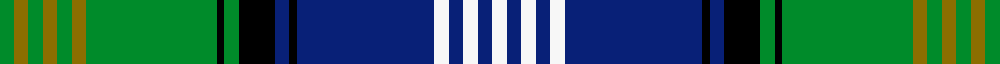

This page is one **sett** — a single exact thread-count. It belongs to the [tartan](/setts/g2y2g2y2g2y2g18k1g2k5db2k1db19w2db2w2db2w2/)
(the same proportion at any scale), whose colour order is pattern [GGGGGGGKGKBKBWBWBW](/stripes/gggggggkgkbkbwbwbw/).

Part of the [Scottish Islamic](/tartans/scottish-islamic/) tartan — the named design grouping this sett with its other cloths.

Sourced from register-of-tartans.  It is a [18 stripe tartan](/stripes/stripes18/).

Original link https://www.tartanregister.gov.uk/tartanDetails.aspx?ref=10644

## Provenance

Earliest known date: 27/06/2011 The Scottish Islamic Tartan weaves together the different strands of Scottish and Muslim heritage creating a fabric for the future. Scottish academic Dr Azeem Ibrahim, developed this concept after consulting leading Islamic scholars around the world - Shaikh Humza Yousaf, Imam Zaid Shakir and Dr Umar Abd-Allah. In Scotland, he sought advice from Shaikh Amer Jamil, Scotland's leading Islamic scholar. The theological explanation of the design is as follows: blue represents the Scottish Flag; green represents the colour of Islam; five white lines running through the pattern represent the five pillars of Islam; six gold lines represent the six articles of faith; the black square represents the Holy Kabah.

2 attestations — the source records this cloth was collapsed from (oldest owns this page)

<ul>
<li>27/06/2011 — Scottish Islamic (register-of-tartans, <a href="https://www.tartanregister.gov.uk/tartanDetails.aspx?ref=10644">record</a>)  <em>The Scottish Islamic Tartan weaves together the different strands of Scottish and Muslim heritage creating a fabric for the future. Scottish academic Dr Azeem Ibrahim, developed this concept after consulting leading Islamic scholars around the world - Shaikh Humza Yousaf, Imam Zaid Shakir and Dr Umar Abd-Allah. In Scotland, he sought advice from Shaikh Amer Jamil, Scotland's leading Islamic scholar. The theological explanation of the design is as follows: blue represents the Scottish Flag; green represents the colour of Islam; five white lines running through the pattern represent the five pillars of Islam; six gold lines represent the six articles of faith; the black square represents the Holy Kabah.</em></li>
<li>undated — Scottish Islamic Corporate Tartan (house-of-tartan, <a href="http://www.house-of-tartan.scotland.net/house/TartanViewjs.asp?colr=Def&tnam=10644">record</a>) </li>
</ul>

## Register references

External register numbers recorded for this tartan.

- Scottish Register of Tartans: [10644](https://www.tartanregister.gov.uk/tartanDetails.aspx?ref=10644)

## Thread count
G/4 Y4 G4 Y4 G4 Y4 G36 K2 G4 K10 DB4 K2 DB38 W4 DB4 W4 DB4 W/4

One full sett is **272 threads**.

## Palette
<table><thead><tr><th>Colour</th><th>Shade</th><th>OKLCh</th></tr></thead><tbody><tr><td>DB</td><td><code style="background-color:#082077;">#082077</code> <small style="color:#888">#082077</small></td><td><small style="color:#888">oklch(30.0% 0.149 265.1)</small></td></tr><tr><td>G</td><td><code style="background-color:#008B2A;">#008B2A</code> <small style="color:#888">#008B2A</small></td><td><small style="color:#888">oklch(55.4% 0.170 145.9)</small></td></tr><tr><td>K</td><td><code style="background-color:#000000;">#000000</code> <small style="color:#888">#000000</small></td><td><small style="color:#888">oklch(0.0% 0.000 0.0)</small></td></tr><tr><td>W</td><td><code style="background-color:#F7F7F7;">#F7F7F7</code> <small style="color:#888">#F7F7F7</small></td><td><small style="color:#888">oklch(97.6% 0.000 89.9)</small></td></tr><tr><td>Y</td><td><code style="background-color:#8B6E00;">#8B6E00</code> <small style="color:#888">#8B6E00</small></td><td><small style="color:#888">oklch(55.1% 0.113 90.4)</small></td></tr></tbody></table>

# Sample pattern

## Nearest tartan variants

The nearest existing variants by ΔTartan distance, with this cloth at the top so the swatches line up against it.

ΔTartan

Threads

Variant

Sett

—

272

<a href="/variants/s18/g2y2g2y2g2y2g18k1g2k5db2k1db19w2db2w2db2w2~x2/">Scottish Islamic</a>

<a href="/ttd/edit/#slug=dg2ly2dg2ly2dg2ly2dg18k1dg2k5db2k1db19w2db2w2db2w2~x2&amp;base=g2y2g2y2g2y2g18k1g2k5db2k1db19w2db2w2db2w2~x2" title="compare in the TTD">0.00</a>

272

<a href="/variants/s18/dg2ly2dg2ly2dg2ly2dg18k1dg2k5db2k1db19w2db2w2db2w2~x2/">Scottish Islamic (Corporate)</a>

## Neighbour map

Every grey dot is one of 13620 variants placed by the first two principal components of the ΔTartan feature space (42% of its variance). Red is this tartan; blue dots are its nearest — click one to open its page.

<svg viewBox="0 0 640 380" role="img" style="max-width:100%;height:auto;border:1px solid #e0e0e0;border-radius:4px;display:block" xmlns="http://www.w3.org/2000/svg"><image href="/nn/cloud.v1.png" width="640" height="380"/><a href="/variants/s18/dg2ly2dg2ly2dg2ly2dg18k1dg2k5db2k1db19w2db2w2db2w2~x2/"><circle cx="162.7" cy="83.3" r="4" fill="#3465a4"><title>Scottish Islamic (Corporate)</title></circle></a><circle cx="158.9" cy="85.7" r="5" fill="#c00000"/><text x="320" y="376" text-anchor="middle" font-size="11" fill="#999">ground</text><text x="11" y="190" text-anchor="middle" font-size="11" fill="#999" transform="rotate(-90 11 190)">complexity</text></svg>

ID: /variants/s18/g2y2g2y2g2y2g18k1g2k5db2k1db19w2db2w2db2w2~x2/
