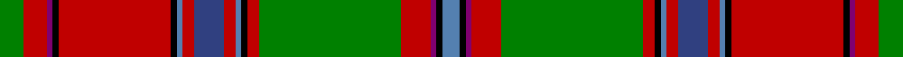

This page is one **sett** — a single exact thread-count. It belongs to the [tartan](/setts/g4r4dp1k1r19k1t1r2db5r2t1k1r2g24r5dp1k1t3/)
(the same proportion at any scale), whose colour order is pattern [BKBRGRKBRBRBKRKBRG](/stripes/bkbrgrkbrbrbkrkbrg/).

Part of the [Dundas](/tartans/dundas/) tartan — the named design grouping this sett with its other cloths.

Sourced from weddslist.  It is a [18 stripe tartan](/stripes/stripes18/).

Original link http://www.weddslist.com/cgi-bin/tartans/pg.pl?source=sts

## Also known as

This cloth is also recorded under:

- Dundas #2
- Dundas,

## Thread count
G/8 R8 P2 K2 R38 K2 Ba2 R4 B10 R4 Ba2 K2 R4 G48 R10 P2 K2 Ba/6

One full sett is **298 threads**.

## Palette

Palette: <strong>Ingles Buchan</strong> <small style="color:#888">(1 of 6 colours)</small>
<table><thead><tr><th>Colour</th><th>Threads</th><th>Shade</th><th>Base</th><th>OKLCh</th></tr></thead><tbody><tr><td>G/</td><td style="text-align:right;font-variant-numeric:tabular-nums">8</td><td><code style="background-color:#008000;">#008000</code> <small style="color:#888">#008000</small></td><td>G <code style="background-color:#006100;">#006100</code></td><td><small style="color:#888">oklch(52.0% 0.177 142.5)</small></td></tr><tr><td>R</td><td style="text-align:right;font-variant-numeric:tabular-nums">8</td><td><code style="background-color:#C00000;">#C00000</code> <small style="color:#888">#C00000</small></td><td>R <code style="background-color:#CC0000;">#CC0000</code></td><td><small style="color:#888">oklch(50.7% 0.208 29.2)</small></td></tr><tr><td>P</td><td style="text-align:right;font-variant-numeric:tabular-nums">2</td><td><code style="background-color:#800070;">#800070</code> <small style="color:#888">#800070</small></td><td>B <code style="background-color:#2A418A;">#2A418A</code></td><td><small style="color:#888">oklch(41.1% 0.183 335.2)</small></td></tr><tr><td>K</td><td style="text-align:right;font-variant-numeric:tabular-nums">2</td><td><code style="background-color:#000000;">#000000</code> <small style="color:#888">#000000</small></td><td>K <code style="background-color:#000000;">#000000</code></td><td><small style="color:#888">oklch(0.0% 0.000 0.0)</small></td></tr><tr><td>R</td><td style="text-align:right;font-variant-numeric:tabular-nums">38</td><td><code style="background-color:#C00000;">#C00000</code> <small style="color:#888">#C00000</small></td><td>R <code style="background-color:#CC0000;">#CC0000</code></td><td><small style="color:#888">oklch(50.7% 0.208 29.2)</small></td></tr><tr><td>K</td><td style="text-align:right;font-variant-numeric:tabular-nums">2</td><td><code style="background-color:#000000;">#000000</code> <small style="color:#888">#000000</small></td><td>K <code style="background-color:#000000;">#000000</code></td><td><small style="color:#888">oklch(0.0% 0.000 0.0)</small></td></tr><tr><td>Ba</td><td style="text-align:right;font-variant-numeric:tabular-nums">2</td><td><code style="background-color:#5480B0;">#5480B0</code> <small style="color:#888">#5480B0</small></td><td>B <code style="background-color:#2A418A;">#2A418A</code></td><td><small style="color:#888">oklch(58.8% 0.089 251.5)</small></td></tr><tr><td>R</td><td style="text-align:right;font-variant-numeric:tabular-nums">4</td><td><code style="background-color:#C00000;">#C00000</code> <small style="color:#888">#C00000</small></td><td>R <code style="background-color:#CC0000;">#CC0000</code></td><td><small style="color:#888">oklch(50.7% 0.208 29.2)</small></td></tr><tr><td>B</td><td style="text-align:right;font-variant-numeric:tabular-nums">10</td><td><code style="background-color:#304080;">#304080</code> <small style="color:#888">#304080</small></td><td>B <code style="background-color:#2A418A;">#2A418A</code></td><td><small style="color:#888">oklch(39.4% 0.109 270.2)</small></td></tr><tr><td>R</td><td style="text-align:right;font-variant-numeric:tabular-nums">4</td><td><code style="background-color:#C00000;">#C00000</code> <small style="color:#888">#C00000</small></td><td>R <code style="background-color:#CC0000;">#CC0000</code></td><td><small style="color:#888">oklch(50.7% 0.208 29.2)</small></td></tr><tr><td>Ba</td><td style="text-align:right;font-variant-numeric:tabular-nums">2</td><td><code style="background-color:#5480B0;">#5480B0</code> <small style="color:#888">#5480B0</small></td><td>B <code style="background-color:#2A418A;">#2A418A</code></td><td><small style="color:#888">oklch(58.8% 0.089 251.5)</small></td></tr><tr><td>K</td><td style="text-align:right;font-variant-numeric:tabular-nums">2</td><td><code style="background-color:#000000;">#000000</code> <small style="color:#888">#000000</small></td><td>K <code style="background-color:#000000;">#000000</code></td><td><small style="color:#888">oklch(0.0% 0.000 0.0)</small></td></tr><tr><td>R</td><td style="text-align:right;font-variant-numeric:tabular-nums">4</td><td><code style="background-color:#C00000;">#C00000</code> <small style="color:#888">#C00000</small></td><td>R <code style="background-color:#CC0000;">#CC0000</code></td><td><small style="color:#888">oklch(50.7% 0.208 29.2)</small></td></tr><tr><td>G</td><td style="text-align:right;font-variant-numeric:tabular-nums">48</td><td><code style="background-color:#008000;">#008000</code> <small style="color:#888">#008000</small></td><td>G <code style="background-color:#006100;">#006100</code></td><td><small style="color:#888">oklch(52.0% 0.177 142.5)</small></td></tr><tr><td>R</td><td style="text-align:right;font-variant-numeric:tabular-nums">10</td><td><code style="background-color:#C00000;">#C00000</code> <small style="color:#888">#C00000</small></td><td>R <code style="background-color:#CC0000;">#CC0000</code></td><td><small style="color:#888">oklch(50.7% 0.208 29.2)</small></td></tr><tr><td>P</td><td style="text-align:right;font-variant-numeric:tabular-nums">2</td><td><code style="background-color:#800070;">#800070</code> <small style="color:#888">#800070</small></td><td>B <code style="background-color:#2A418A;">#2A418A</code></td><td><small style="color:#888">oklch(41.1% 0.183 335.2)</small></td></tr><tr><td>K</td><td style="text-align:right;font-variant-numeric:tabular-nums">2</td><td><code style="background-color:#000000;">#000000</code> <small style="color:#888">#000000</small></td><td>K <code style="background-color:#000000;">#000000</code></td><td><small style="color:#888">oklch(0.0% 0.000 0.0)</small></td></tr><tr><td>Ba/</td><td style="text-align:right;font-variant-numeric:tabular-nums">6</td><td><code style="background-color:#5480B0;">#5480B0</code> <small style="color:#888">#5480B0</small></td><td>B <code style="background-color:#2A418A;">#2A418A</code></td><td><small style="color:#888">oklch(58.8% 0.089 251.5)</small></td></tr></tbody></table>

## Compared to the master

This cloth is one sett of its design; the master sett (the exemplar the design is anchored on) is below for comparison.

<figure style="margin:0"><figcaption style="color:#888;font-size:smaller">this sett</figcaption></figure>
<figure style="margin:0"><figcaption style="color:#888;font-size:smaller"><a href="/setts/db9r24dg24k24db24ly2db9/">master sett →</a></figcaption></figure>

## Nearest tartans

The nearest existing variants by ΔTartan distance, with this tartan at the top so the swatches line up against it.

ΔTartan

Tartan

Sett

—

<a href="/ttd/edit/#slug=g4r4dp1k1r19k1t1r2db5r2t1k1r2g24r5dp1k1t3~x2">Dundas, (Red)</a> <a class="nn-out" href="/variants/s18/g4r4dp1k1r19k1t1r2db5r2t1k1r2g24r5dp1k1t3~x2/" title="open its dictionary page">↗</a>

0.68

<a href="/ttd/edit/#slug=w2r3ri6r48db4r2g16ri5r3ri5db20r5g3r5g54r3ri5ly2~x2&amp;base=g4r4dp1k1r19k1t1r2db5r2t1k1r2g24r5dp1k1t3~x2">Sommerville</a> <a class="nn-out" href="/variants/s18/w2r3ri6r48db4r2g16ri5r3ri5db20r5g3r5g54r3ri5ly2~x2/" title="open its dictionary page">↗</a>

0.69

<a href="/ttd/edit/#slug=dg4r4dp1k1r19k1t1r2db5r2t1k1r2dg24r5dp1k1t3~x2&amp;base=g4r4dp1k1r19k1t1r2db5r2t1k1r2g24r5dp1k1t3~x2">Dundas (Red)</a> <a class="nn-out" href="/variants/s18/dg4r4dp1k1r19k1t1r2db5r2t1k1r2dg24r5dp1k1t3~x2/" title="open its dictionary page">↗</a>

0.79

<a href="/ttd/edit/#slug=w2r3ri5r48db4r2g17ri5r3ri5db21r5g3r5g54r3ri5ly2&amp;base=g4r4dp1k1r19k1t1r2db5r2t1k1r2g24r5dp1k1t3~x2">Sommerville Family Tartan</a> <a class="nn-out" href="/variants/s18/w2r3ri5r48db4r2g17ri5r3ri5db21r5g3r5g54r3ri5ly2/" title="open its dictionary page">↗</a>

0.84

<a href="/ttd/edit/#slug=w2ri3r5ri48db4ri2g17r5ri3r5db21ri5g3ri5g54ri3r5ly2&amp;base=g4r4dp1k1r19k1t1r2db5r2t1k1r2g24r5dp1k1t3~x2">Sommerville</a> <a class="nn-out" href="/variants/s18/w2ri3r5ri48db4ri2g17r5ri3r5db21ri5g3ri5g54ri3r5ly2/" title="open its dictionary page">↗</a>

1.04

<a href="/variants/s22/k8r2k3ly2k2w3k2lo12y22r2y2k1~x2/">O'Keefe</a>

1.04

<a href="/ttd/edit/#slug=r44do3w2g14w2y4r4do2r4y4w2dt12do6r6y7w2~x2&amp;base=g4r4dp1k1r19k1t1r2db5r2t1k1r2g24r5dp1k1t3~x2">North West Mounted Police</a> <a class="nn-out" href="/variants/s16/r44do3w2g14w2y4r4do2r4y4w2dt12do6r6y7w2~x2/" title="open its dictionary page">↗</a>

1.07

<a href="/ttd/edit/#slug=w1r2p2r22db1r1g8r8g8p2r1p2db9r3g1r3g22r1p2w1~x2&amp;base=g4r4dp1k1r19k1t1r2db5r2t1k1r2g24r5dp1k1t3~x2">MacDougall 7</a> <a class="nn-out" href="/variants/s20/w1r2p2r22db1r1g8r8g8p2r1p2db9r3g1r3g22r1p2w1~x2/" title="open its dictionary page">↗</a>

1.11

<a href="/ttd/edit/#slug=g14ri6r2k3ri65k2t2ri6k34ri6t2k2ri4g66ri12r2k2t4&amp;base=g4r4dp1k1r19k1t1r2db5r2t1k1r2g24r5dp1k1t3~x2">Stewart of Ardshiel</a> <a class="nn-out" href="/variants/s18/g14ri6r2k3ri65k2t2ri6k34ri6t2k2ri4g66ri12r2k2t4/" title="open its dictionary page">↗</a>

1.20

<a href="/ttd/edit/#slug=w2r2lp2r22db2r2g8r8g8lp2r2lp2db9r3g1r3g22r2lp2w2~x2&amp;base=g4r4dp1k1r19k1t1r2db5r2t1k1r2g24r5dp1k1t3~x2">MacDougall Clan Tartan</a> <a class="nn-out" href="/variants/s20/w2r2lp2r22db2r2g8r8g8lp2r2lp2db9r3g1r3g22r2lp2w2~x2/" title="open its dictionary page">↗</a>

1.21

<a href="/ttd/edit/#slug=r6t4dg16lo2k1w6k1lo30r15lo30k1w6k1lo2dg16t4r6w1~x2&amp;base=g4r4dp1k1r19k1t1r2db5r2t1k1r2g24r5dp1k1t3~x2">Westwood</a> <a class="nn-out" href="/variants/s18/r6t4dg16lo2k1w6k1lo30r15lo30k1w6k1lo2dg16t4r6w1~x2/" title="open its dictionary page">↗</a>

## Neighbour map

Every grey dot is one of 14360 variants placed by the first two principal components of the ΔTartan feature space (44% of its variance). Red is this tartan; blue dots are its nearest — click one to open its page.

<svg viewBox="0 0 640 380" role="img" style="max-width:100%;height:auto;border:1px solid #e0e0e0;border-radius:4px;display:block" xmlns="http://www.w3.org/2000/svg"><image href="/nn/cloud.v1.png" width="640" height="380"/><a href="/variants/s18/w2r3ri6r48db4r2g16ri5r3ri5db20r5g3r5g54r3ri5ly2~x2/"><circle cx="231.0" cy="55.2" r="4" fill="#3465a4"><title>Sommerville</title></circle></a><a href="/variants/s18/dg4r4dp1k1r19k1t1r2db5r2t1k1r2dg24r5dp1k1t3~x2/"><circle cx="256.8" cy="58.2" r="4" fill="#3465a4"><title>Dundas (Red)</title></circle></a><a href="/variants/s18/w2r3ri5r48db4r2g17ri5r3ri5db21r5g3r5g54r3ri5ly2/"><circle cx="239.3" cy="59.4" r="4" fill="#3465a4"><title>Sommerville Family Tartan</title></circle></a><a href="/variants/s18/w2ri3r5ri48db4ri2g17r5ri3r5db21ri5g3ri5g54ri3r5ly2/"><circle cx="239.0" cy="59.6" r="4" fill="#3465a4"><title>Sommerville</title></circle></a><a href="/variants/s22/k8r2k3ly2k2w3k2lo12y22r2y2k1~x2/"><circle cx="199.3" cy="63.3" r="4" fill="#3465a4"><title>O'Keefe</title></circle></a><a href="/variants/s16/r44do3w2g14w2y4r4do2r4y4w2dt12do6r6y7w2~x2/"><circle cx="258.0" cy="71.3" r="4" fill="#3465a4"><title>North West Mounted Police</title></circle></a><a href="/variants/s20/w1r2p2r22db1r1g8r8g8p2r1p2db9r3g1r3g22r1p2w1~x2/"><circle cx="251.6" cy="83.9" r="4" fill="#3465a4"><title>MacDougall 7</title></circle></a><a href="/variants/s18/g14ri6r2k3ri65k2t2ri6k34ri6t2k2ri4g66ri12r2k2t4/"><circle cx="264.9" cy="53.1" r="4" fill="#3465a4"><title>Stewart of Ardshiel</title></circle></a><a href="/variants/s20/w2r2lp2r22db2r2g8r8g8lp2r2lp2db9r3g1r3g22r2lp2w2~x2/"><circle cx="235.1" cy="84.1" r="4" fill="#3465a4"><title>MacDougall Clan Tartan</title></circle></a><a href="/variants/s18/r6t4dg16lo2k1w6k1lo30r15lo30k1w6k1lo2dg16t4r6w1~x2/"><circle cx="212.0" cy="62.9" r="4" fill="#3465a4"><title>Westwood</title></circle></a><circle cx="245.8" cy="55.9" r="5" fill="#c00000"/></svg>

ID: /variants/s18/g4r4dp1k1r19k1t1r2db5r2t1k1r2g24r5dp1k1t3~x2/
