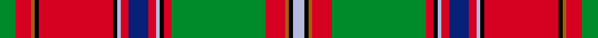

This is one **variant** — a specific cloth: this exact thread count and colourway, with its own
provenance below. It is one weaving of the [sett](/tartans/d/du/dundas-4/) (the scale-free proportion — the
same cloth at any scale or shade), whose colour order is pattern [GRRKRKWRBRWKRGRRKW](/stripes/grrkrkwrbrwkrgrrkw/).

Part of the [Dundas](/tartans/d/du/dundas-4/) tartan — the named design grouping this sett with its other cloths.

Sourced from register-of-tartans.  It is a [18 stripe tartan](/stripes/stripes18/).

Original link [https://www.tartanregister.gov.uk/tartanDetails.aspx?ref=1028](https://www.tartanregister.gov.uk/tartanDetails.aspx?ref=1028)

Dataset <small>— provenance for this record, inherited from the source manifest</small>

<dl class="dataset-prov">
<dt>source</dt><dd><a href="/sources/register-of-tartans/">Scottish Register of Tartans</a></dd>
<dt>data captured from</dt><dd><a href="https://github.com/thetartan/tartan-database/blob/master/data/register-of-tartans/data.csv">https://github.com/thetartan/tartan-database/blob/master/data/register-of-tartans/data.csv</a></dd>
<dt>data date</dt><dd>2017-01-06 <small>(dataset default)</small></dd>
<dt>licence</dt><dd><a href="https://www.tartanregister.gov.uk/copyright">Crown copyright</a></dd>
</dl>

Capture chain <small>— the hands this data passed through, oldest first; each capture carries its own licence</small>

<ol class="capture-chain">
<li><a href="https://www.tartanregister.gov.uk/">Scottish Register of Tartans</a> · <a href="https://www.tartanregister.gov.uk/copyright">Crown copyright</a> <small>the living register — still published by National Records of Scotland</small></li>
<li><a href="https://github.com/thetartan/tartan-database">thetartan/tartan-database</a> <small>2016-2017</small> · <a href="https://creativecommons.org/licenses/by-nc-nd/4.0/">CC BY-NC-ND 4.0</a> <small>Levko Kravets's frozen compilation — the capture we vendored, and where its CC licence text came from</small></li>
<li>this dictionary <small>captured 2026-06-10 · commit 5bf86c7566</small> <small>each re-capture is a git commit to data/sources</small></li>
</ol>

## Register references

External register numbers recorded for this tartan.

- Scottish Register of Tartans: [1028](https://www.tartanregister.gov.uk/tartanDetails.aspx?ref=1028)
- Scottish Tartans World Register: 237

## Thread count
G/8 R8 O2 K2 R38 K2 LB2 R4 DB10 R4 LB2 K2 R4 G48 R10 O2 K2 LB/6

One full sett is **298 threads**.

## Palette
<table><thead><tr><th>Colour</th><th>Shade</th><th>OKLCh</th></tr></thead><tbody><tr><td>LB</td><td><code style="background-color:#B5BBDE;">#B5BBDE</code> <small style="color:#888">#B5BBDE</small></td><td><small style="color:#888">oklch(79.9% 0.050 277.6)</small></td></tr><tr><td>DB</td><td><code style="background-color:#082077;">#082077</code> <small style="color:#888">#082077</small></td><td><small style="color:#888">oklch(30.0% 0.149 265.1)</small></td></tr><tr><td>G</td><td><code style="background-color:#008B2A;">#008B2A</code> <small style="color:#888">#008B2A</small></td><td><small style="color:#888">oklch(55.4% 0.170 145.9)</small></td></tr><tr><td>K</td><td><code style="background-color:#000000;">#000000</code> <small style="color:#888">#000000</small></td><td><small style="color:#888">oklch(0.0% 0.000 0.0)</small></td></tr><tr><td>O</td><td><code style="background-color:#A65C11;">#A65C11</code> <small style="color:#888">#A65C11</small></td><td><small style="color:#888">oklch(55.0% 0.125 58.3)</small></td></tr><tr><td>R</td><td><code style="background-color:#D60020;">#D60020</code> <small style="color:#888">#D60020</small></td><td><small style="color:#888">oklch(55.2% 0.224 25.5)</small></td></tr></tbody></table>

# Sample pattern

[Sample sheet (PDF)](swatch.pdf) — the woven sample, thread count and palette on one printable A4, rendered on demand (the same sheet the TTD print page downloads).

## Nearest tartan variants

The nearest existing variants by ΔTartan distance, with this cloth at the top so the swatches line up against it.

ΔTartan

Threads

Variant

Sett

—

298

<a href="/variants/s18/g4r4o1k1r19k1lb1r2db5r2lb1k1r2g24r5o1k1lb3~x2/">Dundas (Red)</a>

<a href="/ttd/edit/#slug=g4r4b1k1r19k1lb1r2db5r2lb1k1r2g24r5b1k1lb3~x2&amp;base=g4r4o1k1r19k1lb1r2db5r2lb1k1r2g24r5o1k1lb3~x2" title="compare in the TTD">1.50</a>

298

<a href="/variants/s18/g4r4b1k1r19k1lb1r2db5r2lb1k1r2g24r5b1k1lb3~x2/">Dundas, (Red)</a>

<a href="/ttd/edit/#slug=g14r6b2k3r65k2lb2r6k34r6lb2k2r4g66r12b2k2lb4&amp;base=g4r4o1k1r19k1lb1r2db5r2lb1k1r2g24r5o1k1lb3~x2" title="compare in the TTD">1.97</a>

450

<a href="/variants/s18/g14r6b2k3r65k2lb2r6k34r6lb2k2r4g66r12b2k2lb4/">Stewart of Ardshiel</a>

<a href="/ttd/edit/#slug=r6y60db12y6k12y2k2w2k2g18r18k3r4w2~x2&amp;base=g4r4o1k1r19k1lb1r2db5r2lb1k1r2g24r5o1k1lb3~x2" title="compare in the TTD">2.10</a>

580

<a href="/variants/s14/r6y60db12y6k12y2k2w2k2g18r18k3r4w2~x2/">Victoria (Yellow)</a>

<a href="/ttd/edit/#slug=r24k1w1g6w1g1y2r2k1r2y2g1w1lb6k2r3y3g2w1~x2&amp;base=g4r4o1k1r19k1lb1r2db5r2lb1k1r2g24r5o1k1lb3~x2" title="compare in the TTD">2.30</a>

198

<a href="/variants/s19/r24k1w1g6w1g1y2r2k1r2y2g1w1lb6k2r3y3g2w1~x2/">MacKintosh (Chief) Clan Tartan</a>

<a href="/ttd/edit/#slug=w4y10r8k7n28w3y6r5k2r5y6w3g30w2k3r50w2~x2&amp;base=g4r4o1k1r19k1lb1r2db5r2lb1k1r2g24r5o1k1lb3~x2" title="compare in the TTD">2.44</a>

684

<a href="/variants/s17/w4y10r8k7n28w3y6r5k2r5y6w3g30w2k3r50w2~x2/">Chattan</a>

<a href="/ttd/edit/#slug=g4r3lb1dp1r35dp1lb1r3dp16r3lb1dp1r2g35r7k1lb2~x2&amp;base=g4r4o1k1r19k1lb1r2db5r2lb1k1r2g24r5o1k1lb3~x2" title="compare in the TTD">2.62</a>

456

<a href="/variants/s17/g4r3lb1dp1r35dp1lb1r3dp16r3lb1dp1r2g35r7k1lb2~x2/">Unidentified #14</a>

<a href="/ttd/edit/#slug=w4y12r8k8lb32w4y7r7k2r7y7w4g32w2k4r60w2~x2&amp;base=g4r4o1k1r19k1lb1r2db5r2lb1k1r2g24r5o1k1lb3~x2" title="compare in the TTD">2.64</a>

796

<a href="/variants/s17/w4y12r8k8lb32w4y7r7k2r7y7w4g32w2k4r60w2~x2/">Chattan, Chief of Clan</a>

<a href="/ttd/edit/#slug=w4y12r8k8lb32w4y7r7k2r7y7w4g32w2k4r60w2&amp;base=g4r4o1k1r19k1lb1r2db5r2lb1k1r2g24r5o1k1lb3~x2" title="compare in the TTD">2.64</a>

398

<a href="/variants/s17/w4y12r8k8lb32w4y7r7k2r7y7w4g32w2k4r60w2/">Chattan Chief Clan Tartan</a>

<a href="/ttd/edit/#slug=dy1r1k1ly1r21k1dy12ly1y7g3dy6k1ly1k1r1~x2&amp;base=g4r4o1k1r19k1lb1r2db5r2lb1k1r2g24r5o1k1lb3~x2" title="compare in the TTD">2.66</a>

232

<a href="/variants/s15/dy1r1k1ly1r21k1dy12ly1y7g3dy6k1ly1k1r1~x2/">Purdy, R Scott (Personal)</a>

<a href="/ttd/edit/#slug=r8lo5g2lo4g2lo5n38k5g2k4g2k5r8lb4~x2&amp;base=g4r4o1k1r19k1lb1r2db5r2lb1k1r2g24r5o1k1lb3~x2" title="compare in the TTD">2.66</a>

352

<a href="/variants/s14/r8lo5g2lo4g2lo5n38k5g2k4g2k5r8lb4~x2/">Berwick District Tartan</a>

## Neighbour map

Every grey dot is one of 13662 variants placed by the first two principal components of the ΔTartan feature space (42% of its variance). Red is this tartan; blue dots are its nearest — click one to open its page. The map is a flat projection of a many-dimensional space — [how to read it](/posts/neighbourhood-maps/).

<svg viewBox="0 0 640 380" role="img" style="max-width:100%;height:auto;border:1px solid #e0e0e0;border-radius:4px;display:block" xmlns="http://www.w3.org/2000/svg"><image href="/nn/cloud.v1.png" width="640" height="380"/><a href="/variants/s18/g4r4b1k1r19k1lb1r2db5r2lb1k1r2g24r5b1k1lb3~x2/"><circle cx="209.8" cy="52.0" r="4" fill="#3465a4"><title>Dundas, (Red)</title></circle></a><a href="/variants/s18/g14r6b2k3r65k2lb2r6k34r6lb2k2r4g66r12b2k2lb4/"><circle cx="215.3" cy="42.2" r="4" fill="#3465a4"><title>Stewart of Ardshiel</title></circle></a><a href="/variants/s14/r6y60db12y6k12y2k2w2k2g18r18k3r4w2~x2/"><circle cx="206.4" cy="57.1" r="4" fill="#3465a4"><title>Victoria (Yellow)</title></circle></a><a href="/variants/s19/r24k1w1g6w1g1y2r2k1r2y2g1w1lb6k2r3y3g2w1~x2/"><circle cx="224.9" cy="39.2" r="4" fill="#3465a4"><title>MacKintosh (Chief) Clan Tartan</title></circle></a><a href="/variants/s17/w4y10r8k7n28w3y6r5k2r5y6w3g30w2k3r50w2~x2/"><circle cx="164.7" cy="65.4" r="4" fill="#3465a4"><title>Chattan</title></circle></a><a href="/variants/s17/g4r3lb1dp1r35dp1lb1r3dp16r3lb1dp1r2g35r7k1lb2~x2/"><circle cx="272.7" cy="50.8" r="4" fill="#3465a4"><title>Unidentified #14</title></circle></a><a href="/variants/s17/w4y12r8k8lb32w4y7r7k2r7y7w4g32w2k4r60w2~x2/"><circle cx="165.6" cy="53.6" r="4" fill="#3465a4"><title>Chattan, Chief of Clan</title></circle></a><a href="/variants/s17/w4y12r8k8lb32w4y7r7k2r7y7w4g32w2k4r60w2/"><circle cx="165.6" cy="53.6" r="4" fill="#3465a4"><title>Chattan Chief Clan Tartan</title></circle></a><a href="/variants/s15/dy1r1k1ly1r21k1dy12ly1y7g3dy6k1ly1k1r1~x2/"><circle cx="193.9" cy="68.2" r="4" fill="#3465a4"><title>Purdy, R Scott (Personal)</title></circle></a><a href="/variants/s14/r8lo5g2lo4g2lo5n38k5g2k4g2k5r8lb4~x2/"><circle cx="157.5" cy="76.4" r="4" fill="#3465a4"><title>Berwick District Tartan</title></circle></a><circle cx="211.6" cy="52.3" r="5" fill="#c00000"/><text x="320" y="376" text-anchor="middle" font-size="11" fill="#999">ground</text><text x="11" y="190" text-anchor="middle" font-size="11" fill="#999" transform="rotate(-90 11 190)">complexity</text></svg>

ID: /variants/s18/g4r4o1k1r19k1lb1r2db5r2lb1k1r2g24r5o1k1lb3~x2/
