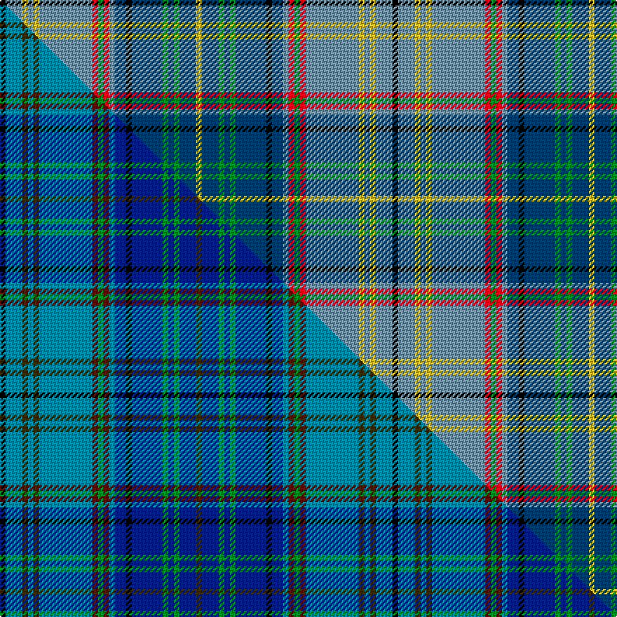

This is one **variant** — a specific cloth: this exact thread count and colourway, with its own
provenance below. It is one weaving of the [sett](/tartans/h/ha/harmon-of-plenderleith/) (the scale-free proportion — the
same cloth at any scale or shade), whose colour order is pattern [KBYBYBRGRBBKBGBGBY](/stripes/kbybybrgrbbkbgbgby/).

Part of the [Harmon of Plenderleith](/tartans/h/ha/harmon-of-plenderleith/) tartan — the named design grouping this sett with its other cloths.

Sourced from house-of-tartan.  It is a [18 stripe tartan](/stripes/stripes18/).

Original link [http://www.house-of-tartan.scotland.net/house/TartanViewjs.asp?colr=Def&tnam=10021](http://www.house-of-tartan.scotland.net/house/TartanViewjs.asp?colr=Def&tnam=10021)

## Provenance

Earliest known date: Mar. 2009 A personal tartan for the Baron of Plenderleith, his family and members of his household. Developed with the help of the House of Tartan, Comrie, Perthshire.

Dataset <small>— provenance for this record, inherited from the source manifest</small>

<dl class="dataset-prov">
<dt>source</dt><dd><a href="/sources/house-of-tartan/">House of Tartan</a></dd>
<dt>data captured from</dt><dd><a href="https://github.com/thetartan/tartan-database/blob/master/data/house-of-tartan/data.csv">https://github.com/thetartan/tartan-database/blob/master/data/house-of-tartan/data.csv</a></dd>
<dt>data date</dt><dd>2017-01-10 <small>(dataset default)</small></dd>
<dt>licence</dt><dd><a href="https://creativecommons.org/licenses/by-nc-nd/4.0/">CC BY-NC-ND 4.0</a></dd>
</dl>

Capture chain <small>— the hands this data passed through, oldest first; each capture carries its own licence</small>

<ol class="capture-chain">
<li><a href="http://www.house-of-tartan.scotland.net/">House of Tartan</a> <small>the weaver/retailer's database — the site is now offline; the URL is kept as the ultimate source's identity</small></li>
<li><a href="https://github.com/thetartan/tartan-database">thetartan/tartan-database</a> <small>2016-2017</small> · <a href="https://creativecommons.org/licenses/by-nc-nd/4.0/">CC BY-NC-ND 4.0</a> <small>Levko Kravets's frozen compilation — the capture we vendored, and where its CC licence text came from</small></li>
<li>this dictionary <small>captured 2026-06-10 · commit 5bf86c7566</small> <small>each re-capture is a git commit to data/sources</small></li>
</ol>

## History

Where this cloth's colourway came from and what descended from it — the source and evolution of its palette. Same design, different variants; a genuine colour difference is history, not an error.

**Origin — developed.** Developed with the help of the House of Tartan, Comrie (earliest known Mar. 2009) — the designer's own rendering, and the root of this tartan's lineage.

Gave rise to:

- *copied* → [Harmon of Plenderleith (Personal)](/variants/s18/k2dbi6ly2dbi2ly2dbi19r2g2r2dbi2db4k2db11g2db2g2db6ly2~x2~dbi1406275-db1404245/) — Scottish Tartans Authority capture: copies the House of Tartan palette (gold, olive, navy, red, black are identical) and differs only in the blue role — a re-render drift, not a new colourway.
- *registered* → [Harmon of Plenderleith (Personal)](/variants/s18/k2t6dy2t2dy2t19dr2g2dr2t2db4k2db11g2db2g2db6dy2~x2/) — The Scottish Register of Tartans entry (ref 10021) — the official reading: a substantially different colourway (opal / lemon / moss) of the same developed sett.

## Thread count
K/4 B12 LY4 B4 LY4 B38 R4 G4 R4 B4 DB8 K4 DB22 G4 DB4 G4 DB12 LY/4

One full sett is **280 threads**.

## Palette
<table><thead><tr><th>Colour</th><th>Shade</th><th>OKLCh</th></tr></thead><tbody><tr><td>B</td><td><code style="background-color:#7894A4;">#7894A4</code> <small style="color:#888">#7894A4</small></td><td><small style="color:#888">oklch(65.1% 0.040 233.2)</small></td></tr><tr><td>DB</td><td><code style="background-color:#003C64;">#003C64</code> <small style="color:#888">#003C64</small></td><td><small style="color:#888">oklch(34.5% 0.089 246.0)</small></td></tr><tr><td>LY</td><td><code style="background-color:#DCBC32;">#DCBC32</code> <small style="color:#888">#DCBC32</small></td><td><small style="color:#888">oklch(80.0% 0.150 95.2)</small></td></tr><tr><td>G</td><td><code style="background-color:#008B2A;">#008B2A</code> <small style="color:#888">#008B2A</small></td><td><small style="color:#888">oklch(55.4% 0.170 145.9)</small></td></tr><tr><td>K</td><td><code style="background-color:#000000;">#000000</code> <small style="color:#888">#000000</small></td><td><small style="color:#888">oklch(0.0% 0.000 0.0)</small></td></tr><tr><td>R</td><td><code style="background-color:#D60020;">#D60020</code> <small style="color:#888">#D60020</small></td><td><small style="color:#888">oklch(55.2% 0.224 25.5)</small></td></tr></tbody></table>

# Sample pattern

## Compared to the master

This cloth is one sett of its design; the master sett (the exemplar the design is anchored on) is below for comparison.

Its **ΔTartan distance** from the master is **0.18** — the same measure the nearest-tartans table ranks by (0 is identical; a re-scale of the same cloth is near 0, a recolour or a different proportion further).

<figure class="master-compare" style="margin:0">

this sett
master sett ★

<figcaption style="color:#888;font-size:smaller">One weave of this sett against the <a href="/setts/k2t6dy2t2dy2t19dr2g2dr2t2db4k2db11g2db2g2db6dy2/">master sett ★</a>, split on the diagonal: a shared proportion runs seamlessly across it with only the shades shifting; a different proportion breaks on it.</figcaption>
</figure>

## Nearest tartan variants

The nearest existing variants by ΔTartan distance, with this cloth at the top so the swatches line up against it.

ΔTartan

Threads

Variant

Sett

—

280

<a href="/variants/s18/k2b6ly2b2ly2b19r2g2r2b2db4k2db11g2db2g2db6ly2~x2~b2602222-db1404245/">Harmon of Plenderleith Personal Tartan</a>

<a href="/ttd/edit/#slug=k2t6dy2t2dy2t19dr2g2dr2t2db4k2db11g2db2g2db6dy2~x2&amp;base=k2b6ly2b2ly2b19r2g2r2b2db4k2db11g2db2g2db6ly2~x2~b2602222-db1404245" title="compare in the TTD">0.18</a>

280

<a href="/variants/s18/k2t6dy2t2dy2t19dr2g2dr2t2db4k2db11g2db2g2db6dy2~x2/">Harmon of Plenderleith (Personal)</a>

<a href="/ttd/edit/#slug=k2dbi6ly2dbi2ly2dbi19r2g2r2dbi2db4k2db11g2db2g2db6ly2~x2~dbi1406275-db1404245&amp;base=k2b6ly2b2ly2b19r2g2r2b2db4k2db11g2db2g2db6ly2~x2~b2602222-db1404245" title="compare in the TTD">0.18</a>

280

<a href="/variants/s18/k2dbi6ly2dbi2ly2dbi19r2g2r2dbi2db4k2db11g2db2g2db6ly2~x2~dbi1406275-db1404245/">Harmon of Plenderleith (Personal)</a>

<a href="/ttd/edit/#slug=w1k2g10db1g2db1g2k2db15o1db2o1db2o1db2o15k1ly1~x2~o1904043&amp;base=k2b6ly2b2ly2b19r2g2r2b2db4k2db11g2db2g2db6ly2~x2~b2602222-db1404245" title="compare in the TTD">2.77</a>

244

<a href="/variants/s18/w1k2g10db1g2db1g2k2db15o1db2o1db2o1db2o15k1ly1~x2~o1904043/">Daniel Melrose Family Tartan</a>

<a href="/ttd/edit/#slug=lo2k2dr2db2g23dr24db2lb2db2dr2db27g6db2lo2~x2&amp;base=k2b6ly2b2ly2b19r2g2r2b2db4k2db11g2db2g2db6ly2~x2~b2602222-db1404245" title="compare in the TTD">2.84</a>

392

<a href="/variants/s14/lo2k2dr2db2g23dr24db2lb2db2dr2db27g6db2lo2~x2/">Olympicana</a>

<a href="/ttd/edit/#slug=db10r5g5r5g60db13g10dt67g5k5g5k5g13y10~db1106275-dt1204274&amp;base=k2b6ly2b2ly2b19r2g2r2b2db4k2db11g2db2g2db6ly2~x2~b2602222-db1404245" title="compare in the TTD">2.95</a>

416

<a href="/variants/s14/db10r5g5r5g60db13g10dbi67g5k5g5k5g13y10~db1106275-dbi1204274/">Beatrice Princess.. (Hunting) Royal Family Tartan</a>

<a href="/ttd/edit/#slug=do5g19dp5do5k5do5db36w3db36do5k5do5dp5g19do5db4~x2~dp1607327-db1406275&amp;base=k2b6ly2b2ly2b19r2g2r2b2db4k2db11g2db2g2db6ly2~x2~b2602222-db1404245" title="compare in the TTD">2.95</a>

650

<a href="/variants/s16/do5g19dp5do5k5do5db36w3db36do5k5do5dp5g19do5db4~x2~dp1607327-db1406275/">Suzugamine</a>

<a href="/ttd/edit/#slug=g16r2g4b2g4r2g16db2g3db2g3db10w2lr12k2lr5k2lr12w2db10g3db2g3db2~x2~g2104115-r2008022-db0906265-lr3200000&amp;base=k2b6ly2b2ly2b19r2g2r2b2db4k2db11g2db2g2db6ly2~x2~b2602222-db1404245" title="compare in the TTD">3.01</a>

456

<a href="/variants/s24/g16r2g4b2g4r2g16db2g3db2g3db10w2lb12k2lb5k2lb12w2db10g3db2g3db2~x2~g2104115-r2008022-db0906265-lb3200000/">O'Sullivan, McCragh</a>

<a href="/ttd/edit/#slug=r6g2r2g21k2w4k2db23y2db2y6~x2&amp;base=k2b6ly2b2ly2b19r2g2r2b2db4k2db11g2db2g2db6ly2~x2~b2602222-db1404245" title="compare in the TTD">3.02</a>

264

<a href="/variants/s11/r6g2r2g21k2w4k2db23y2db2y6~x2/">Glasgow, City of Culture</a>

<a href="/ttd/edit/#slug=dg24dp4dg3dp8k3lb8dp2lb2dp4lb2dp2lb8k3dp8dg3dp4dg24g2~x2~dg1806142-g2408144&amp;base=k2b6ly2b2ly2b19r2g2r2b2db4k2db11g2db2g2db6ly2~x2~b2602222-db1404245" title="compare in the TTD">3.02</a>

404

<a href="/variants/s18/dg24dp4dg3dp8k3lb8dp2lb2dp4lb2dp2lb8k3dp8dg3dp4dg24g2~x2~dg1806142-g2408144/">Jones Hunting</a>

<a href="/ttd/edit/#slug=k7t20lb2r6lb2k20y3g20t27r3g6~x2&amp;base=k2b6ly2b2ly2b19r2g2r2b2db4k2db11g2db2g2db6ly2~x2~b2602222-db1404245" title="compare in the TTD">3.02</a>

438

<a href="/variants/s11/k7t20lb2r6lb2k20y3g20t27r3g6~x2/">Stinson</a>

## Neighbour map

Every grey dot is one of 13656 variants placed by the first two principal components of the ΔTartan feature space (42% of its variance). Red is this tartan; blue dots are its nearest — click one to open its page. The map is a flat projection of a many-dimensional space — [how to read it](/posts/neighbourhood-maps/).

<svg viewBox="0 0 640 380" role="img" style="max-width:100%;height:auto;border:1px solid #e0e0e0;border-radius:4px;display:block" xmlns="http://www.w3.org/2000/svg"><image href="/nn/cloud.v1.png" width="640" height="380"/><a href="/variants/s18/k2t6dy2t2dy2t19dr2g2dr2t2db4k2db11g2db2g2db6dy2~x2/"><circle cx="168.4" cy="129.9" r="4" fill="#3465a4"><title>Harmon of Plenderleith (Personal)</title></circle></a><a href="/variants/s18/k2dbi6ly2dbi2ly2dbi19r2g2r2dbi2db4k2db11g2db2g2db6ly2~x2~dbi1406275-db1404245/"><circle cx="172.1" cy="128.1" r="4" fill="#3465a4"><title>Harmon of Plenderleith (Personal)</title></circle></a><a href="/variants/s18/w1k2g10db1g2db1g2k2db15o1db2o1db2o1db2o15k1ly1~x2~o1904043/"><circle cx="156.4" cy="84.6" r="4" fill="#3465a4"><title>Daniel Melrose Family Tartan</title></circle></a><a href="/variants/s14/lo2k2dr2db2g23dr24db2lb2db2dr2db27g6db2lo2~x2/"><circle cx="168.4" cy="107.6" r="4" fill="#3465a4"><title>Olympicana</title></circle></a><a href="/variants/s14/db10r5g5r5g60db13g10dbi67g5k5g5k5g13y10~db1106275-dbi1204274/"><circle cx="196.7" cy="105.6" r="4" fill="#3465a4"><title>Beatrice Princess.. (Hunting) Royal Family Tartan</title></circle></a><a href="/variants/s16/do5g19dp5do5k5do5db36w3db36do5k5do5dp5g19do5db4~x2~dp1607327-db1406275/"><circle cx="196.8" cy="124.5" r="4" fill="#3465a4"><title>Suzugamine</title></circle></a><a href="/variants/s24/g16r2g4b2g4r2g16db2g3db2g3db10w2lb12k2lb5k2lb12w2db10g3db2g3db2~x2~g2104115-r2008022-db0906265-lb3200000/"><circle cx="104.0" cy="113.2" r="4" fill="#3465a4"><title>O'Sullivan, McCragh</title></circle></a><a href="/variants/s11/r6g2r2g21k2w4k2db23y2db2y6~x2/"><circle cx="121.1" cy="122.6" r="4" fill="#3465a4"><title>Glasgow, City of Culture</title></circle></a><a href="/variants/s18/dg24dp4dg3dp8k3lb8dp2lb2dp4lb2dp2lb8k3dp8dg3dp4dg24g2~x2~dg1806142-g2408144/"><circle cx="201.7" cy="123.9" r="4" fill="#3465a4"><title>Jones Hunting</title></circle></a><a href="/variants/s11/k7t20lb2r6lb2k20y3g20t27r3g6~x2/"><circle cx="121.8" cy="114.8" r="4" fill="#3465a4"><title>Stinson</title></circle></a><circle cx="150.9" cy="122.8" r="5" fill="#c00000"/><text x="320" y="376" text-anchor="middle" font-size="11" fill="#999">ground</text><text x="11" y="190" text-anchor="middle" font-size="11" fill="#999" transform="rotate(-90 11 190)">complexity</text></svg>

ID: /variants/s18/k2b6ly2b2ly2b19r2g2r2b2db4k2db11g2db2g2db6ly2~x2~b2602222-db1404245/
