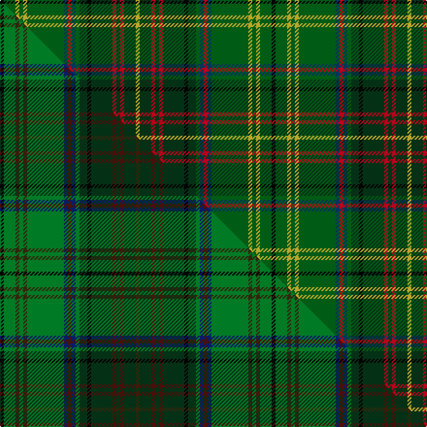

This page is one **sett** — a single exact thread-count. It belongs to the [tartan](/setts/k2dgi6ly2dgi2ly2dgi19db2r2db2dgi2dg4k2dg11r2dg2r2dg6ly2/)
(the same proportion at any scale), whose colour order is pattern [KGYGYGBRBGGKGRGRGY](/stripes/kgygygbrbggkgrgrgy/).

Part of the [Harmon Hunting](/tartans/harmon-hunting/) tartan — the named design grouping this sett with its other cloths.

Sourced from house-of-tartan.  It is a [18 stripe tartan](/stripes/stripes18/).

Original link http://www.house-of-tartan.scotland.net/house/TartanViewjs.asp?colr=Def&tnam=10017

## Provenance

Earliest known date: Mar. 2009 Harmons have a long and proud tradition as hunters and outdoorsmen. The hunting tartan pays homage to that tradition, providing a camouflage effect while maintaining a clear relation to the distinctive pattern of the Harmon Modern tartan. It is designed specifically for outdoor use in any activity in which blending with the natural surroundings is desired

## Thread count
K/4 DGi12 LY4 DGi4 LY4 DGi38 DB4 R4 DB4 DGi4 DG8 K4 DG22 R4 DG4 R4 DG12 LY/4

One full sett is **280 threads**.

## Palette
<table><thead><tr><th>Colour</th><th>Shade</th><th>OKLCh</th></tr></thead><tbody><tr><td>DB</td><td><code style="background-color:#003C64;">#003C64</code> <small style="color:#888">#003C64</small></td><td><small style="color:#888">oklch(34.5% 0.089 246.0)</small></td></tr><tr><td>DB</td><td><code style="background-color:#2C2C80;">#2C2C80</code> <small style="color:#888">#2C2C80</small></td><td><small style="color:#888">oklch(35.0% 0.138 276.6)</small></td></tr><tr><td>LY</td><td><code style="background-color:#DCBC32;">#DCBC32</code> <small style="color:#888">#DCBC32</small></td><td><small style="color:#888">oklch(80.0% 0.150 95.2)</small></td></tr><tr><td>G</td><td><code style="background-color:#5C6428;">#5C6428</code> <small style="color:#888">#5C6428</small></td><td><small style="color:#888">oklch(48.3% 0.084 116.0)</small></td></tr><tr><td>DG</td><td><code style="background-color:#053819;">#053819</code> <small style="color:#888">#053819</small></td><td><small style="color:#888">oklch(30.0% 0.075 151.3)</small></td></tr><tr><td>DG</td><td><code style="background-color:#006818;">#006818</code> <small style="color:#888">#006818</small></td><td><small style="color:#888">oklch(45.0% 0.142 145.0)</small></td></tr><tr><td>K</td><td><code style="background-color:#000000;">#000000</code> <small style="color:#888">#000000</small></td><td><small style="color:#888">oklch(0.0% 0.000 0.0)</small></td></tr><tr><td>R</td><td><code style="background-color:#D60020;">#D60020</code> <small style="color:#888">#D60020</small></td><td><small style="color:#888">oklch(55.2% 0.224 25.5)</small></td></tr></tbody></table>

# Sample pattern

## Compared to the master

This cloth is one sett of its design; the master sett (the exemplar the design is anchored on) is below for comparison.

Its **ΔTartan distance** from the master is **0.63** — the same measure the nearest-tartans table ranks by (0 is identical; a re-scale of the same cloth is near 0, a recolour or a different proportion further).

<figure class="master-compare" style="margin:0">

this sett
master sett ★

<figcaption style="color:#888;font-size:smaller">One weave of this sett against the <a href="/setts/k2g6dy2g2dy2g19db2dr2db2g2dg4k2dg11dr2dg2dr2dg6dy2/">master sett ★</a>, split on the diagonal: a shared proportion runs seamlessly across it with only the shades shifting; a different proportion breaks on it.</figcaption>
</figure>

## Nearest variants

The nearest existing variants by ΔTartan distance, with this cloth at the top so the swatches line up against it.

ΔTartan

Threads

Variant

Sett

—

280

<a href="/variants/s18/k2dgi6ly2dgi2ly2dgi19db2r2db2dgi2dg4k2dg11r2dg2r2dg6ly2~x2~dgi1806142-db1404245/">Harmon Hunting Personal Tartan</a>

<a href="/ttd/edit/#slug=k2g6dy2g2dy2g19db2dr2db2g2dg4k2dg11dr2dg2dr2dg6dy2~x2&amp;base=k2dgi6ly2dgi2ly2dgi19db2r2db2dgi2dg4k2dg11r2dg2r2dg6ly2~x2~dgi1806142-db1404245" title="compare in the TTD">0.00</a>

280

<a href="/variants/s18/k2g6dy2g2dy2g19db2dr2db2g2dg4k2dg11dr2dg2dr2dg6dy2~x2/">Harmon Hunting</a>

<a href="/ttd/edit/#slug=k2g6ly2g2ly2g19db2r2db2g2dg4k2dg11r2dg2r2dg6ly2~x2&amp;base=k2dgi6ly2dgi2ly2dgi19db2r2db2dgi2dg4k2dg11r2dg2r2dg6ly2~x2~dgi1806142-db1404245" title="compare in the TTD">0.00</a>

280

<a href="/variants/s18/k2g6ly2g2ly2g19db2r2db2g2dg4k2dg11r2dg2r2dg6ly2~x2/">Harmon Hunting (Personal)</a>

## Neighbour map

Every grey dot is one of 13620 variants placed by the first two principal components of the ΔTartan feature space (42% of its variance). Red is this tartan; blue dots are its nearest — click one to open its page.

<svg viewBox="0 0 640 380" role="img" style="max-width:100%;height:auto;border:1px solid #e0e0e0;border-radius:4px;display:block" xmlns="http://www.w3.org/2000/svg"><image href="/nn/cloud.v1.png" width="640" height="380"/><a href="/variants/s18/k2g6dy2g2dy2g19db2dr2db2g2dg4k2dg11dr2dg2dr2dg6dy2~x2/"><circle cx="181.2" cy="136.5" r="4" fill="#3465a4"><title>Harmon Hunting</title></circle></a><a href="/variants/s18/k2g6ly2g2ly2g19db2r2db2g2dg4k2dg11r2dg2r2dg6ly2~x2/"><circle cx="142.1" cy="122.1" r="4" fill="#3465a4"><title>Harmon Hunting (Personal)</title></circle></a><circle cx="166.1" cy="129.4" r="5" fill="#c00000"/><text x="320" y="376" text-anchor="middle" font-size="11" fill="#999">ground</text><text x="11" y="190" text-anchor="middle" font-size="11" fill="#999" transform="rotate(-90 11 190)">complexity</text></svg>

ID: /variants/s18/k2dgi6ly2dgi2ly2dgi19db2r2db2dgi2dg4k2dg11r2dg2r2dg6ly2~x2~dgi1806142-db1404245/
