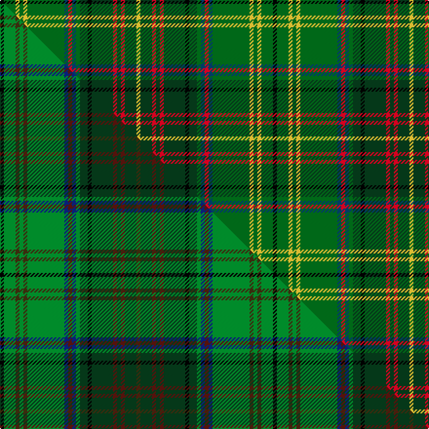

This is one **variant** — a specific cloth: this exact thread count and colourway, with its own
provenance below. It is one weaving of the [sett](/tartans/h/ha/harmon-hunting/) (the scale-free proportion — the
same cloth at any scale or shade), whose colour order is pattern [KGYGYGBRBGGKGRGRGY](/stripes/kgygygbrbggkgrgrgy/).

Part of the [Harmon Hunting](/tartans/h/ha/harmon-hunting/) tartan — the named design grouping this sett with its other cloths.

Sourced from house-of-tartan.  It is a [18 stripe tartan](/stripes/stripes18/).

Original link [http://www.house-of-tartan.scotland.net/house/TartanViewjs.asp?colr=Def&tnam=10017](http://www.house-of-tartan.scotland.net/house/TartanViewjs.asp?colr=Def&tnam=10017)

## Provenance

Earliest known date: Mar. 2009 Harmons have a long and proud tradition as hunters and outdoorsmen. The hunting tartan pays homage to that tradition, providing a camouflage effect while maintaining a clear relation to the distinctive pattern of the Harmon Modern tartan. It is designed specifically for outdoor use in any activity in which blending with the natural surroundings is desired

Dataset <small>— provenance for this record, inherited from the source manifest</small>

<dl class="dataset-prov">
<dt>source</dt><dd><a href="/sources/house-of-tartan/">House of Tartan</a></dd>
<dt>data captured from</dt><dd><a href="https://github.com/thetartan/tartan-database/blob/master/data/house-of-tartan/data.csv">https://github.com/thetartan/tartan-database/blob/master/data/house-of-tartan/data.csv</a></dd>
<dt>data date</dt><dd>2017-01-10 <small>(dataset default)</small></dd>
<dt>licence</dt><dd><a href="https://creativecommons.org/licenses/by-nc-nd/4.0/">CC BY-NC-ND 4.0</a></dd>
</dl>

Capture chain <small>— the hands this data passed through, oldest first; each capture carries its own licence</small>

<ol class="capture-chain">
<li><a href="http://www.house-of-tartan.scotland.net/">House of Tartan</a> <small>the weaver/retailer's database — the site is now offline; the URL is kept as the ultimate source's identity</small></li>
<li><a href="https://github.com/thetartan/tartan-database">thetartan/tartan-database</a> <small>2016-2017</small> · <a href="https://creativecommons.org/licenses/by-nc-nd/4.0/">CC BY-NC-ND 4.0</a> <small>Levko Kravets's frozen compilation — the capture we vendored, and where its CC licence text came from</small></li>
<li>this dictionary <small>captured 2026-06-10 · commit 5bf86c7566</small> <small>each re-capture is a git commit to data/sources</small></li>
</ol>

## Thread count
K/4 DGi12 LY4 DGi4 LY4 DGi38 DB4 R4 DB4 DGi4 DG8 K4 DG22 R4 DG4 R4 DG12 LY/4

One full sett is **280 threads**.

## Palette
<table><thead><tr><th>Colour</th><th>Shade</th><th>OKLCh</th></tr></thead><tbody><tr><td>DB</td><td><code style="background-color:#003C64;">#003C64</code> <small style="color:#888">#003C64</small></td><td><small style="color:#888">oklch(34.5% 0.089 246.0)</small></td></tr><tr><td>DB</td><td><code style="background-color:#2C2C80;">#2C2C80</code> <small style="color:#888">#2C2C80</small></td><td><small style="color:#888">oklch(35.0% 0.138 276.6)</small></td></tr><tr><td>LY</td><td><code style="background-color:#DCBC32;">#DCBC32</code> <small style="color:#888">#DCBC32</small></td><td><small style="color:#888">oklch(80.0% 0.150 95.2)</small></td></tr><tr><td>G</td><td><code style="background-color:#5C6428;">#5C6428</code> <small style="color:#888">#5C6428</small></td><td><small style="color:#888">oklch(48.3% 0.084 116.0)</small></td></tr><tr><td>DG</td><td><code style="background-color:#053819;">#053819</code> <small style="color:#888">#053819</small></td><td><small style="color:#888">oklch(30.0% 0.075 151.3)</small></td></tr><tr><td>DG</td><td><code style="background-color:#006818;">#006818</code> <small style="color:#888">#006818</small></td><td><small style="color:#888">oklch(45.0% 0.142 145.0)</small></td></tr><tr><td>K</td><td><code style="background-color:#000000;">#000000</code> <small style="color:#888">#000000</small></td><td><small style="color:#888">oklch(0.0% 0.000 0.0)</small></td></tr><tr><td>R</td><td><code style="background-color:#D60020;">#D60020</code> <small style="color:#888">#D60020</small></td><td><small style="color:#888">oklch(55.2% 0.224 25.5)</small></td></tr></tbody></table>

# Sample pattern

## Compared to the master

This cloth is one sett of its design; the master sett (the exemplar the design is anchored on) is below for comparison.

Its **ΔTartan distance** from the master is **0.17** — the same measure the nearest-tartans table ranks by (0 is identical; a re-scale of the same cloth is near 0, a recolour or a different proportion further).

<figure class="master-compare" style="margin:0">

this sett
master sett ★

<figcaption style="color:#888;font-size:smaller">One weave of this sett against the <a href="/setts/k2g6dy2g2dy2g19db2dr2db2g2dg4k2dg11dr2dg2dr2dg6dy2/">master sett ★</a>, split on the diagonal: a shared proportion runs seamlessly across it with only the shades shifting; a different proportion breaks on it.</figcaption>
</figure>

## Nearest tartan variants

The nearest existing variants by ΔTartan distance, with this cloth at the top so the swatches line up against it.

ΔTartan

Threads

Variant

Sett

—

280

<a href="/variants/s18/k2dgi6ly2dgi2ly2dgi19db2r2db2dgi2dg4k2dg11r2dg2r2dg6ly2~x2~dgi4514144-db3409246/">Harmon Hunting Personal Tartan</a>

<a href="/ttd/edit/#slug=k2g6ly2g2ly2g19db2r2db2g2dg4k2dg11r2dg2r2dg6ly2~x2&amp;base=k2dgi6ly2dgi2ly2dgi19db2r2db2dgi2dg4k2dg11r2dg2r2dg6ly2~x2~dgi4514144-db3409246" title="compare in the TTD">0.10</a>

280

<a href="/variants/s18/k2g6ly2g2ly2g19db2r2db2g2dg4k2dg11r2dg2r2dg6ly2~x2/">Harmon Hunting (Personal)</a>

<a href="/ttd/edit/#slug=k2g6dy2g2dy2g19db2dr2db2g2dg4k2dg11dr2dg2dr2dg6dy2~x2&amp;base=k2dgi6ly2dgi2ly2dgi19db2r2db2dgi2dg4k2dg11r2dg2r2dg6ly2~x2~dgi4514144-db3409246" title="compare in the TTD">0.17</a>

280

<a href="/variants/s18/k2g6dy2g2dy2g19db2dr2db2g2dg4k2dg11dr2dg2dr2dg6dy2~x2/">Harmon Hunting</a>

<a href="/ttd/edit/#slug=y3k3dg2k6g7dg2y3dg2ly3dg5y3b3y20k2~x2~ly6614084&amp;base=k2dgi6ly2dgi2ly2dgi19db2r2db2dgi2dg4k2dg11r2dg2r2dg6ly2~x2~dgi4514144-db3409246" title="compare in the TTD">2.57</a>

246

<a href="/variants/s14/y3k3dg2k6g7dg2y3dg2ly3dg5y3b3y20k2~x2~ly6614084/">Stewart Camel Fashion Tartan</a>

<a href="/ttd/edit/#slug=dg16k6dg16g32k2dy7y2dy7y2dy7t13&amp;base=k2dgi6ly2dgi2ly2dgi19db2r2db2dgi2dg4k2dg11r2dg2r2dg6ly2~x2~dgi4514144-db3409246" title="compare in the TTD">2.72</a>

191

<a href="/variants/s11/dg16k6dg16g32k2dy7y2dy7y2dy7t13/">Wagga Wagga</a>

<a href="/ttd/edit/#slug=r2dg18g2dg2g2dg2g12db3k13dg10k2g12y2~x2&amp;base=k2dgi6ly2dgi2ly2dgi19db2r2db2dgi2dg4k2dg11r2dg2r2dg6ly2~x2~dgi4514144-db3409246" title="compare in the TTD">2.78</a>

320

<a href="/variants/s13/r2dg18g2dg2g2dg2g12db3k13dg10k2g12y2~x2/">McHeadley Society</a>

<a href="/ttd/edit/#slug=k8do2k2do27g2do2g2do2g18dr2g2dr2dg2dr15g3~x2&amp;base=k2dgi6ly2dgi2ly2dgi19db2r2db2dgi2dg4k2dg11r2dg2r2dg6ly2~x2~dgi4514144-db3409246" title="compare in the TTD">2.85</a>

342

<a href="/variants/s15/k8do2k2do27g2do2g2do2g18dr2g2dr2dg2dr15g3~x2/">Strathmore District Tartan</a>

<a href="/ttd/edit/#slug=dg6g3dg24k2dg4k16o5dg2w4dg2g21dg2k2y3~x2&amp;base=k2dgi6ly2dgi2ly2dgi19db2r2db2dgi2dg4k2dg11r2dg2r2dg6ly2~x2~dgi4514144-db3409246" title="compare in the TTD">3.01</a>

366

<a href="/variants/s14/dg6g3dg24k2dg4k16o5dg2w4dg2g21dg2k2y3~x2/">Celtic F.C.</a>

<a href="/ttd/edit/#slug=r4k1dg8g2dg8k4g8k1db2k1g8k4dg8k2dg8k1y2~x2~dg3710150-g4917141&amp;base=k2dgi6ly2dgi2ly2dgi19db2r2db2dgi2dg4k2dg11r2dg2r2dg6ly2~x2~dgi4514144-db3409246" title="compare in the TTD">3.10</a>

276

<a href="/variants/s17/r4k1dg8g2dg8k4g8k1db2k1g8k4dg8k2dg8k1y2~x2~dg3710150-g4917141/">Redmond (2014)</a>

<a href="/ttd/edit/#slug=db12g24r5do20g4w2g4do21y5g24db12do4k2do4~x2&amp;base=k2dgi6ly2dgi2ly2dgi19db2r2db2dgi2dg4k2dg11r2dg2r2dg6ly2~x2~dgi4514144-db3409246" title="compare in the TTD">3.25</a>

540

<a href="/variants/s14/db12g24r5do20g4w2g4do21y5g24db12do4k2do4~x2/">Hyndman (Personal)</a>

<a href="/ttd/edit/#slug=dg19g5k2t3dg5g3t5k2db3g5w2~x2~t5810240-db2911276&amp;base=k2dgi6ly2dgi2ly2dgi19db2r2db2dgi2dg4k2dg11r2dg2r2dg6ly2~x2~dgi4514144-db3409246" title="compare in the TTD">3.26</a>

174

<a href="/variants/s11/dg19g5k2t3dg5g3t5k2db3g5w2~x2~t5810240-db2911276/">MacLean, Kenneth, baron of Denboig (Personal)</a>

## Neighbour map

Every grey dot is one of 13662 variants placed by the first two principal components of the ΔTartan feature space (42% of its variance). Red is this tartan; blue dots are its nearest — click one to open its page. The map is a flat projection of a many-dimensional space — [how to read it](/posts/neighbourhood-maps/).

<svg viewBox="0 0 640 380" role="img" style="max-width:100%;height:auto;border:1px solid #e0e0e0;border-radius:4px;display:block" xmlns="http://www.w3.org/2000/svg"><image href="/nn/cloud.v1.png" width="640" height="380"/><a href="/variants/s18/k2g6ly2g2ly2g19db2r2db2g2dg4k2dg11r2dg2r2dg6ly2~x2/"><circle cx="142.0" cy="122.1" r="4" fill="#3465a4"><title>Harmon Hunting (Personal)</title></circle></a><a href="/variants/s18/k2g6dy2g2dy2g19db2dr2db2g2dg4k2dg11dr2dg2dr2dg6dy2~x2/"><circle cx="181.0" cy="136.7" r="4" fill="#3465a4"><title>Harmon Hunting</title></circle></a><a href="/variants/s14/y3k3dg2k6g7dg2y3dg2ly3dg5y3b3y20k2~x2~ly6614084/"><circle cx="156.8" cy="129.4" r="4" fill="#3465a4"><title>Stewart Camel Fashion Tartan</title></circle></a><a href="/variants/s11/dg16k6dg16g32k2dy7y2dy7y2dy7t13/"><circle cx="145.0" cy="124.8" r="4" fill="#3465a4"><title>Wagga Wagga</title></circle></a><a href="/variants/s13/r2dg18g2dg2g2dg2g12db3k13dg10k2g12y2~x2/"><circle cx="140.5" cy="151.5" r="4" fill="#3465a4"><title>McHeadley Society</title></circle></a><a href="/variants/s15/k8do2k2do27g2do2g2do2g18dr2g2dr2dg2dr15g3~x2/"><circle cx="179.8" cy="104.7" r="4" fill="#3465a4"><title>Strathmore District Tartan</title></circle></a><a href="/variants/s14/dg6g3dg24k2dg4k16o5dg2w4dg2g21dg2k2y3~x2/"><circle cx="141.1" cy="115.7" r="4" fill="#3465a4"><title>Celtic F.C.</title></circle></a><a href="/variants/s17/r4k1dg8g2dg8k4g8k1db2k1g8k4dg8k2dg8k1y2~x2~dg3710150-g4917141/"><circle cx="142.8" cy="163.3" r="4" fill="#3465a4"><title>Redmond (2014)</title></circle></a><a href="/variants/s14/db12g24r5do20g4w2g4do21y5g24db12do4k2do4~x2/"><circle cx="151.1" cy="139.1" r="4" fill="#3465a4"><title>Hyndman (Personal)</title></circle></a><a href="/variants/s11/dg19g5k2t3dg5g3t5k2db3g5w2~x2~t5810240-db2911276/"><circle cx="164.6" cy="152.9" r="4" fill="#3465a4"><title>MacLean, Kenneth, baron of Denboig (Personal)</title></circle></a><circle cx="166.0" cy="129.5" r="5" fill="#c00000"/><text x="320" y="376" text-anchor="middle" font-size="11" fill="#999">ground</text><text x="11" y="190" text-anchor="middle" font-size="11" fill="#999" transform="rotate(-90 11 190)">complexity</text></svg>

ID: /variants/s18/k2dgi6ly2dgi2ly2dgi19db2r2db2dgi2dg4k2dg11r2dg2r2dg6ly2~x2~dgi4514144-db3409246/
