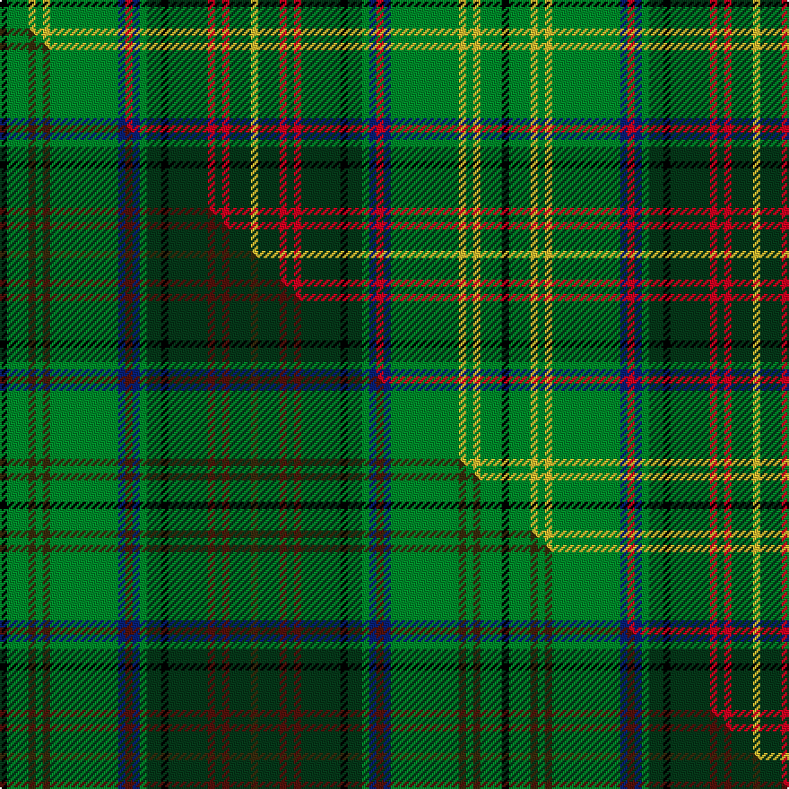

This is one **variant** — a specific cloth: this exact thread count and colourway, with its own
provenance below. It is one weaving of the [sett](/setts/k2g6ly2g2ly2g19db2r2db2g2dg4k2dg11r2dg2r2dg6ly2/) (the scale-free proportion — the
same cloth at any scale or shade), whose colour order is pattern [KGYGYGBRBGGKGRGRGY](/stripes/kgygygbrbggkgrgrgy/).

Part of the [Harmon Hunting](/tartans/harmon-hunting/) tartan — the named design grouping this sett with its other cloths.

Sourced from tartans-authority.  It is a [18 stripe tartan](/stripes/stripes18/).

Original link [https://www.tartanregister.gov.uk/tartanDetails.aspx?ref=10017](https://www.tartanregister.gov.uk/tartanDetails.aspx?ref=10017)

Dataset <small>— provenance for this record, inherited from the source manifest</small>

<dl class="dataset-prov">
<dt>source</dt><dd><a href="/sources/tartans-authority/">Scottish Tartans Authority</a></dd>
<dt>data captured from</dt><dd><a href="https://github.com/thetartan/tartan-database/blob/master/data/tartans-authority/data.csv">https://github.com/thetartan/tartan-database/blob/master/data/tartans-authority/data.csv</a></dd>
<dt>data date</dt><dd>Mar. 2009 <small>(this record)</small></dd>
<dt>licence</dt><dd><a href="https://creativecommons.org/licenses/by-nc-nd/4.0/">CC BY-NC-ND 4.0</a></dd>
</dl>

Capture chain <small>— the hands this data passed through, oldest first; each capture carries its own licence</small>

<ol class="capture-chain">
<li><a href="https://www.tartansauthority.com/">Scottish Tartans Authority</a> <small>the heritage body's archive — its tartan-ferret record browser is retired (links repaired to the SRT, above)</small></li>
<li><a href="https://github.com/thetartan/tartan-database">thetartan/tartan-database</a> <small>2016-2017</small> · <a href="https://creativecommons.org/licenses/by-nc-nd/4.0/">CC BY-NC-ND 4.0</a> <small>Levko Kravets's frozen compilation — the capture we vendored, and where its CC licence text came from</small></li>
<li>this dictionary <small>captured 2026-06-10 · commit 5bf86c7566</small> <small>each re-capture is a git commit to data/sources</small></li>
</ol>

## Register references

External register numbers recorded for this tartan.

- Scottish Register of Tartans: [10017](https://www.tartanregister.gov.uk/tartanDetails?ref=10017)
- Scottish Tartans Authority (ITI): 10017

## Thread count
K/4 G12 LY4 G4 LY4 G38 DB4 R4 DB4 G4 DG8 K4 DG22 R4 DG4 R4 DG12 LY/4

One full sett is **280 threads**.

## Palette
<table><thead><tr><th>Colour</th><th>Shade</th><th>OKLCh</th></tr></thead><tbody><tr><td>DB</td><td><code style="background-color:#082077;">#082077</code> <small style="color:#888">#082077</small></td><td><small style="color:#888">oklch(30.0% 0.149 265.1)</small></td></tr><tr><td>LY</td><td><code style="background-color:#DCBC32;">#DCBC32</code> <small style="color:#888">#DCBC32</small></td><td><small style="color:#888">oklch(80.0% 0.150 95.2)</small></td></tr><tr><td>G</td><td><code style="background-color:#008B2A;">#008B2A</code> <small style="color:#888">#008B2A</small></td><td><small style="color:#888">oklch(55.4% 0.170 145.9)</small></td></tr><tr><td>DG</td><td><code style="background-color:#053819;">#053819</code> <small style="color:#888">#053819</small></td><td><small style="color:#888">oklch(30.0% 0.075 151.3)</small></td></tr><tr><td>K</td><td><code style="background-color:#000000;">#000000</code> <small style="color:#888">#000000</small></td><td><small style="color:#888">oklch(0.0% 0.000 0.0)</small></td></tr><tr><td>R</td><td><code style="background-color:#D60020;">#D60020</code> <small style="color:#888">#D60020</small></td><td><small style="color:#888">oklch(55.2% 0.224 25.5)</small></td></tr></tbody></table>

# Sample pattern

## Compared to the master

This cloth is one sett of its design; the master sett (the exemplar the design is anchored on) is below for comparison.

Its **ΔTartan distance** from the master is **0.12** — the same measure the nearest-tartans table ranks by (0 is identical; a re-scale of the same cloth is near 0, a recolour or a different proportion further).

<figure class="master-compare" style="margin:0">

this sett
master sett ★

<figcaption style="color:#888;font-size:smaller">One weave of this sett against the <a href="/setts/k2g6dy2g2dy2g19db2dr2db2g2dg4k2dg11dr2dg2dr2dg6dy2/">master sett ★</a>, split on the diagonal: a shared proportion runs seamlessly across it with only the shades shifting; a different proportion breaks on it.</figcaption>
</figure>

## Nearest tartan variants

The nearest existing variants by ΔTartan distance, with this cloth at the top so the swatches line up against it.

ΔTartan

Threads

Variant

Sett

—

280

<a href="/variants/s18/k2g6ly2g2ly2g19db2r2db2g2dg4k2dg11r2dg2r2dg6ly2~x2/">Harmon Hunting (Personal)</a>

<a href="/ttd/edit/#slug=k2dgi6ly2dgi2ly2dgi19db2r2db2dgi2dg4k2dg11r2dg2r2dg6ly2~x2~dgi1806142-db1404245&amp;base=k2g6ly2g2ly2g19db2r2db2g2dg4k2dg11r2dg2r2dg6ly2~x2" title="compare in the TTD">0.10</a>

280

<a href="/variants/s18/k2dgi6ly2dgi2ly2dgi19db2r2db2dgi2dg4k2dg11r2dg2r2dg6ly2~x2~dgi1806142-db1404245/">Harmon Hunting Personal Tartan</a>

<a href="/ttd/edit/#slug=k2g6dy2g2dy2g19db2dr2db2g2dg4k2dg11dr2dg2dr2dg6dy2~x2&amp;base=k2g6ly2g2ly2g19db2r2db2g2dg4k2dg11r2dg2r2dg6ly2~x2" title="compare in the TTD">0.12</a>

280

<a href="/variants/s18/k2g6dy2g2dy2g19db2dr2db2g2dg4k2dg11dr2dg2dr2dg6dy2~x2/">Harmon Hunting</a>

<a href="/ttd/edit/#slug=y3k3dg2k6g7dg2y3dg2ly3dg5y3b3y20k2~x2~ly2705081&amp;base=k2g6ly2g2ly2g19db2r2db2g2dg4k2dg11r2dg2r2dg6ly2~x2" title="compare in the TTD">2.22</a>

246

<a href="/variants/s14/y3k3dg2k6g7dg2y3dg2ly3dg5y3b3y20k2~x2~ly2705081/">Stewart Camel Fashion Tartan</a>

<a href="/ttd/edit/#slug=dg6g3dg24k2dg4k16o5dg2w4dg2g21dg2k2y3~x2&amp;base=k2g6ly2g2ly2g19db2r2db2g2dg4k2dg11r2dg2r2dg6ly2~x2" title="compare in the TTD">2.36</a>

366

<a href="/variants/s14/dg6g3dg24k2dg4k16o5dg2w4dg2g21dg2k2y3~x2/">Celtic F.C.</a>

<a href="/ttd/edit/#slug=r2dg18g2dg2g2dg2g12db3k13dg10k2g12y2~x2&amp;base=k2g6ly2g2ly2g19db2r2db2g2dg4k2dg11r2dg2r2dg6ly2~x2" title="compare in the TTD">2.63</a>

320

<a href="/variants/s13/r2dg18g2dg2g2dg2g12db3k13dg10k2g12y2~x2/">McHeadley Society</a>

<a href="/ttd/edit/#slug=g20k2w2k2y2k2g19r5k19r5t20k2g2k2g2k2t20~x2&amp;base=k2g6ly2g2ly2g19db2r2db2g2dg4k2dg11r2dg2r2dg6ly2~x2" title="compare in the TTD">2.71</a>

432

<a href="/variants/s17/g20k2w2k2y2k2g19r5k19r5t20k2g2k2g2k2t20~x2/">MacNicol Htg (Clan)</a>

<a href="/ttd/edit/#slug=r2k6g2k2g14k1y2k1t5r1t5k1w2k1g14k1t2~x2&amp;base=k2g6ly2g2ly2g19db2r2db2g2dg4k2dg11r2dg2r2dg6ly2~x2" title="compare in the TTD">2.71</a>

240

<a href="/variants/s17/r2k6g2k2g14k1y2k1t5r1t5k1w2k1g14k1t2~x2/">Duncan of Sketraw</a>

<a href="/ttd/edit/#slug=dr2g13t2k3ly1k1lr1k1g4dr2k1dr2lr1~x4&amp;base=k2g6ly2g2ly2g19db2r2db2g2dg4k2dg11r2dg2r2dg6ly2~x2" title="compare in the TTD">2.97</a>

260

<a href="/variants/s13/dr2g13t2k3ly1k1lr1k1g4dr2k1dr2lr1~x4/">Stewart (King George VI)</a>

<a href="/ttd/edit/#slug=g7r2g3r5g17y2k15y2t22g3w2t7~x2&amp;base=k2g6ly2g2ly2g19db2r2db2g2dg4k2dg11r2dg2r2dg6ly2~x2" title="compare in the TTD">3.02</a>

320

<a href="/variants/s12/g7r2g3r5g17y2k15y2t22g3w2t7~x2/">Paisley</a>

<a href="/ttd/edit/#slug=dg5g3dg16k2dg4k12g4dg2lb5dg2g16dg2k2y3~x2&amp;base=k2g6ly2g2ly2g19db2r2db2g2dg4k2dg11r2dg2r2dg6ly2~x2" title="compare in the TTD">3.08</a>

296

<a href="/variants/s14/dg5g3dg16k2dg4k12g4dg2lb5dg2g16dg2k2y3~x2/">Celtic Football Club (1996)</a>

## Neighbour map

Every grey dot is one of 13621 variants placed by the first two principal components of the ΔTartan feature space (42% of its variance). Red is this tartan; blue dots are its nearest — click one to open its page.

<svg viewBox="0 0 640 380" role="img" style="max-width:100%;height:auto;border:1px solid #e0e0e0;border-radius:4px;display:block" xmlns="http://www.w3.org/2000/svg"><image href="/nn/cloud.v1.png" width="640" height="380"/><a href="/variants/s18/k2dgi6ly2dgi2ly2dgi19db2r2db2dgi2dg4k2dg11r2dg2r2dg6ly2~x2~dgi1806142-db1404245/"><circle cx="166.1" cy="129.4" r="4" fill="#3465a4"><title>Harmon Hunting Personal Tartan</title></circle></a><a href="/variants/s18/k2g6dy2g2dy2g19db2dr2db2g2dg4k2dg11dr2dg2dr2dg6dy2~x2/"><circle cx="181.1" cy="136.4" r="4" fill="#3465a4"><title>Harmon Hunting</title></circle></a><a href="/variants/s14/y3k3dg2k6g7dg2y3dg2ly3dg5y3b3y20k2~x2~ly2705081/"><circle cx="156.9" cy="129.7" r="4" fill="#3465a4"><title>Stewart Camel Fashion Tartan</title></circle></a><a href="/variants/s14/dg6g3dg24k2dg4k16o5dg2w4dg2g21dg2k2y3~x2/"><circle cx="141.3" cy="115.8" r="4" fill="#3465a4"><title>Celtic F.C.</title></circle></a><a href="/variants/s13/r2dg18g2dg2g2dg2g12db3k13dg10k2g12y2~x2/"><circle cx="140.8" cy="151.6" r="4" fill="#3465a4"><title>McHeadley Society</title></circle></a><a href="/variants/s17/g20k2w2k2y2k2g19r5k19r5t20k2g2k2g2k2t20~x2/"><circle cx="91.2" cy="115.2" r="4" fill="#3465a4"><title>MacNicol Htg (Clan)</title></circle></a><a href="/variants/s17/r2k6g2k2g14k1y2k1t5r1t5k1w2k1g14k1t2~x2/"><circle cx="165.2" cy="96.9" r="4" fill="#3465a4"><title>Duncan of Sketraw</title></circle></a><a href="/variants/s13/dr2g13t2k3ly1k1lr1k1g4dr2k1dr2lr1~x4/"><circle cx="184.7" cy="105.0" r="4" fill="#3465a4"><title>Stewart (King George VI)</title></circle></a><a href="/variants/s12/g7r2g3r5g17y2k15y2t22g3w2t7~x2/"><circle cx="108.2" cy="141.3" r="4" fill="#3465a4"><title>Paisley</title></circle></a><a href="/variants/s14/dg5g3dg16k2dg4k12g4dg2lb5dg2g16dg2k2y3~x2/"><circle cx="136.3" cy="161.1" r="4" fill="#3465a4"><title>Celtic Football Club (1996)</title></circle></a><circle cx="142.0" cy="122.1" r="5" fill="#c00000"/><text x="320" y="376" text-anchor="middle" font-size="11" fill="#999">ground</text><text x="11" y="190" text-anchor="middle" font-size="11" fill="#999" transform="rotate(-90 11 190)">complexity</text></svg>

ID: /variants/s18/k2g6ly2g2ly2g19db2r2db2g2dg4k2dg11r2dg2r2dg6ly2~x2/
