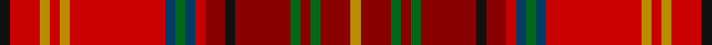

This page is one **sett** — a single exact thread-count. It belongs to the [tartan](/setts/k2r6lo2r2lo2r19dt2g2dt2r2ri4k2ri11g2ri2g2ri6lo2/)
(the same proportion at any scale), whose colour order is pattern [KRYRYRBGBRRKRGRGRY](/stripes/kryryrbgbrrkrgrgry/).

Part of the [Harmon](/tartans/harmon/) tartan — the named design grouping this sett with its other cloths.

Sourced from tartans-authority.  It is a [18 stripe tartan](/stripes/stripes18/).

Original link http://www.tartansauthority.com/tartan-ferret/display/7792/

## Register references

External register numbers recorded for this tartan.

- Scottish Tartans Authority (ITI): 7792

## Thread count
K/4 R12 DY4 R4 DY4 R38 DB4 G4 DB4 R4 DR8 K4 DR22 G4 DR4 G4 DR12 DY/4

One full sett is **280 threads**.

## Palette

Palette: <strong>Tartan Register</strong>
<table><thead><tr><th>Colour</th><th>Threads</th><th>Shade</th><th>Base</th><th>OKLCh</th></tr></thead><tbody><tr><td>K/</td><td style="text-align:right;font-variant-numeric:tabular-nums">4</td><td><code style="background-color:#101010;">#101010</code> <small style="color:#888">#101010</small></td><td>K <code style="background-color:#000000;">#000000</code></td><td><small style="color:#888">oklch(17.3% 0.000 89.9)</small></td></tr><tr><td>R</td><td style="text-align:right;font-variant-numeric:tabular-nums">12</td><td><code style="background-color:#C80000;">#C80000</code> <small style="color:#888">#C80000</small></td><td>R <code style="background-color:#CC0000;">#CC0000</code></td><td><small style="color:#888">oklch(52.3% 0.215 29.2)</small></td></tr><tr><td>DY</td><td style="text-align:right;font-variant-numeric:tabular-nums">4</td><td><code style="background-color:#BC8C00;">#BC8C00</code> <small style="color:#888">#BC8C00</small></td><td>Y <code style="background-color:#F2BF00;">#F2BF00</code></td><td><small style="color:#888">oklch(66.8% 0.137 84.1)</small></td></tr><tr><td>R</td><td style="text-align:right;font-variant-numeric:tabular-nums">4</td><td><code style="background-color:#C80000;">#C80000</code> <small style="color:#888">#C80000</small></td><td>R <code style="background-color:#CC0000;">#CC0000</code></td><td><small style="color:#888">oklch(52.3% 0.215 29.2)</small></td></tr><tr><td>DY</td><td style="text-align:right;font-variant-numeric:tabular-nums">4</td><td><code style="background-color:#BC8C00;">#BC8C00</code> <small style="color:#888">#BC8C00</small></td><td>Y <code style="background-color:#F2BF00;">#F2BF00</code></td><td><small style="color:#888">oklch(66.8% 0.137 84.1)</small></td></tr><tr><td>R</td><td style="text-align:right;font-variant-numeric:tabular-nums">38</td><td><code style="background-color:#C80000;">#C80000</code> <small style="color:#888">#C80000</small></td><td>R <code style="background-color:#CC0000;">#CC0000</code></td><td><small style="color:#888">oklch(52.3% 0.215 29.2)</small></td></tr><tr><td>DB</td><td style="text-align:right;font-variant-numeric:tabular-nums">4</td><td><code style="background-color:#003C64;">#003C64</code> <small style="color:#888">#003C64</small></td><td>B <code style="background-color:#2A418A;">#2A418A</code></td><td><small style="color:#888">oklch(34.5% 0.089 246.0)</small></td></tr><tr><td>G</td><td style="text-align:right;font-variant-numeric:tabular-nums">4</td><td><code style="background-color:#006818;">#006818</code> <small style="color:#888">#006818</small></td><td>G <code style="background-color:#006100;">#006100</code></td><td><small style="color:#888">oklch(45.0% 0.142 145.0)</small></td></tr><tr><td>DB</td><td style="text-align:right;font-variant-numeric:tabular-nums">4</td><td><code style="background-color:#003C64;">#003C64</code> <small style="color:#888">#003C64</small></td><td>B <code style="background-color:#2A418A;">#2A418A</code></td><td><small style="color:#888">oklch(34.5% 0.089 246.0)</small></td></tr><tr><td>R</td><td style="text-align:right;font-variant-numeric:tabular-nums">4</td><td><code style="background-color:#C80000;">#C80000</code> <small style="color:#888">#C80000</small></td><td>R <code style="background-color:#CC0000;">#CC0000</code></td><td><small style="color:#888">oklch(52.3% 0.215 29.2)</small></td></tr><tr><td>DR</td><td style="text-align:right;font-variant-numeric:tabular-nums">8</td><td><code style="background-color:#880000;">#880000</code> <small style="color:#888">#880000</small></td><td>R <code style="background-color:#CC0000;">#CC0000</code></td><td><small style="color:#888">oklch(39.4% 0.162 29.2)</small></td></tr><tr><td>K</td><td style="text-align:right;font-variant-numeric:tabular-nums">4</td><td><code style="background-color:#101010;">#101010</code> <small style="color:#888">#101010</small></td><td>K <code style="background-color:#000000;">#000000</code></td><td><small style="color:#888">oklch(17.3% 0.000 89.9)</small></td></tr><tr><td>DR</td><td style="text-align:right;font-variant-numeric:tabular-nums">22</td><td><code style="background-color:#880000;">#880000</code> <small style="color:#888">#880000</small></td><td>R <code style="background-color:#CC0000;">#CC0000</code></td><td><small style="color:#888">oklch(39.4% 0.162 29.2)</small></td></tr><tr><td>G</td><td style="text-align:right;font-variant-numeric:tabular-nums">4</td><td><code style="background-color:#006818;">#006818</code> <small style="color:#888">#006818</small></td><td>G <code style="background-color:#006100;">#006100</code></td><td><small style="color:#888">oklch(45.0% 0.142 145.0)</small></td></tr><tr><td>DR</td><td style="text-align:right;font-variant-numeric:tabular-nums">4</td><td><code style="background-color:#880000;">#880000</code> <small style="color:#888">#880000</small></td><td>R <code style="background-color:#CC0000;">#CC0000</code></td><td><small style="color:#888">oklch(39.4% 0.162 29.2)</small></td></tr><tr><td>G</td><td style="text-align:right;font-variant-numeric:tabular-nums">4</td><td><code style="background-color:#006818;">#006818</code> <small style="color:#888">#006818</small></td><td>G <code style="background-color:#006100;">#006100</code></td><td><small style="color:#888">oklch(45.0% 0.142 145.0)</small></td></tr><tr><td>DR</td><td style="text-align:right;font-variant-numeric:tabular-nums">12</td><td><code style="background-color:#880000;">#880000</code> <small style="color:#888">#880000</small></td><td>R <code style="background-color:#CC0000;">#CC0000</code></td><td><small style="color:#888">oklch(39.4% 0.162 29.2)</small></td></tr><tr><td>DY/</td><td style="text-align:right;font-variant-numeric:tabular-nums">4</td><td><code style="background-color:#BC8C00;">#BC8C00</code> <small style="color:#888">#BC8C00</small></td><td>Y <code style="background-color:#F2BF00;">#F2BF00</code></td><td><small style="color:#888">oklch(66.8% 0.137 84.1)</small></td></tr></tbody></table>

## Compared to the master

This cloth is one sett of its design; the master sett (the exemplar the design is anchored on) is below for comparison.

<figure style="margin:0"><figcaption style="color:#888;font-size:smaller">this sett</figcaption></figure>
<figure style="margin:0"><figcaption style="color:#888;font-size:smaller"><a href="/setts/k2r6ly2r2ly2r19db2g2db2r2ri4k2ri11g2ri2g2ri6ly2/">master sett →</a></figcaption></figure>

## Nearest tartans

The nearest existing variants by ΔTartan distance, with this tartan at the top so the swatches line up against it.

ΔTartan

Tartan

Sett

—

<a href="/ttd/edit/#slug=k2r6lo2r2lo2r19dt2g2dt2r2ri4k2ri11g2ri2g2ri6lo2~x2">Harmon (Name)</a> <a class="nn-out" href="/variants/s18/k2r6lo2r2lo2r19dt2g2dt2r2ri4k2ri11g2ri2g2ri6lo2~x2/" title="open its dictionary page">↗</a>

0.80

<a href="/ttd/edit/#slug=k2r6ly2r2ly2r19db2g2db2r2ri4k2ri11g2ri2g2ri6ly2~x2&amp;base=k2r6lo2r2lo2r19dt2g2dt2r2ri4k2ri11g2ri2g2ri6lo2~x2">Harmon (Personal)</a> <a class="nn-out" href="/variants/s18/k2r6ly2r2ly2r19db2g2db2r2ri4k2ri11g2ri2g2ri6ly2~x2/" title="open its dictionary page">↗</a>

1.06

<a href="/ttd/edit/#slug=r7ri5rii5r31k9rii4ri3r5ri3rii4dg30r4ri3rii5r5~x2&amp;base=k2r6lo2r2lo2r19dt2g2dt2r2ri4k2ri11g2ri2g2ri6lo2~x2">MacDougall (Kinloch Anderson)</a> <a class="nn-out" href="/variants/s15/r7ri5rii5r31k9rii4ri3r5ri3rii4dg30r4ri3rii5r5~x2/" title="open its dictionary page">↗</a>

1.44

<a href="/ttd/edit/#slug=g3db3g3db3g3m22ly2db2r22t5r8ly2t2~x2&amp;base=k2r6lo2r2lo2r19dt2g2dt2r2ri4k2ri11g2ri2g2ri6lo2~x2">Pitcairn Trust Company</a> <a class="nn-out" href="/variants/s13/g3db3g3db3g3m22ly2db2r22t5r8ly2t2~x2/" title="open its dictionary page">↗</a>

1.50

<a href="/ttd/edit/#slug=lr6y2lr2y5r20o2r2o25ri2o2ri4ly10r2~x2&amp;base=k2r6lo2r2lo2r19dt2g2dt2r2ri4k2ri11g2ri2g2ri6lo2~x2">Strathtay (District?)</a> <a class="nn-out" href="/variants/s13/lr6y2lr2y5r20o2r2o25ri2o2ri4ly10r2~x2/" title="open its dictionary page">↗</a>

1.51

<a href="/ttd/edit/#slug=dg24r7dg7r7dg7r22r7r4b4r4r40b14&amp;base=k2r6lo2r2lo2r19dt2g2dt2r2ri4k2ri11g2ri2g2ri6lo2~x2">Powys (District)</a> <a class="nn-out" href="/variants/s12/dg24r7dg7r7dg7r22r7r4b4r4r40b14/" title="open its dictionary page">↗</a>

1.57

<a href="/ttd/edit/#slug=lo74do6lo6do8r6do6r71dg6r6db6r71do6r6do8lo6do6lo74ly8&amp;base=k2r6lo2r2lo2r19dt2g2dt2r2ri4k2ri11g2ri2g2ri6lo2~x2">Macallan The</a> <a class="nn-out" href="/variants/s18/lo74do6lo6do8r6do6r71dg6r6db6r71do6r6do8lo6do6lo74ly8/" title="open its dictionary page">↗</a>

1.63

<a href="/ttd/edit/#slug=ri7r5rii5ri31k9rii4r3ri5r3rii4g30ri4r3rii5ri5~x2&amp;base=k2r6lo2r2lo2r19dt2g2dt2r2ri4k2ri11g2ri2g2ri6lo2~x2">MacDougall 3</a> <a class="nn-out" href="/variants/s15/ri7r5rii5ri31k9rii4r3ri5r3rii4g30ri4r3rii5ri5~x2/" title="open its dictionary page">↗</a>

1.64

<a href="/ttd/edit/#slug=r15dp3dy2do2dy3r3lo3dy3g3r4g2~x2&amp;base=k2r6lo2r2lo2r19dt2g2dt2r2ri4k2ri11g2ri2g2ri6lo2~x2">Unidentified Chair Covering</a> <a class="nn-out" href="/variants/s11/r15dp3dy2do2dy3r3lo3dy3g3r4g2~x2/" title="open its dictionary page">↗</a>

1.66

<a href="/ttd/edit/#slug=r6rii4ri2r3dg34rii3ri2r4ri2rii3dp8t2r40rii4ri2r6~x2&amp;base=k2r6lo2r2lo2r19dt2g2dt2r2ri4k2ri11g2ri2g2ri6lo2~x2">MacDougall #9</a> <a class="nn-out" href="/variants/s16/r6rii4ri2r3dg34rii3ri2r4ri2rii3dp8t2r40rii4ri2r6~x2/" title="open its dictionary page">↗</a>

1.66

<a href="/ttd/edit/#slug=y12ly3y6ri19k1r8k2n4k2y19k1ri19k1r9~x2&amp;base=k2r6lo2r2lo2r19dt2g2dt2r2ri4k2ri11g2ri2g2ri6lo2~x2">Golden Broom #2</a> <a class="nn-out" href="/variants/s14/y12ly3y6ri19k1r8k2n4k2y19k1ri19k1r9~x2/" title="open its dictionary page">↗</a>

## Neighbour map

Every grey dot is one of 14360 variants placed by the first two principal components of the ΔTartan feature space (44% of its variance). Red is this tartan; blue dots are its nearest — click one to open its page.

<svg viewBox="0 0 640 380" role="img" style="max-width:100%;height:auto;border:1px solid #e0e0e0;border-radius:4px;display:block" xmlns="http://www.w3.org/2000/svg"><image href="/nn/cloud.v1.png" width="640" height="380"/><a href="/variants/s18/k2r6ly2r2ly2r19db2g2db2r2ri4k2ri11g2ri2g2ri6ly2~x2/"><circle cx="194.7" cy="109.2" r="4" fill="#3465a4"><title>Harmon (Personal)</title></circle></a><a href="/variants/s15/r7ri5rii5r31k9rii4ri3r5ri3rii4dg30r4ri3rii5r5~x2/"><circle cx="231.1" cy="134.5" r="4" fill="#3465a4"><title>MacDougall (Kinloch Anderson)</title></circle></a><a href="/variants/s13/g3db3g3db3g3m22ly2db2r22t5r8ly2t2~x2/"><circle cx="185.6" cy="117.4" r="4" fill="#3465a4"><title>Pitcairn Trust Company</title></circle></a><a href="/variants/s13/lr6y2lr2y5r20o2r2o25ri2o2ri4ly10r2~x2/"><circle cx="185.3" cy="112.0" r="4" fill="#3465a4"><title>Strathtay (District?)</title></circle></a><a href="/variants/s12/dg24r7dg7r7dg7r22r7r4b4r4r40b14/"><circle cx="234.4" cy="171.8" r="4" fill="#3465a4"><title>Powys (District)</title></circle></a><a href="/variants/s18/lo74do6lo6do8r6do6r71dg6r6db6r71do6r6do8lo6do6lo74ly8/"><circle cx="271.8" cy="93.0" r="4" fill="#3465a4"><title>Macallan The</title></circle></a><a href="/variants/s15/ri7r5rii5ri31k9rii4r3ri5r3rii4g30ri4r3rii5ri5~x2/"><circle cx="208.4" cy="126.6" r="4" fill="#3465a4"><title>MacDougall 3</title></circle></a><a href="/variants/s11/r15dp3dy2do2dy3r3lo3dy3g3r4g2~x2/"><circle cx="258.2" cy="171.5" r="4" fill="#3465a4"><title>Unidentified Chair Covering</title></circle></a><a href="/variants/s16/r6rii4ri2r3dg34rii3ri2r4ri2rii3dp8t2r40rii4ri2r6~x2/"><circle cx="285.2" cy="73.3" r="4" fill="#3465a4"><title>MacDougall #9</title></circle></a><a href="/variants/s14/y12ly3y6ri19k1r8k2n4k2y19k1ri19k1r9~x2/"><circle cx="226.6" cy="133.4" r="4" fill="#3465a4"><title>Golden Broom #2</title></circle></a><circle cx="217.5" cy="122.0" r="5" fill="#c00000"/></svg>

ID: /variants/s18/k2r6lo2r2lo2r19dt2g2dt2r2ri4k2ri11g2ri2g2ri6lo2~x2/
