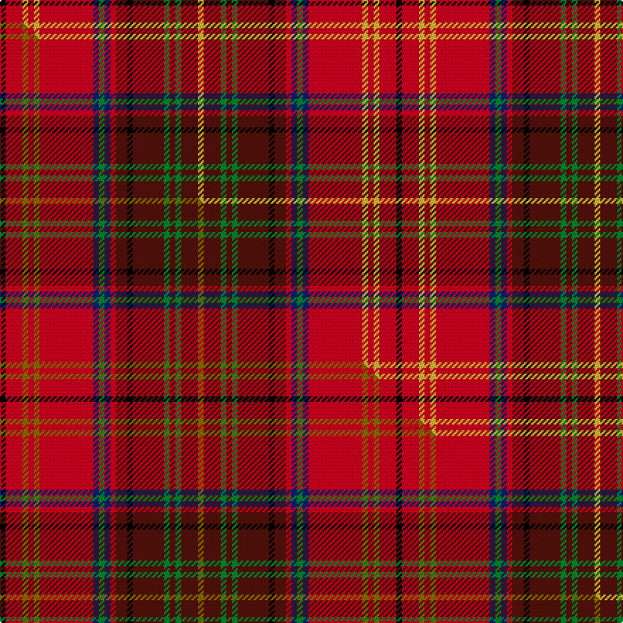

This is one **variant** — a specific cloth: this exact thread count and colourway, with its own
provenance below. It is one weaving of the [sett](/tartans/h/ha/harmon/) (the scale-free proportion — the
same cloth at any scale or shade), whose colour order is pattern [KRYRYRBGBRBKBGBGBY](/stripes/kryryrbgbrbkbgbgby/).

Part of the [Harmon](/tartans/h/ha/harmon/) tartan — the named design grouping this sett with its other cloths.

Sourced from tartans-authority.  It is a [18 stripe tartan](/stripes/stripes18/).

Original link <code>http://www.tartansauthority.com/tartan-ferret/display/7792/</code> — retired · [Internet Archive copy](https://web.archive.org/web/*/http://www.tartansauthority.com/tartan-ferret/display/7792/*)

Dataset <small>— provenance for this record, inherited from the source manifest</small>

<dl class="dataset-prov">
<dt>source</dt><dd><a href="/sources/tartans-authority/">Scottish Tartans Authority</a></dd>
<dt>data captured from</dt><dd><a href="https://github.com/thetartan/tartan-database/blob/master/data/tartans-authority/data.csv">https://github.com/thetartan/tartan-database/blob/master/data/tartans-authority/data.csv</a></dd>
<dt>data date</dt><dd>pre 2008 <small>(this record)</small></dd>
<dt>licence</dt><dd><a href="https://creativecommons.org/licenses/by-nc-nd/4.0/">CC BY-NC-ND 4.0</a></dd>
</dl>

Capture chain <small>— the hands this data passed through, oldest first; each capture carries its own licence</small>

<ol class="capture-chain">
<li><a href="https://www.tartansauthority.com/">Scottish Tartans Authority</a> <small>the heritage body’s archive — its tartan-ferret record browser is retired; dead record links are shown unlinked, with an Internet Archive copy (ITI numbers are not SRT references)</small></li>
<li><a href="https://github.com/thetartan/tartan-database">thetartan/tartan-database</a> <small>2016-2017</small> · <a href="https://creativecommons.org/licenses/by-nc-nd/4.0/">CC BY-NC-ND 4.0</a> <small>Levko Kravets's frozen compilation — the capture we vendored, and where its CC licence text came from</small></li>
<li>this dictionary <small>captured 2026-06-10 · commit 5bf86c7566</small> <small>each re-capture is a git commit to data/sources</small></li>
</ol>

## Register references

External register numbers recorded for this tartan.

- Scottish Tartans Authority (ITI): 7792

## Thread count
K/4 R12 LY4 R4 LY4 R38 DB4 G4 DB4 R4 DR8 K4 DR22 G4 DR4 G4 DR12 LY/4

One full sett is **280 threads**.

## Palette
<table><thead><tr><th>Colour</th><th>Shade</th><th>OKLCh</th></tr></thead><tbody><tr><td>DB</td><td><code style="background-color:#082077;">#082077</code> <small style="color:#888">#082077</small></td><td><small style="color:#888">oklch(30.0% 0.149 265.1)</small></td></tr><tr><td>DR</td><td><code style="background-color:#55120C;">#55120C</code> <small style="color:#888">#55120C</small></td><td><small style="color:#888">oklch(30.0% 0.099 29.3)</small></td></tr><tr><td>LY</td><td><code style="background-color:#DCBC32;">#DCBC32</code> <small style="color:#888">#DCBC32</small></td><td><small style="color:#888">oklch(80.0% 0.150 95.2)</small></td></tr><tr><td>G</td><td><code style="background-color:#008B2A;">#008B2A</code> <small style="color:#888">#008B2A</small></td><td><small style="color:#888">oklch(55.4% 0.170 145.9)</small></td></tr><tr><td>K</td><td><code style="background-color:#000000;">#000000</code> <small style="color:#888">#000000</small></td><td><small style="color:#888">oklch(0.0% 0.000 0.0)</small></td></tr><tr><td>R</td><td><code style="background-color:#D60020;">#D60020</code> <small style="color:#888">#D60020</small></td><td><small style="color:#888">oklch(55.2% 0.224 25.5)</small></td></tr></tbody></table>

# Sample pattern

## Compared to the master

This cloth is one sett of its design; the master sett (the exemplar the design is anchored on) is below for comparison.

Its **ΔTartan distance** from the master is **0.05** — the same measure the nearest-tartans table ranks by (0 is identical; a re-scale of the same cloth is near 0, a recolour or a different proportion further).

<figure class="master-compare" style="margin:0">

this sett
master sett ★

<figcaption style="color:#888;font-size:smaller">One weave of this sett against the <a href="/setts/k2r6y2r2y2r19db2g2db2r2dr4k2dr11g2dr2g2dr6y2/">master sett ★</a>, split on the diagonal: a shared proportion runs seamlessly across it with only the shades shifting; a different proportion breaks on it.</figcaption>
</figure>

## Nearest tartan variants

The nearest existing variants by ΔTartan distance, with this cloth at the top so the swatches line up against it.

ΔTartan

Threads

Variant

Sett

—

280

<a href="/variants/s18/k2r6ly2r2ly2r19db2g2db2r2dr4k2dr11g2dr2g2dr6ly2~x2/">Harmon (Name)</a>

<a href="/ttd/edit/#slug=k2r6y2r2y2r19db2g2db2r2dr4k2dr11g2dr2g2dr6y2~x2&amp;base=k2r6ly2r2ly2r19db2g2db2r2dr4k2dr11g2dr2g2dr6ly2~x2" title="compare in the TTD">0.05</a>

280

<a href="/variants/s18/k2r6y2r2y2r19db2g2db2r2dr4k2dr11g2dr2g2dr6y2~x2/">Harmon (Personal)</a>

<a href="/ttd/edit/#slug=k2lr6y2lr2y2lr19t2dg2t2lr2dr4k2dr11dg2dr2dg2dr6y2~x2~dg1502166&amp;base=k2r6ly2r2ly2r19db2g2db2r2dr4k2dr11g2dr2g2dr6ly2~x2" title="compare in the TTD">0.20</a>

280

<a href="/variants/s18/k2lr6y2lr2y2lr19t2dg2t2lr2dr4k2dr11dg2dr2dg2dr6y2~x2~dg1502166/">Harmon Dress</a>

<a href="/ttd/edit/#slug=k2lr6y2lr2y2lr19db2g2db2lr2dr4k2dr11g2dr2g2dr11g2y2~x2&amp;base=k2r6ly2r2ly2r19db2g2db2r2dr4k2dr11g2dr2g2dr6ly2~x2" title="compare in the TTD">0.58</a>

308

<a href="/variants/s19/k2lr6y2lr2y2lr19db2g2db2lr2dr4k2dr11g2dr2g2dr11g2y2~x2/">Harmon Dress (Personal)</a>

<a href="/ttd/edit/#slug=k2lr6y2lr2y2lr19db2dg2db2lr2dr4k2dr11dg2dr2dg2dr11dg2y2~x2~db1406275-dg1806142&amp;base=k2r6ly2r2ly2r19db2g2db2r2dr4k2dr11g2dr2g2dr6ly2~x2" title="compare in the TTD">0.59</a>

308

<a href="/variants/s19/k2lr6y2lr2y2lr19db2dg2db2lr2dr4k2dr11dg2dr2dg2dr11dg2y2~x2~db1406275-dg1806142/">Harmon Dress Name Tartan</a>

<a href="/ttd/edit/#slug=ri7r5dr5ri31k9dr4r3ri5r3dr4g30ri4r3dr5ri5~x2~ri2209032-r2208029&amp;base=k2r6ly2r2ly2r19db2g2db2r2dr4k2dr11g2dr2g2dr6ly2~x2" title="compare in the TTD">2.41</a>

468

<a href="/variants/s15/ri7r5dr5ri31k9dr4r3ri5r3dr4g30ri4r3dr5ri5~x2~ri2209032-r2208029/">MacDougall (Kinloch Anderson)</a>

<a href="/ttd/edit/#slug=ri7b5r5ri31k9r4b3ri5b3r4g30ri4b3r5ri5~x2~ri2008029-r1506028&amp;base=k2r6ly2r2ly2r19db2g2db2r2dr4k2dr11g2dr2g2dr6ly2~x2" title="compare in the TTD">2.65</a>

468

<a href="/variants/s15/ri7b5r5ri31k9r4b3ri5b3r4g30ri4b3r5ri5~x2~ri2008029-r1506028/">MacDougall 3</a>

<a href="/ttd/edit/#slug=y1k1r8db1r1dg8r1db8r1dg1r8k1w1~x6&amp;base=k2r6ly2r2ly2r19db2g2db2r2dr4k2dr11g2dr2g2dr6ly2~x2" title="compare in the TTD">2.89</a>

480

<a href="/variants/s13/y1k1r8db1r1dg8r1db8r1dg1r8k1w1~x6/">Robieson</a>

<a href="/ttd/edit/#slug=w2k1t2lb1dg4r1dg4r3k3r12lb1r2k1~x4&amp;base=k2r6ly2r2ly2r19db2g2db2r2dr4k2dr11g2dr2g2dr6ly2~x2" title="compare in the TTD">2.94</a>

284

<a href="/variants/s13/w2k1t2lb1dg4r1dg4r3k3r12lb1r2k1~x4/">Peacock (Personal)</a>

<a href="/ttd/edit/#slug=db1y3r3k2db8y3r2k1r2y3g8w1k1r12w1~x2&amp;base=k2r6ly2r2ly2r19db2g2db2r2dr4k2dr11g2dr2g2dr6ly2~x2" title="compare in the TTD">2.94</a>

200

<a href="/variants/s15/db1y3r3k2db8y3r2k1r2y3g8w1k1r12w1~x2/">MacPherson #2</a>

<a href="/ttd/edit/#slug=r7y3r27k14o5k3o5k3o8g3o4g4~x2&amp;base=k2r6ly2r2ly2r19db2g2db2r2dr4k2dr11g2dr2g2dr6ly2~x2" title="compare in the TTD">2.95</a>

322

<a href="/variants/s12/r7y3r27k14o5k3o5k3o8g3o4g4~x2/">Scotland's People</a>

## Neighbour map

Every grey dot is one of 13657 variants placed by the first two principal components of the ΔTartan feature space (42% of its variance). Red is this tartan; blue dots are its nearest — click one to open its page. The map is a flat projection of a many-dimensional space — [how to read it](/posts/neighbourhood-maps/).

<svg viewBox="0 0 640 380" role="img" style="max-width:100%;height:auto;border:1px solid #e0e0e0;border-radius:4px;display:block" xmlns="http://www.w3.org/2000/svg"><image href="/nn/cloud.v1.png" width="640" height="380"/><a href="/variants/s18/k2r6y2r2y2r19db2g2db2r2dr4k2dr11g2dr2g2dr6y2~x2/"><circle cx="169.3" cy="110.4" r="4" fill="#3465a4"><title>Harmon (Personal)</title></circle></a><a href="/variants/s18/k2lr6y2lr2y2lr19t2dg2t2lr2dr4k2dr11dg2dr2dg2dr6y2~x2~dg1502166/"><circle cx="132.4" cy="104.5" r="4" fill="#3465a4"><title>Harmon Dress</title></circle></a><a href="/variants/s19/k2lr6y2lr2y2lr19db2g2db2lr2dr4k2dr11g2dr2g2dr11g2y2~x2/"><circle cx="117.0" cy="102.7" r="4" fill="#3465a4"><title>Harmon Dress (Personal)</title></circle></a><a href="/variants/s19/k2lr6y2lr2y2lr19db2dg2db2lr2dr4k2dr11dg2dr2dg2dr11dg2y2~x2~db1406275-dg1806142/"><circle cx="119.4" cy="103.0" r="4" fill="#3465a4"><title>Harmon Dress Name Tartan</title></circle></a><a href="/variants/s15/ri7r5dr5ri31k9dr4r3ri5r3dr4g30ri4r3dr5ri5~x2~ri2209032-r2208029/"><circle cx="185.0" cy="125.3" r="4" fill="#3465a4"><title>MacDougall (Kinloch Anderson)</title></circle></a><a href="/variants/s15/ri7b5r5ri31k9r4b3ri5b3r4g30ri4b3r5ri5~x2~ri2008029-r1506028/"><circle cx="184.3" cy="127.5" r="4" fill="#3465a4"><title>MacDougall 3</title></circle></a><a href="/variants/s13/y1k1r8db1r1dg8r1db8r1dg1r8k1w1~x6/"><circle cx="170.3" cy="124.7" r="4" fill="#3465a4"><title>Robieson</title></circle></a><a href="/variants/s13/w2k1t2lb1dg4r1dg4r3k3r12lb1r2k1~x4/"><circle cx="166.7" cy="103.9" r="4" fill="#3465a4"><title>Peacock (Personal)</title></circle></a><a href="/variants/s15/db1y3r3k2db8y3r2k1r2y3g8w1k1r12w1~x2/"><circle cx="110.7" cy="114.3" r="4" fill="#3465a4"><title>MacPherson #2</title></circle></a><a href="/variants/s12/r7y3r27k14o5k3o5k3o8g3o4g4~x2/"><circle cx="145.6" cy="140.1" r="4" fill="#3465a4"><title>Scotland's People</title></circle></a><circle cx="151.2" cy="104.8" r="5" fill="#c00000"/><text x="320" y="376" text-anchor="middle" font-size="11" fill="#999">ground</text><text x="11" y="190" text-anchor="middle" font-size="11" fill="#999" transform="rotate(-90 11 190)">complexity</text></svg>

ID: /variants/s18/k2r6ly2r2ly2r19db2g2db2r2dr4k2dr11g2dr2g2dr6ly2~x2/
