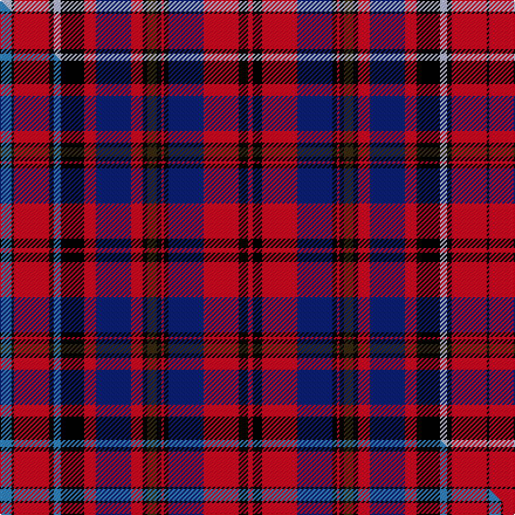

This is one **variant** — a specific cloth: this exact thread count and colourway, with its own
provenance below. It is one weaving of the [sett](/setts/lb5k1r15k2lb3k10r5db15r5k2dy4k2r1k2db15r15k4r2/) (the scale-free proportion — the
same cloth at any scale or shade), whose colour order is pattern [KRKWKRBRKGKRKBRKRKRBKRKGKRBRKWKRKW](/stripes/krkwkrbrkgkrkbrkrkrbkrkgkrbrkwkrkw/).

Part of the [Grand Lodge of Canada](/tartans/g/gr/grand-lodge-of-canada/) tartan — the named design grouping this sett with its other cloths.

Sourced from tartans-authority.  It is a [34 stripe tartan](/stripes/stripes34/).

Original link [https://www.tartanregister.gov.uk/tartanDetails.aspx?ref=6353](https://www.tartanregister.gov.uk/tartanDetails.aspx?ref=6353)

Dataset <small>— provenance for this record, inherited from the source manifest</small>

<dl class="dataset-prov">
<dt>source</dt><dd><a href="/sources/tartans-authority/">Scottish Tartans Authority</a></dd>
<dt>data captured from</dt><dd><a href="https://github.com/thetartan/tartan-database/blob/master/data/tartans-authority/data.csv">https://github.com/thetartan/tartan-database/blob/master/data/tartans-authority/data.csv</a></dd>
<dt>data date</dt><dd>2004 <small>(this record)</small></dd>
<dt>licence</dt><dd><a href="https://creativecommons.org/licenses/by-nc-nd/4.0/">CC BY-NC-ND 4.0</a></dd>
</dl>

Capture chain <small>— the hands this data passed through, oldest first; each capture carries its own licence</small>

<ol class="capture-chain">
<li><a href="https://www.tartansauthority.com/">Scottish Tartans Authority</a> <small>the heritage body's archive — its tartan-ferret record browser is retired (links repaired to the SRT, above)</small></li>
<li><a href="https://github.com/thetartan/tartan-database">thetartan/tartan-database</a> <small>2016-2017</small> · <a href="https://creativecommons.org/licenses/by-nc-nd/4.0/">CC BY-NC-ND 4.0</a> <small>Levko Kravets's frozen compilation — the capture we vendored, and where its CC licence text came from</small></li>
<li>this dictionary <small>captured 2026-06-10 · commit 5bf86c7566</small> <small>each re-capture is a git commit to data/sources</small></li>
</ol>

## Register references

External register numbers recorded for this tartan.

- Scottish Tartans Authority (ITI): 6353

## Thread count
LB/10 K2 R30 K4 LB6 K20 R10 DB30 R10 K4 DY8 K4 R2 K4 DB30 R30 K8 R4 K8 R30 DB30 K4 R2 K4 DY8 K4 R10 DB30 R10 K20 LB6 K4 R30 K/2

One full sett is **824 threads**.

## Palette
<table><thead><tr><th>Colour</th><th>Shade</th><th>OKLCh</th></tr></thead><tbody><tr><td>LB</td><td><code style="background-color:#B5BBDE;">#B5BBDE</code> <small style="color:#888">#B5BBDE</small></td><td><small style="color:#888">oklch(79.9% 0.050 277.6)</small></td></tr><tr><td>DB</td><td><code style="background-color:#082077;">#082077</code> <small style="color:#888">#082077</small></td><td><small style="color:#888">oklch(30.0% 0.149 265.1)</small></td></tr><tr><td>K</td><td><code style="background-color:#000000;">#000000</code> <small style="color:#888">#000000</small></td><td><small style="color:#888">oklch(0.0% 0.000 0.0)</small></td></tr><tr><td>R</td><td><code style="background-color:#D60020;">#D60020</code> <small style="color:#888">#D60020</small></td><td><small style="color:#888">oklch(55.2% 0.224 25.5)</small></td></tr><tr><td>DY</td><td><code style="background-color:#3A2B0D;">#3A2B0D</code> <small style="color:#888">#3A2B0D</small></td><td><small style="color:#888">oklch(30.0% 0.049 82.0)</small></td></tr></tbody></table>

# Sample pattern

## Compared to the master

This cloth is one sett of its design; the master sett (the exemplar the design is anchored on) is below for comparison.

Its **ΔTartan distance** from the master is **0.04** — the same measure the nearest-tartans table ranks by (0 is identical; a re-scale of the same cloth is near 0, a recolour or a different proportion further).

<figure class="master-compare" style="margin:0">

this sett
master sett ★

<figcaption style="color:#888;font-size:smaller">One weave of this sett against the <a href="/setts/t5k1r15k2t3k10r5db15r5k2dy4k2r1k2db15r15k4r2/">master sett ★</a>, split on the diagonal: a shared proportion runs seamlessly across it with only the shades shifting; a different proportion breaks on it.</figcaption>
</figure>

## Nearest tartan variants

The nearest existing variants by ΔTartan distance, with this cloth at the top so the swatches line up against it.

ΔTartan

Threads

Variant

Sett

—

824

<a href="/variants/s18/lb5k1r15k2lb3k10r5db15r5k2dy4k2r1k2db15r15k4r2~x2/">Grand Lodge of Canada (Corporate)</a>

<a href="/ttd/edit/#slug=t5k1r15k2t3k10r5db15r5k2dy4k2r1k2db15r15k4r2~x2~t2405244&amp;base=lb5k1r15k2lb3k10r5db15r5k2dy4k2r1k2db15r15k4r2~x2" title="compare in the TTD">0.04</a>

418

<a href="/variants/s18/t5k1r15k2t3k10r5db15r5k2dy4k2r1k2db15r15k4r2~x2~t2405244/">Grand Lodge of Canada</a>

<a href="/ttd/edit/#slug=g12k1r6db1r1lb1r1db1r6k12r1db12r6k1r6db12r1k12r6lb1g12r6k1r6g12r6db1r1lb1r1db1r6k12r1db12r6k1~x2&amp;base=lb5k1r15k2lb3k10r5db15r5k2dy4k2r1k2db15r15k4r2~x2" title="compare in the TTD">2.31</a>

718

<a href="/variants/s37/g12k1r6db1r1lb1r1db1r6k12r1db12r6k1r6db12r1k12r6lb1g12r6k1r6g12r6db1r1lb1r1db1r6k12r1db12r6k1~x2/">Unidentified #38</a>

<a href="/ttd/edit/#slug=g24r24db3k21db3r6g4r6db10r6g4r6k3db11r42db10k6g16r3k21&amp;base=lb5k1r15k2lb3k10r5db15r5k2dy4k2r1k2db15r15k4r2~x2" title="compare in the TTD">2.78</a>

413

<a href="/variants/s20/g24r24db3k21db3r6g4r6db10r6g4r6k3db11r42db10k6g16r3k21/">Unidentified Cant #07</a>

<a href="/ttd/edit/#slug=r8w2r8n15y1k15n8k1g1k1n8r8w2k2r3~x2&amp;base=lb5k1r15k2lb3k10r5db15r5k2dy4k2r1k2db15r15k4r2~x2" title="compare in the TTD">2.83</a>

310

<a href="/variants/s15/r8w2r8n15y1k15n8k1g1k1n8r8w2k2r3~x2/">Unidentified Scarlett #14</a>

<a href="/ttd/edit/#slug=lri8k1lr2k1lri2k8dp8lb2dp1k2lb2dp8k8lri8k2lr1k2lri8k8dp8lb1dp2k1dp2lb1lri8k8lri2k2lr1k2~x2~lri3203019-lr2805035&amp;base=lb5k1r15k2lb3k10r5db15r5k2dy4k2r1k2db15r15k4r2~x2" title="compare in the TTD">2.92</a>

460

<a href="/variants/s31/lri8k1lr2k1lri2k8dp8lb2dp1k2lb2dp8k8lri8k2lr1k2lri8k8dp8lb1dp2k1dp2lb1lri8k8lri2k2lr1k2~x2~lri3203019-lr2805035/">McLosek (Personal)</a>

<a href="/ttd/edit/#slug=db3r2g4r7k2y2k2y2k5db4r21db4k5y2k2y2k2r7g4r2db3y2~x4&amp;base=lb5k1r15k2lb3k10r5db15r5k2dy4k2r1k2db15r15k4r2~x2" title="compare in the TTD">3.21</a>

692

<a href="/variants/s22/db3r2g4r7k2y2k2y2k5db4r21db4k5y2k2y2k2r7g4r2db3y2~x4/">Hepburn</a>

<a href="/ttd/edit/#slug=k8r8db16r24w4r24k4g6db26g1db1g1db1g1db1g1db1g8k24r12k4db20k1db1k1db1k1db1k1db1~x2&amp;base=lb5k1r15k2lb3k10r5db15r5k2dy4k2r1k2db15r15k4r2~x2" title="compare in the TTD">3.24</a>

798

<a href="/variants/s30/k8r8db16r24w4r24k4g6db26g1db1g1db1g1db1g1db1g8k24r12k4db20k1db1k1db1k1db1k1db1~x2/">Canadian Confederation Canadian Tartan</a>

<a href="/ttd/edit/#slug=r15k5w2n7k4w8k2r26k5n2w2k7w2r5w2g2~x2&amp;base=lb5k1r15k2lb3k10r5db15r5k2dy4k2r1k2db15r15k4r2~x2" title="compare in the TTD">3.36</a>

350

<a href="/variants/s16/r15k5w2n7k4w8k2r26k5n2w2k7w2r5w2g2~x2/">Sabrettes</a>

<a href="/ttd/edit/#slug=r8k1r1k1r1k6db1k6r1k1r1k1r6w1r2dg3r2k1dg5k1r2w1r2k1dg5k1r2dg3r2w1r6k1r1k1r1k6dg1k6r1k1r1k1r3~x8&amp;base=lb5k1r15k2lb3k10r5db15r5k2dy4k2r1k2db15r15k4r2~x2" title="compare in the TTD">3.42</a>

1512

<a href="/variants/s43/r8k1r1k1r1k6db1k6r1k1r1k1r6w1r2dg3r2k1dg5k1r2w1r2k1dg5k1r2dg3r2w1r6k1r1k1r1k6dg1k6r1k1r1k1r3~x8/">Innes of Raemoir and Cowie</a>

<a href="/ttd/edit/#slug=db6r5db4r3db6r4db4r5db9r5db4r3k8r3db4r36db27r4g4r14g27r9db6r6k3&amp;base=lb5k1r15k2lb3k10r5db15r5k2dy4k2r1k2db15r15k4r2~x2" title="compare in the TTD">3.42</a>

409

<a href="/variants/s25/db6r5db4r3db6r4db4r5db9r5db4r3k8r3db4r36db27r4g4r14g27r9db6r6k3/">Murray of Tullibardine #4</a>

## Neighbour map

Every grey dot is one of 13656 variants placed by the first two principal components of the ΔTartan feature space (42% of its variance). Red is this tartan; blue dots are its nearest — click one to open its page. The map is a flat projection of a many-dimensional space — [how to read it](/posts/neighbourhood-maps/).

<svg viewBox="0 0 640 380" role="img" style="max-width:100%;height:auto;border:1px solid #e0e0e0;border-radius:4px;display:block" xmlns="http://www.w3.org/2000/svg"><image href="/nn/cloud.v1.png" width="640" height="380"/><a href="/variants/s18/t5k1r15k2t3k10r5db15r5k2dy4k2r1k2db15r15k4r2~x2~t2405244/"><circle cx="133.3" cy="85.8" r="4" fill="#3465a4"><title>Grand Lodge of Canada</title></circle></a><a href="/variants/s37/g12k1r6db1r1lb1r1db1r6k12r1db12r6k1r6db12r1k12r6lb1g12r6k1r6g12r6db1r1lb1r1db1r6k12r1db12r6k1~x2/"><circle cx="93.3" cy="91.7" r="4" fill="#3465a4"><title>Unidentified #38</title></circle></a><a href="/variants/s20/g24r24db3k21db3r6g4r6db10r6g4r6k3db11r42db10k6g16r3k21/"><circle cx="160.7" cy="92.8" r="4" fill="#3465a4"><title>Unidentified Cant #07</title></circle></a><a href="/variants/s15/r8w2r8n15y1k15n8k1g1k1n8r8w2k2r3~x2/"><circle cx="116.5" cy="80.2" r="4" fill="#3465a4"><title>Unidentified Scarlett #14</title></circle></a><a href="/variants/s31/lri8k1lr2k1lri2k8dp8lb2dp1k2lb2dp8k8lri8k2lr1k2lri8k8dp8lb1dp2k1dp2lb1lri8k8lri2k2lr1k2~x2~lri3203019-lr2805035/"><circle cx="87.5" cy="120.4" r="4" fill="#3465a4"><title>McLosek (Personal)</title></circle></a><a href="/variants/s22/db3r2g4r7k2y2k2y2k5db4r21db4k5y2k2y2k2r7g4r2db3y2~x4/"><circle cx="144.9" cy="105.4" r="4" fill="#3465a4"><title>Hepburn</title></circle></a><a href="/variants/s30/k8r8db16r24w4r24k4g6db26g1db1g1db1g1db1g1db1g8k24r12k4db20k1db1k1db1k1db1k1db1~x2/"><circle cx="144.7" cy="47.3" r="4" fill="#3465a4"><title>Canadian Confederation Canadian Tartan</title></circle></a><a href="/variants/s16/r15k5w2n7k4w8k2r26k5n2w2k7w2r5w2g2~x2/"><circle cx="136.6" cy="74.0" r="4" fill="#3465a4"><title>Sabrettes</title></circle></a><a href="/variants/s43/r8k1r1k1r1k6db1k6r1k1r1k1r6w1r2dg3r2k1dg5k1r2w1r2k1dg5k1r2dg3r2w1r6k1r1k1r1k6dg1k6r1k1r1k1r3~x8/"><circle cx="121.8" cy="94.7" r="4" fill="#3465a4"><title>Innes of Raemoir and Cowie</title></circle></a><a href="/variants/s25/db6r5db4r3db6r4db4r5db9r5db4r3k8r3db4r36db27r4g4r14g27r9db6r6k3/"><circle cx="210.0" cy="112.5" r="4" fill="#3465a4"><title>Murray of Tullibardine #4</title></circle></a><circle cx="129.5" cy="84.2" r="5" fill="#c00000"/><text x="320" y="376" text-anchor="middle" font-size="11" fill="#999">ground</text><text x="11" y="190" text-anchor="middle" font-size="11" fill="#999" transform="rotate(-90 11 190)">complexity</text></svg>

ID: /variants/s18/lb5k1r15k2lb3k10r5db15r5k2dy4k2r1k2db15r15k4r2~x2/
