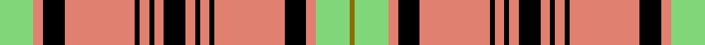

This page is one **sett** — a single exact thread-count. It belongs to the [tartan](/setts/lg14lr4k9lr29k2lr4k2lr4k9lr4k2lr4k2lr29k9lr4lg14y2/)
(the same proportion at any scale), whose colour order is pattern [GYYKYKYKYKYKYKYKYY](/stripes/gyykykykykykykykyy/).

Sourced from register-of-tartans.  It is a [18 stripe tartan](/stripes/stripes18/).

Original link https://www.tartanregister.gov.uk/tartanDetails.aspx?ref=1589

## Register references

External register numbers recorded for this tartan.

- Scottish Register of Tartans: [1589](https://www.tartanregister.gov.uk/tartanDetails.aspx?ref=1589)
- Scottish Tartans Authority (ITI): 6129

## Thread count
LG/28 LR8 K18 LR58 K4 LR8 K4 LR8 K18 LR8 K4 LR8 K4 LR58 K18 LR8 LG28 Y/4

One full sett is **556 threads**.

## Palette
<table><thead><tr><th>Colour</th><th>Shade</th><th>OKLCh</th></tr></thead><tbody><tr><td>LG</td><td><code style="background-color:#82D67A;">#82D67A</code> <small style="color:#888">#82D67A</small></td><td><small style="color:#888">oklch(80.1% 0.150 142.2)</small></td></tr><tr><td>K</td><td><code style="background-color:#000000;">#000000</code> <small style="color:#888">#000000</small></td><td><small style="color:#888">oklch(0.0% 0.000 0.0)</small></td></tr><tr><td>W</td><td><code style="background-color:#F7F7F7;">#F7F7F7</code> <small style="color:#888">#F7F7F7</small></td><td><small style="color:#888">oklch(97.6% 0.000 89.9)</small></td></tr><tr><td>LR</td><td><code style="background-color:#E08070;">#E08070</code> <small style="color:#888">#E08070</small></td><td><small style="color:#888">oklch(70.1% 0.122 30.4)</small></td></tr><tr><td>R</td><td><code style="background-color:#E87878;">#E87878</code> <small style="color:#888">#E87878</small></td><td><small style="color:#888">oklch(70.0% 0.139 21.2)</small></td></tr><tr><td>LO</td><td><code style="background-color:#FF9C34;">#FF9C34</code> <small style="color:#888">#FF9C34</small></td><td><small style="color:#888">oklch(77.9% 0.161 61.8)</small></td></tr><tr><td>DP</td><td><code style="background-color:#4B0B4F;">#4B0B4F</code> <small style="color:#888">#4B0B4F</small></td><td><small style="color:#888">oklch(30.1% 0.125 325.4)</small></td></tr><tr><td>R</td><td><code style="background-color:#C80000;">#C80000</code> <small style="color:#888">#C80000</small></td><td><small style="color:#888">oklch(52.3% 0.215 29.2)</small></td></tr><tr><td>R</td><td><code style="background-color:#980044;">#980044</code> <small style="color:#888">#980044</small></td><td><small style="color:#888">oklch(43.7% 0.175 5.3)</small></td></tr><tr><td>Y</td><td><code style="background-color:#8B6E00;">#8B6E00</code> <small style="color:#888">#8B6E00</small></td><td><small style="color:#888">oklch(55.1% 0.113 90.4)</small></td></tr></tbody></table>

# Sample pattern

## Nearest tartan variants

The nearest existing variants by ΔTartan distance, with this cloth at the top so the swatches line up against it.

ΔTartan

Threads

Variant

Sett

—

556

<a href="/variants/s18/lg14lr4k9lr29k2lr4k2lr4k9lr4k2lr4k2lr29k9lr4lg14y2~x2~lr2805035/">Hannay Dress</a>

<a href="/ttd/edit/#slug=w14y2w14k4w4k8w3k8w4k4w14r2w14k4r1k1r1k1r8w2r8k1r1k1r1k4~x2&amp;base=lg14lr4k9lr29k2lr4k2lr4k9lr4k2lr4k2lr29k9lr4lg14y2~x2~lr2805035" title="compare in the TTD">3.02</a>

480

<a href="/variants/s26/w14y2w14k4w4k8w3k8w4k4w14r2w14k4r1k1r1k1r8w2r8k1r1k1r1k4~x2/">Casey Dress (Estimated threadcount)</a>

<a href="/ttd/edit/#slug=w14y2w14k4w4k8w3k8w4k4w14r2w14k3r1k1r1k1r8w2r8k1r1k1r1k3~x2&amp;base=lg14lr4k9lr29k2lr4k2lr4k9lr4k2lr4k2lr29k9lr4lg14y2~x2~lr2805035" title="compare in the TTD">3.03</a>

474

<a href="/variants/s26/w14y2w14k4w4k8w3k8w4k4w14r2w14k3r1k1r1k1r8w2r8k1r1k1r1k3~x2/">Casey (Dress) Fashion Tartan</a>

<a href="/ttd/edit/#slug=y1r2k4r14g8r2g3y1g3r2g8r13k2r2k2r1y1~x2&amp;base=lg14lr4k9lr29k2lr4k2lr4k9lr4k2lr4k2lr29k9lr4lg14y2~x2~lr2805035" title="compare in the TTD">3.05</a>

272

<a href="/variants/s17/y1r2k4r14g8r2g3y1g3r2g8r13k2r2k2r1y1~x2/">Gaffney (2016)</a>

<a href="/ttd/edit/#slug=r5k1r2k2r16lb2r2k9r2g2r2g13r2k2r4~x2&amp;base=lg14lr4k9lr29k2lr4k2lr4k9lr4k2lr4k2lr29k9lr4lg14y2~x2~lr2805035" title="compare in the TTD">3.12</a>

246

<a href="/variants/s15/r5k1r2k2r16lb2r2k9r2g2r2g13r2k2r4~x2/">Unidentified No 3 #2</a>

<a href="/ttd/edit/#slug=w7k21w9k9w29lo4w29k10r3k3r3k3r19w6&amp;base=lg14lr4k9lr29k2lr4k2lr4k9lr4k2lr4k2lr29k9lr4lg14y2~x2~lr2805035" title="compare in the TTD">3.24</a>

297

<a href="/variants/s14/w7k21w9k9w29lo4w29k10r3k3r3k3r19w6/">Casey, Dress (Corporate)</a>

<a href="/ttd/edit/#slug=r16k6r6g46r6g5r6k12r6lb6r48k6r6k6r16&amp;base=lg14lr4k9lr29k2lr4k2lr4k9lr4k2lr4k2lr29k9lr4lg14y2~x2~lr2805035" title="compare in the TTD">3.30</a>

362

<a href="/variants/s15/r16k6r6g46r6g5r6k12r6lb6r48k6r6k6r16/">Grant</a>

<a href="/ttd/edit/#slug=k10lb1k1r10lb1k1lb1r10g6r2~x4&amp;base=lg14lr4k9lr29k2lr4k2lr4k9lr4k2lr4k2lr29k9lr4lg14y2~x2~lr2805035" title="compare in the TTD">3.33</a>

296

<a href="/variants/s10/k10lb1k1r10lb1k1lb1r10g6r2~x4/">Unidentified (Scolpaig)</a>

<a href="/ttd/edit/#slug=k2loi4lo5o2lo1k1lo2k12lo2k1lo2o6loi7o3lo12o1lo4o1lo12loi1~x2~loi2905070-lo2706066&amp;base=lg14lr4k9lr29k2lr4k2lr4k9lr4k2lr4k2lr29k9lr4lg14y2~x2~lr2805035" title="compare in the TTD">3.37</a>

318

<a href="/variants/s20/k2loi4lo5o2lo1k1lo2k12lo2k1lo2o6loi7o3lo12o1lo4o1lo12loi1~x2~loi2905070-lo2706066/">Highland Aircraft</a>

<a href="/ttd/edit/#slug=w3k1n15k6n5k3n8k2n5y3w2y4k1w3~x2&amp;base=lg14lr4k9lr29k2lr4k2lr4k9lr4k2lr4k2lr29k9lr4lg14y2~x2~lr2805035" title="compare in the TTD">3.44</a>

232

<a href="/variants/s14/w3k1n15k6n5k3n8k2n5y3w2y4k1w3~x2/">Avalon - Washington House</a>

<a href="/ttd/edit/#slug=r6w56db9w8k16w4k3w4k3w36r36k3r12w3~x2&amp;base=lg14lr4k9lr29k2lr4k2lr4k9lr4k2lr4k2lr29k9lr4lg14y2~x2~lr2805035" title="compare in the TTD">3.47</a>

778

<a href="/variants/s14/r6w56db9w8k16w4k3w4k3w36r36k3r12w3~x2/">Duke of Rothesay (Royal)</a>

## Neighbour map

Every grey dot is one of 13620 variants placed by the first two principal components of the ΔTartan feature space (42% of its variance). Red is this tartan; blue dots are its nearest — click one to open its page.

<svg viewBox="0 0 640 380" role="img" style="max-width:100%;height:auto;border:1px solid #e0e0e0;border-radius:4px;display:block" xmlns="http://www.w3.org/2000/svg"><image href="/nn/cloud.v1.png" width="640" height="380"/><a href="/variants/s26/w14y2w14k4w4k8w3k8w4k4w14r2w14k4r1k1r1k1r8w2r8k1r1k1r1k4~x2/"><circle cx="194.9" cy="102.7" r="4" fill="#3465a4"><title>Casey Dress (Estimated threadcount)</title></circle></a><a href="/variants/s26/w14y2w14k4w4k8w3k8w4k4w14r2w14k3r1k1r1k1r8w2r8k1r1k1r1k3~x2/"><circle cx="200.2" cy="101.1" r="4" fill="#3465a4"><title>Casey (Dress) Fashion Tartan</title></circle></a><a href="/variants/s17/y1r2k4r14g8r2g3y1g3r2g8r13k2r2k2r1y1~x2/"><circle cx="248.1" cy="121.6" r="4" fill="#3465a4"><title>Gaffney (2016)</title></circle></a><a href="/variants/s15/r5k1r2k2r16lb2r2k9r2g2r2g13r2k2r4~x2/"><circle cx="239.1" cy="112.8" r="4" fill="#3465a4"><title>Unidentified No 3 #2</title></circle></a><a href="/variants/s14/w7k21w9k9w29lo4w29k10r3k3r3k3r19w6/"><circle cx="182.8" cy="147.1" r="4" fill="#3465a4"><title>Casey, Dress (Corporate)</title></circle></a><a href="/variants/s15/r16k6r6g46r6g5r6k12r6lb6r48k6r6k6r16/"><circle cx="249.5" cy="130.4" r="4" fill="#3465a4"><title>Grant</title></circle></a><a href="/variants/s10/k10lb1k1r10lb1k1lb1r10g6r2~x4/"><circle cx="237.8" cy="126.0" r="4" fill="#3465a4"><title>Unidentified (Scolpaig)</title></circle></a><a href="/variants/s20/k2loi4lo5o2lo1k1lo2k12lo2k1lo2o6loi7o3lo12o1lo4o1lo12loi1~x2~loi2905070-lo2706066/"><circle cx="207.9" cy="132.3" r="4" fill="#3465a4"><title>Highland Aircraft</title></circle></a><a href="/variants/s14/w3k1n15k6n5k3n8k2n5y3w2y4k1w3~x2/"><circle cx="223.1" cy="145.1" r="4" fill="#3465a4"><title>Avalon - Washington House</title></circle></a><a href="/variants/s14/r6w56db9w8k16w4k3w4k3w36r36k3r12w3~x2/"><circle cx="251.3" cy="102.9" r="4" fill="#3465a4"><title>Duke of Rothesay (Royal)</title></circle></a><circle cx="244.5" cy="116.4" r="5" fill="#c00000"/><text x="320" y="376" text-anchor="middle" font-size="11" fill="#999">ground</text><text x="11" y="190" text-anchor="middle" font-size="11" fill="#999" transform="rotate(-90 11 190)">complexity</text></svg>

ID: /variants/s18/lg14lr4k9lr29k2lr4k2lr4k9lr4k2lr4k2lr29k9lr4lg14y2~x2~lr2805035/
