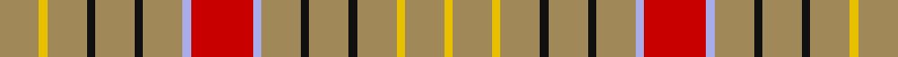

This page is one **sett** — a single exact thread-count. It belongs to the [tartan](/setts/lo14ly3lo14k3lo14k3lo14lb3r22lb3lo14k3lo14k3lo14ly3lo14ly3/)
(the same proportion at any scale), whose colour order is pattern [YYYKYKYWRWYKYKYYYY](/stripes/yyykykywrwykykyyyy/).

Part of the [Sutherland of Duffus](/tartans/sutherland-of-duffus/) tartan — the named design grouping this sett with its other cloths.

Sourced from register-of-tartans.  It is a [18 stripe tartan](/stripes/stripes18/).

Original link https://www.tartanregister.gov.uk/tartanDetails.aspx?ref=5355

## Register references

External register numbers recorded for this tartan.

- Scottish Register of Tartans: [5355](https://www.tartanregister.gov.uk/tartanDetails.aspx?ref=5355)
- Scottish Tartans Authority (ITI): 3232

## Thread count
LT/28 Y6 LT28 K6 LT28 K6 LT28 LP6 R44 LP6 LT28 K6 LT28 K6 LT28 Y6 LT28 Y/6

One full sett is **610 threads**.

## Palette

Palette: <strong>Tartan Register</strong>
<table><thead><tr><th>Colour</th><th>Threads</th><th>Shade</th><th>Base</th><th>OKLCh</th></tr></thead><tbody><tr><td>LT/</td><td style="text-align:right;font-variant-numeric:tabular-nums">28</td><td><code style="background-color:#A08858;">#A08858</code> <small style="color:#888">#A08858</small></td><td>Y <code style="background-color:#F2BF00;">#F2BF00</code></td><td><small style="color:#888">oklch(63.7% 0.071 84.0)</small></td></tr><tr><td>Y</td><td style="text-align:right;font-variant-numeric:tabular-nums">6</td><td><code style="background-color:#E8C000;">#E8C000</code> <small style="color:#888">#E8C000</small></td><td>Y <code style="background-color:#F2BF00;">#F2BF00</code></td><td><small style="color:#888">oklch(81.9% 0.168 93.7)</small></td></tr><tr><td>LT</td><td style="text-align:right;font-variant-numeric:tabular-nums">28</td><td><code style="background-color:#A08858;">#A08858</code> <small style="color:#888">#A08858</small></td><td>Y <code style="background-color:#F2BF00;">#F2BF00</code></td><td><small style="color:#888">oklch(63.7% 0.071 84.0)</small></td></tr><tr><td>K</td><td style="text-align:right;font-variant-numeric:tabular-nums">6</td><td><code style="background-color:#101010;">#101010</code> <small style="color:#888">#101010</small></td><td>K <code style="background-color:#000000;">#000000</code></td><td><small style="color:#888">oklch(17.3% 0.000 89.9)</small></td></tr><tr><td>LT</td><td style="text-align:right;font-variant-numeric:tabular-nums">28</td><td><code style="background-color:#A08858;">#A08858</code> <small style="color:#888">#A08858</small></td><td>Y <code style="background-color:#F2BF00;">#F2BF00</code></td><td><small style="color:#888">oklch(63.7% 0.071 84.0)</small></td></tr><tr><td>K</td><td style="text-align:right;font-variant-numeric:tabular-nums">6</td><td><code style="background-color:#101010;">#101010</code> <small style="color:#888">#101010</small></td><td>K <code style="background-color:#000000;">#000000</code></td><td><small style="color:#888">oklch(17.3% 0.000 89.9)</small></td></tr><tr><td>LT</td><td style="text-align:right;font-variant-numeric:tabular-nums">28</td><td><code style="background-color:#A08858;">#A08858</code> <small style="color:#888">#A08858</small></td><td>Y <code style="background-color:#F2BF00;">#F2BF00</code></td><td><small style="color:#888">oklch(63.7% 0.071 84.0)</small></td></tr><tr><td>LP</td><td style="text-align:right;font-variant-numeric:tabular-nums">6</td><td><code style="background-color:#A8ACE8;">#A8ACE8</code> <small style="color:#888">#A8ACE8</small></td><td>W <code style="background-color:#F7F7F7;">#F7F7F7</code></td><td><small style="color:#888">oklch(76.3% 0.086 281.2)</small></td></tr><tr><td>R</td><td style="text-align:right;font-variant-numeric:tabular-nums">44</td><td><code style="background-color:#C80000;">#C80000</code> <small style="color:#888">#C80000</small></td><td>R <code style="background-color:#CC0000;">#CC0000</code></td><td><small style="color:#888">oklch(52.3% 0.215 29.2)</small></td></tr><tr><td>LP</td><td style="text-align:right;font-variant-numeric:tabular-nums">6</td><td><code style="background-color:#A8ACE8;">#A8ACE8</code> <small style="color:#888">#A8ACE8</small></td><td>W <code style="background-color:#F7F7F7;">#F7F7F7</code></td><td><small style="color:#888">oklch(76.3% 0.086 281.2)</small></td></tr><tr><td>LT</td><td style="text-align:right;font-variant-numeric:tabular-nums">28</td><td><code style="background-color:#A08858;">#A08858</code> <small style="color:#888">#A08858</small></td><td>Y <code style="background-color:#F2BF00;">#F2BF00</code></td><td><small style="color:#888">oklch(63.7% 0.071 84.0)</small></td></tr><tr><td>K</td><td style="text-align:right;font-variant-numeric:tabular-nums">6</td><td><code style="background-color:#101010;">#101010</code> <small style="color:#888">#101010</small></td><td>K <code style="background-color:#000000;">#000000</code></td><td><small style="color:#888">oklch(17.3% 0.000 89.9)</small></td></tr><tr><td>LT</td><td style="text-align:right;font-variant-numeric:tabular-nums">28</td><td><code style="background-color:#A08858;">#A08858</code> <small style="color:#888">#A08858</small></td><td>Y <code style="background-color:#F2BF00;">#F2BF00</code></td><td><small style="color:#888">oklch(63.7% 0.071 84.0)</small></td></tr><tr><td>K</td><td style="text-align:right;font-variant-numeric:tabular-nums">6</td><td><code style="background-color:#101010;">#101010</code> <small style="color:#888">#101010</small></td><td>K <code style="background-color:#000000;">#000000</code></td><td><small style="color:#888">oklch(17.3% 0.000 89.9)</small></td></tr><tr><td>LT</td><td style="text-align:right;font-variant-numeric:tabular-nums">28</td><td><code style="background-color:#A08858;">#A08858</code> <small style="color:#888">#A08858</small></td><td>Y <code style="background-color:#F2BF00;">#F2BF00</code></td><td><small style="color:#888">oklch(63.7% 0.071 84.0)</small></td></tr><tr><td>Y</td><td style="text-align:right;font-variant-numeric:tabular-nums">6</td><td><code style="background-color:#E8C000;">#E8C000</code> <small style="color:#888">#E8C000</small></td><td>Y <code style="background-color:#F2BF00;">#F2BF00</code></td><td><small style="color:#888">oklch(81.9% 0.168 93.7)</small></td></tr><tr><td>LT</td><td style="text-align:right;font-variant-numeric:tabular-nums">28</td><td><code style="background-color:#A08858;">#A08858</code> <small style="color:#888">#A08858</small></td><td>Y <code style="background-color:#F2BF00;">#F2BF00</code></td><td><small style="color:#888">oklch(63.7% 0.071 84.0)</small></td></tr><tr><td>Y/</td><td style="text-align:right;font-variant-numeric:tabular-nums">6</td><td><code style="background-color:#E8C000;">#E8C000</code> <small style="color:#888">#E8C000</small></td><td>Y <code style="background-color:#F2BF00;">#F2BF00</code></td><td><small style="color:#888">oklch(81.9% 0.168 93.7)</small></td></tr></tbody></table>

## Nearest tartans

The nearest existing variants by ΔTartan distance, with this tartan at the top so the swatches line up against it.

ΔTartan

Tartan

Sett

—

<a href="/ttd/edit/#slug=lo14ly3lo14k3lo14k3lo14lb3r22lb3lo14k3lo14k3lo14ly3lo14ly3~x2">Sutherland of Duffus</a> <a class="nn-out" href="/variants/s18/lo14ly3lo14k3lo14k3lo14lb3r22lb3lo14k3lo14k3lo14ly3lo14ly3~x2/" title="open its dictionary page">↗</a>

1.67

<a href="/ttd/edit/#slug=r22lb3lo14k3lo14k3lo14ly3lo14ly3~x2&amp;base=lo14ly3lo14k3lo14k3lo14lb3r22lb3lo14k3lo14k3lo14ly3lo14ly3~x2">Sutherland of Duffus (Clan)</a> <a class="nn-out" href="/variants/s10/r22lb3lo14k3lo14k3lo14ly3lo14ly3~x2/" title="open its dictionary page">↗</a>

1.86

<a href="/ttd/edit/#slug=r8g2r2g6r1g6r2g2r8ly1r8g2r2g6r1g6r2g2r8w1~x4&amp;base=lo14ly3lo14k3lo14k3lo14lb3r22lb3lo14k3lo14k3lo14ly3lo14ly3~x2">Bruce (VS) Clan Tartan</a> <a class="nn-out" href="/variants/s20/r8g2r2g6r1g6r2g2r8ly1r8g2r2g6r1g6r2g2r8w1~x4/" title="open its dictionary page">↗</a>

1.99

<a href="/ttd/edit/#slug=y19ly3y19r3y19ly3y19r3y3r21t3r21y3r3~x2&amp;base=lo14ly3lo14k3lo14k3lo14lb3r22lb3lo14k3lo14k3lo14ly3lo14ly3~x2">Burnett of Powis (Modern) (Personal)</a> <a class="nn-out" href="/variants/s14/y19ly3y19r3y19ly3y19r3y3r21t3r21y3r3~x2/" title="open its dictionary page">↗</a>

2.10

<a href="/ttd/edit/#slug=r16t3o12k3o12k3o12ly3o12ly3~x2&amp;base=lo14ly3lo14k3lo14k3lo14lb3r22lb3lo14k3lo14k3lo14ly3lo14ly3~x2">Duffus, Lord</a> <a class="nn-out" href="/variants/s10/r16t3o12k3o12k3o12ly3o12ly3~x2/" title="open its dictionary page">↗</a>

2.12

<a href="/ttd/edit/#slug=w1db1r7g2r2g6r1g6r2g2r8ly1~x2&amp;base=lo14ly3lo14k3lo14k3lo14lb3r22lb3lo14k3lo14k3lo14ly3lo14ly3~x2">Bruce County</a> <a class="nn-out" href="/variants/s12/w1db1r7g2r2g6r1g6r2g2r8ly1~x2/" title="open its dictionary page">↗</a>

2.14

<a href="/ttd/edit/#slug=dp2r1lo4w2lo12w8lo12w2lo2lo2w1lo2~x4&amp;base=lo14ly3lo14k3lo14k3lo14lb3r22lb3lo14k3lo14k3lo14ly3lo14ly3~x2">Gary (Personal)</a> <a class="nn-out" href="/variants/s12/dp2r1lo4w2lo12w8lo12w2lo2lo2w1lo2~x4/" title="open its dictionary page">↗</a>

2.16

<a href="/ttd/edit/#slug=r9g10w2g2ly2g10r9g5r9g10ly2g2w2g10r9g5~x2&amp;base=lo14ly3lo14k3lo14k3lo14lb3r22lb3lo14k3lo14k3lo14ly3lo14ly3~x2">Wilson's No.169</a> <a class="nn-out" href="/variants/s16/r9g10w2g2ly2g10r9g5r9g10ly2g2w2g10r9g5~x2/" title="open its dictionary page">↗</a>

2.19

<a href="/ttd/edit/#slug=lo10w1lo12k7w2k7lo12w1r4w1lo12k2~x2&amp;base=lo14ly3lo14k3lo14k3lo14lb3r22lb3lo14k3lo14k3lo14ly3lo14ly3~x2">Unidentified (GMG 2002)</a> <a class="nn-out" href="/variants/s12/lo10w1lo12k7w2k7lo12w1r4w1lo12k2~x2/" title="open its dictionary page">↗</a>

2.19

<a href="/ttd/edit/#slug=o6ri2r15o15k2o15ri2r6ri2o8w2~x2&amp;base=lo14ly3lo14k3lo14k3lo14lb3r22lb3lo14k3lo14k3lo14ly3lo14ly3~x2">Frater</a> <a class="nn-out" href="/variants/s11/o6ri2r15o15k2o15ri2r6ri2o8w2~x2/" title="open its dictionary page">↗</a>

2.20

<a href="/ttd/edit/#slug=w1db1r7g2r2g6r1g6r2g2r8lo1~x4&amp;base=lo14ly3lo14k3lo14k3lo14lb3r22lb3lo14k3lo14k3lo14ly3lo14ly3~x2">Bruce County</a> <a class="nn-out" href="/variants/s12/w1db1r7g2r2g6r1g6r2g2r8lo1~x4/" title="open its dictionary page">↗</a>

## Neighbour map

Every grey dot is one of 14360 variants placed by the first two principal components of the ΔTartan feature space (44% of its variance). Red is this tartan; blue dots are its nearest — click one to open its page.

<svg viewBox="0 0 640 380" role="img" style="max-width:100%;height:auto;border:1px solid #e0e0e0;border-radius:4px;display:block" xmlns="http://www.w3.org/2000/svg"><image href="/nn/cloud.v1.png" width="640" height="380"/><a href="/variants/s10/r22lb3lo14k3lo14k3lo14ly3lo14ly3~x2/"><circle cx="299.9" cy="195.1" r="4" fill="#3465a4"><title>Sutherland of Duffus (Clan)</title></circle></a><a href="/variants/s20/r8g2r2g6r1g6r2g2r8ly1r8g2r2g6r1g6r2g2r8w1~x4/"><circle cx="307.2" cy="180.0" r="4" fill="#3465a4"><title>Bruce (VS) Clan Tartan</title></circle></a><a href="/variants/s14/y19ly3y19r3y19ly3y19r3y3r21t3r21y3r3~x2/"><circle cx="353.8" cy="209.8" r="4" fill="#3465a4"><title>Burnett of Powis (Modern) (Personal)</title></circle></a><a href="/variants/s10/r16t3o12k3o12k3o12ly3o12ly3~x2/"><circle cx="266.5" cy="211.9" r="4" fill="#3465a4"><title>Duffus, Lord</title></circle></a><a href="/variants/s12/w1db1r7g2r2g6r1g6r2g2r8ly1~x2/"><circle cx="262.9" cy="173.7" r="4" fill="#3465a4"><title>Bruce County</title></circle></a><a href="/variants/s12/dp2r1lo4w2lo12w8lo12w2lo2lo2w1lo2~x4/"><circle cx="342.0" cy="131.8" r="4" fill="#3465a4"><title>Gary (Personal)</title></circle></a><a href="/variants/s16/r9g10w2g2ly2g10r9g5r9g10ly2g2w2g10r9g5~x2/"><circle cx="244.9" cy="218.9" r="4" fill="#3465a4"><title>Wilson's No.169</title></circle></a><a href="/variants/s12/lo10w1lo12k7w2k7lo12w1r4w1lo12k2~x2/"><circle cx="322.4" cy="170.3" r="4" fill="#3465a4"><title>Unidentified (GMG 2002)</title></circle></a><a href="/variants/s11/o6ri2r15o15k2o15ri2r6ri2o8w2~x2/"><circle cx="322.0" cy="197.4" r="4" fill="#3465a4"><title>Frater</title></circle></a><a href="/variants/s12/w1db1r7g2r2g6r1g6r2g2r8lo1~x4/"><circle cx="263.5" cy="173.2" r="4" fill="#3465a4"><title>Bruce County</title></circle></a><circle cx="344.1" cy="177.3" r="5" fill="#c00000"/></svg>

ID: /variants/s18/lo14ly3lo14k3lo14k3lo14lb3r22lb3lo14k3lo14k3lo14ly3lo14ly3~x2/
