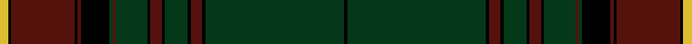

This page is one **sett** — a single exact thread-count. It belongs to the [tartan](/setts/ly3k1dr22k1dr1k10dg1dr1dg11k1dr4k1dg8k1dr4k1dg48k1/)
(the same proportion at any scale), whose colour order is pattern [KGKBKGKBKGBGKBKBKY](/stripes/kgkbkgkbkgbgkbkbky/).

Sourced from tartans-authority.  It is a [18 stripe tartan](/stripes/stripes18/).

Original link http://www.tartansauthority.com/tartan-ferret/display/8295/

## Register references

External register numbers recorded for this tartan.

- Scottish Register of Tartans: [8295](https://www.tartanregister.gov.uk/tartanDetails?ref=8295)
- Scottish Tartans Authority (ITI): 8295

## Thread count
LY/6 K2 DR44 K2 DR2 K20 DG2 DR2 DG22 K2 DR8 K2 DG16 K2 DR8 K2 DG96 K/2

One full sett is **472 threads**.

## Palette
<table><thead><tr><th>Colour</th><th>Shade</th><th>OKLCh</th></tr></thead><tbody><tr><td>DR</td><td><code style="background-color:#55120C;">#55120C</code> <small style="color:#888">#55120C</small></td><td><small style="color:#888">oklch(30.0% 0.099 29.3)</small></td></tr><tr><td>LY</td><td><code style="background-color:#DCBC32;">#DCBC32</code> <small style="color:#888">#DCBC32</small></td><td><small style="color:#888">oklch(80.0% 0.150 95.2)</small></td></tr><tr><td>DG</td><td><code style="background-color:#053819;">#053819</code> <small style="color:#888">#053819</small></td><td><small style="color:#888">oklch(30.0% 0.075 151.3)</small></td></tr><tr><td>K</td><td><code style="background-color:#000000;">#000000</code> <small style="color:#888">#000000</small></td><td><small style="color:#888">oklch(0.0% 0.000 0.0)</small></td></tr></tbody></table>

# Sample pattern

ID: /variants/s18/ly3k1dr22k1dr1k10dg1dr1dg11k1dr4k1dg8k1dr4k1dg48k1~x2/
