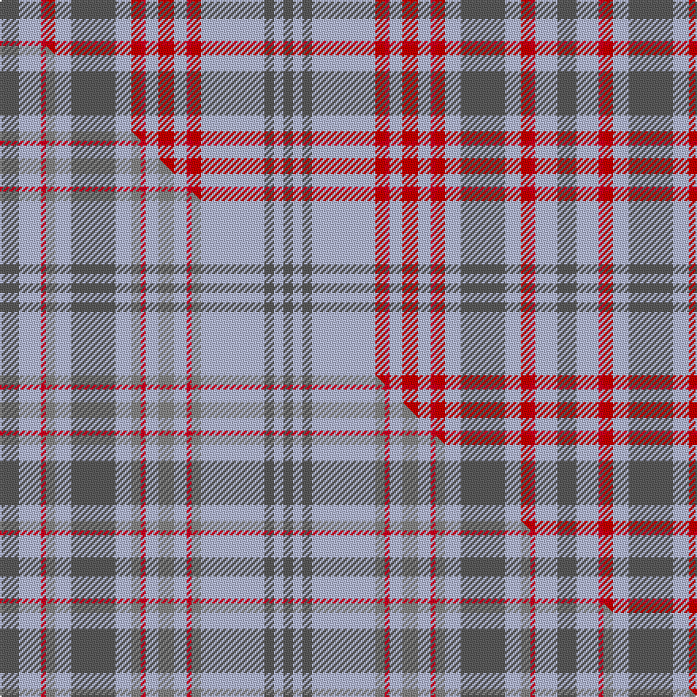

This is one **variant** — a specific cloth: this exact thread count and colourway, with its own
provenance below. It is one weaving of the [sett](/setts/n12lb14r3ri6lb10n28lb10ri6r3lb8ri10lb8r3ri6lb40n6lb6n6/) (the scale-free proportion — the
same cloth at any scale or shade), whose colour order is pattern [BWBWRRWRWRRWBWRRWB](/stripes/bwbwrrwrwrrwbwrrwb/).

Part of the [Miyuki](/tartans/miyuki-4/) tartan — the named design grouping this sett with its other cloths.

Sourced from tartans-authority.  It is a [18 stripe tartan](/stripes/stripes18/).

Original link [https://www.tartanregister.gov.uk/tartanDetails.aspx?ref=2606](https://www.tartanregister.gov.uk/tartanDetails.aspx?ref=2606)

Dataset <small>— provenance for this record, inherited from the source manifest</small>

<dl class="dataset-prov">
<dt>source</dt><dd><a href="/sources/tartans-authority/">Scottish Tartans Authority</a></dd>
<dt>data captured from</dt><dd><a href="https://github.com/thetartan/tartan-database/blob/master/data/tartans-authority/data.csv">https://github.com/thetartan/tartan-database/blob/master/data/tartans-authority/data.csv</a></dd>
<dt>data date</dt><dd>1998 <small>(this record)</small></dd>
<dt>licence</dt><dd><a href="https://creativecommons.org/licenses/by-nc-nd/4.0/">CC BY-NC-ND 4.0</a></dd>
</dl>

Capture chain <small>— the hands this data passed through, oldest first; each capture carries its own licence</small>

<ol class="capture-chain">
<li><a href="https://www.tartansauthority.com/">Scottish Tartans Authority</a> <small>the heritage body's archive — its tartan-ferret record browser is retired (links repaired to the SRT, above)</small></li>
<li><a href="https://github.com/thetartan/tartan-database">thetartan/tartan-database</a> <small>2016-2017</small> · <a href="https://creativecommons.org/licenses/by-nc-nd/4.0/">CC BY-NC-ND 4.0</a> <small>Levko Kravets's frozen compilation — the capture we vendored, and where its CC licence text came from</small></li>
<li>this dictionary <small>captured 2026-06-10 · commit 5bf86c7566</small> <small>each re-capture is a git commit to data/sources</small></li>
</ol>

## Register references

External register numbers recorded for this tartan.

- Scottish Tartans Authority (ITI): 2606

## Thread count
N/12 LB14 R3 Ri6 LB10 N28 LB10 Ri6 R3 LB8 Ri10 LB8 R3 Ri6 LB40 N6 LB6 N/6

One full sett is **352 threads**.

## Palette
<table><thead><tr><th>Colour</th><th>Shade</th><th>OKLCh</th></tr></thead><tbody><tr><td>R</td><td><code style="background-color:#D60020;">#D60020</code> <small style="color:#888">#D60020</small></td><td><small style="color:#888">oklch(55.2% 0.224 25.5)</small></td></tr><tr><td>N</td><td><code style="background-color:#5C5C5C;">#5C5C5C</code> <small style="color:#888">#5C5C5C</small></td><td><small style="color:#888">oklch(47.5% 0.000 89.9)</small></td></tr><tr><td>LB</td><td><code style="background-color:#B5BBDE;">#B5BBDE</code> <small style="color:#888">#B5BBDE</small></td><td><small style="color:#888">oklch(79.9% 0.050 277.6)</small></td></tr><tr><td>R</td><td><code style="background-color:#C80000;">#C80000</code> <small style="color:#888">#C80000</small></td><td><small style="color:#888">oklch(52.3% 0.215 29.2)</small></td></tr></tbody></table>

# Sample pattern

## Compared to the master

This cloth is one sett of its design; the master sett (the exemplar the design is anchored on) is below for comparison.

Its **ΔTartan distance** from the master is **2.64** — the same measure the nearest-tartans table ranks by (0 is identical; a re-scale of the same cloth is near 0, a recolour or a different proportion further).

<figure class="master-compare" style="margin:0">

this sett
master sett ★

<figcaption style="color:#888;font-size:smaller">One weave of this sett against the <a href="/setts/n12lb14r3o6lb10n28lb10o6r3lb8o10lb8r3o6lb40n6lb6n6/">master sett ★</a>, split on the diagonal: a shared proportion runs seamlessly across it with only the shades shifting; a different proportion breaks on it.</figcaption>
</figure>

## Nearest tartan variants

The nearest existing variants by ΔTartan distance, with this cloth at the top so the swatches line up against it.

ΔTartan

Threads

Variant

Sett

—

352

<a href="/variants/s18/n12lb14r3ri6lb10n28lb10ri6r3lb8ri10lb8r3ri6lb40n6lb6n6~n1900000-ri2109032/">Miyuki #3 (Fashion)</a>

<a href="/ttd/edit/#slug=n12lb14r3o6lb10n28lb10o6r3lb8o10lb8r3o6lb40n6lb6n6~n1900000-o2500000&amp;base=n12lb14r3ri6lb10n28lb10ri6r3lb8ri10lb8r3ri6lb40n6lb6n6~n1900000-ri2109032" title="compare in the TTD">2.66</a>

352

<a href="/variants/s18/n12lb14r3o6lb10n28lb10o6r3lb8o10lb8r3o6lb40n6lb6n6~n1900000-o2500000/">Miyuki #3</a>

<a href="/ttd/edit/#slug=lb19db4lb19ly5lb2ly19lb2ly5lb19w2lb19r5lb2r19lb2r5~x2&amp;base=n12lb14r3ri6lb10n28lb10ri6r3lb8ri10lb8r3ri6lb40n6lb6n6~n1900000-ri2109032" title="compare in the TTD">3.26</a>

544

<a href="/variants/s16/lb19db4lb19ly5lb2ly19lb2ly5lb19w2lb19r5lb2r19lb2r5~x2/">McBeams Boy</a>

<a href="/ttd/edit/#slug=do12r1do2r1do2lb2do3o9r1o2r1o3~x4~o2500000&amp;base=n12lb14r3ri6lb10n28lb10ri6r3lb8ri10lb8r3ri6lb40n6lb6n6~n1900000-ri2109032" title="compare in the TTD">3.65</a>

252

<a href="/variants/s12/do12r1do2r1do2lb2do3o9r1o2r1o3~x4~o2500000/">Shieldhall</a>

<a href="/ttd/edit/#slug=lb12r4db4lb42r6lb6db11lb6g19lb8r4lb6db6&amp;base=n12lb14r3ri6lb10n28lb10ri6r3lb8ri10lb8r3ri6lb40n6lb6n6~n1900000-ri2109032" title="compare in the TTD">3.81</a>

250

<a href="/variants/s13/lb12r4db4lb42r6lb6db11lb6g19lb8r4lb6db6/">Bermuda Blue (1962) (District)</a>

<a href="/ttd/edit/#slug=k2g2b10g2b7g2b7g2b5g2r14b1g2~x2&amp;base=n12lb14r3ri6lb10n28lb10ri6r3lb8ri10lb8r3ri6lb40n6lb6n6~n1900000-ri2109032" title="compare in the TTD">3.82</a>

224

<a href="/variants/s13/k2g2b10g2b7g2b7g2b5g2r14b1g2~x2/">Glen Affric, Fragment</a>

<a href="/ttd/edit/#slug=r2lb22g3r2g2r3g2r3g2r3g2w2~x4&amp;base=n12lb14r3ri6lb10n28lb10ri6r3lb8ri10lb8r3ri6lb40n6lb6n6~n1900000-ri2109032" title="compare in the TTD">3.87</a>

368

<a href="/variants/s12/r2lb22g3r2g2r3g2r3g2r3g2w2~x4/">Princess Marina #2</a>

<a href="/ttd/edit/#slug=r4g4r35b4r4g35r4b35r4b4r35g4r4&amp;base=n12lb14r3ri6lb10n28lb10ri6r3lb8ri10lb8r3ri6lb40n6lb6n6~n1900000-ri2109032" title="compare in the TTD">3.89</a>

344

<a href="/variants/s13/r4g4r35b4r4g35r4b35r4b4r35g4r4/">Robertson 1</a>

<a href="/ttd/edit/#slug=r2dp1lb13n13dp4n4dp4n4lb13dp1w2~x2&amp;base=n12lb14r3ri6lb10n28lb10ri6r3lb8ri10lb8r3ri6lb40n6lb6n6~n1900000-ri2109032" title="compare in the TTD">3.95</a>

236

<a href="/variants/s11/r2dp1lb13n13dp4n4dp4n4lb13dp1w2~x2/">Toronto Blue Jays</a>

<a href="/ttd/edit/#slug=r5w20o1w2o1w2o2w2o5n2o2n2o2n3o2n10w3~x2~o2500000-n1900000&amp;base=n12lb14r3ri6lb10n28lb10ri6r3lb8ri10lb8r3ri6lb40n6lb6n6~n1900000-ri2109032" title="compare in the TTD">3.96</a>

248

<a href="/variants/s17/r5w20o1w2o1w2o2w2o5n2o2n2o2n3o2n10w3~x2~o2500000-n1900000/">Nike Golf Light (Corporate)</a>

## Neighbour map

Every grey dot is one of 13621 variants placed by the first two principal components of the ΔTartan feature space (42% of its variance). Red is this tartan; blue dots are its nearest — click one to open its page.

<svg viewBox="0 0 640 380" role="img" style="max-width:100%;height:auto;border:1px solid #e0e0e0;border-radius:4px;display:block" xmlns="http://www.w3.org/2000/svg"><image href="/nn/cloud.v1.png" width="640" height="380"/><a href="/variants/s18/n12lb14r3o6lb10n28lb10o6r3lb8o10lb8r3o6lb40n6lb6n6~n1900000-o2500000/"><circle cx="329.8" cy="178.6" r="4" fill="#3465a4"><title>Miyuki #3</title></circle></a><a href="/variants/s16/lb19db4lb19ly5lb2ly19lb2ly5lb19w2lb19r5lb2r19lb2r5~x2/"><circle cx="310.9" cy="181.9" r="4" fill="#3465a4"><title>McBeams Boy</title></circle></a><a href="/variants/s12/do12r1do2r1do2lb2do3o9r1o2r1o3~x4~o2500000/"><circle cx="251.3" cy="146.6" r="4" fill="#3465a4"><title>Shieldhall</title></circle></a><a href="/variants/s13/lb12r4db4lb42r6lb6db11lb6g19lb8r4lb6db6/"><circle cx="307.8" cy="172.6" r="4" fill="#3465a4"><title>Bermuda Blue (1962) (District)</title></circle></a><a href="/variants/s13/k2g2b10g2b7g2b7g2b5g2r14b1g2~x2/"><circle cx="267.0" cy="161.2" r="4" fill="#3465a4"><title>Glen Affric, Fragment</title></circle></a><a href="/variants/s12/r2lb22g3r2g2r3g2r3g2r3g2w2~x4/"><circle cx="279.5" cy="153.7" r="4" fill="#3465a4"><title>Princess Marina #2</title></circle></a><a href="/variants/s13/r4g4r35b4r4g35r4b35r4b4r35g4r4/"><circle cx="316.6" cy="186.5" r="4" fill="#3465a4"><title>Robertson 1</title></circle></a><a href="/variants/s11/r2dp1lb13n13dp4n4dp4n4lb13dp1w2~x2/"><circle cx="229.6" cy="173.8" r="4" fill="#3465a4"><title>Toronto Blue Jays</title></circle></a><a href="/variants/s17/r5w20o1w2o1w2o2w2o5n2o2n2o2n3o2n10w3~x2~o2500000-n1900000/"><circle cx="250.0" cy="127.0" r="4" fill="#3465a4"><title>Nike Golf Light (Corporate)</title></circle></a><circle cx="297.5" cy="163.4" r="5" fill="#c00000"/><text x="320" y="376" text-anchor="middle" font-size="11" fill="#999">ground</text><text x="11" y="190" text-anchor="middle" font-size="11" fill="#999" transform="rotate(-90 11 190)">complexity</text></svg>

ID: /variants/s18/n12lb14r3ri6lb10n28lb10ri6r3lb8ri10lb8r3ri6lb40n6lb6n6~n1900000-ri2109032/
