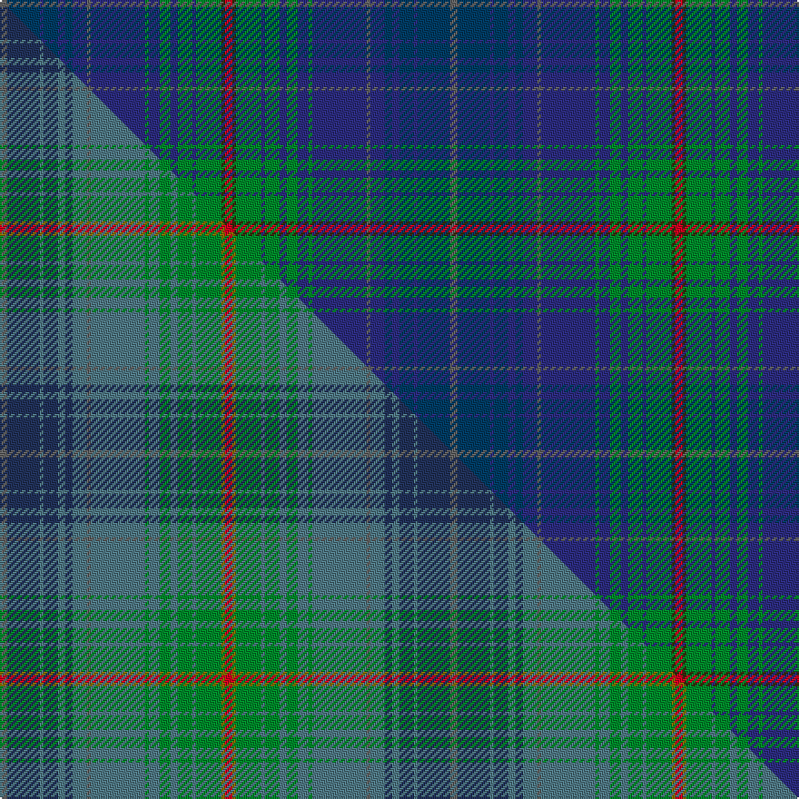

This is one **variant** — a specific cloth: this exact thread count and colourway, with its own
provenance below. It is one weaving of the [sett](/setts/n2db9dbi1db4dbi2db2dbi4n1dbi15g1dbi3g3dbi2g4dbi1g7dy1r2/) (the scale-free proportion — the
same cloth at any scale or shade), whose colour order is pattern [BBBBBBBBBGBGBGBGGR](/stripes/bbbbbbbbbgbgbgbggr/).

Part of the [Glaz](/tartans/g/gl/glaz/) tartan — the named design grouping this sett with its other cloths.

Sourced from tartans-authority.  It is a [18 stripe tartan](/stripes/stripes18/).

Original link [https://www.tartanregister.gov.uk/tartanDetails.aspx?ref=10774](https://www.tartanregister.gov.uk/tartanDetails.aspx?ref=10774)

Dataset <small>— provenance for this record, inherited from the source manifest</small>

<dl class="dataset-prov">
<dt>source</dt><dd><a href="/sources/tartans-authority/">Scottish Tartans Authority</a></dd>
<dt>data captured from</dt><dd><a href="https://github.com/thetartan/tartan-database/blob/master/data/tartans-authority/data.csv">https://github.com/thetartan/tartan-database/blob/master/data/tartans-authority/data.csv</a></dd>
<dt>data date</dt><dd>04/01/2013 <small>(this record)</small></dd>
<dt>licence</dt><dd><a href="https://creativecommons.org/licenses/by-nc-nd/4.0/">CC BY-NC-ND 4.0</a></dd>
</dl>

Capture chain <small>— the hands this data passed through, oldest first; each capture carries its own licence</small>

<ol class="capture-chain">
<li><a href="https://www.tartansauthority.com/">Scottish Tartans Authority</a> <small>the heritage body's archive — its tartan-ferret record browser is retired (links repaired to the SRT, above)</small></li>
<li><a href="https://github.com/thetartan/tartan-database">thetartan/tartan-database</a> <small>2016-2017</small> · <a href="https://creativecommons.org/licenses/by-nc-nd/4.0/">CC BY-NC-ND 4.0</a> <small>Levko Kravets's frozen compilation — the capture we vendored, and where its CC licence text came from</small></li>
<li>this dictionary <small>captured 2026-06-10 · commit 5bf86c7566</small> <small>each re-capture is a git commit to data/sources</small></li>
</ol>

## Register references

External register numbers recorded for this tartan.

- Scottish Register of Tartans: [10774](https://www.tartanregister.gov.uk/tartanDetails?ref=10774)
- Scottish Tartans Authority (ITI): 10774

## Thread count
N/4 DB18 DBi2 DB8 DBi4 DB4 DBi8 N2 DBi30 G2 DBi6 G6 DBi4 G8 DBi2 G14 DY2 R/4

One full sett is **248 threads**.

## Palette
<table><thead><tr><th>Colour</th><th>Shade</th><th>OKLCh</th></tr></thead><tbody><tr><td>DB</td><td><code style="background-color:#2C2C80;">#2C2C80</code> <small style="color:#888">#2C2C80</small></td><td><small style="color:#888">oklch(35.0% 0.138 276.6)</small></td></tr><tr><td>DB</td><td><code style="background-color:#003C64;">#003C64</code> <small style="color:#888">#003C64</small></td><td><small style="color:#888">oklch(34.5% 0.089 246.0)</small></td></tr><tr><td>G</td><td><code style="background-color:#008B2A;">#008B2A</code> <small style="color:#888">#008B2A</small></td><td><small style="color:#888">oklch(55.4% 0.170 145.9)</small></td></tr><tr><td>N</td><td><code style="background-color:#636363;">#636363</code> <small style="color:#888">#636363</small></td><td><small style="color:#888">oklch(50.0% 0.000 89.9)</small></td></tr><tr><td>R</td><td><code style="background-color:#D60020;">#D60020</code> <small style="color:#888">#D60020</small></td><td><small style="color:#888">oklch(55.2% 0.224 25.5)</small></td></tr><tr><td>DY</td><td><code style="background-color:#3A2B0D;">#3A2B0D</code> <small style="color:#888">#3A2B0D</small></td><td><small style="color:#888">oklch(30.0% 0.049 82.0)</small></td></tr></tbody></table>

# Sample pattern

## Compared to the master

This cloth is one sett of its design; the master sett (the exemplar the design is anchored on) is below for comparison.

Its **ΔTartan distance** from the master is **0.17** — the same measure the nearest-tartans table ranks by (0 is identical; a re-scale of the same cloth is near 0, a recolour or a different proportion further).

<figure class="master-compare" style="margin:0">

this sett
master sett ★

<figcaption style="color:#888;font-size:smaller">One weave of this sett against the <a href="/setts/n2dt9t1dt4t2dt2t4n1t15g1t3g3t2g4t1g7y1r2/">master sett ★</a>, split on the diagonal: a shared proportion runs seamlessly across it with only the shades shifting; a different proportion breaks on it.</figcaption>
</figure>

## Nearest tartan variants

The nearest existing variants by ΔTartan distance, with this cloth at the top so the swatches line up against it.

ΔTartan

Threads

Variant

Sett

—

248

<a href="/variants/s18/n2db9dbi1db4dbi2db2dbi4n1dbi15g1dbi3g3dbi2g4dbi1g7dy1r2~x2~db1404245-dbi1406275/">Glaz (Fashion)</a>

<a href="/ttd/edit/#slug=n2dt9t1dt4t2dt2t4n1t15g1t3g3t2g4t1g7y1r2~x2~dt1303265-t2202222&amp;base=n2db9dbi1db4dbi2db2dbi4n1dbi15g1dbi3g3dbi2g4dbi1g7dy1r2~x2~db1404245-dbi1406275" title="compare in the TTD">0.17</a>

248

<a href="/variants/s18/n2dt9t1dt4t2dt2t4n1t15g1t3g3t2g4t1g7y1r2~x2~dt1303265-t2202222/">Glaz</a>

<a href="/ttd/edit/#slug=dg14db2r2db2dg22lb2db16lb2dt20dg5r2dg5dt20lb2db16lb2dg8~x2~db1406275-dt1204274&amp;base=n2db9dbi1db4dbi2db2dbi4n1dbi15g1dbi3g3dbi2g4dbi1g7dy1r2~x2~db1404245-dbi1406275" title="compare in the TTD">2.80</a>

524

<a href="/variants/s17/dg14dbi2r2dbi2dg22lb2dbi16lb2db20dg5r2dg5db20lb2dbi16lb2dg8~x2~dbi1406275-db1204274/">Frangord</a>

<a href="/ttd/edit/#slug=b26w2b3db15n26r2n3db4~x2&amp;base=n2db9dbi1db4dbi2db2dbi4n1dbi15g1dbi3g3dbi2g4dbi1g7dy1r2~x2~db1404245-dbi1406275" title="compare in the TTD">3.00</a>

264

<a href="/variants/s8/b26w2b3db15n26r2n3db4~x2/">Scottish Highlander Universal Tartan</a>

<a href="/ttd/edit/#slug=dt3r1db12dg2db2dt4db2dg2db2dg9dt1ly2~x4~dt1204274-db1406275&amp;base=n2db9dbi1db4dbi2db2dbi4n1dbi15g1dbi3g3dbi2g4dbi1g7dy1r2~x2~db1404245-dbi1406275" title="compare in the TTD">3.17</a>

316

<a href="/variants/s12/db3r1dbi12dg2dbi2db4dbi2dg2dbi2dg9db1ly2~x4~db1204274-dbi1406275/">St. Andrew's Soc. of Philadelphia (C</a>

<a href="/ttd/edit/#slug=db20n2w1n5dg8y1dg2r1dg8n16~x4&amp;base=n2db9dbi1db4dbi2db2dbi4n1dbi15g1dbi3g3dbi2g4dbi1g7dy1r2~x2~db1404245-dbi1406275" title="compare in the TTD">3.21</a>

368

<a href="/variants/s10/db20n2w1n5dg8y1dg2r1dg8n16~x4/">Connecticut</a>

<a href="/ttd/edit/#slug=dt18w1o8w1db16dp8w1dt18w1dt20dp8dt6g8db10g10db1~x4&amp;base=n2db9dbi1db4dbi2db2dbi4n1dbi15g1dbi3g3dbi2g4dbi1g7dy1r2~x2~db1404245-dbi1406275" title="compare in the TTD">3.38</a>

1004

<a href="/variants/s16/dt18w1o8w1db16dp8w1dt18w1dt20dp8dt6g8db10g10db1~x4/">Forbes - 1970 (WCWM #2)</a>

<a href="/ttd/edit/#slug=db4dt24db6r3db4g3db8w3db8g3db4r3db6dt24db4dt3~x2~db1406275&amp;base=n2db9dbi1db4dbi2db2dbi4n1dbi15g1dbi3g3dbi2g4dbi1g7dy1r2~x2~db1404245-dbi1406275" title="compare in the TTD">3.52</a>

426

<a href="/variants/s16/db4dt24db6r3db4g3db8w3db8g3db4r3db6dt24db4dt3~x2~db1406275/">Scozia</a>

<a href="/ttd/edit/#slug=g2db5g3r2db11r2db11dg18db11r2db11r2g3r11db3dg5db3r5b2~x2~r1707016-dg1503171&amp;base=n2db9dbi1db4dbi2db2dbi4n1dbi15g1dbi3g3dbi2g4dbi1g7dy1r2~x2~db1404245-dbi1406275" title="compare in the TTD">3.53</a>

440

<a href="/variants/s19/g2db5g3r2db11r2db11dg18db11r2db11r2g3r11db3dg5db3r5b2~x2~r1707016-dg1503171/">Jorgensen of Taasinge Family Tartan</a>

<a href="/ttd/edit/#slug=db2dbi2t4db2t6lr4t5db2dbi4db6dbi4n2db2dbi12db2dbi3r1~x2~db1106275-dbi1406275-t2302222-lr2800000&amp;base=n2db9dbi1db4dbi2db2dbi4n1dbi15g1dbi3g3dbi2g4dbi1g7dy1r2~x2~db1404245-dbi1406275" title="compare in the TTD">3.67</a>

246

<a href="/variants/s17/db2dbi2t4db2t6lr4t5db2dbi4db6dbi4n2db2dbi12db2dbi3r1~x2~db1106275-dbi1406275-t2302222-lr2800000/">Fulbright, Senator (Personal)</a>

<a href="/ttd/edit/#slug=r12dy50n20db2n10db4n8db6n6db6n4db8n2db32g12db5&amp;base=n2db9dbi1db4dbi2db2dbi4n1dbi15g1dbi3g3dbi2g4dbi1g7dy1r2~x2~db1404245-dbi1406275" title="compare in the TTD">3.69</a>

357

<a href="/variants/s16/r12dy50n20db2n10db4n8db6n6db6n4db8n2db32g12db5/">Help for Heroes Corporate Tartan</a>

## Neighbour map

Every grey dot is one of 13621 variants placed by the first two principal components of the ΔTartan feature space (42% of its variance). Red is this tartan; blue dots are its nearest — click one to open its page.

<svg viewBox="0 0 640 380" role="img" style="max-width:100%;height:auto;border:1px solid #e0e0e0;border-radius:4px;display:block" xmlns="http://www.w3.org/2000/svg"><image href="/nn/cloud.v1.png" width="640" height="380"/><a href="/variants/s18/n2dt9t1dt4t2dt2t4n1t15g1t3g3t2g4t1g7y1r2~x2~dt1303265-t2202222/"><circle cx="302.8" cy="164.3" r="4" fill="#3465a4"><title>Glaz</title></circle></a><a href="/variants/s17/dg14dbi2r2dbi2dg22lb2dbi16lb2db20dg5r2dg5db20lb2dbi16lb2dg8~x2~dbi1406275-db1204274/"><circle cx="260.9" cy="186.6" r="4" fill="#3465a4"><title>Frangord</title></circle></a><a href="/variants/s8/b26w2b3db15n26r2n3db4~x2/"><circle cx="291.0" cy="171.8" r="4" fill="#3465a4"><title>Scottish Highlander Universal Tartan</title></circle></a><a href="/variants/s12/db3r1dbi12dg2dbi2db4dbi2dg2dbi2dg9db1ly2~x4~db1204274-dbi1406275/"><circle cx="303.9" cy="195.1" r="4" fill="#3465a4"><title>St. Andrew's Soc. of Philadelphia (C</title></circle></a><a href="/variants/s10/db20n2w1n5dg8y1dg2r1dg8n16~x4/"><circle cx="267.3" cy="159.4" r="4" fill="#3465a4"><title>Connecticut</title></circle></a><a href="/variants/s16/dt18w1o8w1db16dp8w1dt18w1dt20dp8dt6g8db10g10db1~x4/"><circle cx="244.7" cy="156.4" r="4" fill="#3465a4"><title>Forbes - 1970 (WCWM #2)</title></circle></a><a href="/variants/s16/db4dt24db6r3db4g3db8w3db8g3db4r3db6dt24db4dt3~x2~db1406275/"><circle cx="292.4" cy="185.8" r="4" fill="#3465a4"><title>Scozia</title></circle></a><a href="/variants/s19/g2db5g3r2db11r2db11dg18db11r2db11r2g3r11db3dg5db3r5b2~x2~r1707016-dg1503171/"><circle cx="277.4" cy="187.8" r="4" fill="#3465a4"><title>Jorgensen of Taasinge Family Tartan</title></circle></a><a href="/variants/s17/db2dbi2t4db2t6lr4t5db2dbi4db6dbi4n2db2dbi12db2dbi3r1~x2~db1106275-dbi1406275-t2302222-lr2800000/"><circle cx="233.6" cy="187.8" r="4" fill="#3465a4"><title>Fulbright, Senator (Personal)</title></circle></a><a href="/variants/s16/r12dy50n20db2n10db4n8db6n6db6n4db8n2db32g12db5/"><circle cx="259.2" cy="139.9" r="4" fill="#3465a4"><title>Help for Heroes Corporate Tartan</title></circle></a><circle cx="269.1" cy="149.8" r="5" fill="#c00000"/><text x="320" y="376" text-anchor="middle" font-size="11" fill="#999">ground</text><text x="11" y="190" text-anchor="middle" font-size="11" fill="#999" transform="rotate(-90 11 190)">complexity</text></svg>

ID: /variants/s18/n2db9dbi1db4dbi2db2dbi4n1dbi15g1dbi3g3dbi2g4dbi1g7dy1r2~x2~db1404245-dbi1406275/
