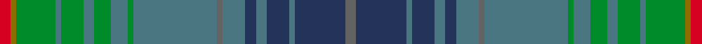

This page is one **sett** — a single exact thread-count. It belongs to the [tartan](/setts/n2dt9t1dt4t2dt2t4n1t15g1t3g3t2g4t1g7y1r2/)
(the same proportion at any scale), whose colour order is pattern [BBBBBBBBBGBGBGBGGR](/stripes/bbbbbbbbbgbgbgbggr/).

Part of the [Glaz](/tartans/glaz/) tartan — the named design grouping this sett with its other cloths.

Sourced from register-of-tartans.  It is a [18 stripe tartan](/stripes/stripes18/).

Original link https://www.tartanregister.gov.uk/tartanDetails.aspx?ref=10774

## Register references

External register numbers recorded for this tartan.

- Scottish Register of Tartans: [10774](https://www.tartanregister.gov.uk/tartanDetails.aspx?ref=10774)

## Thread count
R/4 Y2 G14 T2 G8 T4 G6 T6 G2 T30 N2 T8 DT4 T4 DT8 T2 DT18 N/4

One full sett is **248 threads**.

## Palette
<table><thead><tr><th>Colour</th><th>Shade</th><th>OKLCh</th></tr></thead><tbody><tr><td>T</td><td><code style="background-color:#497681;">#497681</code> <small style="color:#888">#497681</small></td><td><small style="color:#888">oklch(53.8% 0.052 215.0)</small></td></tr><tr><td>DT</td><td><code style="background-color:#24335A;">#24335A</code> <small style="color:#888">#24335A</small></td><td><small style="color:#888">oklch(32.9% 0.072 266.6)</small></td></tr><tr><td>G</td><td><code style="background-color:#008B2A;">#008B2A</code> <small style="color:#888">#008B2A</small></td><td><small style="color:#888">oklch(55.4% 0.170 145.9)</small></td></tr><tr><td>N</td><td><code style="background-color:#636363;">#636363</code> <small style="color:#888">#636363</small></td><td><small style="color:#888">oklch(50.0% 0.000 89.9)</small></td></tr><tr><td>R</td><td><code style="background-color:#D60020;">#D60020</code> <small style="color:#888">#D60020</small></td><td><small style="color:#888">oklch(55.2% 0.224 25.5)</small></td></tr><tr><td>Y</td><td><code style="background-color:#8B6E00;">#8B6E00</code> <small style="color:#888">#8B6E00</small></td><td><small style="color:#888">oklch(55.1% 0.113 90.4)</small></td></tr></tbody></table>

# Sample pattern

## Nearest variants

The nearest existing variants by ΔTartan distance, with this cloth at the top so the swatches line up against it.

ΔTartan

Threads

Variant

Sett

—

248

<a href="/variants/s18/n2dt9t1dt4t2dt2t4n1t15g1t3g3t2g4t1g7y1r2~x2~dt1303265-t2202222/">Glaz</a>

<a href="/ttd/edit/#slug=n2db9dbi1db4dbi2db2dbi4n1dbi15g1dbi3g3dbi2g4dbi1g7dy1r2~x2~db1404245-dbi1406275&amp;base=n2dt9t1dt4t2dt2t4n1t15g1t3g3t2g4t1g7y1r2~x2~dt1303265-t2202222" title="compare in the TTD">0.00</a>

248

<a href="/variants/s18/n2db9dbi1db4dbi2db2dbi4n1dbi15g1dbi3g3dbi2g4dbi1g7dy1r2~x2~db1404245-dbi1406275/">Glaz (Fashion)</a>

## Neighbour map

Every grey dot is one of 13620 variants placed by the first two principal components of the ΔTartan feature space (42% of its variance). Red is this tartan; blue dots are its nearest — click one to open its page.

<svg viewBox="0 0 640 380" role="img" style="max-width:100%;height:auto;border:1px solid #e0e0e0;border-radius:4px;display:block" xmlns="http://www.w3.org/2000/svg"><image href="/nn/cloud.v1.png" width="640" height="380"/><a href="/variants/s18/n2db9dbi1db4dbi2db2dbi4n1dbi15g1dbi3g3dbi2g4dbi1g7dy1r2~x2~db1404245-dbi1406275/"><circle cx="269.2" cy="150.0" r="4" fill="#3465a4"><title>Glaz (Fashion)</title></circle></a><circle cx="302.8" cy="164.5" r="5" fill="#c00000"/><text x="320" y="376" text-anchor="middle" font-size="11" fill="#999">ground</text><text x="11" y="190" text-anchor="middle" font-size="11" fill="#999" transform="rotate(-90 11 190)">complexity</text></svg>

ID: /variants/s18/n2dt9t1dt4t2dt2t4n1t15g1t3g3t2g4t1g7y1r2~x2~dt1303265-t2202222/
