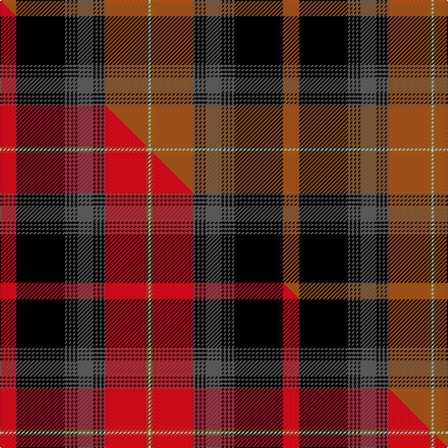

This is one **variant** — a specific cloth: this exact thread count and colourway, with its own
provenance below. It is one weaving of the [sett](/setts/o8k24n1k1n1k1n1k1n8k1n1k1n1k1n1o20y1w1/) (the scale-free proportion — the
same cloth at any scale or shade), whose colour order is pattern [RKBKBKBKBKBKBKBRGW](/stripes/rkbkbkbkbkbkbkbrgw/).

Part of the [Read Dress, Peter](/tartans/r/re/read-dress-peter/) tartan — the named design grouping this sett with its other cloths.

Sourced from tartans-authority.  It is a [18 stripe tartan](/stripes/stripes18/).

Original link [https://www.tartanregister.gov.uk/tartanDetails.aspx?ref=11008](https://www.tartanregister.gov.uk/tartanDetails.aspx?ref=11008)

Dataset <small>— provenance for this record, inherited from the source manifest</small>

<dl class="dataset-prov">
<dt>source</dt><dd><a href="/sources/tartans-authority/">Scottish Tartans Authority</a></dd>
<dt>data captured from</dt><dd><a href="https://github.com/thetartan/tartan-database/blob/master/data/tartans-authority/data.csv">https://github.com/thetartan/tartan-database/blob/master/data/tartans-authority/data.csv</a></dd>
<dt>data date</dt><dd>2014 <small>(this record)</small></dd>
<dt>licence</dt><dd><a href="https://creativecommons.org/licenses/by-nc-nd/4.0/">CC BY-NC-ND 4.0</a></dd>
</dl>

Capture chain <small>— the hands this data passed through, oldest first; each capture carries its own licence</small>

<ol class="capture-chain">
<li><a href="https://www.tartansauthority.com/">Scottish Tartans Authority</a> <small>the heritage body's archive — its tartan-ferret record browser is retired (links repaired to the SRT, above)</small></li>
<li><a href="https://github.com/thetartan/tartan-database">thetartan/tartan-database</a> <small>2016-2017</small> · <a href="https://creativecommons.org/licenses/by-nc-nd/4.0/">CC BY-NC-ND 4.0</a> <small>Levko Kravets's frozen compilation — the capture we vendored, and where its CC licence text came from</small></li>
<li>this dictionary <small>captured 2026-06-10 · commit 5bf86c7566</small> <small>each re-capture is a git commit to data/sources</small></li>
</ol>

## Register references

External register numbers recorded for this tartan.

- Scottish Register of Tartans: [11008](https://www.tartanregister.gov.uk/tartanDetails?ref=11008)
- Scottish Tartans Authority (ITI): 11008

## Thread count
O/16 K48 N2 K2 N2 K2 N2 K2 N16 K2 N2 K2 N2 K2 N2 O40 Y2 W/2

One full sett is **278 threads**.

## Palette
<table><thead><tr><th>Colour</th><th>Shade</th><th>OKLCh</th></tr></thead><tbody><tr><td>O</td><td><code style="background-color:#A65C11;">#A65C11</code> <small style="color:#888">#A65C11</small></td><td><small style="color:#888">oklch(55.0% 0.125 58.3)</small></td></tr><tr><td>K</td><td><code style="background-color:#000000;">#000000</code> <small style="color:#888">#000000</small></td><td><small style="color:#888">oklch(0.0% 0.000 0.0)</small></td></tr><tr><td>N</td><td><code style="background-color:#636363;">#636363</code> <small style="color:#888">#636363</small></td><td><small style="color:#888">oklch(50.0% 0.000 89.9)</small></td></tr><tr><td>W</td><td><code style="background-color:#F7F7F7;">#F7F7F7</code> <small style="color:#888">#F7F7F7</small></td><td><small style="color:#888">oklch(97.6% 0.000 89.9)</small></td></tr><tr><td>Y</td><td><code style="background-color:#8B6E00;">#8B6E00</code> <small style="color:#888">#8B6E00</small></td><td><small style="color:#888">oklch(55.1% 0.113 90.4)</small></td></tr></tbody></table>

# Sample pattern

## Compared to the master

This cloth is one sett of its design; the master sett (the exemplar the design is anchored on) is below for comparison.

Its **ΔTartan distance** from the master is **2.39** — the same measure the nearest-tartans table ranks by (0 is identical; a re-scale of the same cloth is near 0, a recolour or a different proportion further).

<figure class="master-compare" style="margin:0">

this sett
master sett ★

<figcaption style="color:#888;font-size:smaller">One weave of this sett against the <a href="/setts/r8k24n1k1n1k1n1k1n8k1n1k1n1k1n1r20y1w1/">master sett ★</a>, split on the diagonal: a shared proportion runs seamlessly across it with only the shades shifting; a different proportion breaks on it.</figcaption>
</figure>

## Nearest tartan variants

The nearest existing variants by ΔTartan distance, with this cloth at the top so the swatches line up against it.

ΔTartan

Threads

Variant

Sett

—

278

<a href="/variants/s18/o8k24n1k1n1k1n1k1n8k1n1k1n1k1n1o20y1w1~x2/">Read Dress, Peter (Personal)</a>

<a href="/ttd/edit/#slug=k5r1w2r1k26r3ly1n10w1r3w1n10w1r3~x2&amp;base=o8k24n1k1n1k1n1k1n8k1n1k1n1k1n1o20y1w1~x2" title="compare in the TTD">2.25</a>

256

<a href="/variants/s14/k5r1w2r1k26r3ly1n10w1r3w1n10w1r3~x2/">El Dorado Hills P &amp; D (Corporate)</a>

<a href="/ttd/edit/#slug=k5r1w2r1k26r3y1n10w1r3w1n10w1r3~x2&amp;base=o8k24n1k1n1k1n1k1n8k1n1k1n1k1n1o20y1w1~x2" title="compare in the TTD">2.25</a>

256

<a href="/variants/s14/k5r1w2r1k26r3y1n10w1r3w1n10w1r3~x2/">El Dorado Hills Firefighters Pipes and Drums</a>

<a href="/ttd/edit/#slug=r8k24n1k1n1k1n1k1n8k1n1k1n1k1n1r20y1w1~x2&amp;base=o8k24n1k1n1k1n1k1n8k1n1k1n1k1n1o20y1w1~x2" title="compare in the TTD">2.39</a>

278

<a href="/variants/s18/r8k24n1k1n1k1n1k1n8k1n1k1n1k1n1r20y1w1~x2/">Read Dress, Peter (Personal)</a>

<a href="/ttd/edit/#slug=r5k20n1k2n1k2n2k2n5o2n2o2n2o3n2o10w3~x2&amp;base=o8k24n1k1n1k1n1k1n8k1n1k1n1k1n1o20y1w1~x2" title="compare in the TTD">2.51</a>

248

<a href="/variants/s17/r5k20n1k2n1k2n2k2n5o2n2o2n2o3n2o10w3~x2/">Nike Golf Dark</a>

<a href="/ttd/edit/#slug=r47dg14k5y2k3dg7~x2&amp;base=o8k24n1k1n1k1n1k1n8k1n1k1n1k1n1o20y1w1~x2" title="compare in the TTD">2.64</a>

286

<a href="/variants/s10/r47dg14k5y2k3dg7k3y2k5dg14~x2/">Harbor Club</a>

<a href="/ttd/edit/#slug=g14r6b2k3r65k2lb2r6k34r6lb2k2r4g66r12b2k2lb4&amp;base=o8k24n1k1n1k1n1k1n8k1n1k1n1k1n1o20y1w1~x2" title="compare in the TTD">2.76</a>

450

<a href="/variants/s18/g14r6b2k3r65k2lb2r6k34r6lb2k2r4g66r12b2k2lb4/">Stewart of Ardshiel</a>

<a href="/ttd/edit/#slug=k63w2o8k10w2o2w2o2w2o2w2o2w2o2w2o2w2o2w2o2w2n65w2r6~x2&amp;base=o8k24n1k1n1k1n1k1n8k1n1k1n1k1n1o20y1w1~x2" title="compare in the TTD">2.89</a>

622

<a href="/variants/s24/k63w2o8k10w2o2w2o2w2o2w2o2w2o2w2o2w2o2w2o2w2n65w2r6~x2/">Sobieski-Stewart</a>

<a href="/ttd/edit/#slug=r5k20n1k2n1k2n2k2n5o2n2o2n2o3n2o10w3~x2~n1900000-o2500000&amp;base=o8k24n1k1n1k1n1k1n8k1n1k1n1k1n1o20y1w1~x2" title="compare in the TTD">2.97</a>

248

<a href="/variants/s17/r5k20n1k2n1k2n2k2n5o2n2o2n2o3n2o10w3~x2~n1900000-o2500000/">Nike Golf Dark (Corporate)</a>

<a href="/ttd/edit/#slug=k10lyi1ly2k1n2k1ly2lyi1k1n2k3n1k17ly18lyi1ly2k1dg2~x2~lyi3106095-ly3104101&amp;base=o8k24n1k1n1k1n1k1n8k1n1k1n1k1n1o20y1w1~x2" title="compare in the TTD">3.01</a>

248

<a href="/variants/s18/k10lyi1ly2k1n2k1ly2lyi1k1n2k3n1k17ly18lyi1ly2k1dg2~x2~lyi3106095-ly3104101/">Raznotravie (Corporate)</a>

<a href="/ttd/edit/#slug=w1dr2y2dr20db1dr1k6dr6k6y2dr1y2db6dr3k1dr3k20dr1y2w1~x2&amp;base=o8k24n1k1n1k1n1k1n8k1n1k1n1k1n1o20y1w1~x2" title="compare in the TTD">3.01</a>

344

<a href="/variants/s20/w1dr2y2dr20db1dr1k6dr6k6y2dr1y2db6dr3k1dr3k20dr1y2w1~x2/">McDill (2015)</a>

## Neighbour map

Every grey dot is one of 13621 variants placed by the first two principal components of the ΔTartan feature space (42% of its variance). Red is this tartan; blue dots are its nearest — click one to open its page.

<svg viewBox="0 0 640 380" role="img" style="max-width:100%;height:auto;border:1px solid #e0e0e0;border-radius:4px;display:block" xmlns="http://www.w3.org/2000/svg"><image href="/nn/cloud.v1.png" width="640" height="380"/><a href="/variants/s14/k5r1w2r1k26r3ly1n10w1r3w1n10w1r3~x2/"><circle cx="203.4" cy="65.6" r="4" fill="#3465a4"><title>El Dorado Hills P &amp; D (Corporate)</title></circle></a><a href="/variants/s14/k5r1w2r1k26r3y1n10w1r3w1n10w1r3~x2/"><circle cx="203.1" cy="65.1" r="4" fill="#3465a4"><title>El Dorado Hills Firefighters Pipes and Drums</title></circle></a><a href="/variants/s18/r8k24n1k1n1k1n1k1n8k1n1k1n1k1n1r20y1w1~x2/"><circle cx="208.5" cy="45.7" r="4" fill="#3465a4"><title>Read Dress, Peter (Personal)</title></circle></a><a href="/variants/s17/r5k20n1k2n1k2n2k2n5o2n2o2n2o3n2o10w3~x2/"><circle cx="155.8" cy="82.7" r="4" fill="#3465a4"><title>Nike Golf Dark</title></circle></a><a href="/variants/s10/r47dg14k5y2k3dg7k3y2k5dg14~x2/"><circle cx="214.6" cy="86.6" r="4" fill="#3465a4"><title>Harbor Club</title></circle></a><a href="/variants/s18/g14r6b2k3r65k2lb2r6k34r6lb2k2r4g66r12b2k2lb4/"><circle cx="215.0" cy="42.5" r="4" fill="#3465a4"><title>Stewart of Ardshiel</title></circle></a><a href="/variants/s24/k63w2o8k10w2o2w2o2w2o2w2o2w2o2w2o2w2o2w2o2w2n65w2r6~x2/"><circle cx="188.4" cy="14.0" r="4" fill="#3465a4"><title>Sobieski-Stewart</title></circle></a><a href="/variants/s17/r5k20n1k2n1k2n2k2n5o2n2o2n2o3n2o10w3~x2~n1900000-o2500000/"><circle cx="151.7" cy="83.7" r="4" fill="#3465a4"><title>Nike Golf Dark (Corporate)</title></circle></a><a href="/variants/s18/k10lyi1ly2k1n2k1ly2lyi1k1n2k3n1k17ly18lyi1ly2k1dg2~x2~lyi3106095-ly3104101/"><circle cx="210.1" cy="69.4" r="4" fill="#3465a4"><title>Raznotravie (Corporate)</title></circle></a><a href="/variants/s20/w1dr2y2dr20db1dr1k6dr6k6y2dr1y2db6dr3k1dr3k20dr1y2w1~x2/"><circle cx="221.5" cy="80.4" r="4" fill="#3465a4"><title>McDill (2015)</title></circle></a><circle cx="209.0" cy="52.1" r="5" fill="#c00000"/><text x="320" y="376" text-anchor="middle" font-size="11" fill="#999">ground</text><text x="11" y="190" text-anchor="middle" font-size="11" fill="#999" transform="rotate(-90 11 190)">complexity</text></svg>

ID: /variants/s18/o8k24n1k1n1k1n1k1n8k1n1k1n1k1n1o20y1w1~x2/
