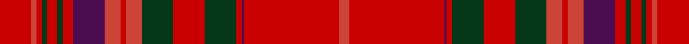

This page is one **sett** — a single exact thread-count. It belongs to the [tartan](/setts/r12ri2r2dg2r4dg2r4dp12ri6r2ri6dg12r12dg12r2dp1r36ri4/)
(the same proportion at any scale), whose colour order is pattern [RRBRGRGRRRBRGRGRRR](/stripes/rrbrgrgrrrbrgrgrrr/).

Part of the [MacCoul](/tartans/maccoul/) tartan — the named design grouping this sett with its other cloths.

Sourced from register-of-tartans.  It is a [18 stripe tartan](/stripes/stripes18/).

Original link https://www.tartanregister.gov.uk/tartanDetails.aspx?ref=2327

2 attestations — the source records this cloth was collapsed from (oldest owns this page)

<ul>
<li>01/01/1850 — MacCoul (register-of-tartans, <a href="https://www.tartanregister.gov.uk/tartanDetails.aspx?ref=2327">record</a>)  <em>From 'Tartan: the Highland Textile'. This tartan first appears in the manuscript of W and A Smith 'Authenticated Tartans of the Clans and Families of Scotland'. The Smith's sources included the findings of George Hunter, an Army clothier, who toured the Highlands in search of old tartans prior to 1822.</em></li>
<li>1850 — MacCoul (Clan) (tartans-authority, <a href="http://www.tartansauthority.com/tartan-ferret/display/1635/">record</a>)  <em>From "Tartan: the Highland Textile". this tartan first appears in the manuscript of William and Andrew Smith's 'Authenticated Tartans of the Clans and Families of Scotland'. The Smith's sources included the findings of George Hunter, an Army clothier, who toured the Highlands in search of old tartans prior to 1822.</em></li>
</ul>

## Register references

External register numbers recorded for this tartan.

- Scottish Register of Tartans: [2327](https://www.tartanregister.gov.uk/tartanDetails.aspx?ref=2327)
- Scottish Tartans Authority (ITI): 1635
- Scottish Tartans World Register: 1635

## Thread count
R/24 Ri4 R4 DG4 R8 DG4 R8 DP24 Ri12 R4 Ri12 DG24 R24 DG24 R4 DP2 R72 Ri/8

One full sett is **500 threads**.

## Palette
<table><thead><tr><th>Colour</th><th>Shade</th><th>OKLCh</th></tr></thead><tbody><tr><td>DG</td><td><code style="background-color:#053819;">#053819</code> <small style="color:#888">#053819</small></td><td><small style="color:#888">oklch(30.0% 0.075 151.3)</small></td></tr><tr><td>DP</td><td><code style="background-color:#4B0B4F;">#4B0B4F</code> <small style="color:#888">#4B0B4F</small></td><td><small style="color:#888">oklch(30.1% 0.125 325.4)</small></td></tr><tr><td>R</td><td><code style="background-color:#CC4438;">#CC4438</code> <small style="color:#888">#CC4438</small></td><td><small style="color:#888">oklch(57.7% 0.174 28.7)</small></td></tr><tr><td>Ra</td><td><code style="background-color:#C80000;">#C80000</code> <small style="color:#888">#C80000</small></td><td><small style="color:#888">oklch(52.3% 0.215 29.2)</small></td></tr></tbody></table>

# Sample pattern

ID: /variants/s18/r12ri2r2dg2r4dg2r4dp12ri6r2ri6dg12r12dg12r2dp1r36ri4~x2~r2109032-ri2307033/
