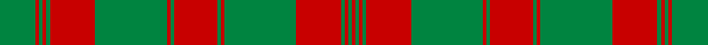

This page is one **sett** — a single exact thread-count. It belongs to the [tartan](/setts/r24g2r2g40r25g2r2g2r2g20/)
(the same proportion at any scale), whose colour order is pattern [GRGRGRGRGRGRGRGRGR](/stripes/grgrgrgrgrgrgrgrgr/).

Sourced from house-of-tartan.  It is a [18 stripe tartan](/stripes/stripes18/).

Original link http://www.house-of-tartan.scotland.net/house/TartanViewjs.asp?colr=Def&tnam=6138

## Provenance

Earliest known date: 2004 A new tartan, a simplified sett based on the #893 Robertson tartan once presented by the Jacobite Prince to a Robertson during the '45.'' (The Setts of the Scottish Tartans, D.C. Stewart, 1950.) The Donachie of Brockloch Society have adopted this tartan.

## Thread count
G/40 R4 G4 R4 G4 R50 G80 R4 G4 R48 G4 R4 G80 R50 G4 R4 G4 R/4

One full sett is **748 threads**.

## Palette

Palette: <strong>Tartan Register</strong> <small style="color:#888">(2 of 4 colours)</small>
<table><thead><tr><th>Colour</th><th>Threads</th><th>Shade</th><th>Base</th><th>OKLCh</th></tr></thead><tbody><tr><td>G/</td><td style="text-align:right;font-variant-numeric:tabular-nums">40</td><td><code style="background-color:#008440;">#008440</code> <small style="color:#888">#008440</small></td><td>G <code style="background-color:#006100;">#006100</code></td><td><small style="color:#888">oklch(53.7% 0.143 151.5)</small></td></tr><tr><td>R</td><td style="text-align:right;font-variant-numeric:tabular-nums">4</td><td><code style="background-color:#C80000;">#C80000</code> <small style="color:#888">#C80000</small></td><td>R <code style="background-color:#CC0000;">#CC0000</code></td><td><small style="color:#888">oklch(52.3% 0.215 29.2)</small></td></tr><tr><td>G</td><td style="text-align:right;font-variant-numeric:tabular-nums">4</td><td><code style="background-color:#008440;">#008440</code> <small style="color:#888">#008440</small></td><td>G <code style="background-color:#006100;">#006100</code></td><td><small style="color:#888">oklch(53.7% 0.143 151.5)</small></td></tr><tr><td>R</td><td style="text-align:right;font-variant-numeric:tabular-nums">4</td><td><code style="background-color:#C80000;">#C80000</code> <small style="color:#888">#C80000</small></td><td>R <code style="background-color:#CC0000;">#CC0000</code></td><td><small style="color:#888">oklch(52.3% 0.215 29.2)</small></td></tr><tr><td>G</td><td style="text-align:right;font-variant-numeric:tabular-nums">4</td><td><code style="background-color:#008440;">#008440</code> <small style="color:#888">#008440</small></td><td>G <code style="background-color:#006100;">#006100</code></td><td><small style="color:#888">oklch(53.7% 0.143 151.5)</small></td></tr><tr><td>R</td><td style="text-align:right;font-variant-numeric:tabular-nums">50</td><td><code style="background-color:#C80000;">#C80000</code> <small style="color:#888">#C80000</small></td><td>R <code style="background-color:#CC0000;">#CC0000</code></td><td><small style="color:#888">oklch(52.3% 0.215 29.2)</small></td></tr><tr><td>G</td><td style="text-align:right;font-variant-numeric:tabular-nums">80</td><td><code style="background-color:#008440;">#008440</code> <small style="color:#888">#008440</small></td><td>G <code style="background-color:#006100;">#006100</code></td><td><small style="color:#888">oklch(53.7% 0.143 151.5)</small></td></tr><tr><td>R</td><td style="text-align:right;font-variant-numeric:tabular-nums">4</td><td><code style="background-color:#C80000;">#C80000</code> <small style="color:#888">#C80000</small></td><td>R <code style="background-color:#CC0000;">#CC0000</code></td><td><small style="color:#888">oklch(52.3% 0.215 29.2)</small></td></tr><tr><td>G</td><td style="text-align:right;font-variant-numeric:tabular-nums">4</td><td><code style="background-color:#008440;">#008440</code> <small style="color:#888">#008440</small></td><td>G <code style="background-color:#006100;">#006100</code></td><td><small style="color:#888">oklch(53.7% 0.143 151.5)</small></td></tr><tr><td>R</td><td style="text-align:right;font-variant-numeric:tabular-nums">48</td><td><code style="background-color:#C80000;">#C80000</code> <small style="color:#888">#C80000</small></td><td>R <code style="background-color:#CC0000;">#CC0000</code></td><td><small style="color:#888">oklch(52.3% 0.215 29.2)</small></td></tr><tr><td>G</td><td style="text-align:right;font-variant-numeric:tabular-nums">4</td><td><code style="background-color:#008440;">#008440</code> <small style="color:#888">#008440</small></td><td>G <code style="background-color:#006100;">#006100</code></td><td><small style="color:#888">oklch(53.7% 0.143 151.5)</small></td></tr><tr><td>R</td><td style="text-align:right;font-variant-numeric:tabular-nums">4</td><td><code style="background-color:#C80000;">#C80000</code> <small style="color:#888">#C80000</small></td><td>R <code style="background-color:#CC0000;">#CC0000</code></td><td><small style="color:#888">oklch(52.3% 0.215 29.2)</small></td></tr><tr><td>G</td><td style="text-align:right;font-variant-numeric:tabular-nums">80</td><td><code style="background-color:#008440;">#008440</code> <small style="color:#888">#008440</small></td><td>G <code style="background-color:#006100;">#006100</code></td><td><small style="color:#888">oklch(53.7% 0.143 151.5)</small></td></tr><tr><td>R</td><td style="text-align:right;font-variant-numeric:tabular-nums">50</td><td><code style="background-color:#C80000;">#C80000</code> <small style="color:#888">#C80000</small></td><td>R <code style="background-color:#CC0000;">#CC0000</code></td><td><small style="color:#888">oklch(52.3% 0.215 29.2)</small></td></tr><tr><td>G</td><td style="text-align:right;font-variant-numeric:tabular-nums">4</td><td><code style="background-color:#008440;">#008440</code> <small style="color:#888">#008440</small></td><td>G <code style="background-color:#006100;">#006100</code></td><td><small style="color:#888">oklch(53.7% 0.143 151.5)</small></td></tr><tr><td>R</td><td style="text-align:right;font-variant-numeric:tabular-nums">4</td><td><code style="background-color:#C80000;">#C80000</code> <small style="color:#888">#C80000</small></td><td>R <code style="background-color:#CC0000;">#CC0000</code></td><td><small style="color:#888">oklch(52.3% 0.215 29.2)</small></td></tr><tr><td>G</td><td style="text-align:right;font-variant-numeric:tabular-nums">4</td><td><code style="background-color:#008440;">#008440</code> <small style="color:#888">#008440</small></td><td>G <code style="background-color:#006100;">#006100</code></td><td><small style="color:#888">oklch(53.7% 0.143 151.5)</small></td></tr><tr><td>R/</td><td style="text-align:right;font-variant-numeric:tabular-nums">4</td><td><code style="background-color:#C80000;">#C80000</code> <small style="color:#888">#C80000</small></td><td>R <code style="background-color:#CC0000;">#CC0000</code></td><td><small style="color:#888">oklch(52.3% 0.215 29.2)</small></td></tr></tbody></table>

## Nearest tartans

The nearest existing variants by ΔTartan distance, with this tartan at the top so the swatches line up against it.

ΔTartan

Tartan

Sett

—

<a href="/ttd/edit/#slug=r24g2r2g40r25g2r2g2r2g20~x2">Donachie Clan Tartan</a> <a class="nn-out" href="/variants/s18/r24g2r2g40r25g2r2g2r2g20~x2/" title="open its dictionary page">↗</a>

1.01

<a href="/ttd/edit/#slug=g15r1g1r1g1r18g24r1g1r18g1r1g1r3~x2&amp;base=r24g2r2g40r25g2r2g2r2g20~x2">Robertson - 1746 (Artefact)</a> <a class="nn-out" href="/variants/s14/g15r1g1r1g1r18g24r1g1r18g1r1g1r3~x2/" title="open its dictionary page">↗</a>

1.16

<a href="/ttd/edit/#slug=g9r2g3r20g2r1g2r2g20r2g3r2g2r22g3ly1r3~x2&amp;base=r24g2r2g40r25g2r2g2r2g20~x2">Hebrides Outer</a> <a class="nn-out" href="/variants/s17/g9r2g3r20g2r1g2r2g20r2g3r2g2r22g3ly1r3~x2/" title="open its dictionary page">↗</a>

1.25

<a href="/ttd/edit/#slug=r24g2r2g40r25g2r2g2r2g20~x2">Donachie</a> <a class="nn-out" href="/variants/s10/r24g2r2g40r25g2r2g2r2g20~x2/" title="open its dictionary page">↗</a>

1.42

<a href="/ttd/edit/#slug=dg15r1dg1r1dg1r18dg24r1dg1r18dg1r1dg1r3~x2&amp;base=r24g2r2g40r25g2r2g2r2g20~x2">Robertson #2</a> <a class="nn-out" href="/variants/s14/dg15r1dg1r1dg1r18dg24r1dg1r18dg1r1dg1r3~x2/" title="open its dictionary page">↗</a>

1.52

<a href="/ttd/edit/#slug=w8g83r7g5r7g7r28g7r28g7r7g5r7g83w4g4w8&amp;base=r24g2r2g40r25g2r2g2r2g20~x2">Rothesay Hunting (District)</a> <a class="nn-out" href="/variants/s17/w8g83r7g5r7g7r28g7r28g7r7g5r7g83w4g4w8/" title="open its dictionary page">↗</a>

1.58

<a href="/ttd/edit/#slug=g14r4g2r2g2r4g19r30g2r9~x2&amp;base=r24g2r2g40r25g2r2g2r2g20~x2">Livingstone</a> <a class="nn-out" href="/variants/s10/g14r4g2r2g2r4g19r30g2r9~x2/" title="open its dictionary page">↗</a>

1.63

<a href="/ttd/edit/#slug=r8g3r1g1r1g22db8g3r1g1r1g3r6g1r1g1r2db6g5r3g4~x2&amp;base=r24g2r2g40r25g2r2g2r2g20~x2">Matheson, hunting</a> <a class="nn-out" href="/variants/s21/r8g3r1g1r1g22db8g3r1g1r1g3r6g1r1g1r2db6g5r3g4~x2/" title="open its dictionary page">↗</a>

1.67

<a href="/ttd/edit/#slug=g20r3g6r6g6r8dp2r2g20r2dp2r46dp3r8~x2&amp;base=r24g2r2g40r25g2r2g2r2g20~x2">MacAlister of Glenbarr</a> <a class="nn-out" href="/variants/s14/g20r3g6r6g6r8dp2r2g20r2dp2r46dp3r8~x2/" title="open its dictionary page">↗</a>

1.69

<a href="/ttd/edit/#slug=w2g32r2g3r2g4r16g4r16g4r2g3r2g32w1g1w2~x2&amp;base=r24g2r2g40r25g2r2g2r2g20~x2">Rothesay, hunting</a> <a class="nn-out" href="/variants/s17/w2g32r2g3r2g4r16g4r16g4r2g3r2g32w1g1w2~x2/" title="open its dictionary page">↗</a>

1.71

<a href="/ttd/edit/#slug=r4g1r1g18k1g1k1g8r28g1r1g4~x2&amp;base=r24g2r2g40r25g2r2g2r2g20~x2">Drummond</a> <a class="nn-out" href="/variants/s12/r4g1r1g18k1g1k1g8r28g1r1g4~x2/" title="open its dictionary page">↗</a>

## Neighbour map

Every grey dot is one of 14360 variants placed by the first two principal components of the ΔTartan feature space (44% of its variance). Red is this tartan; blue dots are its nearest — click one to open its page.

<svg viewBox="0 0 640 380" role="img" style="max-width:100%;height:auto;border:1px solid #e0e0e0;border-radius:4px;display:block" xmlns="http://www.w3.org/2000/svg"><image href="/nn/cloud.v1.png" width="640" height="380"/><a href="/variants/s14/g15r1g1r1g1r18g24r1g1r18g1r1g1r3~x2/"><circle cx="426.5" cy="151.9" r="4" fill="#3465a4"><title>Robertson - 1746 (Artefact)</title></circle></a><a href="/variants/s17/g9r2g3r20g2r1g2r2g20r2g3r2g2r22g3ly1r3~x2/"><circle cx="402.0" cy="130.8" r="4" fill="#3465a4"><title>Hebrides Outer</title></circle></a><a href="/variants/s10/r24g2r2g40r25g2r2g2r2g20~x2/"><circle cx="423.4" cy="183.9" r="4" fill="#3465a4"><title>Donachie</title></circle></a><a href="/variants/s14/dg15r1dg1r1dg1r18dg24r1dg1r18dg1r1dg1r3~x2/"><circle cx="414.1" cy="143.1" r="4" fill="#3465a4"><title>Robertson #2</title></circle></a><a href="/variants/s17/w8g83r7g5r7g7r28g7r28g7r7g5r7g83w4g4w8/"><circle cx="432.6" cy="128.5" r="4" fill="#3465a4"><title>Rothesay Hunting (District)</title></circle></a><a href="/variants/s10/g14r4g2r2g2r4g19r30g2r9~x2/"><circle cx="413.9" cy="195.1" r="4" fill="#3465a4"><title>Livingstone</title></circle></a><a href="/variants/s21/r8g3r1g1r1g22db8g3r1g1r1g3r6g1r1g1r2db6g5r3g4~x2/"><circle cx="348.7" cy="129.8" r="4" fill="#3465a4"><title>Matheson, hunting</title></circle></a><a href="/variants/s14/g20r3g6r6g6r8dp2r2g20r2dp2r46dp3r8~x2/"><circle cx="407.8" cy="136.7" r="4" fill="#3465a4"><title>MacAlister of Glenbarr</title></circle></a><a href="/variants/s17/w2g32r2g3r2g4r16g4r16g4r2g3r2g32w1g1w2~x2/"><circle cx="448.4" cy="117.9" r="4" fill="#3465a4"><title>Rothesay, hunting</title></circle></a><a href="/variants/s12/r4g1r1g18k1g1k1g8r28g1r1g4~x2/"><circle cx="389.2" cy="121.5" r="4" fill="#3465a4"><title>Drummond</title></circle></a><circle cx="427.1" cy="152.4" r="5" fill="#c00000"/></svg>

ID: /variants/s18/r24g2r2g40r25g2r2g2r2g20~x2/
