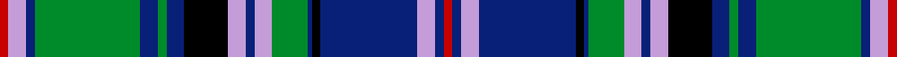

This page is one **sett** — a single exact thread-count. It belongs to the [tartan](/setts/r2lp4db2g24db4g2db4k10lp4db2lp4g8db1k2db22lp4db2r2/)
(the same proportion at any scale), whose colour order is pattern [RBWBKBGWBWKBGBGBWR](/stripes/rbwbkbgwbwkbgbgbwr/).

Sourced from tartans-authority.  It is a [18 stripe tartan](/stripes/stripes18/).

Original link http://www.tartansauthority.com/tartan-ferret/display/74/

## Register references

External register numbers recorded for this tartan.

- Scottish Tartans Authority (ITI): 74

## Thread count
R/4 LP8 DB4 G48 DB8 G4 DB8 K20 LP8 DB4 LP8 G16 DB2 K4 DB44 LP8 DB4 R/4

One full sett is **404 threads**.

## Palette
<table><thead><tr><th>Colour</th><th>Shade</th><th>OKLCh</th></tr></thead><tbody><tr><td>DB</td><td><code style="background-color:#082077;">#082077</code> <small style="color:#888">#082077</small></td><td><small style="color:#888">oklch(30.0% 0.149 265.1)</small></td></tr><tr><td>G</td><td><code style="background-color:#008B2A;">#008B2A</code> <small style="color:#888">#008B2A</small></td><td><small style="color:#888">oklch(55.4% 0.170 145.9)</small></td></tr><tr><td>K</td><td><code style="background-color:#000000;">#000000</code> <small style="color:#888">#000000</small></td><td><small style="color:#888">oklch(0.0% 0.000 0.0)</small></td></tr><tr><td>LP</td><td><code style="background-color:#C49CD8;">#C49CD8</code> <small style="color:#888">#C49CD8</small></td><td><small style="color:#888">oklch(75.0% 0.095 314.2)</small></td></tr><tr><td>R</td><td><code style="background-color:#C80000;">#C80000</code> <small style="color:#888">#C80000</small></td><td><small style="color:#888">oklch(52.3% 0.215 29.2)</small></td></tr></tbody></table>

# Sample pattern

## Nearest variants

The nearest existing variants by ΔTartan distance, with this cloth at the top so the swatches line up against it.

ΔTartan

Threads

Variant

Sett

—

404

<a href="/variants/s18/r2lp4db2g24db4g2db4k10lp4db2lp4g8db1k2db22lp4db2r2~x2~r2109032-lp3004317/">Couper of Gogar (Clan)</a>

<a href="/ttd/edit/#slug=db2lp4r2g24db4g2db4k10lp4db2lp4g8db1k1db22lp4db2r2~x2&amp;base=r2lp4db2g24db4g2db4k10lp4db2lp4g8db1k2db22lp4db2r2~x2~r2109032-lp3004317" title="compare in the TTD">2.02</a>

400

<a href="/variants/s18/db2lp4r2g24db4g2db4k10lp4db2lp4g8db1k1db22lp4db2r2~x2/">Couper of Gogar</a>

## Neighbour map

Every grey dot is one of 13620 variants placed by the first two principal components of the ΔTartan feature space (42% of its variance). Red is this tartan; blue dots are its nearest — click one to open its page.

<svg viewBox="0 0 640 380" role="img" style="max-width:100%;height:auto;border:1px solid #e0e0e0;border-radius:4px;display:block" xmlns="http://www.w3.org/2000/svg"><image href="/nn/cloud.v1.png" width="640" height="380"/><a href="/variants/s18/db2lp4r2g24db4g2db4k10lp4db2lp4g8db1k1db22lp4db2r2~x2/"><circle cx="158.2" cy="88.8" r="4" fill="#3465a4"><title>Couper of Gogar</title></circle></a><circle cx="158.8" cy="91.5" r="5" fill="#c00000"/><text x="320" y="376" text-anchor="middle" font-size="11" fill="#999">ground</text><text x="11" y="190" text-anchor="middle" font-size="11" fill="#999" transform="rotate(-90 11 190)">complexity</text></svg>

ID: /variants/s18/r2lp4db2g24db4g2db4k10lp4db2lp4g8db1k2db22lp4db2r2~x2~r2109032-lp3004317/
