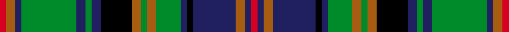

This page is one **sett** — a single exact thread-count. It belongs to the [tartan](/setts/r2o3db2g18db3g2db3k10o3g2o3g8db2k2db14o3db2r2/)
(the same proportion at any scale), whose colour order is pattern [RBRBKBGRGRKBGBGBRR](/stripes/rbrbkbgrgrkbgbgbrr/).

Sourced from register-of-tartans.  It is a [18 stripe tartan](/stripes/stripes18/).

Original link https://www.tartanregister.gov.uk/tartanDetails.aspx?ref=754

## Register references

External register numbers recorded for this tartan.

- Scottish Register of Tartans: [754](https://www.tartanregister.gov.uk/tartanDetails.aspx?ref=754)
- Scottish Tartans Authority (ITI): 1415
- Scottish Tartans World Register: 1415

## Thread count
R/4 O6 DB4 G36 DB6 G4 DB6 K20 O6 G4 O6 G16 DB4 K4 DB28 O6 DB4 R/4

One full sett is **328 threads**.

## Palette
<table><thead><tr><th>Colour</th><th>Shade</th><th>OKLCh</th></tr></thead><tbody><tr><td>DB</td><td><code style="background-color:#1C0070;">#1C0070</code> <small style="color:#888">#1C0070</small></td><td><small style="color:#888">oklch(26.3% 0.162 277.1)</small></td></tr><tr><td>DB</td><td><code style="background-color:#2C2C80;">#2C2C80</code> <small style="color:#888">#2C2C80</small></td><td><small style="color:#888">oklch(35.0% 0.138 276.6)</small></td></tr><tr><td>DB</td><td><code style="background-color:#202060;">#202060</code> <small style="color:#888">#202060</small></td><td><small style="color:#888">oklch(28.9% 0.111 276.9)</small></td></tr><tr><td>DR</td><td><code style="background-color:#55120C;">#55120C</code> <small style="color:#888">#55120C</small></td><td><small style="color:#888">oklch(30.0% 0.099 29.3)</small></td></tr><tr><td>G</td><td><code style="background-color:#008B2A;">#008B2A</code> <small style="color:#888">#008B2A</small></td><td><small style="color:#888">oklch(55.4% 0.170 145.9)</small></td></tr><tr><td>K</td><td><code style="background-color:#000000;">#000000</code> <small style="color:#888">#000000</small></td><td><small style="color:#888">oklch(0.0% 0.000 0.0)</small></td></tr><tr><td>DP</td><td><code style="background-color:#4B0B4F;">#4B0B4F</code> <small style="color:#888">#4B0B4F</small></td><td><small style="color:#888">oklch(30.1% 0.125 325.4)</small></td></tr><tr><td>O</td><td><code style="background-color:#A65C11;">#A65C11</code> <small style="color:#888">#A65C11</small></td><td><small style="color:#888">oklch(55.0% 0.125 58.3)</small></td></tr><tr><td>R</td><td><code style="background-color:#D60020;">#D60020</code> <small style="color:#888">#D60020</small></td><td><small style="color:#888">oklch(55.2% 0.224 25.5)</small></td></tr></tbody></table>

# Sample pattern

## Nearest variants

The nearest existing variants by ΔTartan distance, with this cloth at the top so the swatches line up against it.

ΔTartan

Threads

Variant

Sett

—

328

<a href="/variants/s18/r2o3db2g18db3g2db3k10o3g2o3g8db2k2db14o3db2r2~x2~db1204274/">Cooper/Couper (James Cant)</a>

<a href="/ttd/edit/#slug=r2o3db2g18db3g2db3k10o3g2o3g8db2k2db14o3db2r2~x2&amp;base=r2o3db2g18db3g2db3k10o3g2o3g8db2k2db14o3db2r2~x2~db1204274" title="compare in the TTD">0.00</a>

328

<a href="/variants/s18/r2o3db2g18db3g2db3k10o3g2o3g8db2k2db14o3db2r2~x2/">Cooper (Clan)</a>

## Neighbour map

Every grey dot is one of 13620 variants placed by the first two principal components of the ΔTartan feature space (42% of its variance). Red is this tartan; blue dots are its nearest — click one to open its page.

<svg viewBox="0 0 640 380" role="img" style="max-width:100%;height:auto;border:1px solid #e0e0e0;border-radius:4px;display:block" xmlns="http://www.w3.org/2000/svg"><image href="/nn/cloud.v1.png" width="640" height="380"/><a href="/variants/s18/r2o3db2g18db3g2db3k10o3g2o3g8db2k2db14o3db2r2~x2/"><circle cx="117.3" cy="135.8" r="4" fill="#3465a4"><title>Cooper (Clan)</title></circle></a><circle cx="120.7" cy="135.8" r="5" fill="#c00000"/><text x="320" y="376" text-anchor="middle" font-size="11" fill="#999">ground</text><text x="11" y="190" text-anchor="middle" font-size="11" fill="#999" transform="rotate(-90 11 190)">complexity</text></svg>

ID: /variants/s18/r2o3db2g18db3g2db3k10o3g2o3g8db2k2db14o3db2r2~x2~db1204274/
