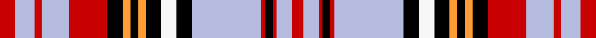
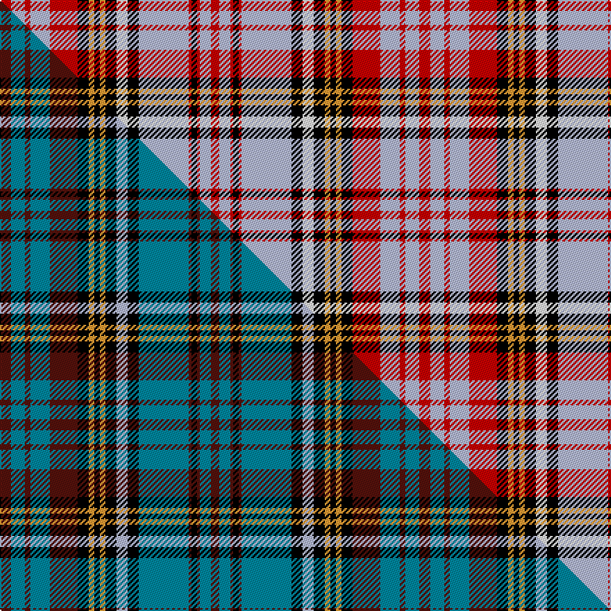

This is one **variant** — a specific cloth: this exact thread count and colourway, with its own
provenance below. It is one weaving of the [sett](/tartans/a/an/anderson-2/) (the scale-free proportion — the
same cloth at any scale or shade), whose colour order is pattern [RWRKRWKWKYKYKRWRWR](/stripes/rwrkrwkwkykykrwrwr/).

Part of the [Anderson](/tartans/a/an/anderson-2/) tartan — the named design grouping this sett with its other cloths.

Sourced from register-of-tartans.  It is a [18 stripe tartan](/stripes/stripes18/).

Original link [https://www.tartanregister.gov.uk/tartanDetails.aspx?ref=5145](https://www.tartanregister.gov.uk/tartanDetails.aspx?ref=5145)

Dataset <small>— provenance for this record, inherited from the source manifest</small>

<dl class="dataset-prov">
<dt>source</dt><dd><a href="/sources/register-of-tartans/">Scottish Register of Tartans</a></dd>
<dt>data captured from</dt><dd><a href="https://github.com/thetartan/tartan-database/blob/master/data/register-of-tartans/data.csv">https://github.com/thetartan/tartan-database/blob/master/data/register-of-tartans/data.csv</a></dd>
<dt>data date</dt><dd>2017-01-06 <small>(dataset default)</small></dd>
<dt>licence</dt><dd><a href="https://www.tartanregister.gov.uk/copyright">Crown copyright</a></dd>
</dl>

Capture chain <small>— the hands this data passed through, oldest first; each capture carries its own licence</small>

<ol class="capture-chain">
<li><a href="https://www.tartanregister.gov.uk/">Scottish Register of Tartans</a> · <a href="https://www.tartanregister.gov.uk/copyright">Crown copyright</a> <small>the living register — still published by National Records of Scotland</small></li>
<li><a href="https://github.com/thetartan/tartan-database">thetartan/tartan-database</a> <small>2016-2017</small> · <a href="https://creativecommons.org/licenses/by-nc-nd/4.0/">CC BY-NC-ND 4.0</a> <small>Levko Kravets's frozen compilation — the capture we vendored, and where its CC licence text came from</small></li>
<li>this dictionary <small>captured 2026-06-10 · commit 5bf86c7566</small> <small>each re-capture is a git commit to data/sources</small></li>
</ol>

## Register references

External register numbers recorded for this tartan.

- Scottish Register of Tartans: [5145](https://www.tartanregister.gov.uk/tartanDetails.aspx?ref=5145)
- Scottish Tartans Authority (ITI): 3448

## Thread count
R/8 LB10 R4 LB14 R20 K8 LO4 K4 LO4 K8 W8 K8 LB36 R2 K4 R2 LB8 R/6

One full sett is **302 threads**.

## Palette
<table><thead><tr><th>Colour</th><th>Shade</th><th>OKLCh</th></tr></thead><tbody><tr><td>LG</td><td><code style="background-color:#82D67A;">#82D67A</code> <small style="color:#888">#82D67A</small></td><td><small style="color:#888">oklch(80.1% 0.150 142.2)</small></td></tr><tr><td>LB</td><td><code style="background-color:#B5BBDE;">#B5BBDE</code> <small style="color:#888">#B5BBDE</small></td><td><small style="color:#888">oklch(79.9% 0.050 277.6)</small></td></tr><tr><td>DB</td><td><code style="background-color:#082077;">#082077</code> <small style="color:#888">#082077</small></td><td><small style="color:#888">oklch(30.0% 0.149 265.1)</small></td></tr><tr><td>DR</td><td><code style="background-color:#55120C;">#55120C</code> <small style="color:#888">#55120C</small></td><td><small style="color:#888">oklch(30.0% 0.099 29.3)</small></td></tr><tr><td>LO</td><td><code style="background-color:#FF9C34;">#FF9C34</code> <small style="color:#888">#FF9C34</small></td><td><small style="color:#888">oklch(77.9% 0.161 61.8)</small></td></tr><tr><td>K</td><td><code style="background-color:#000000;">#000000</code> <small style="color:#888">#000000</small></td><td><small style="color:#888">oklch(0.0% 0.000 0.0)</small></td></tr><tr><td>W</td><td><code style="background-color:#F7F7F7;">#F7F7F7</code> <small style="color:#888">#F7F7F7</small></td><td><small style="color:#888">oklch(97.6% 0.000 89.9)</small></td></tr><tr><td>LR</td><td><code style="background-color:#FF9C97;">#FF9C97</code> <small style="color:#888">#FF9C97</small></td><td><small style="color:#888">oklch(79.3% 0.119 23.2)</small></td></tr><tr><td>R</td><td><code style="background-color:#A00048;">#A00048</code> <small style="color:#888">#A00048</small></td><td><small style="color:#888">oklch(45.4% 0.182 5.3)</small></td></tr><tr><td>R</td><td><code style="background-color:#C80000;">#C80000</code> <small style="color:#888">#C80000</small></td><td><small style="color:#888">oklch(52.3% 0.215 29.2)</small></td></tr></tbody></table>

# Sample pattern

## Compared to the master

This cloth is one sett of its design; the master sett (the exemplar the design is anchored on) is below for comparison.

Its **ΔTartan distance** from the master is **0.45** — the same measure the nearest-tartans table ranks by (0 is identical; a re-scale of the same cloth is near 0, a recolour or a different proportion further).

<figure class="master-compare" style="margin:0">

this sett
master sett ★

<figcaption style="color:#888;font-size:smaller">One weave of this sett against the <a href="/setts/dr4t5dr2t7dr10k4lo2k2lo2k4lb4k4t18dr1k2dr1t4dr3/">master sett ★</a>, split on the diagonal: a shared proportion runs seamlessly across it with only the shades shifting; a different proportion breaks on it.</figcaption>
</figure>

## Nearest tartan variants

The nearest existing variants by ΔTartan distance, with this cloth at the top so the swatches line up against it.

ΔTartan

Threads

Variant

Sett

—

302

<a href="/variants/s18/r4lb5r2lb7r10k4lo2k2lo2k4w4k4lb18r1k2r1lb4r3~x2~r2109032/">Anderson Red (Westwood) (Estimated threadcount)</a>

<a href="/ttd/edit/#slug=w4k1db12k1g8w2r8w2k8r16k4r8w2r1~x2&amp;base=r4lb5r2lb7r10k4lo2k2lo2k4w4k4lb18r1k2r1lb4r3~x2~r2109032" title="compare in the TTD">2.37</a>

298

<a href="/variants/s14/w4k1db12k1g8w2r8w2k8r16k4r8w2r1~x2/">Kenya</a>

<a href="/ttd/edit/#slug=r3lb7k1r2k1lb12k4w3k2r1k1r1db3r2db4r2~x2&amp;base=r4lb5r2lb7r10k4lo2k2lo2k4w4k4lb18r1k2r1lb4r3~x2~r2109032" title="compare in the TTD">2.41</a>

186

<a href="/variants/s16/r3lb7k1r2k1lb12k4w3k2r1k1r1db3r2db4r2~x2/">Royal Canadian Air Force #2</a>

<a href="/ttd/edit/#slug=db4w2r6k1db12dg4db2r6db1r6w2dg8r2w16r4~x2&amp;base=r4lb5r2lb7r10k4lo2k2lo2k4w4k4lb18r1k2r1lb4r3~x2~r2109032" title="compare in the TTD">2.49</a>

288

<a href="/variants/s15/db4w2r6k1db12dg4db2r6db1r6w2dg8r2w16r4~x2/">MacFarlane Dress</a>

<a href="/ttd/edit/#slug=db4w2r6k1db12g4w2r6db1r6w2g8r2w16r4~x2&amp;base=r4lb5r2lb7r10k4lo2k2lo2k4w4k4lb18r1k2r1lb4r3~x2~r2109032" title="compare in the TTD">2.57</a>

288

<a href="/variants/s15/db4w2r6k1db12g4w2r6db1r6w2g8r2w16r4~x2/">MacFarlane Dress Clan Tartan</a>

<a href="/ttd/edit/#slug=w9r5w29k10y2k3w3k3dg12r6k3r3w2~x2&amp;base=r4lb5r2lb7r10k4lo2k2lo2k4w4k4lb18r1k2r1lb4r3~x2~r2109032" title="compare in the TTD">2.61</a>

338

<a href="/variants/s13/w9r5w29k10y2k3w3k3dg12r6k3r3w2~x2/">Hay or Stewart</a>

<a href="/ttd/edit/#slug=r20b36r4k2lb7k4r2k2w3k2r3k4lb7k13r20~x2&amp;base=r4lb5r2lb7r10k4lo2k2lo2k4w4k4lb18r1k2r1lb4r3~x2~r2109032" title="compare in the TTD">2.73</a>

436

<a href="/variants/s15/r20b36r4k2lb7k4r2k2w3k2r3k4lb7k13r20~x2/">MacDougall 1</a>

<a href="/ttd/edit/#slug=r20ti36r4k2t7k4r2k2w3k2r3k4t7k13r20~x2~ti2607245-t2304245&amp;base=r4lb5r2lb7r10k4lo2k2lo2k4w4k4lb18r1k2r1lb4r3~x2~r2109032" title="compare in the TTD">2.74</a>

436

<a href="/variants/s15/r20ti36r4k2t7k4r2k2w3k2r3k4t7k13r20~x2~ti2607245-t2304245/">MacDougall #7</a>

<a href="/ttd/edit/#slug=lb27r4lb3r2lb4r2lb3r4lb14k14r2db14r4db4y3~x2&amp;base=r4lb5r2lb7r10k4lo2k2lo2k4w4k4lb18r1k2r1lb4r3~x2~r2109032" title="compare in the TTD">2.75</a>

356

<a href="/variants/s15/lb27r4lb3r2lb4r2lb3r4lb14k14r2db14r4db4y3~x2/">Cochrane Azure</a>

<a href="/ttd/edit/#slug=r8k3lb15k1w3k1lb8k1w3k1r19k2y2k2g2k2r2k2~x2&amp;base=r4lb5r2lb7r10k4lo2k2lo2k4w4k4lb18r1k2r1lb4r3~x2~r2109032" title="compare in the TTD">2.81</a>

288

<a href="/variants/s18/r8k3lb15k1w3k1lb8k1w3k1r19k2y2k2g2k2r2k2~x2/">Canadian Dental Association</a>

<a href="/ttd/edit/#slug=k1o4w13o1k5dp4w1dp4k5w1k3r5n3w1n3r5k13r1w20n3r1~x2&amp;base=r4lb5r2lb7r10k4lo2k2lo2k4w4k4lb18r1k2r1lb4r3~x2~r2109032" title="compare in the TTD">2.85</a>

384

<a href="/variants/s21/k1o4w13o1k5dp4w1dp4k5w1k3r5n3w1n3r5k13r1w20n3r1~x2/">Aberdeen (Johnston and Smith)</a>

## Neighbour map

Every grey dot is one of 13656 variants placed by the first two principal components of the ΔTartan feature space (42% of its variance). Red is this tartan; blue dots are its nearest — click one to open its page. The map is a flat projection of a many-dimensional space — [how to read it](/posts/neighbourhood-maps/).

<svg viewBox="0 0 640 380" role="img" style="max-width:100%;height:auto;border:1px solid #e0e0e0;border-radius:4px;display:block" xmlns="http://www.w3.org/2000/svg"><image href="/nn/cloud.v1.png" width="640" height="380"/><a href="/variants/s14/w4k1db12k1g8w2r8w2k8r16k4r8w2r1~x2/"><circle cx="132.8" cy="117.1" r="4" fill="#3465a4"><title>Kenya</title></circle></a><a href="/variants/s16/r3lb7k1r2k1lb12k4w3k2r1k1r1db3r2db4r2~x2/"><circle cx="107.1" cy="118.4" r="4" fill="#3465a4"><title>Royal Canadian Air Force #2</title></circle></a><a href="/variants/s15/db4w2r6k1db12dg4db2r6db1r6w2dg8r2w16r4~x2/"><circle cx="97.5" cy="123.4" r="4" fill="#3465a4"><title>MacFarlane Dress</title></circle></a><a href="/variants/s15/db4w2r6k1db12g4w2r6db1r6w2g8r2w16r4~x2/"><circle cx="99.2" cy="125.6" r="4" fill="#3465a4"><title>MacFarlane Dress Clan Tartan</title></circle></a><a href="/variants/s13/w9r5w29k10y2k3w3k3dg12r6k3r3w2~x2/"><circle cx="160.8" cy="108.4" r="4" fill="#3465a4"><title>Hay or Stewart</title></circle></a><a href="/variants/s15/r20b36r4k2lb7k4r2k2w3k2r3k4lb7k13r20~x2/"><circle cx="148.3" cy="92.1" r="4" fill="#3465a4"><title>MacDougall 1</title></circle></a><a href="/variants/s15/r20ti36r4k2t7k4r2k2w3k2r3k4t7k13r20~x2~ti2607245-t2304245/"><circle cx="144.6" cy="93.5" r="4" fill="#3465a4"><title>MacDougall #7</title></circle></a><a href="/variants/s15/lb27r4lb3r2lb4r2lb3r4lb14k14r2db14r4db4y3~x2/"><circle cx="175.5" cy="111.3" r="4" fill="#3465a4"><title>Cochrane Azure</title></circle></a><a href="/variants/s18/r8k3lb15k1w3k1lb8k1w3k1r19k2y2k2g2k2r2k2~x2/"><circle cx="123.6" cy="63.8" r="4" fill="#3465a4"><title>Canadian Dental Association</title></circle></a><a href="/variants/s21/k1o4w13o1k5dp4w1dp4k5w1k3r5n3w1n3r5k13r1w20n3r1~x2/"><circle cx="91.4" cy="65.5" r="4" fill="#3465a4"><title>Aberdeen (Johnston and Smith)</title></circle></a><circle cx="147.9" cy="99.9" r="5" fill="#c00000"/><text x="320" y="376" text-anchor="middle" font-size="11" fill="#999">ground</text><text x="11" y="190" text-anchor="middle" font-size="11" fill="#999" transform="rotate(-90 11 190)">complexity</text></svg>

ID: /variants/s18/r4lb5r2lb7r10k4lo2k2lo2k4w4k4lb18r1k2r1lb4r3~x2~r2109032/
