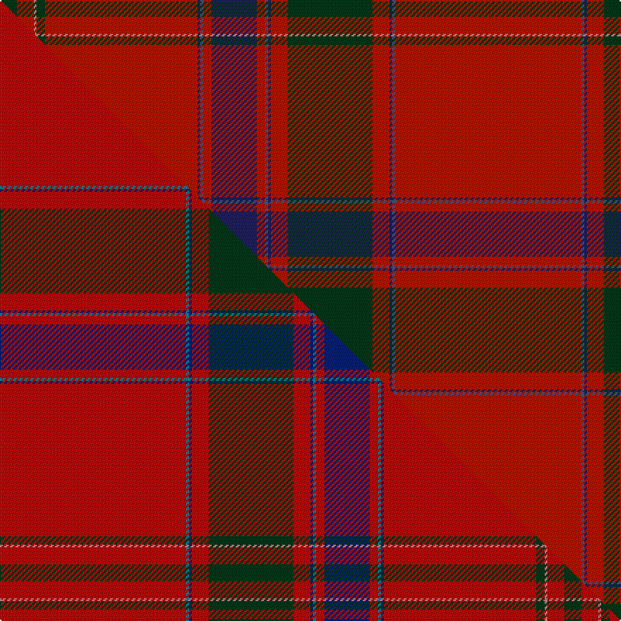

This page is one **sett** — a single exact thread-count. It belongs to the [tartan](/setts/r66n1db1r6dg30r6db1n1r3db16r3n1db1r54dg3o1r6dg6/)
(the same proportion at any scale), whose colour order is pattern [GRRGRBBRBRBBRGRBBRBBRGRBBRBRBBRGRR](/stripes/grrgrbbrbrbbrgrbbrbbrgrbbrbrbbrgrr/).

Part of the [Ramada](/tartans/ramada/) tartan — the named design grouping this sett with its other cloths.

Sourced from house-of-tartan.  It is a [34 stripe tartan](/stripes/stripes34/).

Original link http://www.house-of-tartan.scotland.net/house/TartanViewjs.asp?colr=Def&tnam=6374

## Provenance

Earliest known date: 2004 Re-created from an artifact in the Telfer Dunbar collection at the Scottish Tartans Museum. The unusual bleaching effect that has occurred either by design or by age, has been enhanced in this new design. It is a feature often seen in silk fabrics over 200 years old.

## Thread count
DG/12 R12 O2 DG6 R108 DB2 N2 R6 DB32 R6 N2 DB2 R12 DG60 R12 DB2 N2 R132 N2 DB2 R12 DG60 R12 DB2 N2 R6 DB32 R6 N2 DB2 R108 DG6 O2 R/12

One full sett is **1336 threads**.

## Palette
<table><thead><tr><th>Colour</th><th>Shade</th><th>OKLCh</th></tr></thead><tbody><tr><td>DB</td><td><code style="background-color:#202060;">#202060</code> <small style="color:#888">#202060</small></td><td><small style="color:#888">oklch(28.9% 0.111 276.9)</small></td></tr><tr><td>DG</td><td><code style="background-color:#053819;">#053819</code> <small style="color:#888">#053819</small></td><td><small style="color:#888">oklch(30.0% 0.075 151.3)</small></td></tr><tr><td>G</td><td><code style="background-color:#008B2A;">#008B2A</code> <small style="color:#888">#008B2A</small></td><td><small style="color:#888">oklch(55.4% 0.170 145.9)</small></td></tr><tr><td>K</td><td><code style="background-color:#000000;">#000000</code> <small style="color:#888">#000000</small></td><td><small style="color:#888">oklch(0.0% 0.000 0.0)</small></td></tr><tr><td>O</td><td><code style="background-color:#D07878;">#D07878</code> <small style="color:#888">#D07878</small></td><td><small style="color:#888">oklch(66.9% 0.110 20.4)</small></td></tr><tr><td>N</td><td><code style="background-color:#50507C;">#50507C</code> <small style="color:#888">#50507C</small></td><td><small style="color:#888">oklch(45.1% 0.071 283.2)</small></td></tr><tr><td>R</td><td><code style="background-color:#B81400;">#B81400</code> <small style="color:#888">#B81400</small></td><td><small style="color:#888">oklch(49.8% 0.196 30.7)</small></td></tr></tbody></table>

# Sample pattern

## Compared to the master

This cloth is one sett of its design; the master sett (the exemplar the design is anchored on) is below for comparison.

Its **ΔTartan distance** from the master is **0.03** — the same measure the nearest-tartans table ranks by (0 is identical; a re-scale of the same cloth is near 0, a recolour or a different proportion further).

<figure class="master-compare" style="margin:0">

this sett
master sett ★

<figcaption style="color:#888;font-size:smaller">One weave of this sett against the <a href="/setts/r66t1db1r6dg30r6db1t1r3db16r3t1db1r54dg3o1r6dg6/">master sett ★</a>, split on the diagonal: a shared proportion runs seamlessly across it with only the shades shifting; a different proportion breaks on it.</figcaption>
</figure>

## Nearest tartan variants

The nearest existing variants by ΔTartan distance, with this cloth at the top so the swatches line up against it.

ΔTartan

Threads

Variant

Sett

—

1336

<a href="/variants/s18/r66n1db1r6dg30r6db1n1r3db16r3n1db1r54dg3o1r6dg6~x2~r2008029-n1803284-db1204274-o2704014/">Ramada Corporate Tartan</a>

<a href="/ttd/edit/#slug=r66t1db1r6dg30r6db1t1r3db16r3t1db1r54dg3o1r6dg6~x2~r2008029-o2704014&amp;base=r66n1db1r6dg30r6db1n1r3db16r3n1db1r54dg3o1r6dg6~x2~r2008029-n1803284-db1204274-o2704014" title="compare in the TTD">0.02</a>

680

<a href="/variants/s18/r66t1db1r6dg30r6db1t1r3db16r3t1db1r54dg3o1r6dg6~x2~r2008029-o2704014/">Ramada</a>

<a href="/ttd/edit/#slug=r66n1db1r6g30r6db1n1r3db16r3n1db1r54g3b1r6g6~x2~n1604274-db0805267&amp;base=r66n1db1r6dg30r6db1n1r3db16r3n1db1r54dg3o1r6dg6~x2~r2008029-n1803284-db1204274-o2704014" title="compare in the TTD">0.41</a>

680

<a href="/variants/s18/r66dbi1db1r6g30r6db1dbi1r3db16r3dbi1db1r54g3b1r6g6~x2~dbi1604274-db0805267/">Unidentified 8</a>

<a href="/ttd/edit/#slug=r40w2db1r3g31r3db1w2r3db8r3w2db1r34g4r4g4~x2&amp;base=r66n1db1r6dg30r6db1n1r3db16r3n1db1r54dg3o1r6dg6~x2~r2008029-n1803284-db1204274-o2704014" title="compare in the TTD">1.81</a>

496

<a href="/variants/s17/r40w2db1r3g31r3db1w2r3db8r3w2db1r34g4r4g4~x2/">Dalziel #1</a>

<a href="/ttd/edit/#slug=r24y1db1r3g16r3db1y1r3db6r3y1db1r16g2r2g2~x2&amp;base=r66n1db1r6dg30r6db1n1r3db16r3n1db1r54dg3o1r6dg6~x2~r2008029-n1803284-db1204274-o2704014" title="compare in the TTD">1.89</a>

292

<a href="/variants/s17/r24y1db1r3g16r3db1y1r3db6r3y1db1r16g2r2g2~x2/">Munro</a>

<a href="/ttd/edit/#slug=r24w1db2r4g32r4db2w1r4db6r4w1db2r32g2r3g6~x2&amp;base=r66n1db1r6dg30r6db1n1r3db16r3n1db1r54dg3o1r6dg6~x2~r2008029-n1803284-db1204274-o2704014" title="compare in the TTD">1.99</a>

460

<a href="/variants/s17/r24w1db2r4g32r4db2w1r4db6r4w1db2r32g2r3g6~x2/">Dalzell</a>

<a href="/ttd/edit/#slug=r19y1db1r2g18r2db1y1r2db4r2y1db1r19g2r2g2~x2&amp;base=r66n1db1r6dg30r6db1n1r3db16r3n1db1r54dg3o1r6dg6~x2~r2008029-n1803284-db1204274-o2704014" title="compare in the TTD">2.01</a>

278

<a href="/variants/s17/r19y1db1r2g18r2db1y1r2db4r2y1db1r19g2r2g2~x2/">Munro (Logan)</a>

<a href="/ttd/edit/#slug=r24y1db1r3g16r3db1y1r3db6r3y1db1r16g2o2g2~x4~r2109032-o2307033&amp;base=r66n1db1r6dg30r6db1n1r3db16r3n1db1r54dg3o1r6dg6~x2~r2008029-n1803284-db1204274-o2704014" title="compare in the TTD">3.08</a>

584

<a href="/variants/s17/r24y1db1r3g16r3db1y1r3db6r3y1db1r16g2ri2g2~x4~r2109032-ri2307033/">Munro</a>

<a href="/ttd/edit/#slug=r36ly2db1r3g41r3db1ly2r3db12r3ly2db1r36g3o3g4~x2~r2109032-o2307033&amp;base=r66n1db1r6dg30r6db1n1r3db16r3n1db1r54dg3o1r6dg6~x2~r2008029-n1803284-db1204274-o2704014" title="compare in the TTD">3.32</a>

544

<a href="/variants/s17/r36ly2db1r3g41r3db1ly2r3db12r3ly2db1r36g3ri3g4~x2~r2109032-ri2307033/">Munro (Clan)</a>

<a href="/ttd/edit/#slug=r66n8r4dt2r1ly2r3dt4r4ly1dt1r8dt2n8dt2r8dt2r1ly2r3dt4r4ly1dt1r4n8~x2~dt0900000&amp;base=r66n1db1r6dg30r6db1n1r3db16r3n1db1r54dg3o1r6dg6~x2~r2008029-n1803284-db1204274-o2704014" title="compare in the TTD">3.53</a>

468

<a href="/variants/s26/r66n8r4dt2r1ly2r3dt4r4ly1dt1r8dt2n8dt2r8dt2r1ly2r3dt4r4ly1dt1r4n8~x2~dt0900000/">Fontainbleu</a>

## Neighbour map

Every grey dot is one of 13620 variants placed by the first two principal components of the ΔTartan feature space (42% of its variance). Red is this tartan; blue dots are its nearest — click one to open its page.

<svg viewBox="0 0 640 380" role="img" style="max-width:100%;height:auto;border:1px solid #e0e0e0;border-radius:4px;display:block" xmlns="http://www.w3.org/2000/svg"><image href="/nn/cloud.v1.png" width="640" height="380"/><a href="/variants/s18/r66t1db1r6dg30r6db1t1r3db16r3t1db1r54dg3o1r6dg6~x2~r2008029-o2704014/"><circle cx="487.4" cy="49.9" r="4" fill="#3465a4"><title>Ramada</title></circle></a><a href="/variants/s18/r66dbi1db1r6g30r6db1dbi1r3db16r3dbi1db1r54g3b1r6g6~x2~dbi1604274-db0805267/"><circle cx="455.7" cy="39.8" r="4" fill="#3465a4"><title>Unidentified 8</title></circle></a><a href="/variants/s17/r40w2db1r3g31r3db1w2r3db8r3w2db1r34g4r4g4~x2/"><circle cx="401.2" cy="74.7" r="4" fill="#3465a4"><title>Dalziel #1</title></circle></a><a href="/variants/s17/r24y1db1r3g16r3db1y1r3db6r3y1db1r16g2r2g2~x2/"><circle cx="399.1" cy="104.3" r="4" fill="#3465a4"><title>Munro</title></circle></a><a href="/variants/s17/r24w1db2r4g32r4db2w1r4db6r4w1db2r32g2r3g6~x2/"><circle cx="370.7" cy="90.6" r="4" fill="#3465a4"><title>Dalzell</title></circle></a><a href="/variants/s17/r19y1db1r2g18r2db1y1r2db4r2y1db1r19g2r2g2~x2/"><circle cx="381.2" cy="111.0" r="4" fill="#3465a4"><title>Munro (Logan)</title></circle></a><a href="/variants/s17/r24y1db1r3g16r3db1y1r3db6r3y1db1r16g2ri2g2~x4~r2109032-ri2307033/"><circle cx="374.7" cy="95.7" r="4" fill="#3465a4"><title>Munro</title></circle></a><a href="/variants/s17/r36ly2db1r3g41r3db1ly2r3db12r3ly2db1r36g3ri3g4~x2~r2109032-ri2307033/"><circle cx="350.2" cy="67.6" r="4" fill="#3465a4"><title>Munro (Clan)</title></circle></a><a href="/variants/s26/r66n8r4dt2r1ly2r3dt4r4ly1dt1r8dt2n8dt2r8dt2r1ly2r3dt4r4ly1dt1r4n8~x2~dt0900000/"><circle cx="505.8" cy="34.9" r="4" fill="#3465a4"><title>Fontainbleu</title></circle></a><circle cx="447.2" cy="27.2" r="5" fill="#c00000"/><text x="320" y="376" text-anchor="middle" font-size="11" fill="#999">ground</text><text x="11" y="190" text-anchor="middle" font-size="11" fill="#999" transform="rotate(-90 11 190)">complexity</text></svg>

ID: /variants/s18/r66n1db1r6dg30r6db1n1r3db16r3n1db1r54dg3o1r6dg6~x2~r2008029-n1803284-db1204274-o2704014/
