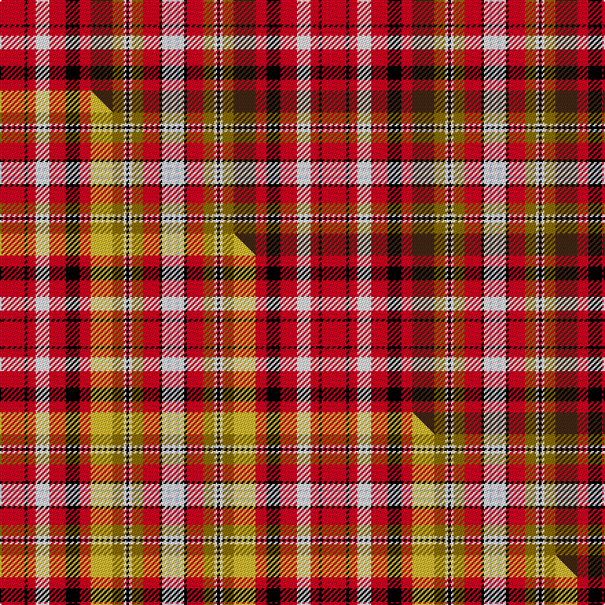

This is one **variant** — a specific cloth: this exact thread count and colourway, with its own
provenance below. It is one weaving of the [sett](/tartans/j/ja/jacobite-old-sett/) (the scale-free proportion — the
same cloth at any scale or shade), whose colour order is pattern [RKRWRKRBGWKWGRKWWW](/stripes/rkrwrkrbgwkwgrkwww/).

Part of the [Jacobite Old Sett](/tartans/j/ja/jacobite-old-sett/) tartan — the named design grouping this sett with its other cloths.

Sourced from weddslist.  It is a [18 stripe tartan](/stripes/stripes18/).

Original link [http://www.weddslist.com/cgi-bin/tartans/pg.pl?source=sts](http://www.weddslist.com/cgi-bin/tartans/pg.pl?source=sts)

Dataset <small>— provenance for this record, inherited from the source manifest</small>

<dl class="dataset-prov">
<dt>source</dt><dd><a href="/sources/weddslist/">Weddslist</a></dd>
<dt>data captured from</dt><dd><a href="https://github.com/thetartan/tartan-database/blob/master/data/weddslist/data.csv">https://github.com/thetartan/tartan-database/blob/master/data/weddslist/data.csv</a></dd>
<dt>data date</dt><dd>2016-11-17 <small>(dataset default)</small></dd>
<dt>licence</dt><dd><a href="https://creativecommons.org/licenses/by-nc-nd/4.0/">CC BY-NC-ND 4.0</a></dd>
</dl>

Capture chain <small>— the hands this data passed through, oldest first; each capture carries its own licence</small>

<ol class="capture-chain">
<li><a href="https://www.weddslist.com/tartans/">Weddslist</a> <small>the living privately compiled reference</small></li>
<li><a href="https://github.com/thetartan/tartan-database">thetartan/tartan-database</a> <small>2016-2017</small> · <a href="https://creativecommons.org/licenses/by-nc-nd/4.0/">CC BY-NC-ND 4.0</a> <small>Levko Kravets's frozen compilation — the capture we vendored, and where its CC licence text came from</small></li>
<li>this dictionary <small>captured 2026-06-10 · commit 5bf86c7566</small> <small>each re-capture is a git commit to data/sources</small></li>
</ol>

## Thread count
R/18 K2 R6 W10 R12 K10 R8 DO16 Y8 W2 K2 W2 Y8 R12 K2 W4 LB2 W/4

One full sett is **234 threads**.

## Palette
<table><thead><tr><th>Colour</th><th>Shade</th><th>OKLCh</th></tr></thead><tbody><tr><td>LB</td><td><code style="background-color:#B5BBDE;">#B5BBDE</code> <small style="color:#888">#B5BBDE</small></td><td><small style="color:#888">oklch(79.9% 0.050 277.6)</small></td></tr><tr><td>DO</td><td><code style="background-color:#412714;">#412714</code> <small style="color:#888">#412714</small></td><td><small style="color:#888">oklch(30.1% 0.050 55.7)</small></td></tr><tr><td>K</td><td><code style="background-color:#000000;">#000000</code> <small style="color:#888">#000000</small></td><td><small style="color:#888">oklch(0.0% 0.000 0.0)</small></td></tr><tr><td>W</td><td><code style="background-color:#F7F7F7;">#F7F7F7</code> <small style="color:#888">#F7F7F7</small></td><td><small style="color:#888">oklch(97.6% 0.000 89.9)</small></td></tr><tr><td>R</td><td><code style="background-color:#D60020;">#D60020</code> <small style="color:#888">#D60020</small></td><td><small style="color:#888">oklch(55.2% 0.224 25.5)</small></td></tr><tr><td>Y</td><td><code style="background-color:#8B6E00;">#8B6E00</code> <small style="color:#888">#8B6E00</small></td><td><small style="color:#888">oklch(55.1% 0.113 90.4)</small></td></tr></tbody></table>

# Sample pattern

## Compared to the master

This cloth is one sett of its design; the master sett (the exemplar the design is anchored on) is below for comparison.

Its **ΔTartan distance** from the master is **0.30** — the same measure the nearest-tartans table ranks by (0 is identical; a re-scale of the same cloth is near 0, a recolour or a different proportion further).

<figure class="master-compare" style="margin:0">

this sett
master sett ★

<figcaption style="color:#888;font-size:smaller">One weave of this sett against the <a href="/setts/r9k1r3w5r6k5r4ly8y4w1k1w1y4r6k1w2lb1w2/">master sett ★</a>, split on the diagonal: a shared proportion runs seamlessly across it with only the shades shifting; a different proportion breaks on it.</figcaption>
</figure>

## Nearest tartan variants

The nearest existing variants by ΔTartan distance, with this cloth at the top so the swatches line up against it.

ΔTartan

Threads

Variant

Sett

—

234

<a href="/variants/s18/r9k1r3w5r6k5r4do8y4w1k1w1y4r6k1w2lb1w2~x2/">Jacobite, Old sett</a>

<a href="/ttd/edit/#slug=r9k1r3w5r6k5r4ly8y4w1k1w1y4r6k1w2lb1w2~x2&amp;base=r9k1r3w5r6k5r4do8y4w1k1w1y4r6k1w2lb1w2~x2" title="compare in the TTD">0.30</a>

234

<a href="/variants/s18/r9k1r3w5r6k5r4ly8y4w1k1w1y4r6k1w2lb1w2~x2/">Jacobite Old Sett</a>

<a href="/ttd/edit/#slug=dr11k4dr6w8dr16k13dr4ly12y6w2k3w2y6dr7k4w3lb3w2~x2&amp;base=r9k1r3w5r6k5r4do8y4w1k1w1y4r6k1w2lb1w2~x2" title="compare in the TTD">0.86</a>

422

<a href="/variants/s18/dr11k4dr6w8dr16k13dr4ly12y6w2k3w2y6dr7k4w3lb3w2~x2/">Jacobite Old Sett (Artefact)</a>

<a href="/ttd/edit/#slug=r14lb3r12g16y2k11lb7k2lb2k2lb7r12w3k3r4~x2&amp;base=r9k1r3w5r6k5r4do8y4w1k1w1y4r6k1w2lb1w2~x2" title="compare in the TTD">1.66</a>

364

<a href="/variants/s15/r14lb3r12g16y2k11lb7k2lb2k2lb7r12w3k3r4~x2/">Kidd</a>

<a href="/ttd/edit/#slug=r21lb9k2lb2k2lb9k18y3g21r13k3r13w2r13~x2&amp;base=r9k1r3w5r6k5r4do8y4w1k1w1y4r6k1w2lb1w2~x2" title="compare in the TTD">1.81</a>

456

<a href="/variants/s14/r21lb9k2lb2k2lb9k18y3g21r13k3r13w2r13~x2/">Caledonia No 155 District Tartan</a>

<a href="/ttd/edit/#slug=r18lb5r18g24y3k19lb10k3lb3k3lb10r18w4k5r5~x2&amp;base=r9k1r3w5r6k5r4do8y4w1k1w1y4r6k1w2lb1w2~x2" title="compare in the TTD">1.98</a>

546

<a href="/variants/s15/r18lb5r18g24y3k19lb10k3lb3k3lb10r18w4k5r5~x2/">MacPherson #5</a>

<a href="/ttd/edit/#slug=r21lt9k2lt2k2lt9k18ly3g21r13k3r13w2r13~x2&amp;base=r9k1r3w5r6k5r4do8y4w1k1w1y4r6k1w2lb1w2~x2" title="compare in the TTD">2.20</a>

456

<a href="/variants/s14/r21lt9k2lt2k2lt9k18ly3g21r13k3r13w2r13~x2/">Caledonian Cameron Commando</a>

<a href="/ttd/edit/#slug=r8db2k1db3k4y1k1w1k1g8r6w1r6~x4&amp;base=r9k1r3w5r6k5r4do8y4w1k1w1y4r6k1w2lb1w2~x2" title="compare in the TTD">2.53</a>

288

<a href="/variants/s13/r8db2k1db3k4y1k1w1k1g8r6w1r6~x4/">Christie Family Tartan</a>

<a href="/ttd/edit/#slug=r21db9k2db2k2db9k18y3g21r13k3r13w2r13~x2&amp;base=r9k1r3w5r6k5r4do8y4w1k1w1y4r6k1w2lb1w2~x2" title="compare in the TTD">2.68</a>

456

<a href="/variants/s14/r21db9k2db2k2db9k18y3g21r13k3r13w2r13~x2/">Caledonia</a>

<a href="/ttd/edit/#slug=k2r14lb8k9y1k2w2k2g10r15k4r12w2~x2&amp;base=r9k1r3w5r6k5r4do8y4w1k1w1y4r6k1w2lb1w2~x2" title="compare in the TTD">2.86</a>

324

<a href="/variants/s13/k2r14lb8k9y1k2w2k2g10r15k4r12w2~x2/">Harden (Name)</a>

<a href="/ttd/edit/#slug=r14lb8k9y1k2w2k2g10r15k4r12w2r12k4r15g10k2w2k2y1k9lb8r14k2~x2&amp;base=r9k1r3w5r6k5r4do8y4w1k1w1y4r6k1w2lb1w2~x2" title="compare in the TTD">2.87</a>

616

<a href="/variants/s24/r14lb8k9y1k2w2k2g10r15k4r12w2r12k4r15g10k2w2k2y1k9lb8r14k2~x2/">Wilson's No.001</a>

## Neighbour map

Every grey dot is one of 13657 variants placed by the first two principal components of the ΔTartan feature space (42% of its variance). Red is this tartan; blue dots are its nearest — click one to open its page. The map is a flat projection of a many-dimensional space — [how to read it](/posts/neighbourhood-maps/).

<svg viewBox="0 0 640 380" role="img" style="max-width:100%;height:auto;border:1px solid #e0e0e0;border-radius:4px;display:block" xmlns="http://www.w3.org/2000/svg"><image href="/nn/cloud.v1.png" width="640" height="380"/><a href="/variants/s18/r9k1r3w5r6k5r4ly8y4w1k1w1y4r6k1w2lb1w2~x2/"><circle cx="95.7" cy="128.2" r="4" fill="#3465a4"><title>Jacobite Old Sett</title></circle></a><a href="/variants/s18/dr11k4dr6w8dr16k13dr4ly12y6w2k3w2y6dr7k4w3lb3w2~x2/"><circle cx="61.2" cy="142.8" r="4" fill="#3465a4"><title>Jacobite Old Sett (Artefact)</title></circle></a><a href="/variants/s15/r14lb3r12g16y2k11lb7k2lb2k2lb7r12w3k3r4~x2/"><circle cx="91.4" cy="137.9" r="4" fill="#3465a4"><title>Kidd</title></circle></a><a href="/variants/s14/r21lb9k2lb2k2lb9k18y3g21r13k3r13w2r13~x2/"><circle cx="124.8" cy="127.4" r="4" fill="#3465a4"><title>Caledonia No 155 District Tartan</title></circle></a><a href="/variants/s15/r18lb5r18g24y3k19lb10k3lb3k3lb10r18w4k5r5~x2/"><circle cx="80.0" cy="137.8" r="4" fill="#3465a4"><title>MacPherson #5</title></circle></a><a href="/variants/s14/r21lt9k2lt2k2lt9k18ly3g21r13k3r13w2r13~x2/"><circle cx="121.0" cy="128.1" r="4" fill="#3465a4"><title>Caledonian Cameron Commando</title></circle></a><a href="/variants/s13/r8db2k1db3k4y1k1w1k1g8r6w1r6~x4/"><circle cx="129.1" cy="137.0" r="4" fill="#3465a4"><title>Christie Family Tartan</title></circle></a><a href="/variants/s14/r21db9k2db2k2db9k18y3g21r13k3r13w2r13~x2/"><circle cx="129.8" cy="128.6" r="4" fill="#3465a4"><title>Caledonia</title></circle></a><a href="/variants/s13/k2r14lb8k9y1k2w2k2g10r15k4r12w2~x2/"><circle cx="156.1" cy="110.9" r="4" fill="#3465a4"><title>Harden (Name)</title></circle></a><a href="/variants/s24/r14lb8k9y1k2w2k2g10r15k4r12w2r12k4r15g10k2w2k2y1k9lb8r14k2~x2/"><circle cx="147.3" cy="90.8" r="4" fill="#3465a4"><title>Wilson's No.001</title></circle></a><circle cx="96.4" cy="127.2" r="5" fill="#c00000"/><text x="320" y="376" text-anchor="middle" font-size="11" fill="#999">ground</text><text x="11" y="190" text-anchor="middle" font-size="11" fill="#999" transform="rotate(-90 11 190)">complexity</text></svg>

ID: /variants/s18/r9k1r3w5r6k5r4do8y4w1k1w1y4r6k1w2lb1w2~x2/
