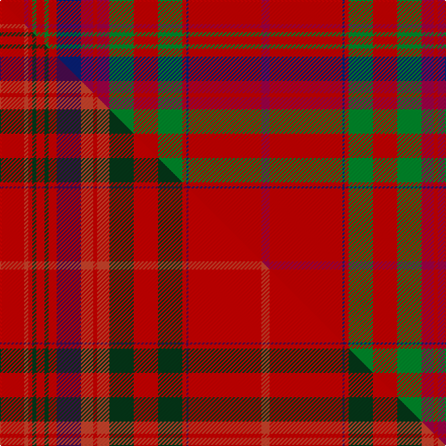

This is one **variant** — a specific cloth: this exact thread count and colourway, with its own
provenance below. It is one weaving of the [sett](/setts/ri12r2ri2g2ri4g2ri4db12r6ri2r6g12ri12g12ri2db1ri36r4/) (the scale-free proportion — the
same cloth at any scale or shade), whose colour order is pattern [RRBRGRGRRRBRGRGRRR](/stripes/rrbrgrgrrrbrgrgrrr/).

Part of the [MacCoul](/tartans/m/ma/maccoul/) tartan — the named design grouping this sett with its other cloths.

Sourced from house-of-tartan.  It is a [18 stripe tartan](/stripes/stripes18/).

Original link [http://www.house-of-tartan.scotland.net/house/TartanViewjs.asp?colr=Def&tnam=1635](http://www.house-of-tartan.scotland.net/house/TartanViewjs.asp?colr=Def&tnam=1635)

## Provenance

Earliest known date: 1850 This plate is taken from the manuscript of William and Andrew Smith's 'Authenticated Tartans of the Clans and Families of Scotland'. The Smith's sources included the findings of George Hunter, an Army clothier, who toured the Highlands in search of old tartans prior to 1822.

Dataset <small>— provenance for this record, inherited from the source manifest</small>

<dl class="dataset-prov">
<dt>source</dt><dd><a href="/sources/house-of-tartan/">House of Tartan</a></dd>
<dt>data captured from</dt><dd><a href="https://github.com/thetartan/tartan-database/blob/master/data/house-of-tartan/data.csv">https://github.com/thetartan/tartan-database/blob/master/data/house-of-tartan/data.csv</a></dd>
<dt>data date</dt><dd>1850 <small>(this record)</small></dd>
<dt>licence</dt><dd><a href="https://creativecommons.org/licenses/by-nc-nd/4.0/">CC BY-NC-ND 4.0</a></dd>
</dl>

Capture chain <small>— the hands this data passed through, oldest first; each capture carries its own licence</small>

<ol class="capture-chain">
<li><a href="http://www.house-of-tartan.scotland.net/">House of Tartan</a> <small>the weaver/retailer's database — the site is now offline; the URL is kept as the ultimate source's identity</small></li>
<li><a href="https://github.com/thetartan/tartan-database">thetartan/tartan-database</a> <small>2016-2017</small> · <a href="https://creativecommons.org/licenses/by-nc-nd/4.0/">CC BY-NC-ND 4.0</a> <small>Levko Kravets's frozen compilation — the capture we vendored, and where its CC licence text came from</small></li>
<li>this dictionary <small>captured 2026-06-10 · commit 5bf86c7566</small> <small>each re-capture is a git commit to data/sources</small></li>
</ol>

## Thread count
Ri/24 R4 Ri4 G4 Ri8 G4 Ri8 DB24 R12 Ri4 R12 G24 Ri24 G24 Ri4 DB2 Ri72 R/8

One full sett is **500 threads**.

## Palette
<table><thead><tr><th>Colour</th><th>Shade</th><th>OKLCh</th></tr></thead><tbody><tr><td>DB</td><td><code style="background-color:#082077;">#082077</code> <small style="color:#888">#082077</small></td><td><small style="color:#888">oklch(30.0% 0.149 265.1)</small></td></tr><tr><td>G</td><td><code style="background-color:#008B2A;">#008B2A</code> <small style="color:#888">#008B2A</small></td><td><small style="color:#888">oklch(55.4% 0.170 145.9)</small></td></tr><tr><td>R</td><td><code style="background-color:#A00048;">#A00048</code> <small style="color:#888">#A00048</small></td><td><small style="color:#888">oklch(45.4% 0.182 5.3)</small></td></tr><tr><td>R</td><td><code style="background-color:#C80000;">#C80000</code> <small style="color:#888">#C80000</small></td><td><small style="color:#888">oklch(52.3% 0.215 29.2)</small></td></tr></tbody></table>

# Sample pattern

## Compared to the master

This cloth is one sett of its design; the master sett (the exemplar the design is anchored on) is below for comparison.

Its **ΔTartan distance** from the master is **1.75** — the same measure the nearest-tartans table ranks by (0 is identical; a re-scale of the same cloth is near 0, a recolour or a different proportion further).

<figure class="master-compare" style="margin:0">

this sett
master sett ★

<figcaption style="color:#888;font-size:smaller">One weave of this sett against the <a href="/setts/r12ri2r2dg2r4dg2r4dp12ri6r2ri6dg12r12dg12r2dp1r36ri4/">master sett ★</a>, split on the diagonal: a shared proportion runs seamlessly across it with only the shades shifting; a different proportion breaks on it.</figcaption>
</figure>

## Nearest tartan variants

The nearest existing variants by ΔTartan distance, with this cloth at the top so the swatches line up against it.

ΔTartan

Threads

Variant

Sett

—

500

<a href="/variants/s18/ri12r2ri2g2ri4g2ri4db12r6ri2r6g12ri12g12ri2db1ri36r4~x2~ri2109032-r1807008/">MacCoul Clan Tartan</a>

<a href="/ttd/edit/#slug=ri12r2ri2g2ri4g2ri4db12r6ri2r6g12ri12g12ri2db1ri36r4~x2~ri2008029-r1707016&amp;base=ri12r2ri2g2ri4g2ri4db12r6ri2r6g12ri12g12ri2db1ri36r4~x2~ri2109032-r1807008" title="compare in the TTD">0.04</a>

500

<a href="/variants/s18/ri12r2ri2g2ri4g2ri4db12r6ri2r6g12ri12g12ri2db1ri36r4~x2~ri2008029-r1707016/">MacCoul</a>

<a href="/ttd/edit/#slug=r12o2r2dg2r4dg2r4dp12o6r2o6dg12r12dg12r2dp1r36o4~x2~r2109032-o2307033&amp;base=ri12r2ri2g2ri4g2ri4db12r6ri2r6g12ri12g12ri2db1ri36r4~x2~ri2109032-r1807008" title="compare in the TTD">1.87</a>

500

<a href="/variants/s18/r12ri2r2dg2r4dg2r4dp12ri6r2ri6dg12r12dg12r2dp1r36ri4~x2~r2109032-ri2307033/">MacCoul</a>

<a href="/ttd/edit/#slug=ri6g12ri2db1ri36r4ri36db1ri2g12ri12g12r6ri2r6db12ri4g2ri4g36ri2r2~x4~ri2109032-r1707016&amp;base=ri12r2ri2g2ri4g2ri4db12r6ri2r6g12ri12g12ri2db1ri36r4~x2~ri2109032-r1807008" title="compare in the TTD">2.39</a>

1664

<a href="/variants/s22/ri6g12ri2db1ri36r4ri36db1ri2g12ri12g12r6ri2r6db12ri4g2ri4g36ri2r2~x4~ri2109032-r1707016/">MacDougall</a>

<a href="/ttd/edit/#slug=r6dp2r2dg24r2dg2r2dp8r2lb1r32dp2r2dp1r6~x2&amp;base=ri12r2ri2g2ri4g2ri4db12r6ri2r6g12ri12g12ri2db1ri36r4~x2~ri2109032-r1807008" title="compare in the TTD">2.62</a>

352

<a href="/variants/s15/r6dp2r2dg24r2dg2r2dp8r2lb1r32dp2r2dp1r6~x2/">Drummond - 1819 (Clan)</a>

<a href="/ttd/edit/#slug=r6t2r2g24r2g2r2t8r2lb1r32t2r2t1r6~x2&amp;base=ri12r2ri2g2ri4g2ri4db12r6ri2r6g12ri12g12ri2db1ri36r4~x2~ri2109032-r1807008" title="compare in the TTD">2.71</a>

352

<a href="/variants/s15/r6t2r2g24r2g2r2t8r2lb1r32t2r2t1r6~x2/">Drummond</a>

<a href="/ttd/edit/#slug=r1g1r32dp32r8g1r1g1r8g32r32g1r1~x2&amp;base=ri12r2ri2g2ri4g2ri4db12r6ri2r6g12ri12g12ri2db1ri36r4~x2~ri2109032-r1807008" title="compare in the TTD">2.83</a>

600

<a href="/variants/s13/r1g1r32dp32r8g1r1g1r8g32r32g1r1~x2/">Unnamed 18th century plaid from Rothiemurchus</a>

<a href="/ttd/edit/#slug=r24w1dp2r4dg32r4dp2w1r4dp6r4w1dp2r32dg6dr6dg6~x2&amp;base=ri12r2ri2g2ri4g2ri4db12r6ri2r6g12ri12g12ri2db1ri36r4~x2~ri2109032-r1807008" title="compare in the TTD">2.89</a>

488

<a href="/variants/s17/r24w1dp2r4dg32r4dp2w1r4dp6r4w1dp2r32dg6dr6dg6~x2/">Dalziel (Clan)</a>

<a href="/ttd/edit/#slug=r24w1dp2r4g32r4dp2w1r4dp6r4w1dp2r32g2o3g6~x2~r2109032-o2307033&amp;base=ri12r2ri2g2ri4g2ri4db12r6ri2r6g12ri12g12ri2db1ri36r4~x2~ri2109032-r1807008" title="compare in the TTD">2.96</a>

460

<a href="/variants/s17/r24w1dp2r4g32r4dp2w1r4dp6r4w1dp2r32g2ri3g6~x2~r2109032-ri2307033/">Dalziel #2</a>

<a href="/ttd/edit/#slug=dr4g8db6dr8r6g2r2g2r24g1r3~x2&amp;base=ri12r2ri2g2ri4g2ri4db12r6ri2r6g12ri12g12ri2db1ri36r4~x2~ri2109032-r1807008" title="compare in the TTD">2.97</a>

250

<a href="/variants/s11/dr4g8db6dr8r6g2r2g2r24g1r3~x2/">MacDougall VS</a>

<a href="/ttd/edit/#slug=dr4g8db6dr8r6g2r2g2r24g1r3&amp;base=ri12r2ri2g2ri4g2ri4db12r6ri2r6g12ri12g12ri2db1ri36r4~x2~ri2109032-r1807008" title="compare in the TTD">2.97</a>

125

<a href="/variants/s11/dr4g8db6dr8r6g2r2g2r24g1r3/">MacDougall VS</a>

## Neighbour map

Every grey dot is one of 13621 variants placed by the first two principal components of the ΔTartan feature space (42% of its variance). Red is this tartan; blue dots are its nearest — click one to open its page. The map is a flat projection of a many-dimensional space — [how to read it](/posts/neighbourhood-maps/).

<svg viewBox="0 0 640 380" role="img" style="max-width:100%;height:auto;border:1px solid #e0e0e0;border-radius:4px;display:block" xmlns="http://www.w3.org/2000/svg"><image href="/nn/cloud.v1.png" width="640" height="380"/><a href="/variants/s18/ri12r2ri2g2ri4g2ri4db12r6ri2r6g12ri12g12ri2db1ri36r4~x2~ri2008029-r1707016/"><circle cx="370.8" cy="107.5" r="4" fill="#3465a4"><title>MacCoul</title></circle></a><a href="/variants/s18/r12ri2r2dg2r4dg2r4dp12ri6r2ri6dg12r12dg12r2dp1r36ri4~x2~r2109032-ri2307033/"><circle cx="391.2" cy="111.2" r="4" fill="#3465a4"><title>MacCoul</title></circle></a><a href="/variants/s22/ri6g12ri2db1ri36r4ri36db1ri2g12ri12g12r6ri2r6db12ri4g2ri4g36ri2r2~x4~ri2109032-r1707016/"><circle cx="336.3" cy="95.4" r="4" fill="#3465a4"><title>MacDougall</title></circle></a><a href="/variants/s15/r6dp2r2dg24r2dg2r2dp8r2lb1r32dp2r2dp1r6~x2/"><circle cx="388.2" cy="90.8" r="4" fill="#3465a4"><title>Drummond - 1819 (Clan)</title></circle></a><a href="/variants/s15/r6t2r2g24r2g2r2t8r2lb1r32t2r2t1r6~x2/"><circle cx="396.2" cy="100.2" r="4" fill="#3465a4"><title>Drummond</title></circle></a><a href="/variants/s13/r1g1r32dp32r8g1r1g1r8g32r32g1r1~x2/"><circle cx="378.2" cy="123.1" r="4" fill="#3465a4"><title>Unnamed 18th century plaid from Rothiemurchus</title></circle></a><a href="/variants/s17/r24w1dp2r4dg32r4dp2w1r4dp6r4w1dp2r32dg6dr6dg6~x2/"><circle cx="326.6" cy="82.1" r="4" fill="#3465a4"><title>Dalziel (Clan)</title></circle></a><a href="/variants/s17/r24w1dp2r4g32r4dp2w1r4dp6r4w1dp2r32g2ri3g6~x2~r2109032-ri2307033/"><circle cx="353.3" cy="82.5" r="4" fill="#3465a4"><title>Dalziel #2</title></circle></a><a href="/variants/s11/dr4g8db6dr8r6g2r2g2r24g1r3~x2/"><circle cx="330.6" cy="140.1" r="4" fill="#3465a4"><title>MacDougall VS</title></circle></a><a href="/variants/s11/dr4g8db6dr8r6g2r2g2r24g1r3/"><circle cx="330.6" cy="140.1" r="4" fill="#3465a4"><title>MacDougall VS</title></circle></a><circle cx="367.2" cy="105.8" r="5" fill="#c00000"/><text x="320" y="376" text-anchor="middle" font-size="11" fill="#999">ground</text><text x="11" y="190" text-anchor="middle" font-size="11" fill="#999" transform="rotate(-90 11 190)">complexity</text></svg>

ID: /variants/s18/ri12r2ri2g2ri4g2ri4db12r6ri2r6g12ri12g12ri2db1ri36r4~x2~ri2109032-r1807008/
