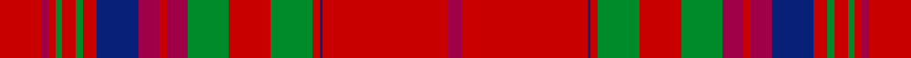

This page is one **sett** — a single exact thread-count. It belongs to the [tartan](/setts/ri12r2ri2g2ri4g2ri4db12r6ri2r6g12ri12g12ri2db1ri36r4/)
(the same proportion at any scale), whose colour order is pattern [RRBRGRGRRRBRGRGRRR](/stripes/rrbrgrgrrrbrgrgrrr/).

Part of the [MacCoul](/tartans/maccoul/) tartan — the named design grouping this sett with its other cloths.

Sourced from house-of-tartan.  It is a [18 stripe tartan](/stripes/stripes18/).

Original link http://www.house-of-tartan.scotland.net/house/TartanViewjs.asp?colr=Def&tnam=1635

## Provenance

Earliest known date: 1850 This plate is taken from the manuscript of William and Andrew Smith's 'Authenticated Tartans of the Clans and Families of Scotland'. The Smith's sources included the findings of George Hunter, an Army clothier, who toured the Highlands in search of old tartans prior to 1822.

## Thread count
Ri/24 R4 Ri4 G4 Ri8 G4 Ri8 DB24 R12 Ri4 R12 G24 Ri24 G24 Ri4 DB2 Ri72 R/8

One full sett is **500 threads**.

## Palette
<table><thead><tr><th>Colour</th><th>Shade</th><th>OKLCh</th></tr></thead><tbody><tr><td>DB</td><td><code style="background-color:#082077;">#082077</code> <small style="color:#888">#082077</small></td><td><small style="color:#888">oklch(30.0% 0.149 265.1)</small></td></tr><tr><td>G</td><td><code style="background-color:#008B2A;">#008B2A</code> <small style="color:#888">#008B2A</small></td><td><small style="color:#888">oklch(55.4% 0.170 145.9)</small></td></tr><tr><td>R</td><td><code style="background-color:#A00048;">#A00048</code> <small style="color:#888">#A00048</small></td><td><small style="color:#888">oklch(45.4% 0.182 5.3)</small></td></tr><tr><td>Ra</td><td><code style="background-color:#C80000;">#C80000</code> <small style="color:#888">#C80000</small></td><td><small style="color:#888">oklch(52.3% 0.215 29.2)</small></td></tr></tbody></table>

# Sample pattern

## Compared to the master

This cloth is one sett of its design; the master sett (the exemplar the design is anchored on) is below for comparison.

<figure style="margin:0"><figcaption style="color:#888;font-size:smaller">this sett</figcaption></figure>
<figure style="margin:0"><figcaption style="color:#888;font-size:smaller"><a href="/setts/r12ri2r2dg2r4dg2r4dp12ri6r2ri6dg12r12dg12r2dp1r36ri4/">master sett →</a></figcaption></figure>

## Nearest variants

The nearest existing variants by ΔTartan distance, with this cloth at the top so the swatches line up against it.

ΔTartan

Threads

Variant

Sett

—

500

<a href="/variants/s18/ri12r2ri2g2ri4g2ri4db12r6ri2r6g12ri12g12ri2db1ri36r4~x2~ri2109032-r1807008/">MacCoul Clan Tartan</a>

<a href="/ttd/edit/#slug=ri12r2ri2g2ri4g2ri4db12r6ri2r6g12ri12g12ri2db1ri36r4~x2~ri2008029-r1707016&amp;base=ri12r2ri2g2ri4g2ri4db12r6ri2r6g12ri12g12ri2db1ri36r4~x2~ri2109032-r1807008" title="compare in the TTD">0.00</a>

500

<a href="/variants/s18/ri12r2ri2g2ri4g2ri4db12r6ri2r6g12ri12g12ri2db1ri36r4~x2~ri2008029-r1707016/">MacCoul</a>

## Neighbour map

Every grey dot is one of 13620 variants placed by the first two principal components of the ΔTartan feature space (42% of its variance). Red is this tartan; blue dots are its nearest — click one to open its page.

<svg viewBox="0 0 640 380" role="img" style="max-width:100%;height:auto;border:1px solid #e0e0e0;border-radius:4px;display:block" xmlns="http://www.w3.org/2000/svg"><image href="/nn/cloud.v1.png" width="640" height="380"/><a href="/variants/s18/ri12r2ri2g2ri4g2ri4db12r6ri2r6g12ri12g12ri2db1ri36r4~x2~ri2008029-r1707016/"><circle cx="370.9" cy="107.6" r="4" fill="#3465a4"><title>MacCoul</title></circle></a><circle cx="367.3" cy="105.8" r="5" fill="#c00000"/><text x="320" y="376" text-anchor="middle" font-size="11" fill="#999">ground</text><text x="11" y="190" text-anchor="middle" font-size="11" fill="#999" transform="rotate(-90 11 190)">complexity</text></svg>

ID: /variants/s18/ri12r2ri2g2ri4g2ri4db12r6ri2r6g12ri12g12ri2db1ri36r4~x2~ri2109032-r1807008/
