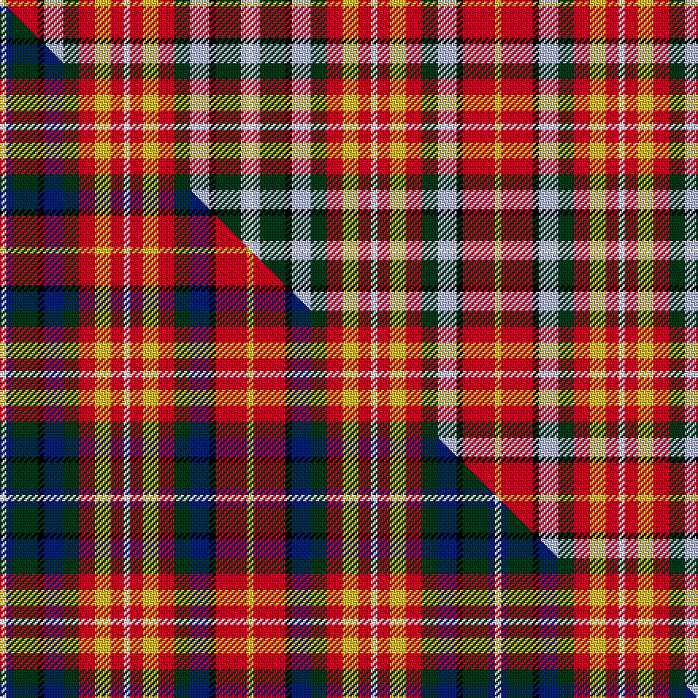

This page is one **sett** — a single exact thread-count. It belongs to the [tartan](/setts/w2lb2dg8k2lb6dg5r5ly5r4w2r4ly5r5dg5lb6k2r10ly2/)
(the same proportion at any scale), whose colour order is pattern [WWGKWGRYRWRYRGWKRY](/stripes/wwgkwgryrwryrgwkry/).

Part of the [Kutztown](/tartans/kutztown/) tartan — the named design grouping this sett with its other cloths.

Sourced from tartans-authority.  It is a [18 stripe tartan](/stripes/stripes18/).

Original link [https://www.tartanregister.gov.uk/tartanDetails.aspx?ref=7762](https://www.tartanregister.gov.uk/tartanDetails.aspx?ref=7762)

Dataset <small>— provenance for this record, inherited from the source manifest</small>

<dl class="dataset-prov">
<dt>source</dt><dd><a href="/sources/tartans-authority/">Scottish Tartans Authority</a></dd>
<dt>data captured from</dt><dd><a href="https://github.com/thetartan/tartan-database/blob/master/data/tartans-authority/data.csv">https://github.com/thetartan/tartan-database/blob/master/data/tartans-authority/data.csv</a></dd>
<dt>data date</dt><dd>October 2008 <small>(this record)</small></dd>
<dt>licence</dt><dd><a href="https://creativecommons.org/licenses/by-nc-nd/4.0/">CC BY-NC-ND 4.0</a></dd>
</dl>

Capture chain <small>— the hands this data passed through, oldest first; each capture carries its own licence</small>

<ol class="capture-chain">
<li><a href="https://www.tartansauthority.com/">Scottish Tartans Authority</a> <small>the heritage body's archive — its tartan-ferret record browser is retired (links repaired to the SRT, above)</small></li>
<li><a href="https://github.com/thetartan/tartan-database">thetartan/tartan-database</a> <small>2016-2017</small> · <a href="https://creativecommons.org/licenses/by-nc-nd/4.0/">CC BY-NC-ND 4.0</a> <small>Levko Kravets's frozen compilation — the capture we vendored, and where its CC licence text came from</small></li>
<li>this dictionary <small>captured 2026-06-10 · commit 5bf86c7566</small> <small>each re-capture is a git commit to data/sources</small></li>
</ol>

## Register references

External register numbers recorded for this tartan.

- Scottish Tartans Authority (ITI): 7762

## Thread count
LY/4 R20 K4 LB12 DG10 R10 LY10 R8 W4 R8 LY10 R10 DG10 LB12 K4 DG16 LB4 W/4

One full sett is **312 threads**.

## Palette
<table><thead><tr><th>Colour</th><th>Shade</th><th>OKLCh</th></tr></thead><tbody><tr><td>LB</td><td><code style="background-color:#B5BBDE;">#B5BBDE</code> <small style="color:#888">#B5BBDE</small></td><td><small style="color:#888">oklch(79.9% 0.050 277.6)</small></td></tr><tr><td>DG</td><td><code style="background-color:#053819;">#053819</code> <small style="color:#888">#053819</small></td><td><small style="color:#888">oklch(30.0% 0.075 151.3)</small></td></tr><tr><td>R</td><td><code style="background-color:#D60020;">#D60020</code> <small style="color:#888">#D60020</small></td><td><small style="color:#888">oklch(55.2% 0.224 25.5)</small></td></tr><tr><td>LY</td><td><code style="background-color:#DCBC32;">#DCBC32</code> <small style="color:#888">#DCBC32</small></td><td><small style="color:#888">oklch(80.0% 0.150 95.2)</small></td></tr><tr><td>K</td><td><code style="background-color:#000000;">#000000</code> <small style="color:#888">#000000</small></td><td><small style="color:#888">oklch(0.0% 0.000 0.0)</small></td></tr><tr><td>W</td><td><code style="background-color:#F7F7F7;">#F7F7F7</code> <small style="color:#888">#F7F7F7</small></td><td><small style="color:#888">oklch(97.6% 0.000 89.9)</small></td></tr></tbody></table>

# Sample pattern

## Compared to the master

This cloth is one sett of its design; the master sett (the exemplar the design is anchored on) is below for comparison.

Its **ΔTartan distance** from the master is **0.15** — the same measure the nearest-tartans table ranks by (0 is identical; a re-scale of the same cloth is near 0, a recolour or a different proportion further).

<figure class="master-compare" style="margin:0">

this sett
master sett ★

<figcaption style="color:#888;font-size:smaller">One weave of this sett against the <a href="/setts/w2db2dg8k2db6dg5r5ly5r4w2r4ly5r5dg5db6k2r10ly2/">master sett ★</a>, split on the diagonal: a shared proportion runs seamlessly across it with only the shades shifting; a different proportion breaks on it.</figcaption>
</figure>

## Nearest tartan variants

The nearest existing variants by ΔTartan distance, with this cloth at the top so the swatches line up against it.

ΔTartan

Threads

Variant

Sett

—

312

<a href="/variants/s18/w2lb2dg8k2lb6dg5r5ly5r4w2r4ly5r5dg5lb6k2r10ly2~x2/">Kutztown (Berks Co., PA) (District)</a>

<a href="/ttd/edit/#slug=w2db2dg8k2db6dg5r5ly5r4w2r4ly5r5dg5db6k2r10ly2~x2&amp;base=w2lb2dg8k2lb6dg5r5ly5r4w2r4ly5r5dg5lb6k2r10ly2~x2" title="compare in the TTD">0.15</a>

312

<a href="/variants/s18/w2db2dg8k2db6dg5r5ly5r4w2r4ly5r5dg5db6k2r10ly2~x2/">Kutztown (Berks County, PA)</a>

<a href="/ttd/edit/#slug=g2k1g4lb4y1lb4r4k1r4lb2r4w1~x4&amp;base=w2lb2dg8k2lb6dg5r5ly5r4w2r4ly5r5dg5lb6k2r10ly2~x2" title="compare in the TTD">2.42</a>

244

<a href="/variants/s12/g2k1g4lb4y1lb4r4k1r4lb2r4w1~x4/">British Columbia</a>

<a href="/ttd/edit/#slug=r6w3r8t7k4ly2k2lb4w8k5w8lb4k2ly2k4t7r8w3r6k4~x3~t2405244-ly3307090-lb3203246&amp;base=w2lb2dg8k2lb6dg5r5ly5r4w2r4ly5r5dg5lb6k2r10ly2~x2" title="compare in the TTD">2.68</a>

552

<a href="/variants/s20/r6w3r8t7k4ly2k2lb4w8k5w8lb4k2ly2k4t7r8w3r6k4~x3~t2405244-ly3307090-lb3203246/">Hewett</a>

<a href="/ttd/edit/#slug=r3k8w2k3w2k2w6db3w6k2w2o3w2o4y2o10w3~x2&amp;base=w2lb2dg8k2lb6dg5r5ly5r4w2r4ly5r5dg5lb6k2r10ly2~x2" title="compare in the TTD">2.72</a>

240

<a href="/variants/s17/r3k8w2k3w2k2w6db3w6k2w2o3w2o4y2o10w3~x2/">Clanedin</a>

<a href="/ttd/edit/#slug=r2k2r5lb5k1lb1k1lb5g6y1g6r6w1r1k1r1~x2&amp;base=w2lb2dg8k2lb6dg5r5ly5r4w2r4ly5r5dg5lb6k2r10ly2~x2" title="compare in the TTD">2.85</a>

174

<a href="/variants/s16/r2k2r5lb5k1lb1k1lb5g6y1g6r6w1r1k1r1~x2/">Unidentified No 3</a>

<a href="/ttd/edit/#slug=r18lb10k15ly4k4w6k4g23r26w4~x2~r2109032-ly3307090-w4000000&amp;base=w2lb2dg8k2lb6dg5r5ly5r4w2r4ly5r5dg5lb6k2r10ly2~x2" title="compare in the TTD">2.95</a>

412

<a href="/variants/s10/r18lb10k15ly4k4w6k4g23r26w4~x2~r2109032-ly3307090-w4000000/">Wilson's No.011</a>

<a href="/ttd/edit/#slug=r7lb3k2lb2k2lb3k6y2g7r4db2r4w2r5~x2&amp;base=w2lb2dg8k2lb6dg5r5ly5r4w2r4ly5r5dg5lb6k2r10ly2~x2" title="compare in the TTD">2.95</a>

180

<a href="/variants/s14/r7lb3k2lb2k2lb3k6y2g7r4db2r4w2r5~x2/">Caledonia Variant</a>

<a href="/ttd/edit/#slug=r6k2r12g10k3w2k3y2k8w4db6w12r4&amp;base=w2lb2dg8k2lb6dg5r5ly5r4w2r4ly5r5dg5lb6k2r10ly2~x2" title="compare in the TTD">2.96</a>

138

<a href="/variants/s13/r6k2r12g10k3w2k3y2k8w4db6w12r4/">Victoria (Patons)</a>

<a href="/ttd/edit/#slug=y6k1y3g3w3r3k2r3db3w3~x2&amp;base=w2lb2dg8k2lb6dg5r5ly5r4w2r4ly5r5dg5lb6k2r10ly2~x2" title="compare in the TTD">3.10</a>

102

<a href="/variants/s10/y6k1y3g3w3r3k2r3db3w3~x2/">Williams Lake Canadian District Tartan</a>

<a href="/ttd/edit/#slug=r5g15dp8ly2k3r11g8r11k3ly2dp8g15r5w2~x2&amp;base=w2lb2dg8k2lb6dg5r5ly5r4w2r4ly5r5dg5lb6k2r10ly2~x2" title="compare in the TTD">3.16</a>

378

<a href="/variants/s14/r5g15dp8ly2k3r11g8r11k3ly2dp8g15r5w2~x2/">Wilson's No.109</a>

## Neighbour map

Every grey dot is one of 13621 variants placed by the first two principal components of the ΔTartan feature space (42% of its variance). Red is this tartan; blue dots are its nearest — click one to open its page.

<svg viewBox="0 0 640 380" role="img" style="max-width:100%;height:auto;border:1px solid #e0e0e0;border-radius:4px;display:block" xmlns="http://www.w3.org/2000/svg"><image href="/nn/cloud.v1.png" width="640" height="380"/><a href="/variants/s18/w2db2dg8k2db6dg5r5ly5r4w2r4ly5r5dg5db6k2r10ly2~x2/"><circle cx="26.1" cy="181.7" r="4" fill="#3465a4"><title>Kutztown (Berks County, PA)</title></circle></a><a href="/variants/s12/g2k1g4lb4y1lb4r4k1r4lb2r4w1~x4/"><circle cx="66.6" cy="207.5" r="4" fill="#3465a4"><title>British Columbia</title></circle></a><a href="/variants/s20/r6w3r8t7k4ly2k2lb4w8k5w8lb4k2ly2k4t7r8w3r6k4~x3~t2405244-ly3307090-lb3203246/"><circle cx="14.0" cy="188.5" r="4" fill="#3465a4"><title>Hewett</title></circle></a><a href="/variants/s17/r3k8w2k3w2k2w6db3w6k2w2o3w2o4y2o10w3~x2/"><circle cx="32.2" cy="163.6" r="4" fill="#3465a4"><title>Clanedin</title></circle></a><a href="/variants/s16/r2k2r5lb5k1lb1k1lb5g6y1g6r6w1r1k1r1~x2/"><circle cx="57.7" cy="152.3" r="4" fill="#3465a4"><title>Unidentified No 3</title></circle></a><a href="/variants/s10/r18lb10k15ly4k4w6k4g23r26w4~x2~r2109032-ly3307090-w4000000/"><circle cx="36.9" cy="145.0" r="4" fill="#3465a4"><title>Wilson's No.011</title></circle></a><a href="/variants/s14/r7lb3k2lb2k2lb3k6y2g7r4db2r4w2r5~x2/"><circle cx="14.1" cy="185.8" r="4" fill="#3465a4"><title>Caledonia Variant</title></circle></a><a href="/variants/s13/r6k2r12g10k3w2k3y2k8w4db6w12r4/"><circle cx="14.0" cy="166.7" r="4" fill="#3465a4"><title>Victoria (Patons)</title></circle></a><a href="/variants/s10/y6k1y3g3w3r3k2r3db3w3~x2/"><circle cx="14.0" cy="197.0" r="4" fill="#3465a4"><title>Williams Lake Canadian District Tartan</title></circle></a><a href="/variants/s14/r5g15dp8ly2k3r11g8r11k3ly2dp8g15r5w2~x2/"><circle cx="98.9" cy="164.1" r="4" fill="#3465a4"><title>Wilson's No.109</title></circle></a><circle cx="27.1" cy="182.5" r="5" fill="#c00000"/><text x="320" y="376" text-anchor="middle" font-size="11" fill="#999">ground</text><text x="11" y="190" text-anchor="middle" font-size="11" fill="#999" transform="rotate(-90 11 190)">complexity</text></svg>

ID: /variants/s18/w2lb2dg8k2lb6dg5r5ly5r4w2r4ly5r5dg5lb6k2r10ly2~x2/
