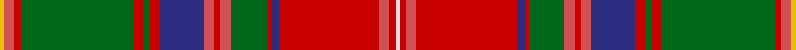

This page is one **sett** — a single exact thread-count. It belongs to the [tartan](/setts/w2r3ri5r48db4r2g17ri5r3ri5db21r5g3r5g54r3ri5ly2/)
(the same proportion at any scale), whose colour order is pattern [WRRRBRGRRRBRGRGRRY](/stripes/wrrrbrgrrrbrgrgrry/).

Sourced from house-of-tartan.  It is a [18 stripe tartan](/stripes/stripes18/).

Original link http://www.house-of-tartan.scotland.net/house/TartanViewjs.asp?colr=Def&tnam=1861

## Provenance

Earliest known date: 1930 The specimen in the Society's collection was obtained about 1930 from the firm J Johnston of Edinburgh. It was descibed at the time as a modern family tartan. The cloth archive also contains a sample from the Lochcarron weavers.

## Thread count
Y/2 DO5 R3 G54 R5 G3 R5 DB21 DO5 R3 DO5 G17 R2 DB4 R48 DO5 R3 LN/2

One full sett is **380 threads**.

## Palette

Palette: <strong>Tartan Register</strong> <small style="color:#888">(5 of 6 colours)</small>
<table><thead><tr><th>Colour</th><th>Threads</th><th>Shade</th><th>Base</th><th>OKLCh</th></tr></thead><tbody><tr><td>Y/</td><td style="text-align:right;font-variant-numeric:tabular-nums">2</td><td><code style="background-color:#E8C000;">#E8C000</code> <small style="color:#888">#E8C000</small></td><td>Y <code style="background-color:#F2BF00;">#F2BF00</code></td><td><small style="color:#888">oklch(81.9% 0.168 93.7)</small></td></tr><tr><td>DO</td><td style="text-align:right;font-variant-numeric:tabular-nums">5</td><td><code style="background-color:#D05054;">#D05054</code> <small style="color:#888">#D05054</small></td><td>R <code style="background-color:#CC0000;">#CC0000</code></td><td><small style="color:#888">oklch(60.2% 0.162 21.5)</small></td></tr><tr><td>R</td><td style="text-align:right;font-variant-numeric:tabular-nums">3</td><td><code style="background-color:#C80000;">#C80000</code> <small style="color:#888">#C80000</small></td><td>R <code style="background-color:#CC0000;">#CC0000</code></td><td><small style="color:#888">oklch(52.3% 0.215 29.2)</small></td></tr><tr><td>G</td><td style="text-align:right;font-variant-numeric:tabular-nums">54</td><td><code style="background-color:#006818;">#006818</code> <small style="color:#888">#006818</small></td><td>G <code style="background-color:#006100;">#006100</code></td><td><small style="color:#888">oklch(45.0% 0.142 145.0)</small></td></tr><tr><td>R</td><td style="text-align:right;font-variant-numeric:tabular-nums">5</td><td><code style="background-color:#C80000;">#C80000</code> <small style="color:#888">#C80000</small></td><td>R <code style="background-color:#CC0000;">#CC0000</code></td><td><small style="color:#888">oklch(52.3% 0.215 29.2)</small></td></tr><tr><td>G</td><td style="text-align:right;font-variant-numeric:tabular-nums">3</td><td><code style="background-color:#006818;">#006818</code> <small style="color:#888">#006818</small></td><td>G <code style="background-color:#006100;">#006100</code></td><td><small style="color:#888">oklch(45.0% 0.142 145.0)</small></td></tr><tr><td>R</td><td style="text-align:right;font-variant-numeric:tabular-nums">5</td><td><code style="background-color:#C80000;">#C80000</code> <small style="color:#888">#C80000</small></td><td>R <code style="background-color:#CC0000;">#CC0000</code></td><td><small style="color:#888">oklch(52.3% 0.215 29.2)</small></td></tr><tr><td>DB</td><td style="text-align:right;font-variant-numeric:tabular-nums">21</td><td><code style="background-color:#2C2C80;">#2C2C80</code> <small style="color:#888">#2C2C80</small></td><td>B <code style="background-color:#2A418A;">#2A418A</code></td><td><small style="color:#888">oklch(35.0% 0.138 276.6)</small></td></tr><tr><td>DO</td><td style="text-align:right;font-variant-numeric:tabular-nums">5</td><td><code style="background-color:#D05054;">#D05054</code> <small style="color:#888">#D05054</small></td><td>R <code style="background-color:#CC0000;">#CC0000</code></td><td><small style="color:#888">oklch(60.2% 0.162 21.5)</small></td></tr><tr><td>R</td><td style="text-align:right;font-variant-numeric:tabular-nums">3</td><td><code style="background-color:#C80000;">#C80000</code> <small style="color:#888">#C80000</small></td><td>R <code style="background-color:#CC0000;">#CC0000</code></td><td><small style="color:#888">oklch(52.3% 0.215 29.2)</small></td></tr><tr><td>DO</td><td style="text-align:right;font-variant-numeric:tabular-nums">5</td><td><code style="background-color:#D05054;">#D05054</code> <small style="color:#888">#D05054</small></td><td>R <code style="background-color:#CC0000;">#CC0000</code></td><td><small style="color:#888">oklch(60.2% 0.162 21.5)</small></td></tr><tr><td>G</td><td style="text-align:right;font-variant-numeric:tabular-nums">17</td><td><code style="background-color:#006818;">#006818</code> <small style="color:#888">#006818</small></td><td>G <code style="background-color:#006100;">#006100</code></td><td><small style="color:#888">oklch(45.0% 0.142 145.0)</small></td></tr><tr><td>R</td><td style="text-align:right;font-variant-numeric:tabular-nums">2</td><td><code style="background-color:#C80000;">#C80000</code> <small style="color:#888">#C80000</small></td><td>R <code style="background-color:#CC0000;">#CC0000</code></td><td><small style="color:#888">oklch(52.3% 0.215 29.2)</small></td></tr><tr><td>DB</td><td style="text-align:right;font-variant-numeric:tabular-nums">4</td><td><code style="background-color:#2C2C80;">#2C2C80</code> <small style="color:#888">#2C2C80</small></td><td>B <code style="background-color:#2A418A;">#2A418A</code></td><td><small style="color:#888">oklch(35.0% 0.138 276.6)</small></td></tr><tr><td>R</td><td style="text-align:right;font-variant-numeric:tabular-nums">48</td><td><code style="background-color:#C80000;">#C80000</code> <small style="color:#888">#C80000</small></td><td>R <code style="background-color:#CC0000;">#CC0000</code></td><td><small style="color:#888">oklch(52.3% 0.215 29.2)</small></td></tr><tr><td>DO</td><td style="text-align:right;font-variant-numeric:tabular-nums">5</td><td><code style="background-color:#D05054;">#D05054</code> <small style="color:#888">#D05054</small></td><td>R <code style="background-color:#CC0000;">#CC0000</code></td><td><small style="color:#888">oklch(60.2% 0.162 21.5)</small></td></tr><tr><td>R</td><td style="text-align:right;font-variant-numeric:tabular-nums">3</td><td><code style="background-color:#C80000;">#C80000</code> <small style="color:#888">#C80000</small></td><td>R <code style="background-color:#CC0000;">#CC0000</code></td><td><small style="color:#888">oklch(52.3% 0.215 29.2)</small></td></tr><tr><td>LN/</td><td style="text-align:right;font-variant-numeric:tabular-nums">2</td><td><code style="background-color:#E0E0E0;">#E0E0E0</code> <small style="color:#888">#E0E0E0</small></td><td>W <code style="background-color:#F7F7F7;">#F7F7F7</code></td><td><small style="color:#888">oklch(90.7% 0.000 89.9)</small></td></tr></tbody></table>

## Nearest tartans

The nearest existing variants by ΔTartan distance, with this tartan at the top so the swatches line up against it.

ΔTartan

Tartan

Sett

—

<a href="/ttd/edit/#slug=w2r3ri5r48db4r2g17ri5r3ri5db21r5g3r5g54r3ri5ly2">Sommerville Family Tartan</a> <a class="nn-out" href="/variants/s18/w2r3ri5r48db4r2g17ri5r3ri5db21r5g3r5g54r3ri5ly2/" title="open its dictionary page">↗</a>

0.26

<a href="/ttd/edit/#slug=w2r3ri6r48db4r2g16ri5r3ri5db20r5g3r5g54r3ri5ly2~x2&amp;base=w2r3ri5r48db4r2g17ri5r3ri5db21r5g3r5g54r3ri5ly2">Sommerville</a> <a class="nn-out" href="/variants/s18/w2r3ri6r48db4r2g16ri5r3ri5db20r5g3r5g54r3ri5ly2~x2/" title="open its dictionary page">↗</a>

0.45

<a href="/ttd/edit/#slug=w2ri3r5ri48db4ri2g17r5ri3r5db21ri5g3ri5g54ri3r5ly2&amp;base=w2r3ri5r48db4r2g17ri5r3ri5db21r5g3r5g54r3ri5ly2">Sommerville</a> <a class="nn-out" href="/variants/s18/w2ri3r5ri48db4ri2g17r5ri3r5db21ri5g3ri5g54ri3r5ly2/" title="open its dictionary page">↗</a>

0.72

<a href="/ttd/edit/#slug=dg4r4dp1k1r19k1t1r2db5r2t1k1r2dg24r5dp1k1t3~x2&amp;base=w2r3ri5r48db4r2g17ri5r3ri5db21r5g3r5g54r3ri5ly2">Dundas (Red)</a> <a class="nn-out" href="/variants/s18/dg4r4dp1k1r19k1t1r2db5r2t1k1r2dg24r5dp1k1t3~x2/" title="open its dictionary page">↗</a>

0.79

<a href="/ttd/edit/#slug=t2p10r3ri4g72ri7g4ri10db24p6r5ri4r5p7g24ri24g24ri3db3ri74p7r5ri6t2~x2&amp;base=w2r3ri5r48db4r2g17ri5r3ri5db21r5g3r5g54r3ri5ly2">MacDougall, of MacDougall</a> <a class="nn-out" href="/variants/s24/t2p10r3ri4g72ri7g4ri10db24p6r5ri4r5p7g24ri24g24ri3db3ri74p7r5ri6t2~x2/" title="open its dictionary page">↗</a>

0.79

<a href="/ttd/edit/#slug=g4r4dp1k1r19k1t1r2db5r2t1k1r2g24r5dp1k1t3~x2&amp;base=w2r3ri5r48db4r2g17ri5r3ri5db21r5g3r5g54r3ri5ly2">Dundas, (Red)</a> <a class="nn-out" href="/variants/s18/g4r4dp1k1r19k1t1r2db5r2t1k1r2g24r5dp1k1t3~x2/" title="open its dictionary page">↗</a>

1.00

<a href="/ttd/edit/#slug=t2dp10ri3r4dg72r7dg4r10db24dp6ri5r4ri5dp7dg24r24dg24r3db3r74dp7ri5r6t2~x2&amp;base=w2r3ri5r48db4r2g17ri5r3ri5db21r5g3r5g54r3ri5ly2">MacDougall of MacDougall</a> <a class="nn-out" href="/variants/s24/t2dp10ri3r4dg72r7dg4r10db24dp6ri5r4ri5dp7dg24r24dg24r3db3r74dp7ri5r6t2~x2/" title="open its dictionary page">↗</a>

1.04

<a href="/ttd/edit/#slug=g14r6ri2dt3r65dt2t2r6dt34r6t2dt2r4g66r12ri2dt2t4&amp;base=w2r3ri5r48db4r2g17ri5r3ri5db21r5g3r5g54r3ri5ly2">Stewart of Ardshiel Clan Tartan</a> <a class="nn-out" href="/variants/s18/g14r6ri2dt3r65dt2t2r6dt34r6t2dt2r4g66r12ri2dt2t4/" title="open its dictionary page">↗</a>

1.08

<a href="/ttd/edit/#slug=r7ri3r6db26r8dg2r2db2r2g1ri2r8g26r8g2r2ri2~x2&amp;base=w2r3ri5r48db4r2g17ri5r3ri5db21r5g3r5g54r3ri5ly2">MacColl, Ancient</a> <a class="nn-out" href="/variants/s17/r7ri3r6db26r8dg2r2db2r2g1ri2r8g26r8g2r2ri2~x2/" title="open its dictionary page">↗</a>

1.09

<a href="/ttd/edit/#slug=w1r2p2r22db1r1g8r8g8p2r1p2db9r3g1r3g22r1p2w1~x2&amp;base=w2r3ri5r48db4r2g17ri5r3ri5db21r5g3r5g54r3ri5ly2">MacDougall 7</a> <a class="nn-out" href="/variants/s20/w1r2p2r22db1r1g8r8g8p2r1p2db9r3g1r3g22r1p2w1~x2/" title="open its dictionary page">↗</a>

1.10

<a href="/variants/s22/k8r2k3ly2k2w3k2lo12y22r2y2k1~x2/">O'Keefe</a>

## Neighbour map

Every grey dot is one of 14360 variants placed by the first two principal components of the ΔTartan feature space (44% of its variance). Red is this tartan; blue dots are its nearest — click one to open its page.

<svg viewBox="0 0 640 380" role="img" style="max-width:100%;height:auto;border:1px solid #e0e0e0;border-radius:4px;display:block" xmlns="http://www.w3.org/2000/svg"><image href="/nn/cloud.v1.png" width="640" height="380"/><a href="/variants/s18/w2r3ri6r48db4r2g16ri5r3ri5db20r5g3r5g54r3ri5ly2~x2/"><circle cx="231.0" cy="55.2" r="4" fill="#3465a4"><title>Sommerville</title></circle></a><a href="/variants/s18/w2ri3r5ri48db4ri2g17r5ri3r5db21ri5g3ri5g54ri3r5ly2/"><circle cx="239.0" cy="59.6" r="4" fill="#3465a4"><title>Sommerville</title></circle></a><a href="/variants/s18/dg4r4dp1k1r19k1t1r2db5r2t1k1r2dg24r5dp1k1t3~x2/"><circle cx="256.8" cy="58.2" r="4" fill="#3465a4"><title>Dundas (Red)</title></circle></a><a href="/variants/s24/t2p10r3ri4g72ri7g4ri10db24p6r5ri4r5p7g24ri24g24ri3db3ri74p7r5ri6t2~x2/"><circle cx="250.9" cy="38.8" r="4" fill="#3465a4"><title>MacDougall, of MacDougall</title></circle></a><a href="/variants/s18/g4r4dp1k1r19k1t1r2db5r2t1k1r2g24r5dp1k1t3~x2/"><circle cx="245.8" cy="55.9" r="4" fill="#3465a4"><title>Dundas, (Red)</title></circle></a><a href="/variants/s24/t2dp10ri3r4dg72r7dg4r10db24dp6ri5r4ri5dp7dg24r24dg24r3db3r74dp7ri5r6t2~x2/"><circle cx="249.0" cy="36.5" r="4" fill="#3465a4"><title>MacDougall of MacDougall</title></circle></a><a href="/variants/s18/g14r6ri2dt3r65dt2t2r6dt34r6t2dt2r4g66r12ri2dt2t4/"><circle cx="296.4" cy="67.6" r="4" fill="#3465a4"><title>Stewart of Ardshiel Clan Tartan</title></circle></a><a href="/variants/s17/r7ri3r6db26r8dg2r2db2r2g1ri2r8g26r8g2r2ri2~x2/"><circle cx="249.7" cy="95.1" r="4" fill="#3465a4"><title>MacColl, Ancient</title></circle></a><a href="/variants/s20/w1r2p2r22db1r1g8r8g8p2r1p2db9r3g1r3g22r1p2w1~x2/"><circle cx="251.6" cy="83.9" r="4" fill="#3465a4"><title>MacDougall 7</title></circle></a><a href="/variants/s22/k8r2k3ly2k2w3k2lo12y22r2y2k1~x2/"><circle cx="199.3" cy="63.3" r="4" fill="#3465a4"><title>O'Keefe</title></circle></a><circle cx="239.3" cy="59.4" r="5" fill="#c00000"/></svg>

ID: /variants/s18/w2r3ri5r48db4r2g17ri5r3ri5db21r5g3r5g54r3ri5ly2/
