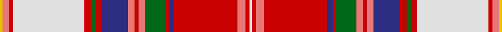

This page is one **sett** — a single exact thread-count. It belongs to the [tartan](/setts/w2r3ri6r48db4r2g16ri5r3ri5db20r5g3r5w54r3ri5ly2/)
(the same proportion at any scale), whose colour order is pattern [WRRRBRGRRRBRGRWRRY](/stripes/wrrrbrgrrrbrgrwrry/).

Sourced from tartans-authority.  It is a [18 stripe tartan](/stripes/stripes18/).

Original link http://www.tartansauthority.com/tartan-ferret/display/8847/

## Register references

External register numbers recorded for this tartan.

- Scottish Register of Tartans: [8847](https://www.tartanregister.gov.uk/tartanDetails?ref=8847)
- Scottish Tartans Authority (ITI): 8847

## Thread count
Y/4 LR10 R6 LN108 R10 G6 R10 DB40 LR10 R6 LR10 G32 R4 DB8 R96 LR12 R6 LN/4

One full sett is **756 threads**.

## Palette

Palette: <strong>Tartan Register</strong>
<table><thead><tr><th>Colour</th><th>Threads</th><th>Shade</th><th>Base</th><th>OKLCh</th></tr></thead><tbody><tr><td>Y/</td><td style="text-align:right;font-variant-numeric:tabular-nums">4</td><td><code style="background-color:#E8C000;">#E8C000</code> <small style="color:#888">#E8C000</small></td><td>Y <code style="background-color:#F2BF00;">#F2BF00</code></td><td><small style="color:#888">oklch(81.9% 0.168 93.7)</small></td></tr><tr><td>LR</td><td style="text-align:right;font-variant-numeric:tabular-nums">10</td><td><code style="background-color:#E87878;">#E87878</code> <small style="color:#888">#E87878</small></td><td>R <code style="background-color:#CC0000;">#CC0000</code></td><td><small style="color:#888">oklch(70.0% 0.139 21.2)</small></td></tr><tr><td>R</td><td style="text-align:right;font-variant-numeric:tabular-nums">6</td><td><code style="background-color:#C80000;">#C80000</code> <small style="color:#888">#C80000</small></td><td>R <code style="background-color:#CC0000;">#CC0000</code></td><td><small style="color:#888">oklch(52.3% 0.215 29.2)</small></td></tr><tr><td>LN</td><td style="text-align:right;font-variant-numeric:tabular-nums">108</td><td><code style="background-color:#E0E0E0;">#E0E0E0</code> <small style="color:#888">#E0E0E0</small></td><td>W <code style="background-color:#F7F7F7;">#F7F7F7</code></td><td><small style="color:#888">oklch(90.7% 0.000 89.9)</small></td></tr><tr><td>R</td><td style="text-align:right;font-variant-numeric:tabular-nums">10</td><td><code style="background-color:#C80000;">#C80000</code> <small style="color:#888">#C80000</small></td><td>R <code style="background-color:#CC0000;">#CC0000</code></td><td><small style="color:#888">oklch(52.3% 0.215 29.2)</small></td></tr><tr><td>G</td><td style="text-align:right;font-variant-numeric:tabular-nums">6</td><td><code style="background-color:#006818;">#006818</code> <small style="color:#888">#006818</small></td><td>G <code style="background-color:#006100;">#006100</code></td><td><small style="color:#888">oklch(45.0% 0.142 145.0)</small></td></tr><tr><td>R</td><td style="text-align:right;font-variant-numeric:tabular-nums">10</td><td><code style="background-color:#C80000;">#C80000</code> <small style="color:#888">#C80000</small></td><td>R <code style="background-color:#CC0000;">#CC0000</code></td><td><small style="color:#888">oklch(52.3% 0.215 29.2)</small></td></tr><tr><td>DB</td><td style="text-align:right;font-variant-numeric:tabular-nums">40</td><td><code style="background-color:#2C2C80;">#2C2C80</code> <small style="color:#888">#2C2C80</small></td><td>B <code style="background-color:#2A418A;">#2A418A</code></td><td><small style="color:#888">oklch(35.0% 0.138 276.6)</small></td></tr><tr><td>LR</td><td style="text-align:right;font-variant-numeric:tabular-nums">10</td><td><code style="background-color:#E87878;">#E87878</code> <small style="color:#888">#E87878</small></td><td>R <code style="background-color:#CC0000;">#CC0000</code></td><td><small style="color:#888">oklch(70.0% 0.139 21.2)</small></td></tr><tr><td>R</td><td style="text-align:right;font-variant-numeric:tabular-nums">6</td><td><code style="background-color:#C80000;">#C80000</code> <small style="color:#888">#C80000</small></td><td>R <code style="background-color:#CC0000;">#CC0000</code></td><td><small style="color:#888">oklch(52.3% 0.215 29.2)</small></td></tr><tr><td>LR</td><td style="text-align:right;font-variant-numeric:tabular-nums">10</td><td><code style="background-color:#E87878;">#E87878</code> <small style="color:#888">#E87878</small></td><td>R <code style="background-color:#CC0000;">#CC0000</code></td><td><small style="color:#888">oklch(70.0% 0.139 21.2)</small></td></tr><tr><td>G</td><td style="text-align:right;font-variant-numeric:tabular-nums">32</td><td><code style="background-color:#006818;">#006818</code> <small style="color:#888">#006818</small></td><td>G <code style="background-color:#006100;">#006100</code></td><td><small style="color:#888">oklch(45.0% 0.142 145.0)</small></td></tr><tr><td>R</td><td style="text-align:right;font-variant-numeric:tabular-nums">4</td><td><code style="background-color:#C80000;">#C80000</code> <small style="color:#888">#C80000</small></td><td>R <code style="background-color:#CC0000;">#CC0000</code></td><td><small style="color:#888">oklch(52.3% 0.215 29.2)</small></td></tr><tr><td>DB</td><td style="text-align:right;font-variant-numeric:tabular-nums">8</td><td><code style="background-color:#2C2C80;">#2C2C80</code> <small style="color:#888">#2C2C80</small></td><td>B <code style="background-color:#2A418A;">#2A418A</code></td><td><small style="color:#888">oklch(35.0% 0.138 276.6)</small></td></tr><tr><td>R</td><td style="text-align:right;font-variant-numeric:tabular-nums">96</td><td><code style="background-color:#C80000;">#C80000</code> <small style="color:#888">#C80000</small></td><td>R <code style="background-color:#CC0000;">#CC0000</code></td><td><small style="color:#888">oklch(52.3% 0.215 29.2)</small></td></tr><tr><td>LR</td><td style="text-align:right;font-variant-numeric:tabular-nums">12</td><td><code style="background-color:#E87878;">#E87878</code> <small style="color:#888">#E87878</small></td><td>R <code style="background-color:#CC0000;">#CC0000</code></td><td><small style="color:#888">oklch(70.0% 0.139 21.2)</small></td></tr><tr><td>R</td><td style="text-align:right;font-variant-numeric:tabular-nums">6</td><td><code style="background-color:#C80000;">#C80000</code> <small style="color:#888">#C80000</small></td><td>R <code style="background-color:#CC0000;">#CC0000</code></td><td><small style="color:#888">oklch(52.3% 0.215 29.2)</small></td></tr><tr><td>LN/</td><td style="text-align:right;font-variant-numeric:tabular-nums">4</td><td><code style="background-color:#E0E0E0;">#E0E0E0</code> <small style="color:#888">#E0E0E0</small></td><td>W <code style="background-color:#F7F7F7;">#F7F7F7</code></td><td><small style="color:#888">oklch(90.7% 0.000 89.9)</small></td></tr></tbody></table>

## Nearest tartans

The nearest existing variants by ΔTartan distance, with this tartan at the top so the swatches line up against it.

ΔTartan

Tartan

Sett

—

<a href="/ttd/edit/#slug=w2r3ri6r48db4r2g16ri5r3ri5db20r5g3r5w54r3ri5ly2~x2">Somerville Dress (Name?)</a> <a class="nn-out" href="/variants/s18/w2r3ri6r48db4r2g16ri5r3ri5db20r5g3r5w54r3ri5ly2~x2/" title="open its dictionary page">↗</a>

0.84

<a href="/ttd/edit/#slug=r6lb1r1k15r1lb2k1lo5lb25ri5k1r5k1lb5k1ri5~x2&amp;base=w2r3ri6r48db4r2g16ri5r3ri5db20r5g3r5w54r3ri5ly2~x2">Puccini (Fashion)</a> <a class="nn-out" href="/variants/s16/r6lb1r1k15r1lb2k1lo5lb25ri5k1r5k1lb5k1ri5~x2/" title="open its dictionary page">↗</a>

0.99

<a href="/ttd/edit/#slug=r8k3lb15k1w3k1lb8k1w3k1r19k2lo2k2g2k2r2k2~x2&amp;base=w2r3ri6r48db4r2g16ri5r3ri5db20r5g3r5w54r3ri5ly2~x2">Canadian Dental Association</a> <a class="nn-out" href="/variants/s18/r8k3lb15k1w3k1lb8k1w3k1r19k2lo2k2g2k2r2k2~x2/" title="open its dictionary page">↗</a>

1.07

<a href="/ttd/edit/#slug=w4ly12r8k8t32w4ly7r7k2r7ly7w4g32w2k4r60w2~x2&amp;base=w2r3ri6r48db4r2g16ri5r3ri5db20r5g3r5w54r3ri5ly2~x2">Chattan, Chief of Clan</a> <a class="nn-out" href="/variants/s17/w4ly12r8k8t32w4ly7r7k2r7ly7w4g32w2k4r60w2~x2/" title="open its dictionary page">↗</a>

1.12

<a href="/ttd/edit/#slug=w4ly12r8k8t32w4ly7r7k2r7ly7w4g32w2k4r60w2&amp;base=w2r3ri6r48db4r2g16ri5r3ri5db20r5g3r5w54r3ri5ly2~x2">Chattan Chief Clan Tartan</a> <a class="nn-out" href="/variants/s17/w4ly12r8k8t32w4ly7r7k2r7ly7w4g32w2k4r60w2/" title="open its dictionary page">↗</a>

1.17

<a href="/ttd/edit/#slug=r20k3w2lo25w2ly5r4k2r4ly5w3t4k5r6w1t1~x2&amp;base=w2r3ri6r48db4r2g16ri5r3ri5db20r5g3r5w54r3ri5ly2~x2">MacGlashan #3</a> <a class="nn-out" href="/variants/s16/r20k3w2lo25w2ly5r4k2r4ly5w3t4k5r6w1t1~x2/" title="open its dictionary page">↗</a>

1.23

<a href="/ttd/edit/#slug=k2g2w2g3w33r2dp10r3g3r26g2r4ri2~x2&amp;base=w2r3ri6r48db4r2g16ri5r3ri5db20r5g3r5w54r3ri5ly2~x2">Crieff Red Dress (Dance)</a> <a class="nn-out" href="/variants/s13/k2g2w2g3w33r2dp10r3g3r26g2r4ri2~x2/" title="open its dictionary page">↗</a>

1.23

<a href="/ttd/edit/#slug=w4ly12r8k8t32w4ly7r7k2r7ly7w4g32w2k8r60w2&amp;base=w2r3ri6r48db4r2g16ri5r3ri5db20r5g3r5w54r3ri5ly2~x2">Chattan, Chief</a> <a class="nn-out" href="/variants/s17/w4ly12r8k8t32w4ly7r7k2r7ly7w4g32w2k8r60w2/" title="open its dictionary page">↗</a>

1.24

<a href="/ttd/edit/#slug=r8k3o15k1w3k1o8k1w3k1r19k2ly2k2g2k2r2k2~x2&amp;base=w2r3ri6r48db4r2g16ri5r3ri5db20r5g3r5w54r3ri5ly2~x2">Canadian Dental Association (Corp.)</a> <a class="nn-out" href="/variants/s18/r8k3o15k1w3k1o8k1w3k1r19k2ly2k2g2k2r2k2~x2/" title="open its dictionary page">↗</a>

1.25

<a href="/ttd/edit/#slug=w4dt4r18o4r1o36k1o4k6r2k6r6k2r6ly4r2~x2&amp;base=w2r3ri6r48db4r2g16ri5r3ri5db20r5g3r5w54r3ri5ly2~x2">Mehrtens (Personal)</a> <a class="nn-out" href="/variants/s16/w4dt4r18o4r1o36k1o4k6r2k6r6k2r6ly4r2~x2/" title="open its dictionary page">↗</a>

1.29

<a href="/ttd/edit/#slug=r25do3w2lo25w3ly5r4do2r4ly5w3db4do5r6w1db1~x2&amp;base=w2r3ri6r48db4r2g16ri5r3ri5db20r5g3r5w54r3ri5ly2~x2">MacGlashan Clan Tartan</a> <a class="nn-out" href="/variants/s16/r25do3w2lo25w3ly5r4do2r4ly5w3db4do5r6w1db1~x2/" title="open its dictionary page">↗</a>

## Neighbour map

Every grey dot is one of 14360 variants placed by the first two principal components of the ΔTartan feature space (44% of its variance). Red is this tartan; blue dots are its nearest — click one to open its page.

<svg viewBox="0 0 640 380" role="img" style="max-width:100%;height:auto;border:1px solid #e0e0e0;border-radius:4px;display:block" xmlns="http://www.w3.org/2000/svg"><image href="/nn/cloud.v1.png" width="640" height="380"/><a href="/variants/s16/r6lb1r1k15r1lb2k1lo5lb25ri5k1r5k1lb5k1ri5~x2/"><circle cx="172.2" cy="41.9" r="4" fill="#3465a4"><title>Puccini (Fashion)</title></circle></a><a href="/variants/s18/r8k3lb15k1w3k1lb8k1w3k1r19k2lo2k2g2k2r2k2~x2/"><circle cx="153.0" cy="52.3" r="4" fill="#3465a4"><title>Canadian Dental Association</title></circle></a><a href="/variants/s17/w4ly12r8k8t32w4ly7r7k2r7ly7w4g32w2k4r60w2~x2/"><circle cx="185.5" cy="40.9" r="4" fill="#3465a4"><title>Chattan, Chief of Clan</title></circle></a><a href="/variants/s17/w4ly12r8k8t32w4ly7r7k2r7ly7w4g32w2k4r60w2/"><circle cx="190.5" cy="43.7" r="4" fill="#3465a4"><title>Chattan Chief Clan Tartan</title></circle></a><a href="/variants/s16/r20k3w2lo25w2ly5r4k2r4ly5w3t4k5r6w1t1~x2/"><circle cx="174.4" cy="59.2" r="4" fill="#3465a4"><title>MacGlashan #3</title></circle></a><a href="/variants/s13/k2g2w2g3w33r2dp10r3g3r26g2r4ri2~x2/"><circle cx="169.7" cy="54.4" r="4" fill="#3465a4"><title>Crieff Red Dress (Dance)</title></circle></a><a href="/variants/s17/w4ly12r8k8t32w4ly7r7k2r7ly7w4g32w2k8r60w2/"><circle cx="171.0" cy="40.7" r="4" fill="#3465a4"><title>Chattan, Chief</title></circle></a><a href="/variants/s18/r8k3o15k1w3k1o8k1w3k1r19k2ly2k2g2k2r2k2~x2/"><circle cx="171.5" cy="64.6" r="4" fill="#3465a4"><title>Canadian Dental Association (Corp.)</title></circle></a><a href="/variants/s16/w4dt4r18o4r1o36k1o4k6r2k6r6k2r6ly4r2~x2/"><circle cx="233.9" cy="45.5" r="4" fill="#3465a4"><title>Mehrtens (Personal)</title></circle></a><a href="/variants/s16/r25do3w2lo25w3ly5r4do2r4ly5w3db4do5r6w1db1~x2/"><circle cx="198.8" cy="58.3" r="4" fill="#3465a4"><title>MacGlashan Clan Tartan</title></circle></a><circle cx="176.8" cy="28.4" r="5" fill="#c00000"/></svg>

ID: /variants/s18/w2r3ri6r48db4r2g16ri5r3ri5db20r5g3r5w54r3ri5ly2~x2/
