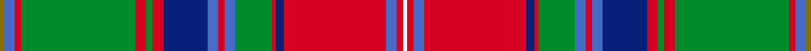

This page is one **sett** — a single exact thread-count. It belongs to the [tartan](/setts/y2b5r3g54r5g3r5db21b5r3b5g17r2db4r48b5r3w2/)
(the same proportion at any scale), whose colour order is pattern [GBRGRGRBBRBGRBRBRW](/stripes/gbrgrgrbbrbgrbrbrw/).

Part of the [Sommerville](/tartans/sommerville/) tartan — the named design grouping this sett with its other cloths.

Sourced from weddslist.  It is a [18 stripe tartan](/stripes/stripes18/).

Original link http://www.weddslist.com/cgi-bin/tartans/pg.pl?source=sts

## Thread count
Y/2 B5 R3 G54 R5 G3 R5 DB21 B5 R3 B5 G17 R2 DB4 R48 B5 R3 W/2

One full sett is **380 threads**.

## Palette
<table><thead><tr><th>Colour</th><th>Shade</th><th>OKLCh</th></tr></thead><tbody><tr><td>B</td><td><code style="background-color:#082077;">#082077</code> <small style="color:#888">#082077</small></td><td><small style="color:#888">oklch(30.0% 0.149 265.1)</small></td></tr><tr><td>G</td><td><code style="background-color:#008B2A;">#008B2A</code> <small style="color:#888">#008B2A</small></td><td><small style="color:#888">oklch(55.4% 0.170 145.9)</small></td></tr><tr><td>LN</td><td><code style="background-color:#F7F7F7;">#F7F7F7</code> <small style="color:#888">#F7F7F7</small></td><td><small style="color:#888">oklch(97.6% 0.000 89.9)</small></td></tr><tr><td>R</td><td><code style="background-color:#466CC8;">#466CC8</code> <small style="color:#888">#466CC8</small></td><td><small style="color:#888">oklch(55.1% 0.149 265.0)</small></td></tr><tr><td>Ra</td><td><code style="background-color:#D60020;">#D60020</code> <small style="color:#888">#D60020</small></td><td><small style="color:#888">oklch(55.2% 0.224 25.5)</small></td></tr><tr><td>Y</td><td><code style="background-color:#8B6E00;">#8B6E00</code> <small style="color:#888">#8B6E00</small></td><td><small style="color:#888">oklch(55.1% 0.113 90.4)</small></td></tr></tbody></table>

# Sample pattern

## Compared to the master

This cloth is one sett of its design; the master sett (the exemplar the design is anchored on) is below for comparison.

Its **ΔTartan distance** from the master is **0.71** — the same measure the nearest-tartans table ranks by (0 is identical; a re-scale of the same cloth is near 0, a recolour or a different proportion further).

<figure style="margin:0"><figcaption style="color:#888;font-size:smaller">this sett</figcaption></figure>
<figure style="margin:0"><figcaption style="color:#888;font-size:smaller"><a href="/setts/y2ri5r3g54r5g3r5db20ri5r3ri5g16r2db4r48ri6r3w2/">master sett →</a></figcaption></figure>

## Nearest variants

The nearest existing variants by ΔTartan distance, with this cloth at the top so the swatches line up against it.

ΔTartan

Threads

Variant

Sett

—

380

<a href="/variants/s18/y2b5r3g54r5g3r5db21b5r3b5g17r2db4r48b5r3w2/">Sommerville</a>

<a href="/ttd/edit/#slug=y2ri5r3g54r5g3r5db21ri5r3ri5g17r2db4r48ri5r3w2~ri2406019-r2109032&amp;base=y2b5r3g54r5g3r5db21b5r3b5g17r2db4r48b5r3w2" title="compare in the TTD">1.20</a>

380

<a href="/variants/s18/y2ri5r3g54r5g3r5db21ri5r3ri5g17r2db4r48ri5r3w2~ri2406019-r2109032/">Sommerville Family Tartan</a>

<a href="/ttd/edit/#slug=y2ri5r3g54r5g3r5db20ri5r3ri5g16r2db4r48ri6r3w2~x2~ri2806019-r2109032&amp;base=y2b5r3g54r5g3r5db21b5r3b5g17r2db4r48b5r3w2" title="compare in the TTD">1.22</a>

756

<a href="/variants/s18/y2ri5r3g54r5g3r5db20ri5r3ri5g16r2db4r48ri6r3w2~x2~ri2806019-r2109032/">Somerville (Name)</a>

<a href="/ttd/edit/#slug=y2ri5r3g54r5g3r5db20ri5r3ri5g16r2db4r48ri6r3w2~x2~ri2806019-r2109032-db1406275&amp;base=y2b5r3g54r5g3r5db21b5r3b5g17r2db4r48b5r3w2" title="compare in the TTD">1.22</a>

756

<a href="/variants/s18/y2ri5r3g54r5g3r5db20ri5r3ri5g16r2db4r48ri6r3w2~x2~ri2806019-r2109032-db1406275/">Sommerville</a>

## Neighbour map

Every grey dot is one of 13620 variants placed by the first two principal components of the ΔTartan feature space (42% of its variance). Red is this tartan; blue dots are its nearest — click one to open its page.

<svg viewBox="0 0 640 380" role="img" style="max-width:100%;height:auto;border:1px solid #e0e0e0;border-radius:4px;display:block" xmlns="http://www.w3.org/2000/svg"><image href="/nn/cloud.v1.png" width="640" height="380"/><a href="/variants/s18/y2ri5r3g54r5g3r5db21ri5r3ri5g17r2db4r48ri5r3w2~ri2406019-r2109032/"><circle cx="234.1" cy="74.1" r="4" fill="#3465a4"><title>Sommerville Family Tartan</title></circle></a><a href="/variants/s18/y2ri5r3g54r5g3r5db20ri5r3ri5g16r2db4r48ri6r3w2~x2~ri2806019-r2109032/"><circle cx="227.6" cy="72.5" r="4" fill="#3465a4"><title>Somerville (Name)</title></circle></a><a href="/variants/s18/y2ri5r3g54r5g3r5db20ri5r3ri5g16r2db4r48ri6r3w2~x2~ri2806019-r2109032-db1406275/"><circle cx="235.5" cy="74.8" r="4" fill="#3465a4"><title>Sommerville</title></circle></a><circle cx="227.0" cy="74.2" r="5" fill="#c00000"/><text x="320" y="376" text-anchor="middle" font-size="11" fill="#999">ground</text><text x="11" y="190" text-anchor="middle" font-size="11" fill="#999" transform="rotate(-90 11 190)">complexity</text></svg>

ID: /variants/s18/y2b5r3g54r5g3r5db21b5r3b5g17r2db4r48b5r3w2/
