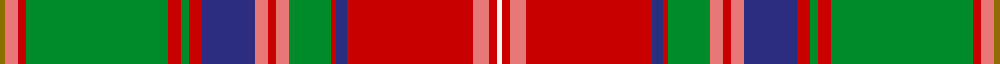

This page is one **sett** — a single exact thread-count. It belongs to the [tartan](/setts/y2ri5r3g54r5g3r5db20ri5r3ri5g16r2db4r48ri6r3w2/)
(the same proportion at any scale), whose colour order is pattern [GRRGRGRBRRRGRBRRRW](/stripes/grrgrgrbrrrgrbrrrw/).

Part of the [Sommerville](/tartans/sommerville/) tartan — the named design grouping this sett with its other cloths.

Sourced from register-of-tartans.  It is a [18 stripe tartan](/stripes/stripes18/).

Original link https://www.tartanregister.gov.uk/tartanDetails.aspx?ref=3835

## Register references

External register numbers recorded for this tartan.

- Scottish Register of Tartans: [3835](https://www.tartanregister.gov.uk/tartanDetails.aspx?ref=3835)
- Scottish Tartans Authority (ITI): 1861
- Scottish Tartans World Register: 1861

## Thread count
Y/4 Ri10 R6 G108 R10 G6 R10 DB40 Ri10 R6 Ri10 G32 R4 DB8 R96 Ri12 R6 W/4

One full sett is **756 threads**.

## Palette
<table><thead><tr><th>Colour</th><th>Shade</th><th>OKLCh</th></tr></thead><tbody><tr><td>DB</td><td><code style="background-color:#003C64;">#003C64</code> <small style="color:#888">#003C64</small></td><td><small style="color:#888">oklch(34.5% 0.089 246.0)</small></td></tr><tr><td>DB</td><td><code style="background-color:#2C2C80;">#2C2C80</code> <small style="color:#888">#2C2C80</small></td><td><small style="color:#888">oklch(35.0% 0.138 276.6)</small></td></tr><tr><td>DR</td><td><code style="background-color:#55120C;">#55120C</code> <small style="color:#888">#55120C</small></td><td><small style="color:#888">oklch(30.0% 0.099 29.3)</small></td></tr><tr><td>R</td><td><code style="background-color:#A00000;">#A00000</code> <small style="color:#888">#A00000</small></td><td><small style="color:#888">oklch(44.3% 0.182 29.2)</small></td></tr><tr><td>LO</td><td><code style="background-color:#FF9C34;">#FF9C34</code> <small style="color:#888">#FF9C34</small></td><td><small style="color:#888">oklch(77.9% 0.161 61.8)</small></td></tr><tr><td>DG</td><td><code style="background-color:#053819;">#053819</code> <small style="color:#888">#053819</small></td><td><small style="color:#888">oklch(30.0% 0.075 151.3)</small></td></tr><tr><td>G</td><td><code style="background-color:#008B2A;">#008B2A</code> <small style="color:#888">#008B2A</small></td><td><small style="color:#888">oklch(55.4% 0.170 145.9)</small></td></tr><tr><td>W</td><td><code style="background-color:#F7F7F7;">#F7F7F7</code> <small style="color:#888">#F7F7F7</small></td><td><small style="color:#888">oklch(97.6% 0.000 89.9)</small></td></tr><tr><td>R</td><td><code style="background-color:#E87878;">#E87878</code> <small style="color:#888">#E87878</small></td><td><small style="color:#888">oklch(70.0% 0.139 21.2)</small></td></tr><tr><td>LB</td><td><code style="background-color:#B5BBDE;">#B5BBDE</code> <small style="color:#888">#B5BBDE</small></td><td><small style="color:#888">oklch(79.9% 0.050 277.6)</small></td></tr><tr><td>R</td><td><code style="background-color:#C80000;">#C80000</code> <small style="color:#888">#C80000</small></td><td><small style="color:#888">oklch(52.3% 0.215 29.2)</small></td></tr><tr><td>Y</td><td><code style="background-color:#8B6E00;">#8B6E00</code> <small style="color:#888">#8B6E00</small></td><td><small style="color:#888">oklch(55.1% 0.113 90.4)</small></td></tr></tbody></table>

# Sample pattern

## Nearest variants

The nearest existing variants by ΔTartan distance, with this cloth at the top so the swatches line up against it.

ΔTartan

Threads

Variant

Sett

—

756

<a href="/variants/s18/y2ri5r3g54r5g3r5db20ri5r3ri5g16r2db4r48ri6r3w2~x2~ri2806019-r2109032-db1406275/">Sommerville</a>

<a href="/ttd/edit/#slug=y2ri5r3g54r5g3r5db20ri5r3ri5g16r2db4r48ri6r3w2~x2~ri2806019-r2109032&amp;base=y2ri5r3g54r5g3r5db20ri5r3ri5g16r2db4r48ri6r3w2~x2~ri2806019-r2109032-db1406275" title="compare in the TTD">0.00</a>

756

<a href="/variants/s18/y2ri5r3g54r5g3r5db20ri5r3ri5g16r2db4r48ri6r3w2~x2~ri2806019-r2109032/">Somerville (Name)</a>

<a href="/ttd/edit/#slug=y2ri5r3g54r5g3r5db21ri5r3ri5g17r2db4r48ri5r3w2~ri2406019-r2109032&amp;base=y2ri5r3g54r5g3r5db20ri5r3ri5g16r2db4r48ri6r3w2~x2~ri2806019-r2109032-db1406275" title="compare in the TTD">0.03</a>

380

<a href="/variants/s18/y2ri5r3g54r5g3r5db21ri5r3ri5g17r2db4r48ri5r3w2~ri2406019-r2109032/">Sommerville Family Tartan</a>

<a href="/ttd/edit/#slug=y2b5r3g54r5g3r5db21b5r3b5g17r2db4r48b5r3w2&amp;base=y2ri5r3g54r5g3r5db20ri5r3ri5g16r2db4r48ri6r3w2~x2~ri2806019-r2109032-db1406275" title="compare in the TTD">1.22</a>

380

<a href="/variants/s18/y2b5r3g54r5g3r5db21b5r3b5g17r2db4r48b5r3w2/">Sommerville</a>

## Neighbour map

Every grey dot is one of 13620 variants placed by the first two principal components of the ΔTartan feature space (42% of its variance). Red is this tartan; blue dots are its nearest — click one to open its page.

<svg viewBox="0 0 640 380" role="img" style="max-width:100%;height:auto;border:1px solid #e0e0e0;border-radius:4px;display:block" xmlns="http://www.w3.org/2000/svg"><image href="/nn/cloud.v1.png" width="640" height="380"/><a href="/variants/s18/y2ri5r3g54r5g3r5db20ri5r3ri5g16r2db4r48ri6r3w2~x2~ri2806019-r2109032/"><circle cx="227.6" cy="72.5" r="4" fill="#3465a4"><title>Somerville (Name)</title></circle></a><a href="/variants/s18/y2ri5r3g54r5g3r5db21ri5r3ri5g17r2db4r48ri5r3w2~ri2406019-r2109032/"><circle cx="234.1" cy="74.1" r="4" fill="#3465a4"><title>Sommerville Family Tartan</title></circle></a><a href="/variants/s18/y2b5r3g54r5g3r5db21b5r3b5g17r2db4r48b5r3w2/"><circle cx="227.0" cy="74.2" r="4" fill="#3465a4"><title>Sommerville</title></circle></a><circle cx="235.5" cy="74.8" r="5" fill="#c00000"/><text x="320" y="376" text-anchor="middle" font-size="11" fill="#999">ground</text><text x="11" y="190" text-anchor="middle" font-size="11" fill="#999" transform="rotate(-90 11 190)">complexity</text></svg>

ID: /variants/s18/y2ri5r3g54r5g3r5db20ri5r3ri5g16r2db4r48ri6r3w2~x2~ri2806019-r2109032-db1406275/
