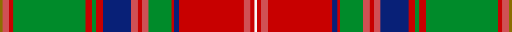
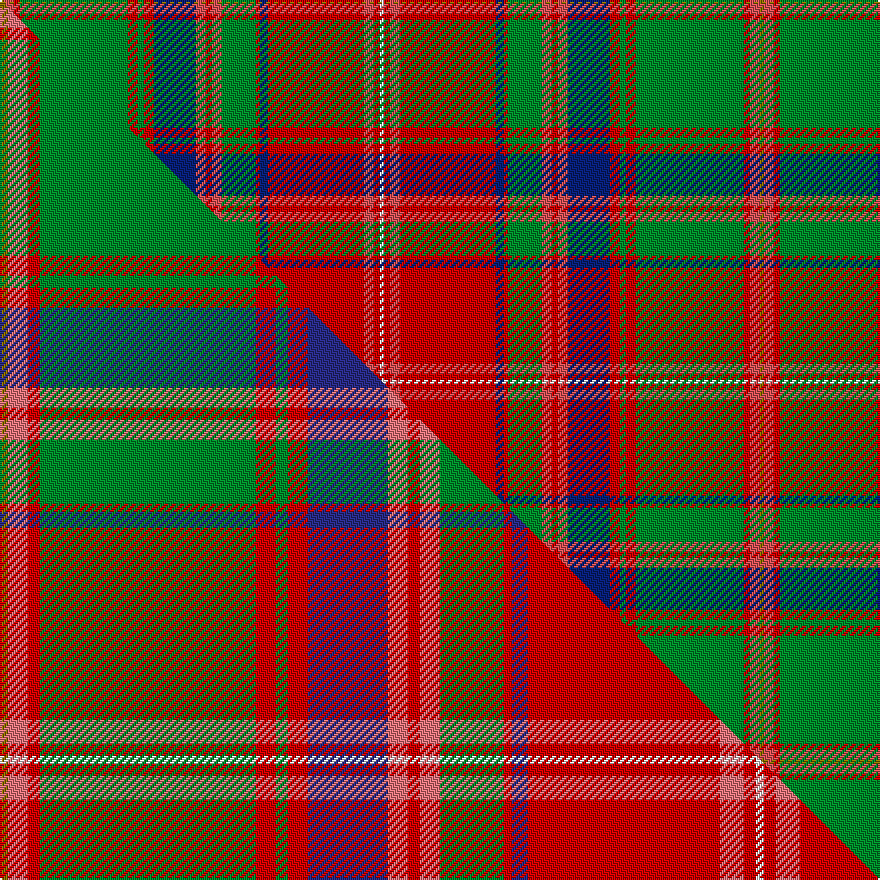

This page is one **sett** — a single exact thread-count. It belongs to the [tartan](/setts/y2ri5r3g54r5g3r5db21ri5r3ri5g17r2db4r48ri5r3w2/)
(the same proportion at any scale), whose colour order is pattern [GRRGRGRBRRRGRBRRRW](/stripes/grrgrgrbrrrgrbrrrw/).

Part of the [Sommerville](/tartans/sommerville/) tartan — the named design grouping this sett with its other cloths.

Sourced from house-of-tartan.  It is a [18 stripe tartan](/stripes/stripes18/).

Original link http://www.house-of-tartan.scotland.net/house/TartanViewjs.asp?colr=Def&tnam=1861

## Provenance

Earliest known date: 1930 The specimen in the Society's collection was obtained about 1930 from the firm J Johnston of Edinburgh. It was descibed at the time as a modern family tartan. The cloth archive also contains a sample from the Lochcarron weavers.

## Thread count
Y/2 Ri5 R3 G54 R5 G3 R5 DB21 Ri5 R3 Ri5 G17 R2 DB4 R48 Ri5 R3 W/2

One full sett is **380 threads**.

## Palette
<table><thead><tr><th>Colour</th><th>Shade</th><th>OKLCh</th></tr></thead><tbody><tr><td>DB</td><td><code style="background-color:#082077;">#082077</code> <small style="color:#888">#082077</small></td><td><small style="color:#888">oklch(30.0% 0.149 265.1)</small></td></tr><tr><td>R</td><td><code style="background-color:#D05054;">#D05054</code> <small style="color:#888">#D05054</small></td><td><small style="color:#888">oklch(60.2% 0.162 21.5)</small></td></tr><tr><td>G</td><td><code style="background-color:#008B2A;">#008B2A</code> <small style="color:#888">#008B2A</small></td><td><small style="color:#888">oklch(55.4% 0.170 145.9)</small></td></tr><tr><td>W</td><td><code style="background-color:#F7F7F7;">#F7F7F7</code> <small style="color:#888">#F7F7F7</small></td><td><small style="color:#888">oklch(97.6% 0.000 89.9)</small></td></tr><tr><td>R</td><td><code style="background-color:#C80000;">#C80000</code> <small style="color:#888">#C80000</small></td><td><small style="color:#888">oklch(52.3% 0.215 29.2)</small></td></tr><tr><td>Y</td><td><code style="background-color:#8B6E00;">#8B6E00</code> <small style="color:#888">#8B6E00</small></td><td><small style="color:#888">oklch(55.1% 0.113 90.4)</small></td></tr></tbody></table>

# Sample pattern

## Compared to the master

This cloth is one sett of its design; the master sett (the exemplar the design is anchored on) is below for comparison.

Its **ΔTartan distance** from the master is **0.08** — the same measure the nearest-tartans table ranks by (0 is identical; a re-scale of the same cloth is near 0, a recolour or a different proportion further).

<figure class="master-compare" style="margin:0">

this sett
master sett ★

<figcaption style="color:#888;font-size:smaller">One weave of this sett against the <a href="/setts/y2ri5r3g54r5g3r5db20ri5r3ri5g16r2db4r48ri6r3w2/">master sett ★</a>, split on the diagonal: a shared proportion runs seamlessly across it with only the shades shifting; a different proportion breaks on it.</figcaption>
</figure>

## Nearest tartan variants

The nearest existing variants by ΔTartan distance, with this cloth at the top so the swatches line up against it.

ΔTartan

Threads

Variant

Sett

—

380

<a href="/variants/s18/y2ri5r3g54r5g3r5db21ri5r3ri5g17r2db4r48ri5r3w2~ri2406019-r2109032/">Sommerville Family Tartan</a>

<a href="/ttd/edit/#slug=y2ri5r3g54r5g3r5db20ri5r3ri5g16r2db4r48ri6r3w2~x2~ri2806019-r2109032&amp;base=y2ri5r3g54r5g3r5db21ri5r3ri5g17r2db4r48ri5r3w2~ri2406019-r2109032" title="compare in the TTD">0.05</a>

756

<a href="/variants/s18/y2ri5r3g54r5g3r5db20ri5r3ri5g16r2db4r48ri6r3w2~x2~ri2806019-r2109032/">Somerville (Name)</a>

<a href="/ttd/edit/#slug=y2ri5r3g54r5g3r5db20ri5r3ri5g16r2db4r48ri6r3w2~x2~ri2806019-r2109032-db1406275&amp;base=y2ri5r3g54r5g3r5db21ri5r3ri5g17r2db4r48ri5r3w2~ri2406019-r2109032" title="compare in the TTD">0.07</a>

756

<a href="/variants/s18/y2ri5r3g54r5g3r5db20ri5r3ri5g16r2db4r48ri6r3w2~x2~ri2806019-r2109032-db1406275/">Sommerville</a>

<a href="/ttd/edit/#slug=y2b5r3g54r5g3r5db21b5r3b5g17r2db4r48b5r3w2&amp;base=y2ri5r3g54r5g3r5db21ri5r3ri5g17r2db4r48ri5r3w2~ri2406019-r2109032" title="compare in the TTD">1.20</a>

380

<a href="/variants/s18/y2b5r3g54r5g3r5db21b5r3b5g17r2db4r48b5r3w2/">Sommerville</a>

<a href="/ttd/edit/#slug=y2ri5r3w54r5g3r5db20ri5r3ri5g16r2db4r48ri6r3w2~x2~ri2806019-r2109032&amp;base=y2ri5r3g54r5g3r5db21ri5r3ri5g17r2db4r48ri5r3w2~ri2406019-r2109032" title="compare in the TTD">1.43</a>

756

<a href="/variants/s18/y2ri5r3w54r5g3r5db20ri5r3ri5g16r2db4r48ri6r3w2~x2~ri2806019-r2109032/">Somerville Dress (Name?)</a>

<a href="/ttd/edit/#slug=lb1b4dg2r2g27r4g2r4dp10b3dg2r2dg2b3g10r10g10r2dp2r26b3dg2r3lb1~x2&amp;base=y2ri5r3g54r5g3r5db21ri5r3ri5g17r2db4r48ri5r3w2~ri2406019-r2109032" title="compare in the TTD">1.71</a>

544

<a href="/variants/s24/lb1b4dg2r2g27r4g2r4dp10b3dg2r2dg2b3g10r10g10r2dp2r26b3dg2r3lb1~x2/">MacDougal 1</a>

<a href="/ttd/edit/#slug=lb2dp10r3ri4g72ri7g4ri10db24dp6r5ri4r5dp7g24ri24g24ri3db3ri74dp7r5ri6lb2~x2~r2208029-ri2209032&amp;base=y2ri5r3g54r5g3r5db21ri5r3ri5g17r2db4r48ri5r3w2~ri2406019-r2109032" title="compare in the TTD">1.84</a>

1332

<a href="/variants/s24/lb2dp10r3ri4g72ri7g4ri10db24dp6r5ri4r5dp7g24ri24g24ri3db3ri74dp7r5ri6lb2~x2~r2208029-ri2209032/">MacDougall of MacDougall</a>

<a href="/ttd/edit/#slug=lb2dp10b3r4g72r7g4r10db24dp6b5r4b5dp7g24r24g24r3db3r74dp7b5r6lb2~x2&amp;base=y2ri5r3g54r5g3r5db21ri5r3ri5g17r2db4r48ri5r3w2~ri2406019-r2109032" title="compare in the TTD">1.94</a>

1332

<a href="/variants/s24/lb2dp10b3r4g72r7g4r10db24dp6b5r4b5dp7g24r24g24r3db3r74dp7b5r6lb2~x2/">MacDougall, of MacDougall</a>

<a href="/ttd/edit/#slug=lb1r5b2ri3g24ri5g2ri5db11r3b2ri2b2r3g11ri11g11ri2db2ri25r3b2ri5lb1~x2~r1707016-ri2008029&amp;base=y2ri5r3g54r5g3r5db21ri5r3ri5g17r2db4r48ri5r3w2~ri2406019-r2109032" title="compare in the TTD">2.25</a>

568

<a href="/variants/s24/lb1r5b2ri3g24ri5g2ri5db11r3b2ri2b2r3g11ri11g11ri2db2ri25r3b2ri5lb1~x2~r1707016-ri2008029/">MacDougall 5</a>

<a href="/ttd/edit/#slug=db1g2db1g3dg6db1g6db2lo5r13dy23lo1dy1lo1dy2lo1~x2~g1903114-dg1806142&amp;base=y2ri5r3g54r5g3r5db21ri5r3ri5g17r2db4r48ri5r3w2~ri2406019-r2109032" title="compare in the TTD">2.31</a>

272

<a href="/variants/s16/db1g2db1g3dg6db1g6db2lo5r13dy23lo1dy1lo1dy2lo1~x2~g1903114-dg1806142/">Langermann (Name)</a>

<a href="/ttd/edit/#slug=g14r6ri2db3r65db2lb2r6db34r6lb2db2r4g66r12ri2db2lb4~r2109032-ri2406019&amp;base=y2ri5r3g54r5g3r5db21ri5r3ri5g17r2db4r48ri5r3w2~ri2406019-r2109032" title="compare in the TTD">2.35</a>

450

<a href="/variants/s18/g14r6ri2db3r65db2lb2r6db34r6lb2db2r4g66r12ri2db2lb4~r2109032-ri2406019/">Stewart of Ardshiel Clan Tartan</a>

## Neighbour map

Every grey dot is one of 13620 variants placed by the first two principal components of the ΔTartan feature space (42% of its variance). Red is this tartan; blue dots are its nearest — click one to open its page.

<svg viewBox="0 0 640 380" role="img" style="max-width:100%;height:auto;border:1px solid #e0e0e0;border-radius:4px;display:block" xmlns="http://www.w3.org/2000/svg"><image href="/nn/cloud.v1.png" width="640" height="380"/><a href="/variants/s18/y2ri5r3g54r5g3r5db20ri5r3ri5g16r2db4r48ri6r3w2~x2~ri2806019-r2109032/"><circle cx="227.6" cy="72.5" r="4" fill="#3465a4"><title>Somerville (Name)</title></circle></a><a href="/variants/s18/y2ri5r3g54r5g3r5db20ri5r3ri5g16r2db4r48ri6r3w2~x2~ri2806019-r2109032-db1406275/"><circle cx="235.5" cy="74.8" r="4" fill="#3465a4"><title>Sommerville</title></circle></a><a href="/variants/s18/y2b5r3g54r5g3r5db21b5r3b5g17r2db4r48b5r3w2/"><circle cx="227.0" cy="74.2" r="4" fill="#3465a4"><title>Sommerville</title></circle></a><a href="/variants/s18/y2ri5r3w54r5g3r5db20ri5r3ri5g16r2db4r48ri6r3w2~x2~ri2806019-r2109032/"><circle cx="169.0" cy="57.9" r="4" fill="#3465a4"><title>Somerville Dress (Name?)</title></circle></a><a href="/variants/s24/lb1b4dg2r2g27r4g2r4dp10b3dg2r2dg2b3g10r10g10r2dp2r26b3dg2r3lb1~x2/"><circle cx="217.1" cy="74.9" r="4" fill="#3465a4"><title>MacDougal 1</title></circle></a><a href="/variants/s24/lb2dp10r3ri4g72ri7g4ri10db24dp6r5ri4r5dp7g24ri24g24ri3db3ri74dp7r5ri6lb2~x2~r2208029-ri2209032/"><circle cx="235.1" cy="49.6" r="4" fill="#3465a4"><title>MacDougall of MacDougall</title></circle></a><a href="/variants/s24/lb2dp10b3r4g72r7g4r10db24dp6b5r4b5dp7g24r24g24r3db3r74dp7b5r6lb2~x2/"><circle cx="235.1" cy="51.8" r="4" fill="#3465a4"><title>MacDougall, of MacDougall</title></circle></a><a href="/variants/s24/lb1r5b2ri3g24ri5g2ri5db11r3b2ri2b2r3g11ri11g11ri2db2ri25r3b2ri5lb1~x2~r1707016-ri2008029/"><circle cx="222.7" cy="86.3" r="4" fill="#3465a4"><title>MacDougall 5</title></circle></a><a href="/variants/s16/db1g2db1g3dg6db1g6db2lo5r13dy23lo1dy1lo1dy2lo1~x2~g1903114-dg1806142/"><circle cx="211.5" cy="94.1" r="4" fill="#3465a4"><title>Langermann (Name)</title></circle></a><a href="/variants/s18/g14r6ri2db3r65db2lb2r6db34r6lb2db2r4g66r12ri2db2lb4~r2109032-ri2406019/"><circle cx="271.2" cy="69.4" r="4" fill="#3465a4"><title>Stewart of Ardshiel Clan Tartan</title></circle></a><circle cx="234.1" cy="74.1" r="5" fill="#c00000"/><text x="320" y="376" text-anchor="middle" font-size="11" fill="#999">ground</text><text x="11" y="190" text-anchor="middle" font-size="11" fill="#999" transform="rotate(-90 11 190)">complexity</text></svg>

ID: /variants/s18/y2ri5r3g54r5g3r5db21ri5r3ri5g17r2db4r48ri5r3w2~ri2406019-r2109032/
