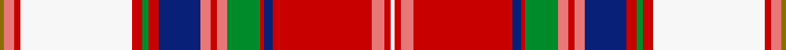

This page is one **sett** — a single exact thread-count. It belongs to the [tartan](/setts/y2ri5r3w54r5g3r5db20ri5r3ri5g16r2db4r48ri6r3w2/)
(the same proportion at any scale), whose colour order is pattern [GRRWRGRBRRRGRBRRRW](/stripes/grrwrgrbrrrgrbrrrw/).

Sourced from tartans-authority.  It is a [18 stripe tartan](/stripes/stripes18/).

Original link http://www.tartansauthority.com/tartan-ferret/display/8847/

## Register references

External register numbers recorded for this tartan.

- Scottish Register of Tartans: [8847](https://www.tartanregister.gov.uk/tartanDetails?ref=8847)
- Scottish Tartans Authority (ITI): 8847

## Thread count
Y/4 Ri10 R6 W108 R10 G6 R10 DB40 Ri10 R6 Ri10 G32 R4 DB8 R96 Ri12 R6 W/4

One full sett is **756 threads**.

## Palette
<table><thead><tr><th>Colour</th><th>Shade</th><th>OKLCh</th></tr></thead><tbody><tr><td>DB</td><td><code style="background-color:#082077;">#082077</code> <small style="color:#888">#082077</small></td><td><small style="color:#888">oklch(30.0% 0.149 265.1)</small></td></tr><tr><td>G</td><td><code style="background-color:#008B2A;">#008B2A</code> <small style="color:#888">#008B2A</small></td><td><small style="color:#888">oklch(55.4% 0.170 145.9)</small></td></tr><tr><td>W</td><td><code style="background-color:#F7F7F7;">#F7F7F7</code> <small style="color:#888">#F7F7F7</small></td><td><small style="color:#888">oklch(97.6% 0.000 89.9)</small></td></tr><tr><td>R</td><td><code style="background-color:#E87878;">#E87878</code> <small style="color:#888">#E87878</small></td><td><small style="color:#888">oklch(70.0% 0.139 21.2)</small></td></tr><tr><td>R</td><td><code style="background-color:#C80000;">#C80000</code> <small style="color:#888">#C80000</small></td><td><small style="color:#888">oklch(52.3% 0.215 29.2)</small></td></tr><tr><td>Y</td><td><code style="background-color:#8B6E00;">#8B6E00</code> <small style="color:#888">#8B6E00</small></td><td><small style="color:#888">oklch(55.1% 0.113 90.4)</small></td></tr></tbody></table>

# Sample pattern

## Nearest tartan variants

The nearest existing variants by ΔTartan distance, with this cloth at the top so the swatches line up against it.

ΔTartan

Threads

Variant

Sett

—

756

<a href="/variants/s18/y2ri5r3w54r5g3r5db20ri5r3ri5g16r2db4r48ri6r3w2~x2~ri2806019-r2109032/">Somerville Dress (Name?)</a>

<a href="/ttd/edit/#slug=y2ri5r3g54r5g3r5db20ri5r3ri5g16r2db4r48ri6r3w2~x2~ri2806019-r2109032&amp;base=y2ri5r3w54r5g3r5db20ri5r3ri5g16r2db4r48ri6r3w2~x2~ri2806019-r2109032" title="compare in the TTD">1.40</a>

756

<a href="/variants/s18/y2ri5r3g54r5g3r5db20ri5r3ri5g16r2db4r48ri6r3w2~x2~ri2806019-r2109032/">Somerville (Name)</a>

<a href="/ttd/edit/#slug=y2b5r3g54r5g3r5db21b5r3b5g17r2db4r48b5r3w2&amp;base=y2ri5r3w54r5g3r5db20ri5r3ri5g16r2db4r48ri6r3w2~x2~ri2806019-r2109032" title="compare in the TTD">2.62</a>

380

<a href="/variants/s18/y2b5r3g54r5g3r5db21b5r3b5g17r2db4r48b5r3w2/">Sommerville</a>

## Neighbour map

Every grey dot is one of 13620 variants placed by the first two principal components of the ΔTartan feature space (42% of its variance). Red is this tartan; blue dots are its nearest — click one to open its page.

<svg viewBox="0 0 640 380" role="img" style="max-width:100%;height:auto;border:1px solid #e0e0e0;border-radius:4px;display:block" xmlns="http://www.w3.org/2000/svg"><image href="/nn/cloud.v1.png" width="640" height="380"/><a href="/variants/s18/y2ri5r3g54r5g3r5db20ri5r3ri5g16r2db4r48ri6r3w2~x2~ri2806019-r2109032/"><circle cx="227.6" cy="72.5" r="4" fill="#3465a4"><title>Somerville (Name)</title></circle></a><a href="/variants/s18/y2b5r3g54r5g3r5db21b5r3b5g17r2db4r48b5r3w2/"><circle cx="227.0" cy="74.2" r="4" fill="#3465a4"><title>Sommerville</title></circle></a><circle cx="169.0" cy="57.9" r="5" fill="#c00000"/><text x="320" y="376" text-anchor="middle" font-size="11" fill="#999">ground</text><text x="11" y="190" text-anchor="middle" font-size="11" fill="#999" transform="rotate(-90 11 190)">complexity</text></svg>

ID: /variants/s18/y2ri5r3w54r5g3r5db20ri5r3ri5g16r2db4r48ri6r3w2~x2~ri2806019-r2109032/
