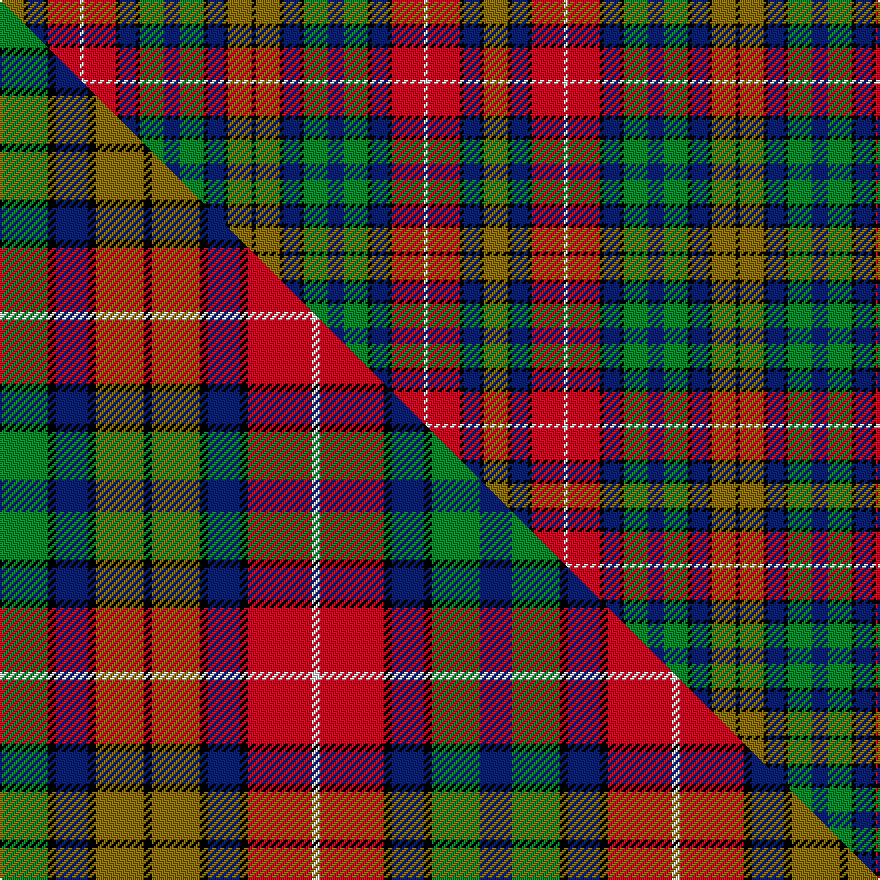

This page is one **sett** — a single exact thread-count. It belongs to the [tartan](/setts/y6k1db4k1r8w1r8k1db4k1g6db4g6k1db4k1y6k1/)
(the same proportion at any scale), whose colour order is pattern [GKBKRWRKBKGBGKBKGK](/stripes/gkbkrwrkbkgbgkbkgk/).

Part of the [Buchanan](/tartans/buchanan/) tartan — the named design grouping this sett with its other cloths.

Sourced from weddslist.  It is a [18 stripe tartan](/stripes/stripes18/).

Original link http://www.weddslist.com/cgi-bin/tartans/pg.pl?source=rb

3 attestations — the source records this cloth was collapsed from (oldest owns this page)

<ul>
<li>undated — Buchanan (weddslist, <a href="http://www.weddslist.com/cgi-bin/tartans/pg.pl?source=rb">record</a>) </li>
<li>undated — Buchanan (a) (weddslist, <a href="http://www.weddslist.com/cgi-bin/tartans/pg.pl?source=tinsel">record</a>) </li>
<li>undated — Buchanan (weddslist, <a href="http://www.weddslist.com/cgi-bin/tartans/pg.pl?source=x">record</a>) </li>
</ul>

## Thread count
Y/12 K2 DB8 K2 R16 W2 R16 K2 DB8 K2 G12 DB8 G12 K2 DB8 K2 Y12 K/2

One full sett is **242 threads**.

## Palette
<table><thead><tr><th>Colour</th><th>Shade</th><th>OKLCh</th></tr></thead><tbody><tr><td>DB</td><td><code style="background-color:#082077;">#082077</code> <small style="color:#888">#082077</small></td><td><small style="color:#888">oklch(30.0% 0.149 265.1)</small></td></tr><tr><td>G</td><td><code style="background-color:#008B2A;">#008B2A</code> <small style="color:#888">#008B2A</small></td><td><small style="color:#888">oklch(55.4% 0.170 145.9)</small></td></tr><tr><td>K</td><td><code style="background-color:#000000;">#000000</code> <small style="color:#888">#000000</small></td><td><small style="color:#888">oklch(0.0% 0.000 0.0)</small></td></tr><tr><td>W</td><td><code style="background-color:#F7F7F7;">#F7F7F7</code> <small style="color:#888">#F7F7F7</small></td><td><small style="color:#888">oklch(97.6% 0.000 89.9)</small></td></tr><tr><td>R</td><td><code style="background-color:#D60020;">#D60020</code> <small style="color:#888">#D60020</small></td><td><small style="color:#888">oklch(55.2% 0.224 25.5)</small></td></tr><tr><td>Y</td><td><code style="background-color:#8B6E00;">#8B6E00</code> <small style="color:#888">#8B6E00</small></td><td><small style="color:#888">oklch(55.1% 0.113 90.4)</small></td></tr></tbody></table>

# Sample pattern

## Compared to the master

This cloth is one sett of its design; the master sett (the exemplar the design is anchored on) is below for comparison.

Its **ΔTartan distance** from the master is **0.00** — the same measure the nearest-tartans table ranks by (0 is identical; a re-scale of the same cloth is near 0, a recolour or a different proportion further).

<figure class="master-compare" style="margin:0">

this sett
master sett ★

<figcaption style="color:#888;font-size:smaller">One weave of this sett against the <a href="/setts/g6k1db4k1y6k1y6k1db4k1r8w1r8k1db4k1g6db4/">master sett ★</a>, split on the diagonal: a shared proportion runs seamlessly across it with only the shades shifting; a different proportion breaks on it.</figcaption>
</figure>

## Nearest tartan variants

The nearest existing variants by ΔTartan distance, with this cloth at the top so the swatches line up against it.

ΔTartan

Threads

Variant

Sett

—

242

<a href="/variants/s18/y6k1db4k1r8w1r8k1db4k1g6db4g6k1db4k1y6k1~x2/">Buchanan</a>

<a href="/ttd/edit/#slug=g6k1db4k1y6k1y6k1db4k1r8w1r8k1db4k1g6db4~x4&amp;base=y6k1db4k1r8w1r8k1db4k1g6db4g6k1db4k1y6k1~x2" title="compare in the TTD">0.00</a>

472

<a href="/variants/s18/g6k1db4k1y6k1y6k1db4k1r8w1r8k1db4k1g6db4~x4/">Buchanan (Wilson)</a>

<a href="/ttd/edit/#slug=g6k1db4k1y6k1y6k1db4k1r8w1r8k1db4k1g6db4~x2&amp;base=y6k1db4k1r8w1r8k1db4k1g6db4g6k1db4k1y6k1~x2" title="compare in the TTD">0.00</a>

236

<a href="/variants/s18/g6k1db4k1y6k1y6k1db4k1r8w1r8k1db4k1g6db4~x2/">Buchanan Clan Tartan</a>

<a href="/ttd/edit/#slug=g12k1db4k1y6k1y6k1db4k1r8w1r8k1db4k1g6db4~x4&amp;base=y6k1db4k1r8w1r8k1db4k1g6db4g6k1db4k1y6k1~x2" title="compare in the TTD">0.22</a>

496

<a href="/variants/s18/g12k1db4k1y6k1y6k1db4k1r8w1r8k1db4k1g6db4~x4/">Buchanan 2</a>

<a href="/ttd/edit/#slug=g23k3db9k3r20w3r20k3db9k3y20k3y20k3db9k3g23db9~x2&amp;base=y6k1db4k1r8w1r8k1db4k1g6db4g6k1db4k1y6k1~x2" title="compare in the TTD">0.35</a>

680

<a href="/variants/s18/g23k3db9k3r20w3r20k3db9k3y20k3y20k3db9k3g23db9~x2/">Buchanan</a>

<a href="/ttd/edit/#slug=g6k1lb3k1y6k1y6k1lb3k1r6w1r6k1lb3k1g6lb3~x4&amp;base=y6k1db4k1r8w1r8k1db4k1g6db4g6k1db4k1y6k1~x2" title="compare in the TTD">0.37</a>

412

<a href="/variants/s18/g6k1lb3k1y6k1y6k1lb3k1r6w1r6k1lb3k1g6lb3~x4/">Buchanan Old Clan Tartan</a>

<a href="/ttd/edit/#slug=db9g23k3db9k3r20w3r20k3db9k3y20k3y20k3db9k3g23db9~x2&amp;base=y6k1db4k1r8w1r8k1db4k1g6db4g6k1db4k1y6k1~x2" title="compare in the TTD">1.32</a>

744

<a href="/variants/s19/db9g23k3db9k3r20w3r20k3db9k3y20k3y20k3db9k3g23db9~x2/">Buchanan (1850 - Clan)</a>

<a href="/ttd/edit/#slug=db3g1k3db3k3g1db3g1r6w1r6db4y5db1y5g1~x4&amp;base=y6k1db4k1r8w1r8k1db4k1g6db4g6k1db4k1y6k1~x2" title="compare in the TTD">1.96</a>

360

<a href="/variants/s16/db3g1k3db3k3g1db3g1r6w1r6db4y5db1y5g1~x4/">Buchanan Incorrect</a>

<a href="/ttd/edit/#slug=k13lb7k2r14g14w2lb3w2g14r14k15lb7~x2&amp;base=y6k1db4k1r8w1r8k1db4k1g6db4g6k1db4k1y6k1~x2" title="compare in the TTD">2.11</a>

388

<a href="/variants/s12/k13lb7k2r14g14w2lb3w2g14r14k15lb7~x2/">Coulter (Personal)</a>

<a href="/ttd/edit/#slug=r13w2r13k3dr13g21db3k18db9k2db2k2db15w2~x2&amp;base=y6k1db4k1r8w1r8k1db4k1g6db4g6k1db4k1y6k1~x2" title="compare in the TTD">2.24</a>

442

<a href="/variants/s14/r13w2r13k3dr13g21db3k18db9k2db2k2db15w2~x2/">Taiwan Scottish</a>

<a href="/ttd/edit/#slug=lb7k9ly2k2ly2r14g14w2lb3w2g14r14k2lb7k9ly2k2~x2&amp;base=y6k1db4k1r8w1r8k1db4k1g6db4g6k1db4k1y6k1~x2" title="compare in the TTD">2.25</a>

410

<a href="/variants/s17/lb7k9ly2k2ly2r14g14w2lb3w2g14r14k2lb7k9ly2k2~x2/">Coulter (Personal)</a>

## Neighbour map

Every grey dot is one of 13620 variants placed by the first two principal components of the ΔTartan feature space (42% of its variance). Red is this tartan; blue dots are its nearest — click one to open its page.

<svg viewBox="0 0 640 380" role="img" style="max-width:100%;height:auto;border:1px solid #e0e0e0;border-radius:4px;display:block" xmlns="http://www.w3.org/2000/svg"><image href="/nn/cloud.v1.png" width="640" height="380"/><a href="/variants/s18/g6k1db4k1y6k1y6k1db4k1r8w1r8k1db4k1g6db4~x4/"><circle cx="31.8" cy="147.8" r="4" fill="#3465a4"><title>Buchanan (Wilson)</title></circle></a><a href="/variants/s18/g6k1db4k1y6k1y6k1db4k1r8w1r8k1db4k1g6db4~x2/"><circle cx="31.8" cy="147.8" r="4" fill="#3465a4"><title>Buchanan Clan Tartan</title></circle></a><a href="/variants/s18/g12k1db4k1y6k1y6k1db4k1r8w1r8k1db4k1g6db4~x4/"><circle cx="55.1" cy="125.7" r="4" fill="#3465a4"><title>Buchanan 2</title></circle></a><a href="/variants/s18/g23k3db9k3r20w3r20k3db9k3y20k3y20k3db9k3g23db9~x2/"><circle cx="32.8" cy="146.5" r="4" fill="#3465a4"><title>Buchanan</title></circle></a><a href="/variants/s18/g6k1lb3k1y6k1y6k1lb3k1r6w1r6k1lb3k1g6lb3~x4/"><circle cx="14.0" cy="160.5" r="4" fill="#3465a4"><title>Buchanan Old Clan Tartan</title></circle></a><a href="/variants/s19/db9g23k3db9k3r20w3r20k3db9k3y20k3y20k3db9k3g23db9~x2/"><circle cx="27.4" cy="146.2" r="4" fill="#3465a4"><title>Buchanan (1850 - Clan)</title></circle></a><a href="/variants/s16/db3g1k3db3k3g1db3g1r6w1r6db4y5db1y5g1~x4/"><circle cx="36.8" cy="172.0" r="4" fill="#3465a4"><title>Buchanan Incorrect</title></circle></a><a href="/variants/s12/k13lb7k2r14g14w2lb3w2g14r14k15lb7~x2/"><circle cx="14.0" cy="135.6" r="4" fill="#3465a4"><title>Coulter (Personal)</title></circle></a><a href="/variants/s14/r13w2r13k3dr13g21db3k18db9k2db2k2db15w2~x2/"><circle cx="35.8" cy="135.3" r="4" fill="#3465a4"><title>Taiwan Scottish</title></circle></a><a href="/variants/s17/lb7k9ly2k2ly2r14g14w2lb3w2g14r14k2lb7k9ly2k2~x2/"><circle cx="14.0" cy="140.0" r="4" fill="#3465a4"><title>Coulter (Personal)</title></circle></a><circle cx="31.8" cy="147.8" r="5" fill="#c00000"/><text x="320" y="376" text-anchor="middle" font-size="11" fill="#999">ground</text><text x="11" y="190" text-anchor="middle" font-size="11" fill="#999" transform="rotate(-90 11 190)">complexity</text></svg>

ID: /variants/s18/y6k1db4k1r8w1r8k1db4k1g6db4g6k1db4k1y6k1~x2/
