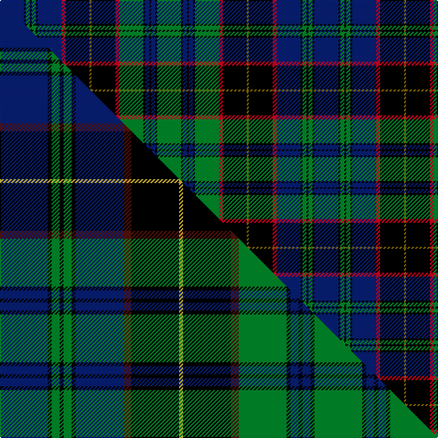

This is one **variant** — a specific cloth: this exact thread count and colourway, with its own
provenance below. It is one weaving of the [sett](/tartans/o/oc/ochiltree/) (the scale-free proportion — the
same cloth at any scale or shade), whose colour order is pattern [BKGKGKBRKGKRGKBKBKG](/stripes/bkgkgkbrkgkrgkbkbkg/).

Part of the [Ochiltree](/tartans/o/oc/ochiltree/) tartan — the named design grouping this sett with its other cloths.

Sourced from house-of-tartan.  It is a [19 stripe tartan](/stripes/stripes19/).

Original link [http://www.house-of-tartan.scotland.net/house/TartanViewjs.asp?colr=Def&tnam=321](http://www.house-of-tartan.scotland.net/house/TartanViewjs.asp?colr=Def&tnam=321)

## Provenance

Earliest known date: 1988 O'Sullivan McCragh was designed by Chris Aitken for Geoffrey (Tailor) Highland Crafts Ltd. in June 1994.

2 attestations — the source records this cloth was collapsed from (oldest owns this page)

<ul>
<li>1988 — Ochiltree Family Tartan (house-of-tartan, <a href="http://www.house-of-tartan.scotland.net/house/TartanViewjs.asp?colr=Def&tnam=321">record</a>) </li>
<li>undated — Ochiltree (weddslist, <a href="http://www.weddslist.com/cgi-bin/tartans/pg.pl?source=sts">record</a>) </li>
</ul>

Dataset <small>— provenance for this record, inherited from the source manifest</small>

<dl class="dataset-prov">
<dt>source</dt><dd><a href="/sources/house-of-tartan/">House of Tartan</a></dd>
<dt>data captured from</dt><dd><a href="https://github.com/thetartan/tartan-database/blob/master/data/house-of-tartan/data.csv">https://github.com/thetartan/tartan-database/blob/master/data/house-of-tartan/data.csv</a></dd>
<dt>data date</dt><dd>1988 <small>(this record)</small></dd>
<dt>licence</dt><dd><a href="https://creativecommons.org/licenses/by-nc-nd/4.0/">CC BY-NC-ND 4.0</a></dd>
</dl>

Capture chain <small>— the hands this data passed through, oldest first; each capture carries its own licence</small>

<ol class="capture-chain">
<li><a href="http://www.house-of-tartan.scotland.net/">House of Tartan</a> <small>the weaver/retailer's database — the site is now offline; the URL is kept as the ultimate source's identity</small></li>
<li><a href="https://github.com/thetartan/tartan-database">thetartan/tartan-database</a> <small>2016-2017</small> · <a href="https://creativecommons.org/licenses/by-nc-nd/4.0/">CC BY-NC-ND 4.0</a> <small>Levko Kravets's frozen compilation — the capture we vendored, and where its CC licence text came from</small></li>
<li>this dictionary <small>captured 2026-06-10 · commit 5bf86c7566</small> <small>each re-capture is a git commit to data/sources</small></li>
</ol>

## Thread count
DB/24 K2 G4 K2 G4 K2 DB24 R4 K24 Y2 K24 R4 G24 K2 DB4 K2 DB4 K2 G/24

One full sett is **316 threads**.

## Palette
<table><thead><tr><th>Colour</th><th>Shade</th><th>OKLCh</th></tr></thead><tbody><tr><td>DB</td><td><code style="background-color:#082077;">#082077</code> <small style="color:#888">#082077</small></td><td><small style="color:#888">oklch(30.0% 0.149 265.1)</small></td></tr><tr><td>G</td><td><code style="background-color:#008B2A;">#008B2A</code> <small style="color:#888">#008B2A</small></td><td><small style="color:#888">oklch(55.4% 0.170 145.9)</small></td></tr><tr><td>K</td><td><code style="background-color:#000000;">#000000</code> <small style="color:#888">#000000</small></td><td><small style="color:#888">oklch(0.0% 0.000 0.0)</small></td></tr><tr><td>R</td><td><code style="background-color:#D60020;">#D60020</code> <small style="color:#888">#D60020</small></td><td><small style="color:#888">oklch(55.2% 0.224 25.5)</small></td></tr><tr><td>Y</td><td><code style="background-color:#8B6E00;">#8B6E00</code> <small style="color:#888">#8B6E00</small></td><td><small style="color:#888">oklch(55.1% 0.113 90.4)</small></td></tr></tbody></table>

# Sample pattern

[Sample sheet (PDF)](swatch.pdf) — the woven sample, thread count and palette on one printable A4, rendered on demand (the same sheet the TTD print page downloads).

## Compared to the master

This cloth is one sett of its design; the master sett (the exemplar the design is anchored on) is below for comparison.

Its **ΔTartan distance** from the master is **0.04** — the same measure the nearest-tartans table ranks by (0 is identical; a re-scale of the same cloth is near 0, a recolour or a different proportion further).

<figure class="master-compare" style="margin:0">

this sett
master sett ★

<figcaption style="color:#888;font-size:smaller">One weave of this sett against the <a href="/setts/db12k1g2k1g2k1db12dr2k12ly1k12dr2g12k1db2k1db2k1g12/">master sett ★</a>, split on the diagonal: a shared proportion runs seamlessly across it with only the shades shifting; a different proportion breaks on it.</figcaption>
</figure>

## Nearest tartan variants

The nearest existing variants by ΔTartan distance, with this cloth at the top so the swatches line up against it.

ΔTartan

Threads

Variant

Sett

—

316

<a href="/variants/s19/db12k1g2k1g2k1db12r2k12y1k12r2g12k1db2k1db2k1g12~x2/">Ochiltree Family Tartan</a>

<a href="/ttd/edit/#slug=db12k1g2k1g2k1db12dr2k12ly1k12dr2g12k1db2k1db2k1g12~x4&amp;base=db12k1g2k1g2k1db12r2k12y1k12r2g12k1db2k1db2k1g12~x2" title="compare in the TTD">0.04</a>

632

<a href="/variants/s19/db12k1g2k1g2k1db12dr2k12ly1k12dr2g12k1db2k1db2k1g12~x4/">Ochiltree (Name)</a>

<a href="/ttd/edit/#slug=db12k1g2k1g2k1db12dr2k25dr2g12k1db2k1db2k1g12~x4&amp;base=db12k1g2k1g2k1db12r2k12y1k12r2g12k1db2k1db2k1g12~x2" title="compare in the TTD">0.32</a>

632

<a href="/variants/s17/db12k1g2k1g2k1db12dr2k25dr2g12k1db2k1db2k1g12~x4/">O'Connor / Ochiltree</a>

<a href="/ttd/edit/#slug=db24k2db2r2db2k20g16y2g2y3~x2~db3514276&amp;base=db12k1g2k1g2k1db12r2k12y1k12r2g12k1db2k1db2k1g12~x2" title="compare in the TTD">1.20</a>

246

<a href="/variants/s10/db24k2db2r2db2k20g16y2g2y3~x2~db3514276/">Watson</a>

<a href="/ttd/edit/#slug=db15k1db1k1db1k12g9r1g9k1w1k1g9r1g9k12r1db9r2db1r1db6w1~x2&amp;base=db12k1g2k1g2k1db12r2k12y1k12r2g12k1db2k1db2k1g12~x2" title="compare in the TTD">1.33</a>

388

<a href="/variants/s23/db15k1db1k1db1k12g9r1g9k1w1k1g9r1g9k12r1db9r2db1r1db6w1~x2/">Rankine</a>

<a href="/ttd/edit/#slug=r4k2db16k16g16ly4g16k16db1k1db1k1db1k1db8r2~x2&amp;base=db12k1g2k1g2k1db12r2k12y1k12r2g12k1db2k1db2k1g12~x2" title="compare in the TTD">1.49</a>

412

<a href="/variants/s16/r4k2db16k16g16ly4g16k16db1k1db1k1db1k1db8r2~x2/">Farquharson</a>

<a href="/ttd/edit/#slug=k19db2g10ly3g10db2k24db2g10db18g5db2k7db2g5db18g10db2k5~x2&amp;base=db12k1g2k1g2k1db12r2k12y1k12r2g12k1db2k1db2k1g12~x2" title="compare in the TTD">1.50</a>

576

<a href="/variants/s19/k19db2g10ly3g10db2k24db2g10db18g5db2k7db2g5db18g10db2k5~x2/">Offally Irish County Tartan</a>

<a href="/ttd/edit/#slug=db12k2db2k2db2k12g12k1w2k1g12k12db12k1r2~x2&amp;base=db12k1g2k1g2k1db12r2k12y1k12r2g12k1db2k1db2k1g12~x2" title="compare in the TTD">1.56</a>

320

<a href="/variants/s15/db12k2db2k2db2k12g12k1w2k1g12k12db12k1r2~x2/">Mackenzie</a>

<a href="/ttd/edit/#slug=db12k2db2k2db2k12g12k1w2k1g12k12db12k1r2&amp;base=db12k1g2k1g2k1db12r2k12y1k12r2g12k1db2k1db2k1g12~x2" title="compare in the TTD">1.56</a>

160

<a href="/variants/s15/db12k2db2k2db2k12g12k1w2k1g12k12db12k1r2/">MacKenzie</a>

<a href="/ttd/edit/#slug=ly2db8r3db16r1k16g16r3g1r1g8r1g1r3g16k16r1db16r3db8ly1~x4&amp;base=db12k1g2k1g2k1db12r2k12y1k12r2g12k1db2k1db2k1g12~x2" title="compare in the TTD">1.70</a>

1116

<a href="/variants/s21/ly2db8r3db16r1k16g16r3g1r1g8r1g1r3g16k16r1db16r3db8ly1~x4/">Cameron</a>

<a href="/ttd/edit/#slug=db12k2db2k2db2k12g16k1r2k1g16k12db12k1w3~x2&amp;base=db12k1g2k1g2k1db12r2k12y1k12r2g12k1db2k1db2k1g12~x2" title="compare in the TTD">1.70</a>

354

<a href="/variants/s15/db12k2db2k2db2k12g16k1r2k1g16k12db12k1w3~x2/">Robertson Hunting Clan Tartan</a>

## Neighbour map

Every grey dot is one of 13662 variants placed by the first two principal components of the ΔTartan feature space (42% of its variance). Red is this tartan; blue dots are its nearest — click one to open its page. The map is a flat projection of a many-dimensional space — [how to read it](/posts/neighbourhood-maps/).

<svg viewBox="0 0 640 380" role="img" style="max-width:100%;height:auto;border:1px solid #e0e0e0;border-radius:4px;display:block" xmlns="http://www.w3.org/2000/svg"><image href="/nn/cloud.v1.png" width="640" height="380"/><a href="/variants/s19/db12k1g2k1g2k1db12dr2k12ly1k12dr2g12k1db2k1db2k1g12~x4/"><circle cx="125.1" cy="119.5" r="4" fill="#3465a4"><title>Ochiltree (Name)</title></circle></a><a href="/variants/s17/db12k1g2k1g2k1db12dr2k25dr2g12k1db2k1db2k1g12~x4/"><circle cx="120.7" cy="115.8" r="4" fill="#3465a4"><title>O'Connor / Ochiltree</title></circle></a><a href="/variants/s10/db24k2db2r2db2k20g16y2g2y3~x2~db3514276/"><circle cx="133.9" cy="111.0" r="4" fill="#3465a4"><title>Watson</title></circle></a><a href="/variants/s23/db15k1db1k1db1k12g9r1g9k1w1k1g9r1g9k12r1db9r2db1r1db6w1~x2/"><circle cx="119.3" cy="101.5" r="4" fill="#3465a4"><title>Rankine</title></circle></a><a href="/variants/s16/r4k2db16k16g16ly4g16k16db1k1db1k1db1k1db8r2~x2/"><circle cx="123.7" cy="111.9" r="4" fill="#3465a4"><title>Farquharson</title></circle></a><a href="/variants/s19/k19db2g10ly3g10db2k24db2g10db18g5db2k7db2g5db18g10db2k5~x2/"><circle cx="99.1" cy="132.3" r="4" fill="#3465a4"><title>Offally Irish County Tartan</title></circle></a><a href="/variants/s15/db12k2db2k2db2k12g12k1w2k1g12k12db12k1r2~x2/"><circle cx="123.7" cy="135.5" r="4" fill="#3465a4"><title>Mackenzie</title></circle></a><a href="/variants/s15/db12k2db2k2db2k12g12k1w2k1g12k12db12k1r2/"><circle cx="123.7" cy="135.5" r="4" fill="#3465a4"><title>MacKenzie</title></circle></a><a href="/variants/s21/ly2db8r3db16r1k16g16r3g1r1g8r1g1r3g16k16r1db16r3db8ly1~x4/"><circle cx="114.7" cy="107.8" r="4" fill="#3465a4"><title>Cameron</title></circle></a><a href="/variants/s15/db12k2db2k2db2k12g16k1r2k1g16k12db12k1w3~x2/"><circle cx="120.6" cy="122.0" r="4" fill="#3465a4"><title>Robertson Hunting Clan Tartan</title></circle></a><circle cx="120.5" cy="116.6" r="5" fill="#c00000"/><text x="320" y="376" text-anchor="middle" font-size="11" fill="#999">ground</text><text x="11" y="190" text-anchor="middle" font-size="11" fill="#999" transform="rotate(-90 11 190)">complexity</text></svg>

ID: /variants/s19/db12k1g2k1g2k1db12r2k12y1k12r2g12k1db2k1db2k1g12~x2/
