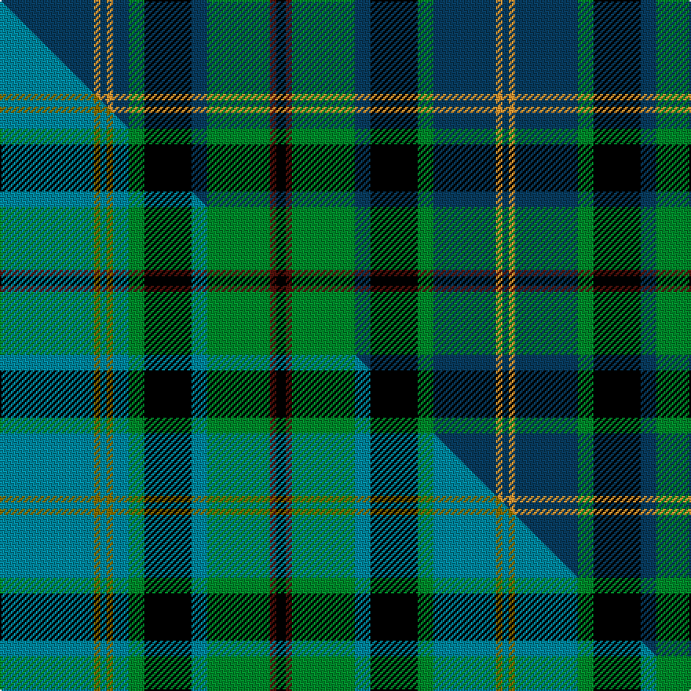

This is one **variant** — a specific cloth: this exact thread count and colourway, with its own
provenance below. It is one weaving of the [sett](/setts/db30lo2db2lo2db5g5k15db5g20dr2k3dr2g20db5k15g5db20lo2db2/) (the scale-free proportion — the
same cloth at any scale or shade), whose colour order is pattern [BYBGKBGBKBGBKGBYBYB](/stripes/bybgkbgbkbgbkgbybyb/).

Part of the [Pennsylvania](/tartans/p/pe/pennsylvania/) tartan — the named design grouping this sett with its other cloths.

Sourced from house-of-tartan.  It is a [19 stripe tartan](/stripes/stripes19/).

Original link [http://www.house-of-tartan.scotland.net/house/TartanViewjs.asp?colr=Def&tnam=3130](http://www.house-of-tartan.scotland.net/house/TartanViewjs.asp?colr=Def&tnam=3130)

## Provenance

Earliest known date: 1992 Not yet accepted by the State as official (March 2007). Designed and copyrighted by the late Wm.H. Johnston 1992. Registered with the Tartan Educational and Cultural Association on 10 March 1993. Based on the Black Watch which served at the Battle of Bushy Run, near Pittsburgh, in 1763, thus assuring western Pennsylvania and the "Ohio Country" for Great Britain. 'Tartans' (Johnston/Smith 1999) states (incorrectly) on Page 109 that this is the State Tartan and gives the correct graphic but the wrong threadcount. The second pivot is given as R4 when in fact it is B4. The Sheepskin Shop in Ebensburg PA that markets blankets in the tartan has obviously used the incorrect threadcount from the book.

Dataset <small>— provenance for this record, inherited from the source manifest</small>

<dl class="dataset-prov">
<dt>source</dt><dd><a href="/sources/house-of-tartan/">House of Tartan</a></dd>
<dt>data captured from</dt><dd><a href="https://github.com/thetartan/tartan-database/blob/master/data/house-of-tartan/data.csv">https://github.com/thetartan/tartan-database/blob/master/data/house-of-tartan/data.csv</a></dd>
<dt>data date</dt><dd>1992 <small>(this record)</small></dd>
<dt>licence</dt><dd><a href="https://creativecommons.org/licenses/by-nc-nd/4.0/">CC BY-NC-ND 4.0</a></dd>
</dl>

Capture chain <small>— the hands this data passed through, oldest first; each capture carries its own licence</small>

<ol class="capture-chain">
<li><a href="http://www.house-of-tartan.scotland.net/">House of Tartan</a> <small>the weaver/retailer's database — the site is now offline; the URL is kept as the ultimate source's identity</small></li>
<li><a href="https://github.com/thetartan/tartan-database">thetartan/tartan-database</a> <small>2016-2017</small> · <a href="https://creativecommons.org/licenses/by-nc-nd/4.0/">CC BY-NC-ND 4.0</a> <small>Levko Kravets's frozen compilation — the capture we vendored, and where its CC licence text came from</small></li>
<li>this dictionary <small>captured 2026-06-10 · commit 5bf86c7566</small> <small>each re-capture is a git commit to data/sources</small></li>
</ol>

## Thread count
DB/60 LO4 DB4 LO4 DB10 G10 K30 DB10 G40 DR4 K6 DR4 G40 DB10 K30 G10 DB40 LO4 DB/4

One full sett is **584 threads**.

## Palette
<table><thead><tr><th>Colour</th><th>Shade</th><th>OKLCh</th></tr></thead><tbody><tr><td>LG</td><td><code style="background-color:#82D67A;">#82D67A</code> <small style="color:#888">#82D67A</small></td><td><small style="color:#888">oklch(80.1% 0.150 142.2)</small></td></tr><tr><td>DB</td><td><code style="background-color:#1C0070;">#1C0070</code> <small style="color:#888">#1C0070</small></td><td><small style="color:#888">oklch(26.3% 0.162 277.1)</small></td></tr><tr><td>DB</td><td><code style="background-color:#083C60;">#083C60</code> <small style="color:#888">#083C60</small></td><td><small style="color:#888">oklch(34.4% 0.081 245.3)</small></td></tr><tr><td>DR</td><td><code style="background-color:#55120C;">#55120C</code> <small style="color:#888">#55120C</small></td><td><small style="color:#888">oklch(30.0% 0.099 29.3)</small></td></tr><tr><td>LO</td><td><code style="background-color:#FF9C34;">#FF9C34</code> <small style="color:#888">#FF9C34</small></td><td><small style="color:#888">oklch(77.9% 0.161 61.8)</small></td></tr><tr><td>G</td><td><code style="background-color:#008B2A;">#008B2A</code> <small style="color:#888">#008B2A</small></td><td><small style="color:#888">oklch(55.4% 0.170 145.9)</small></td></tr><tr><td>K</td><td><code style="background-color:#000000;">#000000</code> <small style="color:#888">#000000</small></td><td><small style="color:#888">oklch(0.0% 0.000 0.0)</small></td></tr></tbody></table>

# Sample pattern

## Compared to the master

This cloth is one sett of its design; the master sett (the exemplar the design is anchored on) is below for comparison.

Its **ΔTartan distance** from the master is **0.92** — the same measure the nearest-tartans table ranks by (0 is identical; a re-scale of the same cloth is near 0, a recolour or a different proportion further).

<figure class="master-compare" style="margin:0">

this sett
master sett ★

<figcaption style="color:#888;font-size:smaller">One weave of this sett against the <a href="/setts/t30y2t2y2t5g5k15t5g20dr2k3dr2g20t5k15g5t20y2t2/">master sett ★</a>, split on the diagonal: a shared proportion runs seamlessly across it with only the shades shifting; a different proportion breaks on it.</figcaption>
</figure>

## Nearest tartan variants

The nearest existing variants by ΔTartan distance, with this cloth at the top so the swatches line up against it.

ΔTartan

Threads

Variant

Sett

—

584

<a href="/variants/s19/db30lo2db2lo2db5g5k15db5g20dr2k3dr2g20db5k15g5db20lo2db2~x2~db1403246/">Pennsylvania American District Tartan</a>

<a href="/ttd/edit/#slug=t30y2t2y2t5g5k15t5g20dr2k3dr2g20t5k15g5t20y2t2~x2&amp;base=db30lo2db2lo2db5g5k15db5g20dr2k3dr2g20db5k15g5db20lo2db2~x2~db1403246" title="compare in the TTD">0.92</a>

584

<a href="/variants/s19/t30y2t2y2t5g5k15t5g20dr2k3dr2g20t5k15g5t20y2t2~x2/">Pennsylvania (District)</a>

<a href="/ttd/edit/#slug=g30y2g5y2g4k15db29r2db29k15g5y2g4y2g17~x2&amp;base=db30lo2db2lo2db5g5k15db5g20dr2k3dr2g20db5k15g5db20lo2db2~x2~db1403246" title="compare in the TTD">1.34</a>

558

<a href="/variants/s15/g30y2g5y2g4k15db29r2db29k15g5y2g4y2g17~x2/">Unidentified B'gowrie Unknown Tartan</a>

<a href="/ttd/edit/#slug=g16r2g2r1g3r1g2r2g12k12r1db16r2db8y2~x2&amp;base=db30lo2db2lo2db5g5k15db5g20dr2k3dr2g20db5k15g5db20lo2db2~x2~db1403246" title="compare in the TTD">1.58</a>

292

<a href="/variants/s15/g16r2g2r1g3r1g2r2g12k12r1db16r2db8y2~x2/">Cochrane Clan Tartan</a>

<a href="/ttd/edit/#slug=g16r2g2r1g3r1g2r2g12k12r1db16r2db8y2&amp;base=db30lo2db2lo2db5g5k15db5g20dr2k3dr2g20db5k15g5db20lo2db2~x2~db1403246" title="compare in the TTD">1.58</a>

146

<a href="/variants/s15/g16r2g2r1g3r1g2r2g12k12r1db16r2db8y2/">Cochrane</a>

<a href="/ttd/edit/#slug=db18k2db2k2db2k6g18w2g18k6db18k1db4k1db18k6g18r2g18k6db2k2db2k2~x2&amp;base=db30lo2db2lo2db5g5k15db5g20dr2k3dr2g20db5k15g5db20lo2db2~x2~db1403246" title="compare in the TTD">1.75</a>

664

<a href="/variants/s24/db18k2db2k2db2k6g18w2g18k6db18k1db4k1db18k6g18r2g18k6db2k2db2k2~x2/">MacKenzie (Vestiarium Scoticum)</a>

<a href="/ttd/edit/#slug=k6g18w2g18k6db18k1db4k1db18k6g18r2g18k6db2k2db2k2db18k2db2k2db2~x2&amp;base=db30lo2db2lo2db5g5k15db5g20dr2k3dr2g20db5k15g5db20lo2db2~x2~db1403246" title="compare in the TTD">1.75</a>

688

<a href="/variants/s24/k6g18w2g18k6db18k1db4k1db18k6g18r2g18k6db2k2db2k2db18k2db2k2db2~x2/">MacKenzie, Bailey</a>

<a href="/ttd/edit/#slug=db36k5r2k5g15r2g10w2g10r2g15k5r2k5db10r2db2r2db4w2~x2~db1404245&amp;base=db30lo2db2lo2db5g5k15db5g20dr2k3dr2g20db5k15g5db20lo2db2~x2~db1403246" title="compare in the TTD">1.85</a>

476

<a href="/variants/s20/db36k5r2k5g15r2g10w2g10r2g15k5r2k5db10r2db2r2db4w2~x2~db1404245/">Ranking Corporate Tartan</a>

<a href="/ttd/edit/#slug=r1g11k4db2k1db1k1db14k1db1k1db2k4g11w1~x4&amp;base=db30lo2db2lo2db5g5k15db5g20dr2k3dr2g20db5k15g5db20lo2db2~x2~db1403246" title="compare in the TTD">1.95</a>

440

<a href="/variants/s15/r1g11k4db2k1db1k1db14k1db1k1db2k4g11w1~x4/">MacKenzie</a>

<a href="/ttd/edit/#slug=db21k1db1k1db1k10g22r2g22k10db16k1db2k1db16k10g22y2g22k10db1k1db1k1db7~x2&amp;base=db30lo2db2lo2db5g5k15db5g20dr2k3dr2g20db5k15g5db20lo2db2~x2~db1403246" title="compare in the TTD">1.99</a>

760

<a href="/variants/s25/db21k1db1k1db1k10g22r2g22k10db16k1db2k1db16k10g22y2g22k10db1k1db1k1db7~x2/">Farquharson</a>

<a href="/ttd/edit/#slug=db36g10dr2g10lb2g10dr2g10k14dr2db12dr3db2dr2db4lb2~x2&amp;base=db30lo2db2lo2db5g5k15db5g20dr2k3dr2g20db5k15g5db20lo2db2~x2~db1403246" title="compare in the TTD">2.02</a>

416

<a href="/variants/s16/db36g10dr2g10lb2g10dr2g10k14dr2db12dr3db2dr2db4lb2~x2/">Rankin (1998) (Name)</a>

## Neighbour map

Every grey dot is one of 13656 variants placed by the first two principal components of the ΔTartan feature space (42% of its variance). Red is this tartan; blue dots are its nearest — click one to open its page. The map is a flat projection of a many-dimensional space — [how to read it](/posts/neighbourhood-maps/).

<svg viewBox="0 0 640 380" role="img" style="max-width:100%;height:auto;border:1px solid #e0e0e0;border-radius:4px;display:block" xmlns="http://www.w3.org/2000/svg"><image href="/nn/cloud.v1.png" width="640" height="380"/><a href="/variants/s19/t30y2t2y2t5g5k15t5g20dr2k3dr2g20t5k15g5t20y2t2~x2/"><circle cx="171.8" cy="121.1" r="4" fill="#3465a4"><title>Pennsylvania (District)</title></circle></a><a href="/variants/s15/g30y2g5y2g4k15db29r2db29k15g5y2g4y2g17~x2/"><circle cx="167.5" cy="127.9" r="4" fill="#3465a4"><title>Unidentified B'gowrie Unknown Tartan</title></circle></a><a href="/variants/s15/g16r2g2r1g3r1g2r2g12k12r1db16r2db8y2~x2/"><circle cx="168.8" cy="117.7" r="4" fill="#3465a4"><title>Cochrane Clan Tartan</title></circle></a><a href="/variants/s15/g16r2g2r1g3r1g2r2g12k12r1db16r2db8y2/"><circle cx="168.8" cy="117.7" r="4" fill="#3465a4"><title>Cochrane</title></circle></a><a href="/variants/s24/db18k2db2k2db2k6g18w2g18k6db18k1db4k1db18k6g18r2g18k6db2k2db2k2~x2/"><circle cx="167.7" cy="102.0" r="4" fill="#3465a4"><title>MacKenzie (Vestiarium Scoticum)</title></circle></a><a href="/variants/s24/k6g18w2g18k6db18k1db4k1db18k6g18r2g18k6db2k2db2k2db18k2db2k2db2~x2/"><circle cx="167.7" cy="102.0" r="4" fill="#3465a4"><title>MacKenzie, Bailey</title></circle></a><a href="/variants/s20/db36k5r2k5g15r2g10w2g10r2g15k5r2k5db10r2db2r2db4w2~x2~db1404245/"><circle cx="159.7" cy="94.9" r="4" fill="#3465a4"><title>Ranking Corporate Tartan</title></circle></a><a href="/variants/s15/r1g11k4db2k1db1k1db14k1db1k1db2k4g11w1~x4/"><circle cx="168.1" cy="114.8" r="4" fill="#3465a4"><title>MacKenzie</title></circle></a><a href="/variants/s25/db21k1db1k1db1k10g22r2g22k10db16k1db2k1db16k10g22y2g22k10db1k1db1k1db7~x2/"><circle cx="180.8" cy="88.6" r="4" fill="#3465a4"><title>Farquharson</title></circle></a><a href="/variants/s16/db36g10dr2g10lb2g10dr2g10k14dr2db12dr3db2dr2db4lb2~x2/"><circle cx="200.7" cy="110.3" r="4" fill="#3465a4"><title>Rankin (1998) (Name)</title></circle></a><circle cx="177.5" cy="118.8" r="5" fill="#c00000"/><text x="320" y="376" text-anchor="middle" font-size="11" fill="#999">ground</text><text x="11" y="190" text-anchor="middle" font-size="11" fill="#999" transform="rotate(-90 11 190)">complexity</text></svg>

ID: /variants/s19/db30lo2db2lo2db5g5k15db5g20dr2k3dr2g20db5k15g5db20lo2db2~x2~db1403246/
