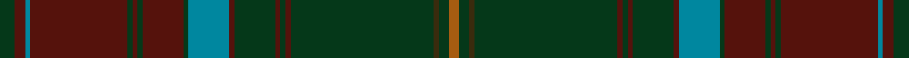

This page is one **sett** — a single exact thread-count. It belongs to the [tartan](/setts/dg3dr2t1dr19dg1dr1dg1dr8dg1t8dr1dg8dr1dg1dr1dg28dy1dg2o2/)
(the same proportion at any scale), whose colour order is pattern [GBBBGBGBGBBGBGBGGGR](/stripes/gbbbgbgbgbbgbgbgggr/).

Sourced from register-of-tartans.  It is a [19 stripe tartan](/stripes/stripes19/).

Original link https://www.tartanregister.gov.uk/tartanDetails.aspx?ref=349

2 attestations — the source records this cloth was collapsed from (oldest owns this page)

<ul>
<li>01/01/2006 — Brewer (register-of-tartans, <a href="https://www.tartanregister.gov.uk/tartanDetails.aspx?ref=349">record</a>)  <em>Designed by Matt Newsome in January 2006 as a Personal family tartan for James Brewer. Brewers are traditionally considered a sept of Clan Drummond (Mr Brewer has traced his family line to Perthshire and Lanark) so elements of this tartan come from the Vestiarium Scoticum version of the Drummond tartan. The mauve line is taken from the Cooper tartan in honour of Mr Brewer's great grandmother, who was a Cooper. James Brewer wishes this tartan to be worn by anyone of the name Brewer, or any variations. Woven by D C Dalgliesh.</em></li>
<li>2006, January — Brewer (Name) (tartans-authority, <a href="http://www.tartansauthority.com/tartan-ferret/display/6833/">record</a>)  <em>This tartan was designed by Matt Newsome in January 2006 for James Brewer, as a personal family tartan. Brewers are traditionally considered a sept of Clan Drummond, and Mr. Brewer has traced his family line to Perthshire and Lanark. Elements of this tartan come from the Vestiarium Scoticum version of the Drummond tartan, to honor those clan links. The mauve line is taken from the Cooper tartan, in honor of Mr. Brewer's great grandmother, who was a Cooper. James Brewer wishes this tartan to be worn by anyone of the name Brewer, or any variations. Woven by D C Dalgliesh.</em></li>
</ul>

## Register references

External register numbers recorded for this tartan.

- Scottish Register of Tartans: [349](https://www.tartanregister.gov.uk/tartanDetails.aspx?ref=349)
- Scottish Tartans Authority (ITI): 6833

## Thread count
DG/6 DR4 T2 DR38 DG2 DR2 DG2 DR16 DG2 T16 DR2 DG16 DR2 DG2 DR2 DG56 DY2 DG4 O/4

One full sett is **350 threads**.

## Palette
<table><thead><tr><th>Colour</th><th>Shade</th><th>OKLCh</th></tr></thead><tbody><tr><td>T</td><td><code style="background-color:#00879F;">#00879F</code> <small style="color:#888">#00879F</small></td><td><small style="color:#888">oklch(57.4% 0.102 216.1)</small></td></tr><tr><td>DB</td><td><code style="background-color:#082077;">#082077</code> <small style="color:#888">#082077</small></td><td><small style="color:#888">oklch(30.0% 0.149 265.1)</small></td></tr><tr><td>R</td><td><code style="background-color:#D60020;">#D60020</code> <small style="color:#888">#D60020</small></td><td><small style="color:#888">oklch(55.2% 0.224 25.5)</small></td></tr><tr><td>DR</td><td><code style="background-color:#55120C;">#55120C</code> <small style="color:#888">#55120C</small></td><td><small style="color:#888">oklch(30.0% 0.099 29.3)</small></td></tr><tr><td>DG</td><td><code style="background-color:#053819;">#053819</code> <small style="color:#888">#053819</small></td><td><small style="color:#888">oklch(30.0% 0.075 151.3)</small></td></tr><tr><td>N</td><td><code style="background-color:#636363;">#636363</code> <small style="color:#888">#636363</small></td><td><small style="color:#888">oklch(50.0% 0.000 89.9)</small></td></tr><tr><td>O</td><td><code style="background-color:#A65C11;">#A65C11</code> <small style="color:#888">#A65C11</small></td><td><small style="color:#888">oklch(55.0% 0.125 58.3)</small></td></tr><tr><td>DY</td><td><code style="background-color:#3A2B0D;">#3A2B0D</code> <small style="color:#888">#3A2B0D</small></td><td><small style="color:#888">oklch(30.0% 0.049 82.0)</small></td></tr></tbody></table>

# Sample pattern

## Nearest tartan variants

The nearest existing variants by ΔTartan distance, with this cloth at the top so the swatches line up against it.

ΔTartan

Threads

Variant

Sett

—

350

<a href="/variants/s19/dg3dr2t1dr19dg1dr1dg1dr8dg1t8dr1dg8dr1dg1dr1dg28dy1dg2o2~x2/">Brewer</a>

<a href="/ttd/edit/#slug=dr3r1db1dr1dg13dr3db4lb1dr16dg2dr2r1dg3~x2&amp;base=dg3dr2t1dr19dg1dr1dg1dr8dg1t8dr1dg8dr1dg1dr1dg28dy1dg2o2~x2" title="compare in the TTD">3.30</a>

192

<a href="/variants/s13/dr3r1db1dr1dg13dr3db4lb1dr16dg2dr2r1dg3~x2/">MacDonald of Glencoe</a>

<a href="/ttd/edit/#slug=oi50do6o3do3y3do3dt10oi8do3oi6y3oi6do3oi8dt10do3y3do3o3do6oi4~x2~oi2004072-do1103038&amp;base=dg3dr2t1dr19dg1dr1dg1dr8dg1t8dr1dg8dr1dg1dr1dg28dy1dg2o2~x2" title="compare in the TTD">3.45</a>

480

<a href="/variants/s21/yi50do6o3do3y3do3dt10yi8do3yi6y3yi6do3yi8dt10do3y3do3o3do6yi4~x2~yi2004072-do1103038/">Williams #2</a>

<a href="/ttd/edit/#slug=r7dt2r3dg32r2dg2r2dt10r2lb2r31dt2r2dt1r6~x2~r1906028-dt1201300-dg1602166-lb3203246&amp;base=dg3dr2t1dr19dg1dr1dg1dr8dg1t8dr1dg8dr1dg1dr1dg28dy1dg2o2~x2" title="compare in the TTD">3.72</a>

398

<a href="/variants/s15/r7dt2r3dg32r2dg2r2dt10r2lb2r31dt2r2dt1r6~x2~r1906028-dt1201300-dg1602166-lb3203246/">Drummond of Megginch - 1997 Kilt</a>

<a href="/ttd/edit/#slug=n126r3y16n20y4n4y4n4y4n4y4n4y4n4y4n4y4n4y4n4y4do130n10&amp;base=dg3dr2t1dr19dg1dr1dg1dr8dg1t8dr1dg8dr1dg1dr1dg28dy1dg2o2~x2" title="compare in the TTD">3.83</a>

610

<a href="/variants/s23/n126r3y16n20y4n4y4n4y4n4y4n4y4n4y4n4y4n4y4n4y4do130n10/">Unidentified Plaid #13</a>

## Neighbour map

Every grey dot is one of 13620 variants placed by the first two principal components of the ΔTartan feature space (42% of its variance). Red is this tartan; blue dots are its nearest — click one to open its page.

<svg viewBox="0 0 640 380" role="img" style="max-width:100%;height:auto;border:1px solid #e0e0e0;border-radius:4px;display:block" xmlns="http://www.w3.org/2000/svg"><image href="/nn/cloud.v1.png" width="640" height="380"/><a href="/variants/s13/dr3r1db1dr1dg13dr3db4lb1dr16dg2dr2r1dg3~x2/"><circle cx="388.7" cy="165.3" r="4" fill="#3465a4"><title>MacDonald of Glencoe</title></circle></a><a href="/variants/s21/yi50do6o3do3y3do3dt10yi8do3yi6y3yi6do3yi8dt10do3y3do3o3do6yi4~x2~yi2004072-do1103038/"><circle cx="433.9" cy="142.0" r="4" fill="#3465a4"><title>Williams #2</title></circle></a><a href="/variants/s15/r7dt2r3dg32r2dg2r2dt10r2lb2r31dt2r2dt1r6~x2~r1906028-dt1201300-dg1602166-lb3203246/"><circle cx="467.3" cy="139.4" r="4" fill="#3465a4"><title>Drummond of Megginch - 1997 Kilt</title></circle></a><a href="/variants/s23/n126r3y16n20y4n4y4n4y4n4y4n4y4n4y4n4y4n4y4n4y4do130n10/"><circle cx="495.2" cy="92.7" r="4" fill="#3465a4"><title>Unidentified Plaid #13</title></circle></a><circle cx="429.0" cy="121.2" r="5" fill="#c00000"/><text x="320" y="376" text-anchor="middle" font-size="11" fill="#999">ground</text><text x="11" y="190" text-anchor="middle" font-size="11" fill="#999" transform="rotate(-90 11 190)">complexity</text></svg>

ID: /variants/s19/dg3dr2t1dr19dg1dr1dg1dr8dg1t8dr1dg8dr1dg1dr1dg28dy1dg2o2~x2/
