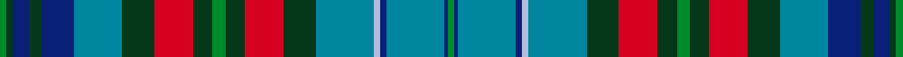
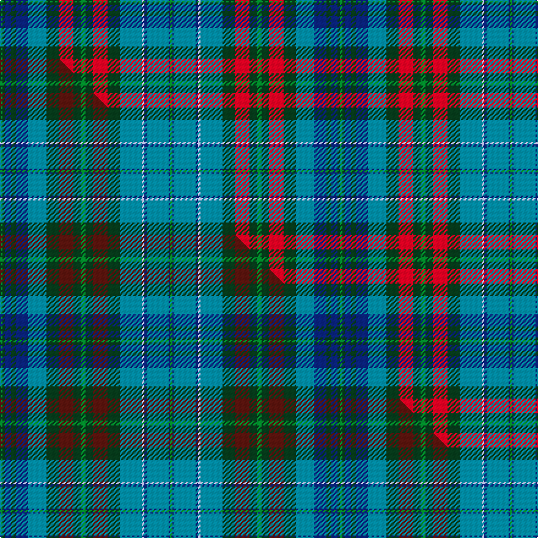

This is one **variant** — a specific cloth: this exact thread count and colourway, with its own
provenance below. It is one weaving of the [sett](/tartans/w/wa/watkins/) (the scale-free proportion — the
same cloth at any scale or shade), whose colour order is pattern [GBBBWBGRGGGRGBBGBGG](/stripes/gbbbwbgrgggrgbbgbgg/).

Part of the [Watkins](/tartans/w/wa/watkins/) tartan — the named design grouping this sett with its other cloths.

Sourced from house-of-tartan.  It is a [19 stripe tartan](/stripes/stripes19/).

Original link [http://www.house-of-tartan.scotland.net/house/TartanViewjs.asp?colr=Def&tnam=6169](http://www.house-of-tartan.scotland.net/house/TartanViewjs.asp?colr=Def&tnam=6169)

## Provenance

Earliest known date: pre 2004 The tartan for this Welsh surname and its variations, Walters, Watts, Gwatkin, Watkiss, is actually woven in Wales at the Cambrian Woollen Mill, weaving on the same site since 1830. This tartan differs from many traditional patterns in that the warp and weft differ, giving the finished worsted wool cloth more of a predominant stripe, vertically noticeable in the finished Kilt, or Cilt in Wales.

Dataset <small>— provenance for this record, inherited from the source manifest</small>

<dl class="dataset-prov">
<dt>source</dt><dd><a href="/sources/house-of-tartan/">House of Tartan</a></dd>
<dt>data captured from</dt><dd><a href="https://github.com/thetartan/tartan-database/blob/master/data/house-of-tartan/data.csv">https://github.com/thetartan/tartan-database/blob/master/data/house-of-tartan/data.csv</a></dd>
<dt>data date</dt><dd>pre 2004 <small>(this record)</small></dd>
<dt>licence</dt><dd><a href="https://creativecommons.org/licenses/by-nc-nd/4.0/">CC BY-NC-ND 4.0</a></dd>
</dl>

Capture chain <small>— the hands this data passed through, oldest first; each capture carries its own licence</small>

<ol class="capture-chain">
<li><a href="http://www.house-of-tartan.scotland.net/">House of Tartan</a> <small>the weaver/retailer's database — the site is now offline; the URL is kept as the ultimate source's identity</small></li>
<li><a href="https://github.com/thetartan/tartan-database">thetartan/tartan-database</a> <small>2016-2017</small> · <a href="https://creativecommons.org/licenses/by-nc-nd/4.0/">CC BY-NC-ND 4.0</a> <small>Levko Kravets's frozen compilation — the capture we vendored, and where its CC licence text came from</small></li>
<li>this dictionary <small>captured 2026-06-10 · commit 5bf86c7566</small> <small>each re-capture is a git commit to data/sources</small></li>
</ol>

## Thread count
G/2 DG2 DB5 DG4 DB10 T15 DG10 R12 DG6 G4 DG6 R12 DG10 T18 LB2 DB2 T18 DB1 G/2

One full sett is **278 threads**.

## Palette
<table><thead><tr><th>Colour</th><th>Shade</th><th>OKLCh</th></tr></thead><tbody><tr><td>LB</td><td><code style="background-color:#B5BBDE;">#B5BBDE</code> <small style="color:#888">#B5BBDE</small></td><td><small style="color:#888">oklch(79.9% 0.050 277.6)</small></td></tr><tr><td>T</td><td><code style="background-color:#00879F;">#00879F</code> <small style="color:#888">#00879F</small></td><td><small style="color:#888">oklch(57.4% 0.102 216.1)</small></td></tr><tr><td>DB</td><td><code style="background-color:#082077;">#082077</code> <small style="color:#888">#082077</small></td><td><small style="color:#888">oklch(30.0% 0.149 265.1)</small></td></tr><tr><td>R</td><td><code style="background-color:#D60020;">#D60020</code> <small style="color:#888">#D60020</small></td><td><small style="color:#888">oklch(55.2% 0.224 25.5)</small></td></tr><tr><td>G</td><td><code style="background-color:#008B2A;">#008B2A</code> <small style="color:#888">#008B2A</small></td><td><small style="color:#888">oklch(55.4% 0.170 145.9)</small></td></tr><tr><td>DG</td><td><code style="background-color:#053819;">#053819</code> <small style="color:#888">#053819</small></td><td><small style="color:#888">oklch(30.0% 0.075 151.3)</small></td></tr></tbody></table>

# Sample pattern

[Sample sheet (PDF)](swatch.pdf) — the woven sample, thread count and palette on one printable A4, rendered on demand (the same sheet the TTD print page downloads).

## Compared to the master

This cloth is one sett of its design; the master sett (the exemplar the design is anchored on) is below for comparison.

Its **ΔTartan distance** from the master is **0.10** — the same measure the nearest-tartans table ranks by (0 is identical; a re-scale of the same cloth is near 0, a recolour or a different proportion further).

<figure class="master-compare" style="margin:0">

this sett
master sett ★

<figcaption style="color:#888;font-size:smaller">One weave of this sett against the <a href="/setts/g2dg2db5dg4db10t15dg10dr12dg6g4dg6dr12dg10t18lb2db2t18db1g2/">master sett ★</a>, split on the diagonal: a shared proportion runs seamlessly across it with only the shades shifting; a different proportion breaks on it.</figcaption>
</figure>

## Nearest tartan variants

The nearest existing variants by ΔTartan distance, with this cloth at the top so the swatches line up against it.

ΔTartan

Threads

Variant

Sett

—

278

<a href="/variants/s19/g2dg2db5dg4db10t15dg10r12dg6g4dg6r12dg10t18lb2db2t18db1g2/">Watkins Welsh Name Tartan</a>

<a href="/ttd/edit/#slug=g2dg2db5dg4db10t15dg10dr12dg6g4dg6dr12dg10t18lb2db2t18db1g2&amp;base=g2dg2db5dg4db10t15dg10r12dg6g4dg6r12dg10t18lb2db2t18db1g2" title="compare in the TTD">0.10</a>

278

<a href="/variants/s19/g2dg2db5dg4db10t15dg10dr12dg6g4dg6dr12dg10t18lb2db2t18db1g2/">Watkins (Welsh Name)</a>

<a href="/ttd/edit/#slug=g4db4r4db2g12db2g12db2r4g4w1ri4dbi2r4db4dbi4db4r4db2dbi12db2~x2~db3409246-r4315012-ri6016021-dbi3514276&amp;base=g2dg2db5dg4db10t15dg10r12dg6g4dg6r12dg10t18lb2db2t18db1g2" title="compare in the TTD">1.79</a>

360

<a href="/variants/s21/g4db4r4db2g12db2g12db2r4g4w1ri4dbi2r4db4dbi4db4r4db2dbi12db2~x2~db3409246-r4315012-ri6016021-dbi3514276/">Otago Peninsula Corporate Tartan</a>

<a href="/ttd/edit/#slug=db11r1db2r3db1do8g11w1g11do8db8y1r1y1~x2&amp;base=g2dg2db5dg4db10t15dg10r12dg6g4dg6r12dg10t18lb2db2t18db1g2" title="compare in the TTD">2.62</a>

248

<a href="/variants/s14/db11r1db2r3db1do8g11w1g11do8db8y1r1y1~x2/">Allen Northumbrian Family Tartan</a>

<a href="/ttd/edit/#slug=dr5db3dr3r2db2y2db2y1db14g2db7g4db4g7db2g9y1n2g5~x2&amp;base=g2dg2db5dg4db10t15dg10r12dg6g4dg6r12dg10t18lb2db2t18db1g2" title="compare in the TTD">2.62</a>

288

<a href="/variants/s19/dr5db3dr3r2db2y2db2y1db14g2db7g4db4g7db2g9y1n2g5~x2/">Hart of Scotland (Corporate)</a>

<a href="/ttd/edit/#slug=r6g22dg8g4dg12g2dg18db8lb12db35ly4&amp;base=g2dg2db5dg4db10t15dg10r12dg6g4dg6r12dg10t18lb2db2t18db1g2" title="compare in the TTD">2.99</a>

252

<a href="/variants/s11/r6g22dg8g4dg12g2dg18db8lb12db35ly4/">Bruntsfield Links Golfing Society</a>

<a href="/ttd/edit/#slug=dp4db1dp2db1t16db1y16r16db1t4db2t4db2t12db1w4~x2&amp;base=g2dg2db5dg4db10t15dg10r12dg6g4dg6r12dg10t18lb2db2t18db1g2" title="compare in the TTD">3.05</a>

332

<a href="/variants/s16/dp4db1dp2db1t16db1y16r16db1t4db2t4db2t12db1w4~x2/">Spirit of Romania</a>

<a href="/ttd/edit/#slug=b30dp3r3g12r12g12b8r3b8dp12r5g3r5g25r4b6lb1~x2&amp;base=g2dg2db5dg4db10t15dg10r12dg6g4dg6r12dg10t18lb2db2t18db1g2" title="compare in the TTD">3.13</a>

546

<a href="/variants/s17/b30dp3r3g12r12g12b8r3b8dp12r5g3r5g25r4b6lb1~x2/">MacDougall 2</a>

<a href="/ttd/edit/#slug=db14w1g8w1dg16lb6w1db14w1g14lb6g6r8dg6r8dg1~x2&amp;base=g2dg2db5dg4db10t15dg10r12dg6g4dg6r12dg10t18lb2db2t18db1g2" title="compare in the TTD">3.14</a>

414

<a href="/variants/s16/db14w1g8w1dg16lb6w1db14w1g14lb6g6r8dg6r8dg1~x2/">Gordon #3</a>

<a href="/ttd/edit/#slug=db9n3db2lr2db9n6db3lr3db3g18dg8r2~x2&amp;base=g2dg2db5dg4db10t15dg10r12dg6g4dg6r12dg10t18lb2db2t18db1g2" title="compare in the TTD">3.21</a>

250

<a href="/variants/s12/db9n3db2lr2db9n6db3lr3db3g18dg8r2~x2/">Patterson, William John Magee (Personal)</a>

<a href="/ttd/edit/#slug=dt18w1o8w1db16dp8w1dt18w1dt20dp8dt6g8db10g10db1~x4&amp;base=g2dg2db5dg4db10t15dg10r12dg6g4dg6r12dg10t18lb2db2t18db1g2" title="compare in the TTD">3.25</a>

1004

<a href="/variants/s16/dt18w1o8w1db16dp8w1dt18w1dt20dp8dt6g8db10g10db1~x4/">Forbes - 1970 (WCWM #2)</a>

## Neighbour map

Every grey dot is one of 13662 variants placed by the first two principal components of the ΔTartan feature space (42% of its variance). Red is this tartan; blue dots are its nearest — click one to open its page. The map is a flat projection of a many-dimensional space — [how to read it](/posts/neighbourhood-maps/).

<svg viewBox="0 0 640 380" role="img" style="max-width:100%;height:auto;border:1px solid #e0e0e0;border-radius:4px;display:block" xmlns="http://www.w3.org/2000/svg"><image href="/nn/cloud.v1.png" width="640" height="380"/><a href="/variants/s19/g2dg2db5dg4db10t15dg10dr12dg6g4dg6dr12dg10t18lb2db2t18db1g2/"><circle cx="205.6" cy="167.9" r="4" fill="#3465a4"><title>Watkins (Welsh Name)</title></circle></a><a href="/variants/s21/g4db4r4db2g12db2g12db2r4g4w1ri4dbi2r4db4dbi4db4r4db2dbi12db2~x2~db3409246-r4315012-ri6016021-dbi3514276/"><circle cx="157.1" cy="162.5" r="4" fill="#3465a4"><title>Otago Peninsula Corporate Tartan</title></circle></a><a href="/variants/s14/db11r1db2r3db1do8g11w1g11do8db8y1r1y1~x2/"><circle cx="150.7" cy="161.0" r="4" fill="#3465a4"><title>Allen Northumbrian Family Tartan</title></circle></a><a href="/variants/s19/dr5db3dr3r2db2y2db2y1db14g2db7g4db4g7db2g9y1n2g5~x2/"><circle cx="209.6" cy="148.8" r="4" fill="#3465a4"><title>Hart of Scotland (Corporate)</title></circle></a><a href="/variants/s11/r6g22dg8g4dg12g2dg18db8lb12db35ly4/"><circle cx="145.8" cy="157.2" r="4" fill="#3465a4"><title>Bruntsfield Links Golfing Society</title></circle></a><a href="/variants/s16/dp4db1dp2db1t16db1y16r16db1t4db2t4db2t12db1w4~x2/"><circle cx="201.2" cy="125.5" r="4" fill="#3465a4"><title>Spirit of Romania</title></circle></a><a href="/variants/s17/b30dp3r3g12r12g12b8r3b8dp12r5g3r5g25r4b6lb1~x2/"><circle cx="214.5" cy="130.0" r="4" fill="#3465a4"><title>MacDougall 2</title></circle></a><a href="/variants/s16/db14w1g8w1dg16lb6w1db14w1g14lb6g6r8dg6r8dg1~x2/"><circle cx="79.3" cy="145.8" r="4" fill="#3465a4"><title>Gordon #3</title></circle></a><a href="/variants/s12/db9n3db2lr2db9n6db3lr3db3g18dg8r2~x2/"><circle cx="155.2" cy="178.8" r="4" fill="#3465a4"><title>Patterson, William John Magee (Personal)</title></circle></a><a href="/variants/s16/dt18w1o8w1db16dp8w1dt18w1dt20dp8dt6g8db10g10db1~x4/"><circle cx="244.5" cy="156.9" r="4" fill="#3465a4"><title>Forbes - 1970 (WCWM #2)</title></circle></a><circle cx="163.8" cy="144.5" r="5" fill="#c00000"/><text x="320" y="376" text-anchor="middle" font-size="11" fill="#999">ground</text><text x="11" y="190" text-anchor="middle" font-size="11" fill="#999" transform="rotate(-90 11 190)">complexity</text></svg>

ID: /variants/s19/g2dg2db5dg4db10t15dg10r12dg6g4dg6r12dg10t18lb2db2t18db1g2/
