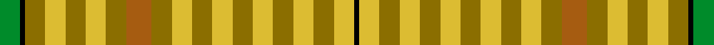

This is one **variant** — a specific cloth: this exact thread count and colourway, with its own
provenance below. It is one weaving of the [sett](/tartans/p/pe/peeper-2/) (the scale-free proportion — the
same cloth at any scale or shade), whose colour order is pattern [GKGYGYGRGYGYGYGYGYK](/stripes/gkgygygrgygygygygyk/).

Part of the [Peeper](/tartans/p/pe/peeper-2/) tartan — the named design grouping this sett with its other cloths.

Sourced from register-of-tartans.  It is a [19 stripe tartan](/stripes/stripes19/).

Original link [https://www.tartanregister.gov.uk/tartanDetails.aspx?ref=3313](https://www.tartanregister.gov.uk/tartanDetails.aspx?ref=3313)

2 attestations — the source records this cloth was collapsed from (oldest owns this page)

<ul>
<li>01/01/2006 — Peeper (check) (register-of-tartans, <a href="https://www.tartanregister.gov.uk/tartanDetails.aspx?ref=3313">record</a>)  <em>A tartan designed for Quinn Peeper of New Orleans, Lousiana. This one is referred to as the 'Peeper check.' He also had designed a version referred to as 'Peeper tartan.' May be used by all of the name Peeper.</em></li>
<li>2006 — Peeper (check) (Name) (tartans-authority, <a href="https://web.archive.org/web/*/http://www.tartansauthority.com/tartan-ferret/display/6992/*">record</a>)  <em>An asymmetric. tartan designed for Quinn Peeper of New Orleans, Lousiana. This one is referred to as the "Peeper check." He also had designed a version referred to as "Peeper tartan." May be used by all of the name Peeper.</em></li>
</ul>

Dataset <small>— provenance for this record, inherited from the source manifest</small>

<dl class="dataset-prov">
<dt>source</dt><dd><a href="/sources/register-of-tartans/">Scottish Register of Tartans</a></dd>
<dt>data captured from</dt><dd><a href="https://github.com/thetartan/tartan-database/blob/master/data/register-of-tartans/data.csv">https://github.com/thetartan/tartan-database/blob/master/data/register-of-tartans/data.csv</a></dd>
<dt>data date</dt><dd>2006 <small>(this record)</small></dd>
<dt>licence</dt><dd><a href="https://www.tartanregister.gov.uk/copyright">Crown copyright</a></dd>
</dl>

Capture chain <small>— the hands this data passed through, oldest first; each capture carries its own licence</small>

<ol class="capture-chain">
<li><a href="https://www.tartanregister.gov.uk/">Scottish Register of Tartans</a> · <a href="https://www.tartanregister.gov.uk/copyright">Crown copyright</a> <small>the living register — still published by National Records of Scotland</small></li>
<li><a href="https://github.com/thetartan/tartan-database">thetartan/tartan-database</a> <small>2016-2017</small> · <a href="https://creativecommons.org/licenses/by-nc-nd/4.0/">CC BY-NC-ND 4.0</a> <small>Levko Kravets's frozen compilation — the capture we vendored, and where its CC licence text came from</small></li>
<li>this dictionary <small>captured 2026-06-10 · commit 5bf86c7566</small> <small>each re-capture is a git commit to data/sources</small></li>
</ol>

## Register references

External register numbers recorded for this tartan.

- Scottish Register of Tartans: [3313](https://www.tartanregister.gov.uk/tartanDetails.aspx?ref=3313)
- Scottish Tartans Authority (ITI): 6992

## Thread count
G/8 K2 Y8 LY8 Y8 LY8 Y8 O10 Y8 LY8 Y8 LY8 Y8 LY8 Y8 LY8 Y8 LY8 K/2

One full sett is **274 threads**.

## Palette
<table><thead><tr><th>Colour</th><th>Shade</th><th>OKLCh</th></tr></thead><tbody><tr><td>G</td><td><code style="background-color:#008B2A;">#008B2A</code> <small style="color:#888">#008B2A</small></td><td><small style="color:#888">oklch(55.4% 0.170 145.9)</small></td></tr><tr><td>K</td><td><code style="background-color:#000000;">#000000</code> <small style="color:#888">#000000</small></td><td><small style="color:#888">oklch(0.0% 0.000 0.0)</small></td></tr><tr><td>LY</td><td><code style="background-color:#DCBC32;">#DCBC32</code> <small style="color:#888">#DCBC32</small></td><td><small style="color:#888">oklch(80.0% 0.150 95.2)</small></td></tr><tr><td>Y</td><td><code style="background-color:#8B6E00;">#8B6E00</code> <small style="color:#888">#8B6E00</small></td><td><small style="color:#888">oklch(55.1% 0.113 90.4)</small></td></tr><tr><td>O</td><td><code style="background-color:#A65C11;">#A65C11</code> <small style="color:#888">#A65C11</small></td><td><small style="color:#888">oklch(55.0% 0.125 58.3)</small></td></tr><tr><td>DY</td><td><code style="background-color:#3A2B0D;">#3A2B0D</code> <small style="color:#888">#3A2B0D</small></td><td><small style="color:#888">oklch(30.0% 0.049 82.0)</small></td></tr></tbody></table>

# Sample pattern

[Sample sheet (PDF)](swatch.pdf) — the woven sample, thread count and palette on one printable A4, rendered on demand (the same sheet the TTD print page downloads).

ID: /variants/s19/g4k1y4ly4y4ly4y4o5y4ly4y4ly4y4ly4y4ly4y4ly4k1~x2/
