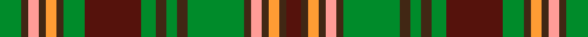

This is one **variant** — a specific cloth: this exact thread count and colourway, with its own
provenance below. It is one weaving of the [sett](/setts/g6do2lr3do2lo3do2g6dr16g4do3g3do3g16do2lr3do2lo3do2dr4/) (the scale-free proportion — the
same cloth at any scale or shade), whose colour order is pattern [BBYBYBGBGBGBGBYBYBG](/stripes/bbybybgbgbgbgbybybg/).

Part of the [Mowat, Sir Oliver](/tartans/m/mo/mowat-sir-oliver/) tartan — the named design grouping this sett with its other cloths.

Sourced from register-of-tartans.  It is a [19 stripe tartan](/stripes/stripes19/).

Original link [https://www.tartanregister.gov.uk/tartanDetails.aspx?ref=3036](https://www.tartanregister.gov.uk/tartanDetails.aspx?ref=3036)

## Provenance

Earliest known date: pre 2002 1820 - 1903. One of the Fathers of the Confederation. Premier of Ontario.

3 attestations — the source records this cloth was collapsed from (oldest owns this page)

<ul>
<li>01/01/2002 — Mowat, Sir Oliver (register-of-tartans, <a href="https://www.tartanregister.gov.uk/tartanDetails.aspx?ref=3036">record</a>)  <em>Sir Oliver Mowat, 1820 - 1903, 3rd Premier of Ontario, 8th Lieutenant Governor of Ontario was one of the Fathers of Confederation. Sample in Scottish Tartans Authority's Johnston Collection.</em></li>
<li>pre 2002 — Mowat, Sir Oliver (Commemorative) (tartans-authority, <a href="https://www.tartanregister.gov.uk/tartanDetails.aspx?ref=5651">record</a>)  <em>1820 - 1903. One of the Fathers of the Confederation. Premier of Ontario. Sample in STA Johnston Collection.</em></li>
<li>pre 2002 — Mowat, Sir Oliver Commemorative Tartan (house-of-tartan, <a href="http://www.house-of-tartan.scotland.net/house/TartanViewjs.asp?colr=Def&tnam=5651">record</a>) </li>
</ul>

Dataset <small>— provenance for this record, inherited from the source manifest</small>

<dl class="dataset-prov">
<dt>source</dt><dd><a href="/sources/register-of-tartans/">Scottish Register of Tartans</a></dd>
<dt>data captured from</dt><dd><a href="https://github.com/thetartan/tartan-database/blob/master/data/register-of-tartans/data.csv">https://github.com/thetartan/tartan-database/blob/master/data/register-of-tartans/data.csv</a></dd>
<dt>data date</dt><dd>2002 <small>(this record)</small></dd>
<dt>licence</dt><dd><a href="https://www.tartanregister.gov.uk/copyright">Crown copyright</a></dd>
</dl>

Capture chain <small>— the hands this data passed through, oldest first; each capture carries its own licence</small>

<ol class="capture-chain">
<li><a href="https://www.tartanregister.gov.uk/">Scottish Register of Tartans</a> · <a href="https://www.tartanregister.gov.uk/copyright">Crown copyright</a> <small>the living register — still published by National Records of Scotland</small></li>
<li><a href="https://github.com/thetartan/tartan-database">thetartan/tartan-database</a> <small>2016-2017</small> · <a href="https://creativecommons.org/licenses/by-nc-nd/4.0/">CC BY-NC-ND 4.0</a> <small>Levko Kravets's frozen compilation — the capture we vendored, and where its CC licence text came from</small></li>
<li>this dictionary <small>captured 2026-06-10 · commit 5bf86c7566</small> <small>each re-capture is a git commit to data/sources</small></li>
</ol>

## Register references

External register numbers recorded for this tartan.

- Scottish Register of Tartans: [3036](https://www.tartanregister.gov.uk/tartanDetails.aspx?ref=3036)
- Scottish Tartans Authority (ITI): 5651

## Thread count
G/12 DO4 LR6 DO4 LO6 DO4 G12 DR32 G8 DO6 G6 DO6 G32 DO4 LR6 DO4 LO6 DO4 DR/8

One full sett is **320 threads**.

## Palette
<table><thead><tr><th>Colour</th><th>Shade</th><th>OKLCh</th></tr></thead><tbody><tr><td>DR</td><td><code style="background-color:#55120C;">#55120C</code> <small style="color:#888">#55120C</small></td><td><small style="color:#888">oklch(30.0% 0.099 29.3)</small></td></tr><tr><td>LO</td><td><code style="background-color:#FF9C34;">#FF9C34</code> <small style="color:#888">#FF9C34</small></td><td><small style="color:#888">oklch(77.9% 0.161 61.8)</small></td></tr><tr><td>G</td><td><code style="background-color:#008B2A;">#008B2A</code> <small style="color:#888">#008B2A</small></td><td><small style="color:#888">oklch(55.4% 0.170 145.9)</small></td></tr><tr><td>DO</td><td><code style="background-color:#412714;">#412714</code> <small style="color:#888">#412714</small></td><td><small style="color:#888">oklch(30.1% 0.050 55.7)</small></td></tr><tr><td>LR</td><td><code style="background-color:#FF9C97;">#FF9C97</code> <small style="color:#888">#FF9C97</small></td><td><small style="color:#888">oklch(79.3% 0.119 23.2)</small></td></tr></tbody></table>

# Sample pattern

## Nearest tartan variants

The nearest existing variants by ΔTartan distance, with this cloth at the top so the swatches line up against it.

ΔTartan

Threads

Variant

Sett

—

320

<a href="/variants/s19/g6do2lr3do2lo3do2g6dr16g4do3g3do3g16do2lr3do2lo3do2dr4~x2/">Mowat, Sir Oliver</a>

<a href="/ttd/edit/#slug=g9db2dg3db2dg5db2dg3lo3dg6lo3dg3db2dg5db2dg3db2g16dr3db2dr3g7~x2&amp;base=g6do2lr3do2lo3do2g6dr16g4do3g3do3g16do2lr3do2lo3do2dr4~x2" title="compare in the TTD">3.00</a>

312

<a href="/variants/s21/g9db2dg3db2dg5db2dg3lo3dg6lo3dg3db2dg5db2dg3db2g16dr3db2dr3g7~x2/">Limerick Irish County Tartan</a>

<a href="/ttd/edit/#slug=db8lo1g12dr10y2dr6y2dr4~x4&amp;base=g6do2lr3do2lo3do2g6dr16g4do3g3do3g16do2lr3do2lo3do2dr4~x2" title="compare in the TTD">3.20</a>

312

<a href="/variants/s8/db8lo1g12dr10y2dr6y2dr4~x4/">Indiana 'Cardinal'</a>

<a href="/ttd/edit/#slug=do6ly4do3db2do5db2do3db2g14dr3db2~x2&amp;base=g6do2lr3do2lo3do2g6dr16g4do3g3do3g16do2lr3do2lo3do2dr4~x2" title="compare in the TTD">3.27</a>

168

<a href="/variants/s11/do6ly4do3db2do5db2do3db2g14dr3db2~x2/">Limerick, County</a>

<a href="/ttd/edit/#slug=dg19dr3dg3dr15ly13dr15dg3dr3dg19dy6ly6do6~x2&amp;base=g6do2lr3do2lo3do2g6dr16g4do3g3do3g16do2lr3do2lo3do2dr4~x2" title="compare in the TTD">3.53</a>

394

<a href="/variants/s12/dg19dr3dg3dr15ly13dr15dg3dr3dg19dy6ly6do6~x2/">Maple Leaf</a>

<a href="/ttd/edit/#slug=lb3dg15n12ly1n1ly1n1ly1n1ly1n1ly1n1ly3lyi3ly15lb3~x2~ly2706114-lyi3104101&amp;base=g6do2lr3do2lo3do2g6dr16g4do3g3do3g16do2lr3do2lo3do2dr4~x2" title="compare in the TTD">3.61</a>

244

<a href="/variants/s17/lb3dg15n12ly1n1ly1n1ly1n1ly1n1ly1n1ly3lyi3ly15lb3~x2~ly2706114-lyi3104101/">Green Thistle</a>

<a href="/ttd/edit/#slug=g18r3g3r15dg13r14g3r3g18dg5g2y5g3r2g3db5g2lb5~x2&amp;base=g6do2lr3do2lo3do2g6dr16g4do3g3do3g16do2lr3do2lo3do2dr4~x2" title="compare in the TTD">3.70</a>

442

<a href="/variants/s18/g18r3g3r15dg13r14g3r3g18dg5g2y5g3r2g3db5g2lb5~x2/">Ben Murad (Personal)</a>

<a href="/ttd/edit/#slug=dr3g16db2g2db2g3db6o20lr3o2lr2o3~x2&amp;base=g6do2lr3do2lo3do2g6dr16g4do3g3do3g16do2lr3do2lo3do2dr4~x2" title="compare in the TTD">3.77</a>

244

<a href="/variants/s12/dr3g16db2g2db2g3db6o20lr3o2lr2o3~x2/">Callum, Blue (Fashion)</a>

<a href="/ttd/edit/#slug=ly18do3ly3do3ly3do16g16w3g16do16ly17do3ly3do3ly17do16g16w3~x2&amp;base=g6do2lr3do2lo3do2g6dr16g4do3g3do3g16do2lr3do2lo3do2dr4~x2" title="compare in the TTD">3.82</a>

658

<a href="/variants/s18/ly18do3ly3do3ly3do16g16w3g16do16ly17do3ly3do3ly17do16g16w3~x2/">Lamont Heather</a>

<a href="/ttd/edit/#slug=dr3lb2dr3lb2dr14db6lb3db6g16dr6t6dr6lb3~x2&amp;base=g6do2lr3do2lo3do2g6dr16g4do3g3do3g16do2lr3do2lo3do2dr4~x2" title="compare in the TTD">3.84</a>

292

<a href="/variants/s13/dr3lb2dr3lb2dr14db6lb3db6g16dr6t6dr6lb3~x2/">Ritchie</a>

<a href="/ttd/edit/#slug=dr3g3dr18g6dr4db3lb3db18dr6g18lb3g3dr3db4dr18g3dr3~x2&amp;base=g6do2lr3do2lo3do2g6dr16g4do3g3do3g16do2lr3do2lo3do2dr4~x2" title="compare in the TTD">3.85</a>

464

<a href="/variants/s17/dr3g3dr18g6dr4db3lb3db18dr6g18lb3g3dr3db4dr18g3dr3~x2/">Reid Red Clan/Family Tartan</a>

## Neighbour map

Every grey dot is one of 13621 variants placed by the first two principal components of the ΔTartan feature space (42% of its variance). Red is this tartan; blue dots are its nearest — click one to open its page.

<svg viewBox="0 0 640 380" role="img" style="max-width:100%;height:auto;border:1px solid #e0e0e0;border-radius:4px;display:block" xmlns="http://www.w3.org/2000/svg"><image href="/nn/cloud.v1.png" width="640" height="380"/><a href="/variants/s21/g9db2dg3db2dg5db2dg3lo3dg6lo3dg3db2dg5db2dg3db2g16dr3db2dr3g7~x2/"><circle cx="186.3" cy="194.9" r="4" fill="#3465a4"><title>Limerick Irish County Tartan</title></circle></a><a href="/variants/s8/db8lo1g12dr10y2dr6y2dr4~x4/"><circle cx="259.5" cy="197.9" r="4" fill="#3465a4"><title>Indiana 'Cardinal'</title></circle></a><a href="/variants/s11/do6ly4do3db2do5db2do3db2g14dr3db2~x2/"><circle cx="193.5" cy="220.5" r="4" fill="#3465a4"><title>Limerick, County</title></circle></a><a href="/variants/s12/dg19dr3dg3dr15ly13dr15dg3dr3dg19dy6ly6do6~x2/"><circle cx="201.6" cy="230.9" r="4" fill="#3465a4"><title>Maple Leaf</title></circle></a><a href="/variants/s17/lb3dg15n12ly1n1ly1n1ly1n1ly1n1ly1n1ly3lyi3ly15lb3~x2~ly2706114-lyi3104101/"><circle cx="244.4" cy="149.1" r="4" fill="#3465a4"><title>Green Thistle</title></circle></a><a href="/variants/s18/g18r3g3r15dg13r14g3r3g18dg5g2y5g3r2g3db5g2lb5~x2/"><circle cx="180.9" cy="156.9" r="4" fill="#3465a4"><title>Ben Murad (Personal)</title></circle></a><a href="/variants/s12/dr3g16db2g2db2g3db6o20lr3o2lr2o3~x2/"><circle cx="228.8" cy="171.1" r="4" fill="#3465a4"><title>Callum, Blue (Fashion)</title></circle></a><a href="/variants/s18/ly18do3ly3do3ly3do16g16w3g16do16ly17do3ly3do3ly17do16g16w3~x2/"><circle cx="166.6" cy="223.7" r="4" fill="#3465a4"><title>Lamont Heather</title></circle></a><a href="/variants/s13/dr3lb2dr3lb2dr14db6lb3db6g16dr6t6dr6lb3~x2/"><circle cx="191.0" cy="207.9" r="4" fill="#3465a4"><title>Ritchie</title></circle></a><a href="/variants/s17/dr3g3dr18g6dr4db3lb3db18dr6g18lb3g3dr3db4dr18g3dr3~x2/"><circle cx="252.6" cy="210.0" r="4" fill="#3465a4"><title>Reid Red Clan/Family Tartan</title></circle></a><circle cx="205.4" cy="181.2" r="5" fill="#c00000"/><text x="320" y="376" text-anchor="middle" font-size="11" fill="#999">ground</text><text x="11" y="190" text-anchor="middle" font-size="11" fill="#999" transform="rotate(-90 11 190)">complexity</text></svg>

ID: /variants/s19/g6do2lr3do2lo3do2g6dr16g4do3g3do3g16do2lr3do2lo3do2dr4~x2/
