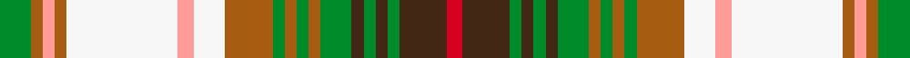

This is one **variant** — a specific cloth: this exact thread count and colourway, with its own
provenance below. It is one weaving of the [sett](/setts/g8o3lr3o3w28lr4w8o12g3o3g3o3g8do3g3do3g3do12r4/) (the scale-free proportion — the
same cloth at any scale or shade), whose colour order is pattern [GRYRWYWRGRGRGBGBGBR](/stripes/gryrwywrgrgrgbgbgbr/).

Part of the [Drymen](/tartans/d/dr/drymen/) tartan — the named design grouping this sett with its other cloths.

Sourced from register-of-tartans.  It is a [19 stripe tartan](/stripes/stripes19/).

Original link [https://www.tartanregister.gov.uk/tartanDetails.aspx?ref=997](https://www.tartanregister.gov.uk/tartanDetails.aspx?ref=997)

Dataset <small>— provenance for this record, inherited from the source manifest</small>

<dl class="dataset-prov">
<dt>source</dt><dd><a href="/sources/register-of-tartans/">Scottish Register of Tartans</a></dd>
<dt>data captured from</dt><dd><a href="https://github.com/thetartan/tartan-database/blob/master/data/register-of-tartans/data.csv">https://github.com/thetartan/tartan-database/blob/master/data/register-of-tartans/data.csv</a></dd>
<dt>data date</dt><dd>1984 <small>(this record)</small></dd>
<dt>licence</dt><dd><a href="https://www.tartanregister.gov.uk/copyright">Crown copyright</a></dd>
</dl>

Capture chain <small>— the hands this data passed through, oldest first; each capture carries its own licence</small>

<ol class="capture-chain">
<li><a href="https://www.tartanregister.gov.uk/">Scottish Register of Tartans</a> · <a href="https://www.tartanregister.gov.uk/copyright">Crown copyright</a> <small>the living register — still published by National Records of Scotland</small></li>
<li><a href="https://github.com/thetartan/tartan-database">thetartan/tartan-database</a> <small>2016-2017</small> · <a href="https://creativecommons.org/licenses/by-nc-nd/4.0/">CC BY-NC-ND 4.0</a> <small>Levko Kravets's frozen compilation — the capture we vendored, and where its CC licence text came from</small></li>
<li>this dictionary <small>captured 2026-06-10 · commit 5bf86c7566</small> <small>each re-capture is a git commit to data/sources</small></li>
</ol>

## Register references

External register numbers recorded for this tartan.

- Scottish Register of Tartans: [997](https://www.tartanregister.gov.uk/tartanDetails.aspx?ref=997)
- Scottish Tartans Authority (ITI): 4725

## Thread count
G/8 O3 LR3 O3 W28 LR4 W8 O12 G3 O3 G3 O3 G8 DO3 G3 DO3 G3 DO12 R/4

One full sett is **222 threads**.

## Palette
<table><thead><tr><th>Colour</th><th>Shade</th><th>OKLCh</th></tr></thead><tbody><tr><td>G</td><td><code style="background-color:#008B2A;">#008B2A</code> <small style="color:#888">#008B2A</small></td><td><small style="color:#888">oklch(55.4% 0.170 145.9)</small></td></tr><tr><td>DO</td><td><code style="background-color:#412714;">#412714</code> <small style="color:#888">#412714</small></td><td><small style="color:#888">oklch(30.1% 0.050 55.7)</small></td></tr><tr><td>O</td><td><code style="background-color:#A65C11;">#A65C11</code> <small style="color:#888">#A65C11</small></td><td><small style="color:#888">oklch(55.0% 0.125 58.3)</small></td></tr><tr><td>LR</td><td><code style="background-color:#FF9C97;">#FF9C97</code> <small style="color:#888">#FF9C97</small></td><td><small style="color:#888">oklch(79.3% 0.119 23.2)</small></td></tr><tr><td>R</td><td><code style="background-color:#D60020;">#D60020</code> <small style="color:#888">#D60020</small></td><td><small style="color:#888">oklch(55.2% 0.224 25.5)</small></td></tr><tr><td>W</td><td><code style="background-color:#F7F7F7;">#F7F7F7</code> <small style="color:#888">#F7F7F7</small></td><td><small style="color:#888">oklch(97.6% 0.000 89.9)</small></td></tr></tbody></table>

# Sample pattern

## Nearest tartan variants

The nearest existing variants by ΔTartan distance, with this cloth at the top so the swatches line up against it.

ΔTartan

Threads

Variant

Sett

—

222

<a href="/variants/s19/g8o3lr3o3w28lr4w8o12g3o3g3o3g8do3g3do3g3do12r4/">Drymen</a>

<a href="/ttd/edit/#slug=dg1r6g5r6dg1r1dg9dy3g3y3dg9r1dg1r6g5r6dg1r1w1r1w12g1w12r1w1r1~x4&amp;base=g8o3lr3o3w28lr4w8o12g3o3g3o3g8do3g3do3g3do12r4" title="compare in the TTD">2.34</a>

776

<a href="/variants/s26/dg1r6g5r6dg1r1dg9dy3g3y3dg9r1dg1r6g5r6dg1r1w1r1w12g1w12r1w1r1~x4/">Maple Leaf Dress District Tartan</a>

<a href="/ttd/edit/#slug=dg1r6g5r6dg1r1dg9o3dg3gi3dg9r1dg1r6g5r6dg1r1w1r1w12g1w12r1w1r1~x4~dg1104144-gi2104115&amp;base=g8o3lr3o3w28lr4w8o12g3o3g3o3g8do3g3do3g3do12r4" title="compare in the TTD">2.50</a>

776

<a href="/variants/s26/dg1r6g5r6dg1r1dg9o3dg3gi3dg9r1dg1r6g5r6dg1r1w1r1w12g1w12r1w1r1~x4~dg1104144-gi2104115/">Maple Leaf, dress</a>

<a href="/ttd/edit/#slug=dp3lb1w9r6g5lb2w2lb2w2lb2g12y2~x2&amp;base=g8o3lr3o3w28lr4w8o12g3o3g3o3g8do3g3do3g3do12r4" title="compare in the TTD">2.81</a>

182

<a href="/variants/s12/dp3lb1w9r6g5lb2w2lb2w2lb2g12y2~x2/">Fredericton District Tartan</a>

<a href="/ttd/edit/#slug=w1r2db2w1g9w1db2r2w1r2db2w1lo9w1db2r2w1~x4&amp;base=g8o3lr3o3w28lr4w8o12g3o3g3o3g8do3g3do3g3do12r4" title="compare in the TTD">2.89</a>

320

<a href="/variants/s17/w1r2db2w1g9w1db2r2w1r2db2w1lo9w1db2r2w1~x4/">Jacobite General Tartan</a>

<a href="/ttd/edit/#slug=dy2w2k2w12dy1w1dy1w1ly4do5ly2do9dy3r2~x2&amp;base=g8o3lr3o3w28lr4w8o12g3o3g3o3g8do3g3do3g3do12r4" title="compare in the TTD">2.90</a>

180

<a href="/variants/s14/dy2w2k2w12dy1w1dy1w1ly4do5ly2do9dy3r2~x2/">Harrods (Corporate)</a>

<a href="/ttd/edit/#slug=r1dg1r6g5r6dg1r1dg9ly3g3do3dg9r1dg1r6dgi5r6dg1r1w1r1w12g1w12r1w1~x4~g2408144-dgi1806142&amp;base=g8o3lr3o3w28lr4w8o12g3o3g3o3g8do3g3do3g3do12r4" title="compare in the TTD">2.94</a>

776

<a href="/variants/s26/r1dg1r6g5r6dg1r1dg9ly3g3do3dg9r1dg1r6dgi5r6dg1r1w1r1w12g1w12r1w1~x4~g2408144-dgi1806142/">Maple Leaf Dress (Lumsden)</a>

<a href="/ttd/edit/#slug=dy3do9ly2do5ly4w1dy1w1dy1w12k2w2dy2w2k2w12dy1w1dy1w1ly4do5ly2do9dy3r2~x2&amp;base=g8o3lr3o3w28lr4w8o12g3o3g3o3g8do3g3do3g3do12r4" title="compare in the TTD">2.98</a>

350

<a href="/variants/s26/dy3do9ly2do5ly4w1dy1w1dy1w12k2w2dy2w2k2w12dy1w1dy1w1ly4do5ly2do9dy3r2~x2/">Harrods</a>

<a href="/ttd/edit/#slug=r14lb4dt6y1dt2w2dt2lg12r6dt2r2w1~x4~lg3003114&amp;base=g8o3lr3o3w28lr4w8o12g3o3g3o3g8do3g3do3g3do12r4" title="compare in the TTD">3.01</a>

372

<a href="/variants/s12/r14lb4dt6y1dt2w2dt2lg12r6dt2r2w1~x4~lg3003114/">Stuart/Stewart - Prince Charles Edward</a>

<a href="/ttd/edit/#slug=w5db2w1g8w1db2r2w1r2db2w1lo8w1db2w5~x2&amp;base=g8o3lr3o3w28lr4w8o12g3o3g3o3g8do3g3do3g3do12r4" title="compare in the TTD">3.04</a>

152

<a href="/variants/s15/w5db2w1g8w1db2r2w1r2db2w1lo8w1db2w5~x2/">Wombles Corporate Tartan</a>

<a href="/ttd/edit/#slug=r2o3do9oi2do5oi4w1o1w1o1w12k2w2o2~x2~o2102055-oi2104058&amp;base=g8o3lr3o3w28lr4w8o12g3o3g3o3g8do3g3do3g3do12r4" title="compare in the TTD">3.08</a>

180

<a href="/variants/s14/r2o3do9oi2do5oi4w1o1w1o1w12k2w2o2~x2~o2102055-oi2104058/">Harrods</a>

## Neighbour map

Every grey dot is one of 13621 variants placed by the first two principal components of the ΔTartan feature space (42% of its variance). Red is this tartan; blue dots are its nearest — click one to open its page. The map is a flat projection of a many-dimensional space — [how to read it](/posts/neighbourhood-maps/).

<svg viewBox="0 0 640 380" role="img" style="max-width:100%;height:auto;border:1px solid #e0e0e0;border-radius:4px;display:block" xmlns="http://www.w3.org/2000/svg"><image href="/nn/cloud.v1.png" width="640" height="380"/><a href="/variants/s26/dg1r6g5r6dg1r1dg9dy3g3y3dg9r1dg1r6g5r6dg1r1w1r1w12g1w12r1w1r1~x4/"><circle cx="84.6" cy="109.7" r="4" fill="#3465a4"><title>Maple Leaf Dress District Tartan</title></circle></a><a href="/variants/s26/dg1r6g5r6dg1r1dg9o3dg3gi3dg9r1dg1r6g5r6dg1r1w1r1w12g1w12r1w1r1~x4~dg1104144-gi2104115/"><circle cx="84.1" cy="108.5" r="4" fill="#3465a4"><title>Maple Leaf, dress</title></circle></a><a href="/variants/s12/dp3lb1w9r6g5lb2w2lb2w2lb2g12y2~x2/"><circle cx="125.7" cy="159.3" r="4" fill="#3465a4"><title>Fredericton District Tartan</title></circle></a><a href="/variants/s17/w1r2db2w1g9w1db2r2w1r2db2w1lo9w1db2r2w1~x4/"><circle cx="79.9" cy="151.3" r="4" fill="#3465a4"><title>Jacobite General Tartan</title></circle></a><a href="/variants/s14/dy2w2k2w12dy1w1dy1w1ly4do5ly2do9dy3r2~x2/"><circle cx="90.4" cy="121.5" r="4" fill="#3465a4"><title>Harrods (Corporate)</title></circle></a><a href="/variants/s26/r1dg1r6g5r6dg1r1dg9ly3g3do3dg9r1dg1r6dgi5r6dg1r1w1r1w12g1w12r1w1~x4~g2408144-dgi1806142/"><circle cx="63.7" cy="95.8" r="4" fill="#3465a4"><title>Maple Leaf Dress (Lumsden)</title></circle></a><a href="/variants/s26/dy3do9ly2do5ly4w1dy1w1dy1w12k2w2dy2w2k2w12dy1w1dy1w1ly4do5ly2do9dy3r2~x2/"><circle cx="84.4" cy="97.5" r="4" fill="#3465a4"><title>Harrods</title></circle></a><a href="/variants/s12/r14lb4dt6y1dt2w2dt2lg12r6dt2r2w1~x4~lg3003114/"><circle cx="124.2" cy="120.0" r="4" fill="#3465a4"><title>Stuart/Stewart - Prince Charles Edward</title></circle></a><a href="/variants/s15/w5db2w1g8w1db2r2w1r2db2w1lo8w1db2w5~x2/"><circle cx="108.6" cy="172.9" r="4" fill="#3465a4"><title>Wombles Corporate Tartan</title></circle></a><a href="/variants/s14/r2o3do9oi2do5oi4w1o1w1o1w12k2w2o2~x2~o2102055-oi2104058/"><circle cx="97.4" cy="122.3" r="4" fill="#3465a4"><title>Harrods</title></circle></a><circle cx="89.2" cy="134.1" r="5" fill="#c00000"/><text x="320" y="376" text-anchor="middle" font-size="11" fill="#999">ground</text><text x="11" y="190" text-anchor="middle" font-size="11" fill="#999" transform="rotate(-90 11 190)">complexity</text></svg>

ID: /variants/s19/g8o3lr3o3w28lr4w8o12g3o3g3o3g8do3g3do3g3do12r4/
