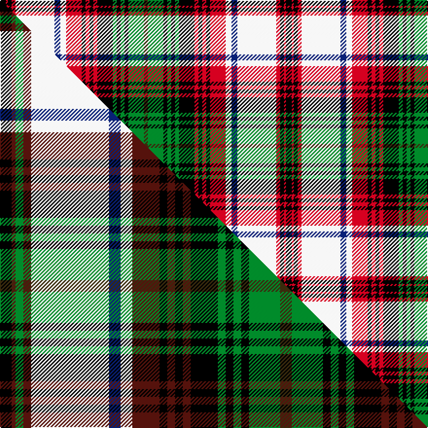

This page is one **sett** — a single exact thread-count. It belongs to the [tartan](/setts/k3r1k2r2w20db3w3r8k2r2k2r2k8g2k2g2k2g8dy2/)
(the same proportion at any scale), whose colour order is pattern [GGKGKGKRKRKRWBWRKRK](/stripes/ggkgkgkrkrkrwbwrkrk/).

Part of the [Princess Beatrice Dress](/tartans/princess-beatrice-dress/) tartan — the named design grouping this sett with its other cloths.

Sourced from register-of-tartans.  It is a [19 stripe tartan](/stripes/stripes19/).

Original link https://www.tartanregister.gov.uk/tartanDetails.aspx?ref=3397

2 attestations — the source records this cloth was collapsed from (oldest owns this page)

<ul>
<li>01/01/1880 — Princess Beatrice Dress (1880) (register-of-tartans, <a href="https://www.tartanregister.gov.uk/tartanDetails.aspx?ref=3397">record</a>)  <em>Princess Beatrice (1857 - 1944) was the youngest daughter of Queen Victoria who married Prince Henry of Battenburg in 1885. It was originally thought that this tartan was possibly designed for that wedding or as a commemorative tartan for that occasion although it was not until circa 1930 that the sett first appeared in the lists of Ross and Johnston. However, research in 2003 showed that a woven sample of this tartan, just known as 'Beatrice Dress' was included in Clans Originaux published in Paris in 1880. The original hypothesis was therefore incorrect and the tartan had been in existance for at least 5 years before the wedding.</em></li>
<li>1880 — Princess Beatrice Dress (1880) (Fash (tartans-authority, <a href="http://www.tartansauthority.com/tartan-ferret/display/1206/">record</a>)  <em>Princess Beatrice (1857 - 1944) was the youngest daughter of Queen Victoria who married Prince Henry of Battenburg in 1885. It was originally thought that this tartan was possibly designed for that wedding or as a commemorative tartan for that occasion although it was not until circa 1930 that the sett first appeared in the lists of Ross and Johnston. However, research in 2003 showed that a woven sample of this tartan, just known as 'Beatrice Dress' was included in Clans Originaux published in Paris in 1880. The original hypothesis was therefore incorrect and the tartan had been in existance for at least 5 years before the wedding.</em></li>
</ul>

## Register references

External register numbers recorded for this tartan.

- Scottish Register of Tartans: [3397](https://www.tartanregister.gov.uk/tartanDetails.aspx?ref=3397)
- Scottish Tartans Authority (ITI): 1206
- Scottish Tartans World Register: 1206

## Thread count
K/6 R2 K4 R4 W40 DB6 W6 R16 K4 R4 K4 R4 K16 G4 K4 G4 K4 G16 DY/4

One full sett is **294 threads**.

## Palette
<table><thead><tr><th>Colour</th><th>Shade</th><th>OKLCh</th></tr></thead><tbody><tr><td>DB</td><td><code style="background-color:#082077;">#082077</code> <small style="color:#888">#082077</small></td><td><small style="color:#888">oklch(30.0% 0.149 265.1)</small></td></tr><tr><td>G</td><td><code style="background-color:#008B2A;">#008B2A</code> <small style="color:#888">#008B2A</small></td><td><small style="color:#888">oklch(55.4% 0.170 145.9)</small></td></tr><tr><td>K</td><td><code style="background-color:#000000;">#000000</code> <small style="color:#888">#000000</small></td><td><small style="color:#888">oklch(0.0% 0.000 0.0)</small></td></tr><tr><td>W</td><td><code style="background-color:#F7F7F7;">#F7F7F7</code> <small style="color:#888">#F7F7F7</small></td><td><small style="color:#888">oklch(97.6% 0.000 89.9)</small></td></tr><tr><td>R</td><td><code style="background-color:#D60020;">#D60020</code> <small style="color:#888">#D60020</small></td><td><small style="color:#888">oklch(55.2% 0.224 25.5)</small></td></tr><tr><td>DY</td><td><code style="background-color:#3A2B0D;">#3A2B0D</code> <small style="color:#888">#3A2B0D</small></td><td><small style="color:#888">oklch(30.0% 0.049 82.0)</small></td></tr></tbody></table>

# Sample pattern

## Compared to the master

This cloth is one sett of its design; the master sett (the exemplar the design is anchored on) is below for comparison.

Its **ΔTartan distance** from the master is **1.14** — the same measure the nearest-tartans table ranks by (0 is identical; a re-scale of the same cloth is near 0, a recolour or a different proportion further).

<figure class="master-compare" style="margin:0">

this sett
master sett ★

<figcaption style="color:#888;font-size:smaller">One weave of this sett against the <a href="/setts/k3dr1g2dr2w20db3w3dr7k2dr2k2dr2k7g2k2g2k2g8dy3/">master sett ★</a>, split on the diagonal: a shared proportion runs seamlessly across it with only the shades shifting; a different proportion breaks on it.</figcaption>
</figure>

## Nearest tartan variants

The nearest existing variants by ΔTartan distance, with this cloth at the top so the swatches line up against it.

ΔTartan

Threads

Variant

Sett

—

294

<a href="/variants/s19/k3r1k2r2w20db3w3r8k2r2k2r2k8g2k2g2k2g8dy2~x2/">Princess Beatrice Dress (1880)</a>

<a href="/ttd/edit/#slug=k3r1g2r2w20db3w3r7k2r2k2r2k7g2k2g2k2g8y3~x2&amp;base=k3r1k2r2w20db3w3r8k2r2k2r2k8g2k2g2k2g8dy2~x2" title="compare in the TTD">1.14</a>

288

<a href="/variants/s19/k3r1g2r2w20db3w3r7k2r2k2r2k7g2k2g2k2g8y3~x2/">Princess Beatrice, dress</a>

<a href="/ttd/edit/#slug=k3dr1g2dr2w20db3w3dr7k2dr2k2dr2k7g2k2g2k2g8dy3~x4&amp;base=k3r1k2r2w20db3w3r8k2r2k2r2k8g2k2g2k2g8dy2~x2" title="compare in the TTD">1.14</a>

576

<a href="/variants/s19/k3dr1g2dr2w20db3w3dr7k2dr2k2dr2k7g2k2g2k2g8dy3~x4/">Princess Beatrice Dress (Dance)</a>

<a href="/ttd/edit/#slug=r8lb16k2r4k2lb51k8w8k6y4k4y4k12r4k12r4g16k2r4k2r16g8&amp;base=k3r1k2r2w20db3w3r8k2r2k2r2k8g2k2g2k2g8dy2~x2" title="compare in the TTD">1.42</a>

378

<a href="/variants/s22/r8lb16k2r4k2lb51k8w8k6y4k4y4k12r4k12r4g16k2r4k2r16g8/">Anderson (MacGregor-Hastie #1)</a>

<a href="/ttd/edit/#slug=w37k4db12g12w2lr2r23k4r6~x2~lr2805035-r1506019&amp;base=k3r1k2r2w20db3w3r8k2r2k2r2k8g2k2g2k2g8dy2~x2" title="compare in the TTD">1.70</a>

322

<a href="/variants/s9/w37k4db12g12w2lr2r23k4r6~x2~lr2805035-r1506019/">Hebridean Arisaid Red (Dance)</a>

<a href="/ttd/edit/#slug=k1o4w13o1k5dp4w1dp4k5w1k3r5n3w1n3r5k13r1w20n3r1~x2&amp;base=k3r1k2r2w20db3w3r8k2r2k2r2k8g2k2g2k2g8dy2~x2" title="compare in the TTD">1.77</a>

384

<a href="/variants/s21/k1o4w13o1k5dp4w1dp4k5w1k3r5n3w1n3r5k13r1w20n3r1~x2/">Aberdeen (Johnston and Smith)</a>

<a href="/ttd/edit/#slug=r4g6r2g6r3db4r1k4y1k1y1k3w3k3w18r1k2r1w6r3~x2&amp;base=k3r1k2r2w20db3w3r8k2r2k2r2k8g2k2g2k2g8dy2~x2" title="compare in the TTD">1.86</a>

278

<a href="/variants/s20/r4g6r2g6r3db4r1k4y1k1y1k3w3k3w18r1k2r1w6r3~x2/">Anderson</a>

<a href="/ttd/edit/#slug=r3g6k1r2k1g6db5r1k3y1k1y1k3w3k3w18k1r2k1w6r3&amp;base=k3r1k2r2w20db3w3r8k2r2k2r2k8g2k2g2k2g8dy2~x2" title="compare in the TTD">1.91</a>

136

<a href="/variants/s21/r3g6k1r2k1g6db5r1k3y1k1y1k3w3k3w18k1r2k1w6r3/">Anderson P</a>

<a href="/ttd/edit/#slug=r5t6r2t9r14k5ly2k2ly2k5w5k5lb23r1k2r1lb5t4~x2&amp;base=k3r1k2r2w20db3w3r8k2r2k2r2k8g2k2g2k2g8dy2~x2" title="compare in the TTD">1.94</a>

374

<a href="/variants/s18/r5t6r2t9r14k5ly2k2ly2k5w5k5lb23r1k2r1lb5t4~x2/">Westwood MacAndreas</a>

<a href="/ttd/edit/#slug=r6g10r2k2r4k2r2g10r4k9r2k9y2k3y2k4w6k6lb27r2k2r2lb10r6~x2&amp;base=k3r1k2r2w20db3w3r8k2r2k2r2k8g2k2g2k2g8dy2~x2" title="compare in the TTD">1.97</a>

512

<a href="/variants/s24/r6g10r2k2r4k2r2g10r4k9r2k9y2k3y2k4w6k6lb27r2k2r2lb10r6~x2/">Anderson (MacGregor-Hastie #3)</a>

<a href="/ttd/edit/#slug=k1dp4w13dp1k5b4w1b4k5w1k3r5n3w1n3r5k13r1w20n3r1~x2&amp;base=k3r1k2r2w20db3w3r8k2r2k2r2k8g2k2g2k2g8dy2~x2" title="compare in the TTD">2.06</a>

384

<a href="/variants/s21/k1dp4w13dp1k5b4w1b4k5w1k3r5n3w1n3r5k13r1w20n3r1~x2/">Aberdeen Dress (Dance)</a>

## Neighbour map

Every grey dot is one of 13620 variants placed by the first two principal components of the ΔTartan feature space (42% of its variance). Red is this tartan; blue dots are its nearest — click one to open its page.

<svg viewBox="0 0 640 380" role="img" style="max-width:100%;height:auto;border:1px solid #e0e0e0;border-radius:4px;display:block" xmlns="http://www.w3.org/2000/svg"><image href="/nn/cloud.v1.png" width="640" height="380"/><a href="/variants/s19/k3r1g2r2w20db3w3r7k2r2k2r2k7g2k2g2k2g8y3~x2/"><circle cx="66.2" cy="70.0" r="4" fill="#3465a4"><title>Princess Beatrice, dress</title></circle></a><a href="/variants/s19/k3dr1g2dr2w20db3w3dr7k2dr2k2dr2k7g2k2g2k2g8dy3~x4/"><circle cx="67.8" cy="73.7" r="4" fill="#3465a4"><title>Princess Beatrice Dress (Dance)</title></circle></a><a href="/variants/s22/r8lb16k2r4k2lb51k8w8k6y4k4y4k12r4k12r4g16k2r4k2r16g8/"><circle cx="95.9" cy="50.5" r="4" fill="#3465a4"><title>Anderson (MacGregor-Hastie #1)</title></circle></a><a href="/variants/s9/w37k4db12g12w2lr2r23k4r6~x2~lr2805035-r1506019/"><circle cx="75.8" cy="88.3" r="4" fill="#3465a4"><title>Hebridean Arisaid Red (Dance)</title></circle></a><a href="/variants/s21/k1o4w13o1k5dp4w1dp4k5w1k3r5n3w1n3r5k13r1w20n3r1~x2/"><circle cx="91.3" cy="65.7" r="4" fill="#3465a4"><title>Aberdeen (Johnston and Smith)</title></circle></a><a href="/variants/s20/r4g6r2g6r3db4r1k4y1k1y1k3w3k3w18r1k2r1w6r3~x2/"><circle cx="86.0" cy="76.3" r="4" fill="#3465a4"><title>Anderson</title></circle></a><a href="/variants/s21/r3g6k1r2k1g6db5r1k3y1k1y1k3w3k3w18k1r2k1w6r3/"><circle cx="88.6" cy="68.0" r="4" fill="#3465a4"><title>Anderson P</title></circle></a><a href="/variants/s18/r5t6r2t9r14k5ly2k2ly2k5w5k5lb23r1k2r1lb5t4~x2/"><circle cx="71.0" cy="78.5" r="4" fill="#3465a4"><title>Westwood MacAndreas</title></circle></a><a href="/variants/s24/r6g10r2k2r4k2r2g10r4k9r2k9y2k3y2k4w6k6lb27r2k2r2lb10r6~x2/"><circle cx="40.6" cy="84.6" r="4" fill="#3465a4"><title>Anderson (MacGregor-Hastie #3)</title></circle></a><a href="/variants/s21/k1dp4w13dp1k5b4w1b4k5w1k3r5n3w1n3r5k13r1w20n3r1~x2/"><circle cx="90.8" cy="66.6" r="4" fill="#3465a4"><title>Aberdeen Dress (Dance)</title></circle></a><circle cx="68.3" cy="68.1" r="5" fill="#c00000"/><text x="320" y="376" text-anchor="middle" font-size="11" fill="#999">ground</text><text x="11" y="190" text-anchor="middle" font-size="11" fill="#999" transform="rotate(-90 11 190)">complexity</text></svg>

ID: /variants/s19/k3r1k2r2w20db3w3r8k2r2k2r2k8g2k2g2k2g8dy2~x2/
