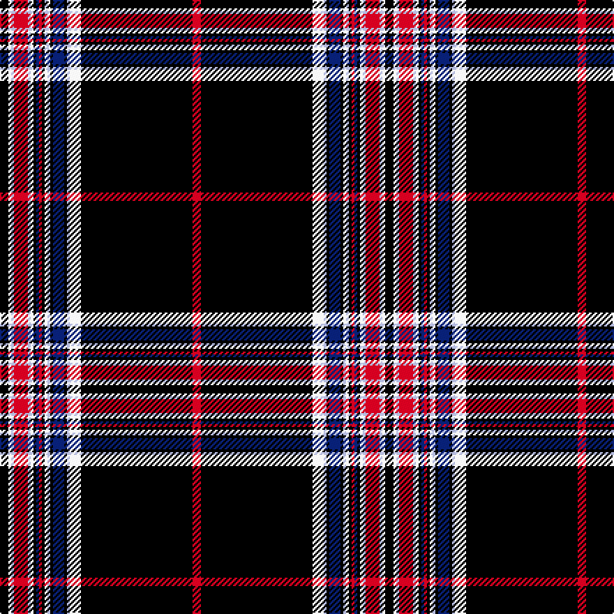

This page is one **sett** — a single exact thread-count. It belongs to the [tartan](/setts/k3w1lb1r5lb1w1k1db1r1k1lb1w1k1db4k1lb1w4k40r3/)
(the same proportion at any scale), whose colour order is pattern [KWWRWWKBRKWWKBKWWKR](/stripes/kwwrwwkbrkwwkbkwwkr/).

Part of the [JCM Customs](/tartans/jcm-customs/) tartan — the named design grouping this sett with its other cloths.

Sourced from tartans-authority.  It is a [19 stripe tartan](/stripes/stripes19/).

Original link https://www.tartanregister.gov.uk/tartanDetails.aspx?ref=11236

Dataset <small>— provenance for this record, inherited from the source manifest</small>

<dl class="dataset-prov">
<dt>source</dt><dd><a href="/sources/tartans-authority/">Scottish Tartans Authority</a></dd>
<dt>data captured from</dt><dd><a href="https://github.com/thetartan/tartan-database/blob/master/data/tartans-authority/data.csv">https://github.com/thetartan/tartan-database/blob/master/data/tartans-authority/data.csv</a></dd>
<dt>data date</dt><dd>2015 <small>(this record)</small></dd>
<dt>licence</dt><dd><a href="https://creativecommons.org/licenses/by-nc-nd/4.0/">CC BY-NC-ND 4.0</a></dd>
</dl>

Capture chain <small>— the hands this data passed through, oldest first; each capture carries its own licence</small>

<ol class="capture-chain">
<li><a href="https://www.tartansauthority.com/">Scottish Tartans Authority</a> <small>the heritage body's archive — its tartan-ferret record browser is retired (links repaired to the SRT, above)</small></li>
<li><a href="https://github.com/thetartan/tartan-database">thetartan/tartan-database</a> <small>2016-2017</small> · <a href="https://creativecommons.org/licenses/by-nc-nd/4.0/">CC BY-NC-ND 4.0</a> <small>Levko Kravets's frozen compilation — the capture we vendored, and where its CC licence text came from</small></li>
<li>this dictionary <small>captured 2026-06-10 · commit 5bf86c7566</small> <small>each re-capture is a git commit to data/sources</small></li>
</ol>

## Register references

External register numbers recorded for this tartan.

- Scottish Register of Tartans: [11236](https://www.tartanregister.gov.uk/tartanDetails?ref=11236)
- Scottish Tartans Authority (ITI): 11236

## Thread count
K/6 W2 LB2 R10 LB2 W2 K2 DB2 R2 K2 LB2 W2 K2 DB8 K2 LB2 W8 K80 R/6

One full sett is **276 threads**.

## Palette
<table><thead><tr><th>Colour</th><th>Shade</th><th>OKLCh</th></tr></thead><tbody><tr><td>DB</td><td><code style="background-color:#082077;">#082077</code> <small style="color:#888">#082077</small></td><td><small style="color:#888">oklch(30.0% 0.149 265.1)</small></td></tr><tr><td>K</td><td><code style="background-color:#000000;">#000000</code> <small style="color:#888">#000000</small></td><td><small style="color:#888">oklch(0.0% 0.000 0.0)</small></td></tr><tr><td>LB</td><td><code style="background-color:#B5BBDE;">#B5BBDE</code> <small style="color:#888">#B5BBDE</small></td><td><small style="color:#888">oklch(79.9% 0.050 277.6)</small></td></tr><tr><td>R</td><td><code style="background-color:#D60020;">#D60020</code> <small style="color:#888">#D60020</small></td><td><small style="color:#888">oklch(55.2% 0.224 25.5)</small></td></tr><tr><td>W</td><td><code style="background-color:#F7F7F7;">#F7F7F7</code> <small style="color:#888">#F7F7F7</small></td><td><small style="color:#888">oklch(97.6% 0.000 89.9)</small></td></tr></tbody></table>

# Sample pattern

## Compared to the master

This cloth is one sett of its design; the master sett (the exemplar the design is anchored on) is below for comparison.

Its **ΔTartan distance** from the master is **0.60** — the same measure the nearest-tartans table ranks by (0 is identical; a re-scale of the same cloth is near 0, a recolour or a different proportion further).

<figure class="master-compare" style="margin:0">

this sett
master sett ★

<figcaption style="color:#888;font-size:smaller">One weave of this sett against the <a href="/setts/k3w1lb1r5lb1w1k1db1r1k1w1lb1k1db4k1lb1w4k40r3/">master sett ★</a>, split on the diagonal: a shared proportion runs seamlessly across it with only the shades shifting; a different proportion breaks on it.</figcaption>
</figure>

## Nearest tartan variants

The nearest existing variants by ΔTartan distance, with this cloth at the top so the swatches line up against it.

ΔTartan

Threads

Variant

Sett

—

276

<a href="/variants/s19/k3w1lb1r5lb1w1k1db1r1k1lb1w1k1db4k1lb1w4k40r3~x2/">J.C.M. Customs</a>

<a href="/ttd/edit/#slug=k3w1lb1r5lb1w1k1db1r1k1w1lb1k1db4k1lb1w4k40r3~x2&amp;base=k3w1lb1r5lb1w1k1db1r1k1lb1w1k1db4k1lb1w4k40r3~x2" title="compare in the TTD">0.60</a>

276

<a href="/variants/s19/k3w1lb1r5lb1w1k1db1r1k1w1lb1k1db4k1lb1w4k40r3~x2/">JCM Customs</a>

<a href="/ttd/edit/#slug=db5w1db5w1db5w1db5w1db5w1lo5b1y5b1lo5y1k36w1b3w1k72w1~x2~db1404245-b1611266&amp;base=k3w1lb1r5lb1w1k1db1r1k1lb1w1k1db4k1lb1w4k40r3~x2" title="compare in the TTD">2.68</a>

636

<a href="/variants/s22/db5w1db5w1db5w1db5w1db5w1lo5b1y5b1lo5y1k36w1b3w1k72w1~x2~db1404245-b1511266/">Khalsa</a>

<a href="/ttd/edit/#slug=dp3ly1k4dp1k4dp1k41dp1k4dp1k4dr15ly1dr3ly2dr3ly3dr1ly6k1w2~x2&amp;base=k3w1lb1r5lb1w1k1db1r1k1lb1w1k1db4k1lb1w4k40r3~x2" title="compare in the TTD">2.89</a>

398

<a href="/variants/s21/dp3ly1k4dp1k4dp1k41dp1k4dp1k4dr15ly1dr3ly2dr3ly3dr1ly6k1w2~x2/">New Star (Fashion)</a>

<a href="/ttd/edit/#slug=k86n6k4w3k3r3k3n22o14k3o6w4&amp;base=k3w1lb1r5lb1w1k1db1r1k1lb1w1k1db4k1lb1w4k40r3~x2" title="compare in the TTD">2.97</a>

224

<a href="/variants/s12/k86n6k4w3k3r3k3n22o14k3o6w4/">Langtree</a>

<a href="/ttd/edit/#slug=k86n6k4w3k3r3k3n22ly14k3ly6w4&amp;base=k3w1lb1r5lb1w1k1db1r1k1lb1w1k1db4k1lb1w4k40r3~x2" title="compare in the TTD">3.07</a>

224

<a href="/variants/s12/k86n6k4w3k3r3k3n22ly14k3ly6w4/">Langtree Trade Tartan</a>

<a href="/ttd/edit/#slug=k86n6k4lb3k3dr3k3n22o14k3o6lb4&amp;base=k3w1lb1r5lb1w1k1db1r1k1lb1w1k1db4k1lb1w4k40r3~x2" title="compare in the TTD">3.10</a>

224

<a href="/variants/s12/k86n6k4lb3k3dr3k3n22o14k3o6lb4/">Langtree</a>

<a href="/ttd/edit/#slug=k96db8k12dp3k3dp3k3g20r8k3r4w4~db1406275-dp1607327&amp;base=k3w1lb1r5lb1w1k1db1r1k1lb1w1k1db4k1lb1w4k40r3~x2" title="compare in the TTD">3.17</a>

234

<a href="/variants/s12/k96db8k12dp3k3dp3k3g20r8k3r4w4~db1406275-dp1607327/">Watt</a>

<a href="/ttd/edit/#slug=dr3ly1k4dr1k4dr1k41dr1k4dr1k4o15ly1o3ly2o3ly3o1ly6k1w2~x2&amp;base=k3w1lb1r5lb1w1k1db1r1k1lb1w1k1db4k1lb1w4k40r3~x2" title="compare in the TTD">3.20</a>

398

<a href="/variants/s21/dr3ly1k4dr1k4dr1k41dr1k4dr1k4o15ly1o3ly2o3ly3o1ly6k1w2~x2/">New Star</a>

<a href="/ttd/edit/#slug=k3y3k3y3k3y3k3y3k36w1k2db9r2db1~x2&amp;base=k3w1lb1r5lb1w1k1db1r1k1lb1w1k1db4k1lb1w4k40r3~x2" title="compare in the TTD">3.24</a>

292

<a href="/variants/s14/k3y3k3y3k3y3k3y3k36w1k2db9r2db1~x2/">Goldwire (2015)</a>

<a href="/ttd/edit/#slug=w2k1w1r1y1k3w18k2w2k1w1y2db8w4k48w3k2w2k1w1y1r1~x2&amp;base=k3w1lb1r5lb1w1k1db1r1k1lb1w1k1db4k1lb1w4k40r3~x2" title="compare in the TTD">3.31</a>

418

<a href="/variants/s22/w2k1w1r1y1k3w18k2w2k1w1y2db8w4k48w3k2w2k1w1y1r1~x2/">Normandy Bay Myth</a>

## Neighbour map

Every grey dot is one of 13620 variants placed by the first two principal components of the ΔTartan feature space (42% of its variance). Red is this tartan; blue dots are its nearest — click one to open its page.

<svg viewBox="0 0 640 380" role="img" style="max-width:100%;height:auto;border:1px solid #e0e0e0;border-radius:4px;display:block" xmlns="http://www.w3.org/2000/svg"><image href="/nn/cloud.v1.png" width="640" height="380"/><a href="/variants/s19/k3w1lb1r5lb1w1k1db1r1k1w1lb1k1db4k1lb1w4k40r3~x2/"><circle cx="333.9" cy="14.0" r="4" fill="#3465a4"><title>JCM Customs</title></circle></a><a href="/variants/s22/db5w1db5w1db5w1db5w1db5w1lo5b1y5b1lo5y1k36w1b3w1k72w1~x2~db1404245-b1511266/"><circle cx="341.4" cy="14.0" r="4" fill="#3465a4"><title>Khalsa</title></circle></a><a href="/variants/s21/dp3ly1k4dp1k4dp1k41dp1k4dp1k4dr15ly1dr3ly2dr3ly3dr1ly6k1w2~x2/"><circle cx="289.8" cy="17.0" r="4" fill="#3465a4"><title>New Star (Fashion)</title></circle></a><a href="/variants/s12/k86n6k4w3k3r3k3n22o14k3o6w4/"><circle cx="319.6" cy="48.0" r="4" fill="#3465a4"><title>Langtree</title></circle></a><a href="/variants/s12/k86n6k4w3k3r3k3n22ly14k3ly6w4/"><circle cx="309.6" cy="46.5" r="4" fill="#3465a4"><title>Langtree Trade Tartan</title></circle></a><a href="/variants/s12/k86n6k4lb3k3dr3k3n22o14k3o6lb4/"><circle cx="327.6" cy="51.1" r="4" fill="#3465a4"><title>Langtree</title></circle></a><a href="/variants/s12/k96db8k12dp3k3dp3k3g20r8k3r4w4~db1406275-dp1607327/"><circle cx="266.4" cy="14.0" r="4" fill="#3465a4"><title>Watt</title></circle></a><a href="/variants/s21/dr3ly1k4dr1k4dr1k41dr1k4dr1k4o15ly1o3ly2o3ly3o1ly6k1w2~x2/"><circle cx="276.3" cy="14.0" r="4" fill="#3465a4"><title>New Star</title></circle></a><a href="/variants/s14/k3y3k3y3k3y3k3y3k36w1k2db9r2db1~x2/"><circle cx="361.2" cy="44.3" r="4" fill="#3465a4"><title>Goldwire (2015)</title></circle></a><a href="/variants/s22/w2k1w1r1y1k3w18k2w2k1w1y2db8w4k48w3k2w2k1w1y1r1~x2/"><circle cx="277.6" cy="14.0" r="4" fill="#3465a4"><title>Normandy Bay Myth</title></circle></a><circle cx="333.9" cy="14.0" r="5" fill="#c00000"/><text x="320" y="376" text-anchor="middle" font-size="11" fill="#999">ground</text><text x="11" y="190" text-anchor="middle" font-size="11" fill="#999" transform="rotate(-90 11 190)">complexity</text></svg>

ID: /variants/s19/k3w1lb1r5lb1w1k1db1r1k1lb1w1k1db4k1lb1w4k40r3~x2/
