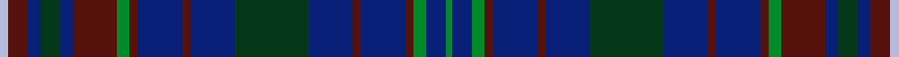
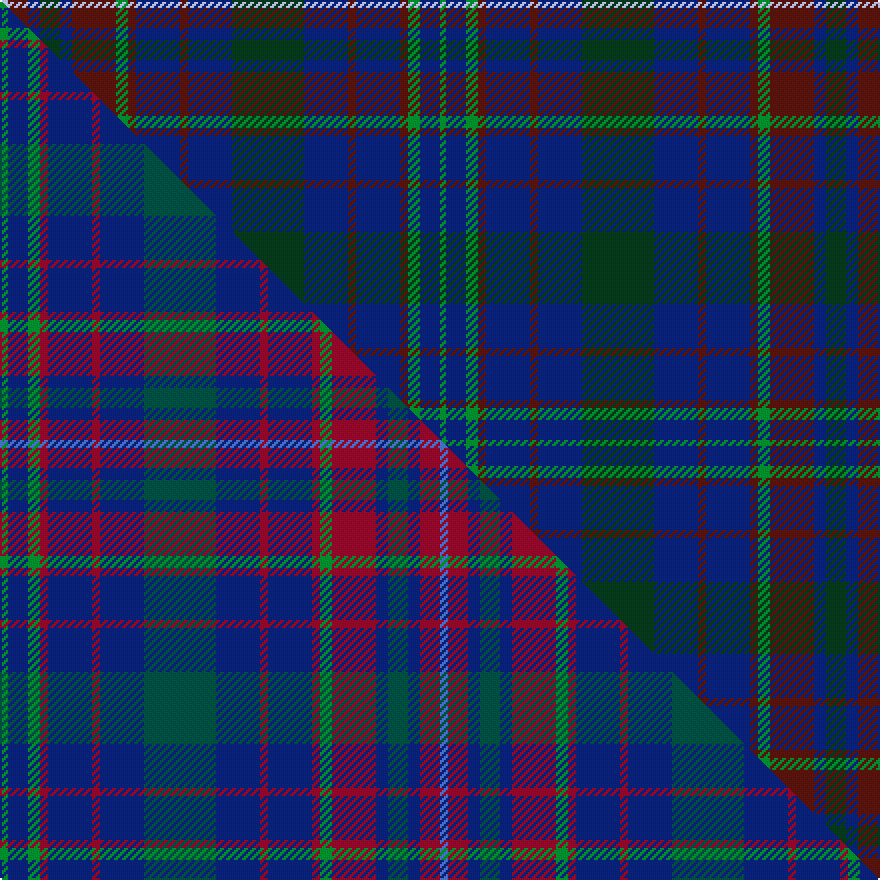

This page is one **sett** — a single exact thread-count. It belongs to the [tartan](/setts/lb4dr10db6dg10db6dr22g6dr4db22dr4db22dg36db22dr4db22dr4g6db10g3/)
(the same proportion at any scale), whose colour order is pattern [GBGBBBBGBBBBGBBGBBW](/stripes/gbgbbbbgbbbbgbbgbbw/).

Part of the [Jorgensen of Taasinge](/tartans/jorgensen-of-taasinge/) tartan — the named design grouping this sett with its other cloths.

Sourced from tartans-authority.  It is a [19 stripe tartan](/stripes/stripes19/).

Original link http://www.tartansauthority.com/tartan-ferret/display/7214/

## Register references

External register numbers recorded for this tartan.

- Scottish Tartans Authority (ITI): 7214

## Thread count
LB/4 DR10 DB6 DG10 DB6 DR22 G6 DR4 DB22 DR4 DB22 DG36 DB22 DR4 DB22 DR4 G6 DB10 G/3

One full sett is **439 threads**.

## Palette
<table><thead><tr><th>Colour</th><th>Shade</th><th>OKLCh</th></tr></thead><tbody><tr><td>LB</td><td><code style="background-color:#B5BBDE;">#B5BBDE</code> <small style="color:#888">#B5BBDE</small></td><td><small style="color:#888">oklch(79.9% 0.050 277.6)</small></td></tr><tr><td>DB</td><td><code style="background-color:#082077;">#082077</code> <small style="color:#888">#082077</small></td><td><small style="color:#888">oklch(30.0% 0.149 265.1)</small></td></tr><tr><td>DR</td><td><code style="background-color:#55120C;">#55120C</code> <small style="color:#888">#55120C</small></td><td><small style="color:#888">oklch(30.0% 0.099 29.3)</small></td></tr><tr><td>DG</td><td><code style="background-color:#053819;">#053819</code> <small style="color:#888">#053819</small></td><td><small style="color:#888">oklch(30.0% 0.075 151.3)</small></td></tr><tr><td>G</td><td><code style="background-color:#008B2A;">#008B2A</code> <small style="color:#888">#008B2A</small></td><td><small style="color:#888">oklch(55.4% 0.170 145.9)</small></td></tr></tbody></table>

# Sample pattern

## Compared to the master

This cloth is one sett of its design; the master sett (the exemplar the design is anchored on) is below for comparison.

Its **ΔTartan distance** from the master is **0.38** — the same measure the nearest-tartans table ranks by (0 is identical; a re-scale of the same cloth is near 0, a recolour or a different proportion further).

<figure class="master-compare" style="margin:0">

this sett
master sett ★

<figcaption style="color:#888;font-size:smaller">One weave of this sett against the <a href="/setts/g2db5g3r2db11r2db11dg18db11r2db11r2g3r11db3dg5db3r5b2/">master sett ★</a>, split on the diagonal: a shared proportion runs seamlessly across it with only the shades shifting; a different proportion breaks on it.</figcaption>
</figure>

## Nearest tartan variants

The nearest existing variants by ΔTartan distance, with this cloth at the top so the swatches line up against it.

ΔTartan

Threads

Variant

Sett

—

439

<a href="/variants/s19/lb4dr10db6dg10db6dr22g6dr4db22dr4db22dg36db22dr4db22dr4g6db10g3/">Jorgensen of Taasinge (Personal)</a>

<a href="/ttd/edit/#slug=lb4dr10dt6dg10dt6dr22g6dr4dt22dr4dt22dg36dt22dr4dt22dr4g6dt10g3~dt1103265-dg1704144&amp;base=lb4dr10db6dg10db6dr22g6dr4db22dr4db22dg36db22dr4db22dr4g6db10g3" title="compare in the TTD">0.12</a>

439

<a href="/variants/s19/lb4dr10dt6dg10dt6dr22g6dr4dt22dr4dt22dg36dt22dr4dt22dr4g6dt10g3~dt1103265-dg1704144/">Jrgensen of Taasingee (Personal)</a>

<a href="/ttd/edit/#slug=g2db5g3r2db11r2db11dg18db11r2db11r2g3r11db3dg5db3r5b2~x2~r1707016-dg1503171&amp;base=lb4dr10db6dg10db6dr22g6dr4db22dr4db22dg36db22dr4db22dr4g6db10g3" title="compare in the TTD">0.37</a>

440

<a href="/variants/s19/g2db5g3r2db11r2db11dg18db11r2db11r2g3r11db3dg5db3r5b2~x2~r1707016-dg1503171/">Jorgensen of Taasinge Family Tartan</a>

<a href="/ttd/edit/#slug=db20dg6db6lb2dg20dr8dg6dr4dg10lr3~x2&amp;base=lb4dr10db6dg10db6dr22g6dr4db22dr4db22dg36db22dr4db22dr4g6db10g3" title="compare in the TTD">3.27</a>

294

<a href="/variants/s10/db20dg6db6lb2dg20dr8dg6dr4dg10lr3~x2/">MacConnell</a>

<a href="/ttd/edit/#slug=dy3dbi20db4dg3db3dg3db3dg3db4dbi13lo2dbi2lo2dbi2dg2dbi2dg3~x2~dbi1403246-db1106275&amp;base=lb4dr10db6dg10db6dr22g6dr4db22dr4db22dg36db22dr4db22dr4g6db10g3" title="compare in the TTD">3.45</a>

284

<a href="/variants/s17/dy3dbi20db4dg3db3dg3db3dg3db4dbi13lo2dbi2lo2dbi2dg2dbi2dg3~x2~dbi1403246-db1106275/">Fermanagh, County (District)</a>

<a href="/ttd/edit/#slug=db4dt24db6r3db4g3db8w3db8g3db4r3db6dt24db4dt3~x2~db1406275&amp;base=lb4dr10db6dg10db6dr22g6dr4db22dr4db22dg36db22dr4db22dr4g6db10g3" title="compare in the TTD">3.55</a>

426

<a href="/variants/s16/db4dt24db6r3db4g3db8w3db8g3db4r3db6dt24db4dt3~x2~db1406275/">Scozia</a>

<a href="/ttd/edit/#slug=dg14db2r2db2dg22lb2db16lb2dt20dg5r2dg5dt20lb2db16lb2dg8~x2~db1406275-dt1204274&amp;base=lb4dr10db6dg10db6dr22g6dr4db22dr4db22dg36db22dr4db22dr4g6db10g3" title="compare in the TTD">3.88</a>

524

<a href="/variants/s17/dg14dbi2r2dbi2dg22lb2dbi16lb2db20dg5r2dg5db20lb2dbi16lb2dg8~x2~dbi1406275-db1204274/">Frangord</a>

<a href="/ttd/edit/#slug=dt3r1db12dg2db2dt4db2dg2db2dg9dt1ly2~x4~dt1204274-db1406275&amp;base=lb4dr10db6dg10db6dr22g6dr4db22dr4db22dg36db22dr4db22dr4g6db10g3" title="compare in the TTD">3.88</a>

316

<a href="/variants/s12/db3r1dbi12dg2dbi2db4dbi2dg2dbi2dg9db1ly2~x4~db1204274-dbi1406275/">St. Andrew's Soc. of Philadelphia (C</a>

<a href="/ttd/edit/#slug=w2t4dy3dt3dy3dt20dy3t16dt8lb2~x2~t2102222-dt1102249&amp;base=lb4dr10db6dg10db6dr22g6dr4db22dr4db22dg36db22dr4db22dr4g6db10g3" title="compare in the TTD">3.96</a>

248

<a href="/variants/s10/w2t4dy3dt3dy3dt20dy3t16dt8lb2~x2~t2102222-dt1102249/">Sverker</a>

## Neighbour map

Every grey dot is one of 13620 variants placed by the first two principal components of the ΔTartan feature space (42% of its variance). Red is this tartan; blue dots are its nearest — click one to open its page.

<svg viewBox="0 0 640 380" role="img" style="max-width:100%;height:auto;border:1px solid #e0e0e0;border-radius:4px;display:block" xmlns="http://www.w3.org/2000/svg"><image href="/nn/cloud.v1.png" width="640" height="380"/><a href="/variants/s19/lb4dr10dt6dg10dt6dr22g6dr4dt22dr4dt22dg36dt22dr4dt22dr4g6dt10g3~dt1103265-dg1704144/"><circle cx="343.5" cy="204.8" r="4" fill="#3465a4"><title>Jrgensen of Taasingee (Personal)</title></circle></a><a href="/variants/s19/g2db5g3r2db11r2db11dg18db11r2db11r2g3r11db3dg5db3r5b2~x2~r1707016-dg1503171/"><circle cx="277.4" cy="187.8" r="4" fill="#3465a4"><title>Jorgensen of Taasinge Family Tartan</title></circle></a><a href="/variants/s10/db20dg6db6lb2dg20dr8dg6dr4dg10lr3~x2/"><circle cx="322.9" cy="232.5" r="4" fill="#3465a4"><title>MacConnell</title></circle></a><a href="/variants/s17/dy3dbi20db4dg3db3dg3db3dg3db4dbi13lo2dbi2lo2dbi2dg2dbi2dg3~x2~dbi1403246-db1106275/"><circle cx="375.5" cy="197.2" r="4" fill="#3465a4"><title>Fermanagh, County (District)</title></circle></a><a href="/variants/s16/db4dt24db6r3db4g3db8w3db8g3db4r3db6dt24db4dt3~x2~db1406275/"><circle cx="292.4" cy="185.8" r="4" fill="#3465a4"><title>Scozia</title></circle></a><a href="/variants/s17/dg14dbi2r2dbi2dg22lb2dbi16lb2db20dg5r2dg5db20lb2dbi16lb2dg8~x2~dbi1406275-db1204274/"><circle cx="260.9" cy="186.7" r="4" fill="#3465a4"><title>Frangord</title></circle></a><a href="/variants/s12/db3r1dbi12dg2dbi2db4dbi2dg2dbi2dg9db1ly2~x4~db1204274-dbi1406275/"><circle cx="303.9" cy="195.1" r="4" fill="#3465a4"><title>St. Andrew's Soc. of Philadelphia (C</title></circle></a><a href="/variants/s10/w2t4dy3dt3dy3dt20dy3t16dt8lb2~x2~t2102222-dt1102249/"><circle cx="309.8" cy="205.1" r="4" fill="#3465a4"><title>Sverker</title></circle></a><circle cx="320.1" cy="196.9" r="5" fill="#c00000"/><text x="320" y="376" text-anchor="middle" font-size="11" fill="#999">ground</text><text x="11" y="190" text-anchor="middle" font-size="11" fill="#999" transform="rotate(-90 11 190)">complexity</text></svg>

ID: /variants/s19/lb4dr10db6dg10db6dr22g6dr4db22dr4db22dg36db22dr4db22dr4g6db10g3/
