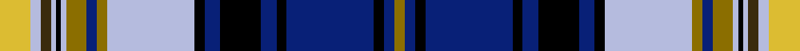

This is one **variant** — a specific cloth: this exact thread count and colourway, with its own
provenance below. It is one weaving of the [sett](/tartans/f/fe/ferrari/) (the scale-free proportion — the
same cloth at any scale or shade), whose colour order is pattern [GBKBKBKBKWGBGWKWGWY](/stripes/gbkbkbkbkwgbgwkwgwy/).

Part of the [Ferrari](/tartans/f/fe/ferrari/) tartan — the named design grouping this sett with its other cloths.

Sourced from register-of-tartans.  It is a [19 stripe tartan](/stripes/stripes19/).

Original link [https://www.tartanregister.gov.uk/tartanDetails.aspx?ref=10790](https://www.tartanregister.gov.uk/tartanDetails.aspx?ref=10790)

Dataset <small>— provenance for this record, inherited from the source manifest</small>

<dl class="dataset-prov">
<dt>source</dt><dd><a href="/sources/register-of-tartans/">Scottish Register of Tartans</a></dd>
<dt>data captured from</dt><dd><a href="https://github.com/thetartan/tartan-database/blob/master/data/register-of-tartans/data.csv">https://github.com/thetartan/tartan-database/blob/master/data/register-of-tartans/data.csv</a></dd>
<dt>data date</dt><dd>21/02/2013 <small>(this record)</small></dd>
<dt>licence</dt><dd><a href="https://www.tartanregister.gov.uk/copyright">Crown copyright</a></dd>
</dl>

Capture chain <small>— the hands this data passed through, oldest first; each capture carries its own licence</small>

<ol class="capture-chain">
<li><a href="https://www.tartanregister.gov.uk/">Scottish Register of Tartans</a> · <a href="https://www.tartanregister.gov.uk/copyright">Crown copyright</a> <small>the living register — still published by National Records of Scotland</small></li>
<li><a href="https://github.com/thetartan/tartan-database">thetartan/tartan-database</a> <small>2016-2017</small> · <a href="https://creativecommons.org/licenses/by-nc-nd/4.0/">CC BY-NC-ND 4.0</a> <small>Levko Kravets's frozen compilation — the capture we vendored, and where its CC licence text came from</small></li>
<li>this dictionary <small>captured 2026-06-10 · commit 5bf86c7566</small> <small>each re-capture is a git commit to data/sources</small></li>
</ol>

## Register references

External register numbers recorded for this tartan.

- Scottish Register of Tartans: [10790](https://www.tartanregister.gov.uk/tartanDetails.aspx?ref=10790)

## Thread count
LY/12 LB4 DY4 LB2 K2 LB2 Y8 DB4 Y4 LB34 K4 DB6 K16 DB6 K4 DB34 K4 DB4 Y/4

One full sett is **300 threads**.

## Palette
<table><thead><tr><th>Colour</th><th>Shade</th><th>OKLCh</th></tr></thead><tbody><tr><td>DB</td><td><code style="background-color:#082077;">#082077</code> <small style="color:#888">#082077</small></td><td><small style="color:#888">oklch(30.0% 0.149 265.1)</small></td></tr><tr><td>LB</td><td><code style="background-color:#B5BBDE;">#B5BBDE</code> <small style="color:#888">#B5BBDE</small></td><td><small style="color:#888">oklch(79.9% 0.050 277.6)</small></td></tr><tr><td>DY</td><td><code style="background-color:#3A2B0D;">#3A2B0D</code> <small style="color:#888">#3A2B0D</small></td><td><small style="color:#888">oklch(30.0% 0.049 82.0)</small></td></tr><tr><td>K</td><td><code style="background-color:#000000;">#000000</code> <small style="color:#888">#000000</small></td><td><small style="color:#888">oklch(0.0% 0.000 0.0)</small></td></tr><tr><td>LY</td><td><code style="background-color:#DCBC32;">#DCBC32</code> <small style="color:#888">#DCBC32</small></td><td><small style="color:#888">oklch(80.0% 0.150 95.2)</small></td></tr><tr><td>Y</td><td><code style="background-color:#8B6E00;">#8B6E00</code> <small style="color:#888">#8B6E00</small></td><td><small style="color:#888">oklch(55.1% 0.113 90.4)</small></td></tr></tbody></table>

# Sample pattern

## Nearest tartan variants

The nearest existing variants by ΔTartan distance, with this cloth at the top so the swatches line up against it.

ΔTartan

Threads

Variant

Sett

—

300

<a href="/variants/s19/ly6lb2dy2lb1k1lb1y4db2y2lb17k2db3k8db3k2db17k2db2y2~x2/">Ferrari (Coldrerio)</a>

<a href="/ttd/edit/#slug=ly6db2lo2db1k1db1lyi4lb2lyi2db17k2lb3k8lb3k2lb17k2lb2lyi2~x2~ly7811105-lyi8517093&amp;base=ly6lb2dy2lb1k1lb1y4db2y2lb17k2db3k8db3k2db17k2db2y2~x2" title="compare in the TTD">1.45</a>

300

<a href="/variants/s19/ly6db2lo2db1k1db1lyi4lb2lyi2db17k2lb3k8lb3k2lb17k2lb2lyi2~x2~ly7811105-lyi8517093/">Ferrari (Name)</a>

<a href="/ttd/edit/#slug=w37k4db12t12w2lb2dp23k4dp6~x2&amp;base=ly6lb2dy2lb1k1lb1y4db2y2lb17k2db3k8db3k2db17k2db2y2~x2" title="compare in the TTD">2.02</a>

322

<a href="/variants/s9/w37k4db12t12w2lb2dp23k4dp6~x2/">Hebridean Arisaid Blue (Dance)</a>

<a href="/ttd/edit/#slug=r1w1db8lb12y1lb1k2w3k6db1lb1y1lb1db1w1r1~x6&amp;base=ly6lb2dy2lb1k1lb1y4db2y2lb17k2db3k8db3k2db17k2db2y2~x2" title="compare in the TTD">2.09</a>

492

<a href="/variants/s16/r1w1db8lb12y1lb1k2w3k6db1lb1y1lb1db1w1r1~x6/">Buchanan, John &amp; Isabella</a>

<a href="/ttd/edit/#slug=db2b4r2w26db3w2db3k10b3db2b3g9db1k1db21b3db2r2~x2&amp;base=ly6lb2dy2lb1k1lb1y4db2y2lb17k2db3k8db3k2db17k2db2y2~x2" title="compare in the TTD">2.19</a>

388

<a href="/variants/s18/db2b4r2w26db3w2db3k10b3db2b3g9db1k1db21b3db2r2~x2/">Cooper, dress</a>

<a href="/ttd/edit/#slug=db81r4db8r8db4r12w16k8w32k16y6db8g16r8w4r24&amp;base=ly6lb2dy2lb1k1lb1y4db2y2lb17k2db3k8db3k2db17k2db2y2~x2" title="compare in the TTD">2.21</a>

405

<a href="/variants/s16/db81r4db8r8db4r12w16k8w32k16y6db8g16r8w4r24/">Royal Stuart/Stewart (Variant)</a>

<a href="/ttd/edit/#slug=w16t38db2t6db2t4db4t2db6t2db12dr16k8ly8dr4ly3dr2ly16dr10&amp;base=ly6lb2dy2lb1k1lb1y4db2y2lb17k2db3k8db3k2db17k2db2y2~x2" title="compare in the TTD">2.34</a>

296

<a href="/variants/s19/w16t38db2t6db2t4db4t2db6t2db12dr16k8ly8dr4ly3dr2ly16dr10/">Declaration of Scottish Independence</a>

<a href="/ttd/edit/#slug=db2lp4r2w26db3w2db3k10lp3db2lp3g9db1k1db21lp3db2r2~x2&amp;base=ly6lb2dy2lb1k1lb1y4db2y2lb17k2db3k8db3k2db17k2db2y2~x2" title="compare in the TTD">2.44</a>

388

<a href="/variants/s18/db2lp4r2w26db3w2db3k10lp3db2lp3g9db1k1db21lp3db2r2~x2/">Cooper Dress Tartan</a>

<a href="/ttd/edit/#slug=r6g2r2g8k2y2k2y2k10db2k2db23w2db2w2~x2&amp;base=ly6lb2dy2lb1k1lb1y4db2y2lb17k2db3k8db3k2db17k2db2y2~x2" title="compare in the TTD">2.45</a>

260

<a href="/variants/s15/r6g2r2g8k2y2k2y2k10db2k2db23w2db2w2~x2/">Estes Family Tartan</a>

<a href="/ttd/edit/#slug=r3db14k12lb24k1w3k1lb24k12db2k2db2k2db8y1r3~x2&amp;base=ly6lb2dy2lb1k1lb1y4db2y2lb17k2db3k8db3k2db17k2db2y2~x2" title="compare in the TTD">2.45</a>

444

<a href="/variants/s16/r3db14k12lb24k1w3k1lb24k12db2k2db2k2db8y1r3~x2/">Royal Scottish Country Dance Society</a>

<a href="/ttd/edit/#slug=dy2db2r4db21k1db1g9r3db2r3k10db3w2db3w28dy2r4db2~x2&amp;base=ly6lb2dy2lb1k1lb1y4db2y2lb17k2db3k8db3k2db17k2db2y2~x2" title="compare in the TTD">2.49</a>

400

<a href="/variants/s18/dy2db2r4db21k1db1g9r3db2r3k10db3w2db3w28dy2r4db2~x2/">Cooper Dress (Dalgleish #2) (Dance)</a>

## Neighbour map

Every grey dot is one of 13662 variants placed by the first two principal components of the ΔTartan feature space (42% of its variance). Red is this tartan; blue dots are its nearest — click one to open its page. The map is a flat projection of a many-dimensional space — [how to read it](/posts/neighbourhood-maps/).

<svg viewBox="0 0 640 380" role="img" style="max-width:100%;height:auto;border:1px solid #e0e0e0;border-radius:4px;display:block" xmlns="http://www.w3.org/2000/svg"><image href="/nn/cloud.v1.png" width="640" height="380"/><a href="/variants/s19/ly6db2lo2db1k1db1lyi4lb2lyi2db17k2lb3k8lb3k2lb17k2lb2lyi2~x2~ly7811105-lyi8517093/"><circle cx="93.6" cy="80.5" r="4" fill="#3465a4"><title>Ferrari (Name)</title></circle></a><a href="/variants/s9/w37k4db12t12w2lb2dp23k4dp6~x2/"><circle cx="82.5" cy="94.1" r="4" fill="#3465a4"><title>Hebridean Arisaid Blue (Dance)</title></circle></a><a href="/variants/s16/r1w1db8lb12y1lb1k2w3k6db1lb1y1lb1db1w1r1~x6/"><circle cx="95.0" cy="94.9" r="4" fill="#3465a4"><title>Buchanan, John &amp; Isabella</title></circle></a><a href="/variants/s18/db2b4r2w26db3w2db3k10b3db2b3g9db1k1db21b3db2r2~x2/"><circle cx="111.2" cy="61.1" r="4" fill="#3465a4"><title>Cooper, dress</title></circle></a><a href="/variants/s16/db81r4db8r8db4r12w16k8w32k16y6db8g16r8w4r24/"><circle cx="129.0" cy="73.1" r="4" fill="#3465a4"><title>Royal Stuart/Stewart (Variant)</title></circle></a><a href="/variants/s19/w16t38db2t6db2t4db4t2db6t2db12dr16k8ly8dr4ly3dr2ly16dr10/"><circle cx="89.2" cy="92.2" r="4" fill="#3465a4"><title>Declaration of Scottish Independence</title></circle></a><a href="/variants/s18/db2lp4r2w26db3w2db3k10lp3db2lp3g9db1k1db21lp3db2r2~x2/"><circle cx="110.5" cy="59.5" r="4" fill="#3465a4"><title>Cooper Dress Tartan</title></circle></a><a href="/variants/s15/r6g2r2g8k2y2k2y2k10db2k2db23w2db2w2~x2/"><circle cx="114.9" cy="97.3" r="4" fill="#3465a4"><title>Estes Family Tartan</title></circle></a><a href="/variants/s16/r3db14k12lb24k1w3k1lb24k12db2k2db2k2db8y1r3~x2/"><circle cx="147.6" cy="73.2" r="4" fill="#3465a4"><title>Royal Scottish Country Dance Society</title></circle></a><a href="/variants/s18/dy2db2r4db21k1db1g9r3db2r3k10db3w2db3w28dy2r4db2~x2/"><circle cx="105.1" cy="50.2" r="4" fill="#3465a4"><title>Cooper Dress (Dalgleish #2) (Dance)</title></circle></a><circle cx="97.5" cy="80.5" r="5" fill="#c00000"/><text x="320" y="376" text-anchor="middle" font-size="11" fill="#999">ground</text><text x="11" y="190" text-anchor="middle" font-size="11" fill="#999" transform="rotate(-90 11 190)">complexity</text></svg>

ID: /variants/s19/ly6lb2dy2lb1k1lb1y4db2y2lb17k2db3k8db3k2db17k2db2y2~x2/
