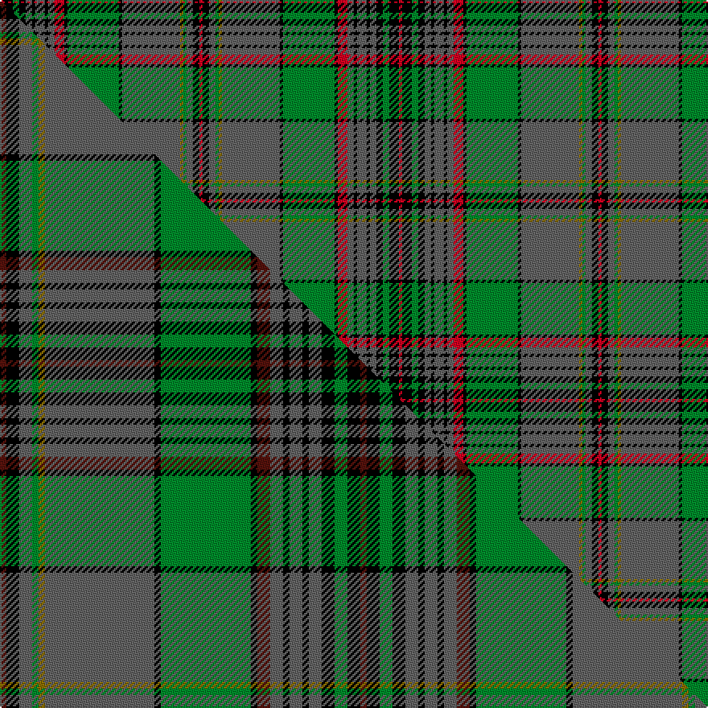

This is one **variant** — a specific cloth: this exact thread count and colourway, with its own
provenance below. It is one weaving of the [sett](/setts/r1k3g2k2n2k1n3k1n2r3k1g16k1n18y1g1n2k2r1/) (the scale-free proportion — the
same cloth at any scale or shade), whose colour order is pattern [RKBGGBKGKRBKBKBKGKR](/stripes/rkbggbkgkrbkbkbkgkr/).

Part of the [Craig](/tartans/craig/) tartan — the named design grouping this sett with its other cloths.

Sourced from house-of-tartan.  It is a [19 stripe tartan](/stripes/stripes19/).

Original link [http://www.house-of-tartan.scotland.net/house/TartanViewjs.asp?colr=Def&tnam=1574](http://www.house-of-tartan.scotland.net/house/TartanViewjs.asp?colr=Def&tnam=1574)

## Provenance

Earliest known date: 1957 MacGregor Hastie wrote, "This tartan was designed by me to meet a long felt want. Many people have asked if there was a Craig family tartan, and as the name is not connected with any Highland clan, yet the the family name is numerous, it seemed a good idea to design one. The design is based on the general colour of craigs and rocks." The Craig tartan is now in general production.

2 attestations — the source records this cloth was collapsed from (oldest owns this page)

<ul>
<li>1957 — Craig Family Tartan (house-of-tartan, <a href="http://www.house-of-tartan.scotland.net/house/TartanViewjs.asp?colr=Def&tnam=1574">record</a>) </li>
<li>undated — Craig (weddslist, <a href="http://www.weddslist.com/cgi-bin/tartans/pg.pl?source=sts">record</a>) </li>
</ul>

Dataset <small>— provenance for this record, inherited from the source manifest</small>

<dl class="dataset-prov">
<dt>source</dt><dd><a href="/sources/house-of-tartan/">House of Tartan</a></dd>
<dt>data captured from</dt><dd><a href="https://github.com/thetartan/tartan-database/blob/master/data/house-of-tartan/data.csv">https://github.com/thetartan/tartan-database/blob/master/data/house-of-tartan/data.csv</a></dd>
<dt>data date</dt><dd>1957 <small>(this record)</small></dd>
<dt>licence</dt><dd><a href="https://creativecommons.org/licenses/by-nc-nd/4.0/">CC BY-NC-ND 4.0</a></dd>
</dl>

Capture chain <small>— the hands this data passed through, oldest first; each capture carries its own licence</small>

<ol class="capture-chain">
<li><a href="http://www.house-of-tartan.scotland.net/">House of Tartan</a> <small>the weaver/retailer's database — the site is now offline; the URL is kept as the ultimate source's identity</small></li>
<li><a href="https://github.com/thetartan/tartan-database">thetartan/tartan-database</a> <small>2016-2017</small> · <a href="https://creativecommons.org/licenses/by-nc-nd/4.0/">CC BY-NC-ND 4.0</a> <small>Levko Kravets's frozen compilation — the capture we vendored, and where its CC licence text came from</small></li>
<li>this dictionary <small>captured 2026-06-10 · commit 5bf86c7566</small> <small>each re-capture is a git commit to data/sources</small></li>
</ol>

## Thread count
R/2 K6 G4 K4 N4 K2 N6 K2 N4 R6 K2 G32 K2 N36 Y2 G2 N4 K4 R/2

One full sett is **248 threads**.

## Palette
<table><thead><tr><th>Colour</th><th>Shade</th><th>OKLCh</th></tr></thead><tbody><tr><td>G</td><td><code style="background-color:#008B2A;">#008B2A</code> <small style="color:#888">#008B2A</small></td><td><small style="color:#888">oklch(55.4% 0.170 145.9)</small></td></tr><tr><td>K</td><td><code style="background-color:#000000;">#000000</code> <small style="color:#888">#000000</small></td><td><small style="color:#888">oklch(0.0% 0.000 0.0)</small></td></tr><tr><td>N</td><td><code style="background-color:#636363;">#636363</code> <small style="color:#888">#636363</small></td><td><small style="color:#888">oklch(50.0% 0.000 89.9)</small></td></tr><tr><td>R</td><td><code style="background-color:#D60020;">#D60020</code> <small style="color:#888">#D60020</small></td><td><small style="color:#888">oklch(55.2% 0.224 25.5)</small></td></tr><tr><td>Y</td><td><code style="background-color:#8B6E00;">#8B6E00</code> <small style="color:#888">#8B6E00</small></td><td><small style="color:#888">oklch(55.1% 0.113 90.4)</small></td></tr></tbody></table>

# Sample pattern

## Compared to the master

This cloth is one sett of its design; the master sett (the exemplar the design is anchored on) is below for comparison.

Its **ΔTartan distance** from the master is **0.19** — the same measure the nearest-tartans table ranks by (0 is identical; a re-scale of the same cloth is near 0, a recolour or a different proportion further).

<figure class="master-compare" style="margin:0">

this sett
master sett ★

<figcaption style="color:#888;font-size:smaller">One weave of this sett against the <a href="/setts/dr1k2n2g1y1n17k1g14k1dr2n2k1n2k1n2k2g2k2dr1/">master sett ★</a>, split on the diagonal: a shared proportion runs seamlessly across it with only the shades shifting; a different proportion breaks on it.</figcaption>
</figure>

## Nearest tartan variants

The nearest existing variants by ΔTartan distance, with this cloth at the top so the swatches line up against it.

ΔTartan

Threads

Variant

Sett

—

248

<a href="/variants/s19/r1k3g2k2n2k1n3k1n2r3k1g16k1n18y1g1n2k2r1~x2/">Craig Family Tartan</a>

<a href="/ttd/edit/#slug=dr1k2n2g1y1n17k1g14k1dr2n2k1n2k1n2k2g2k2dr1~x4&amp;base=r1k3g2k2n2k1n3k1n2r3k1g16k1n18y1g1n2k2r1~x2" title="compare in the TTD">0.19</a>

448

<a href="/variants/s19/dr1k2n2g1y1n17k1g14k1dr2n2k1n2k1n2k2g2k2dr1~x4/">Craig</a>

<a href="/ttd/edit/#slug=db36k5r2k5g15r2g10w2g10r2g15k5r2k5db10r2db2r2db4w2~x2~db1404245&amp;base=r1k3g2k2n2k1n3k1n2r3k1g16k1n18y1g1n2k2r1~x2" title="compare in the TTD">2.38</a>

476

<a href="/variants/s20/db36k5r2k5g15r2g10w2g10r2g15k5r2k5db10r2db2r2db4w2~x2~db1404245/">Ranking Corporate Tartan</a>

<a href="/ttd/edit/#slug=g46k3db6y2db3y2db3g7r6db2r3w4~x2&amp;base=r1k3g2k2n2k1n3k1n2r3k1g16k1n18y1g1n2k2r1~x2" title="compare in the TTD">2.65</a>

248

<a href="/variants/s12/g46k3db6y2db3y2db3g7r6db2r3w4~x2/">Seller (Personal)</a>

<a href="/ttd/edit/#slug=g34r4g3r2g4r2g3r4g17k17r2db17r4db4ly3~x2&amp;base=r1k3g2k2n2k1n3k1n2r3k1g16k1n18y1g1n2k2r1~x2" title="compare in the TTD">2.78</a>

406

<a href="/variants/s15/g34r4g3r2g4r2g3r4g17k17r2db17r4db4ly3~x2/">Cochrane</a>

<a href="/ttd/edit/#slug=g34r4g4r2g4r2g3r4g17k17r2db17r4db4y3~x2&amp;base=r1k3g2k2n2k1n3k1n2r3k1g16k1n18y1g1n2k2r1~x2" title="compare in the TTD">2.79</a>

410

<a href="/variants/s15/g34r4g4r2g4r2g3r4g17k17r2db17r4db4y3~x2/">Cochrane (1984) Clan Tartan</a>

<a href="/ttd/edit/#slug=r2k1r1k1g15r4db4r3db3y1k1y2~x6&amp;base=r1k3g2k2n2k1n3k1n2r3k1g16k1n18y1g1n2k2r1~x2" title="compare in the TTD">2.84</a>

432

<a href="/variants/s12/r2k1r1k1g15r4db4r3db3y1k1y2~x6/">Celts, Tartan of the</a>

<a href="/ttd/edit/#slug=k2g2r3db18r2g6r4lb1db6r3g18r3k2g2~x2&amp;base=r1k3g2k2n2k1n3k1n2r3k1g16k1n18y1g1n2k2r1~x2" title="compare in the TTD">2.87</a>

280

<a href="/variants/s14/k2g2r3db18r2g6r4lb1db6r3g18r3k2g2~x2/">Glen Orchy #2 or MacIntyre</a>

<a href="/ttd/edit/#slug=k3ly8do2ly8dt11do2ly4dr4do27dt1do2dt2do2dt13do3~x2&amp;base=r1k3g2k2n2k1n3k1n2r3k1g16k1n18y1g1n2k2r1~x2" title="compare in the TTD">2.93</a>

356

<a href="/variants/s15/k3ly8do2ly8dt11do2ly4dr4do27dt1do2dt2do2dt13do3~x2/">Strathdon District Tartan</a>

<a href="/ttd/edit/#slug=dg24dp4dg3dp8k3lb8dp2lb2dp4lb2dp2lb8k3dp8dg3dp4dg24g2~x2~dg1806142-g2408144&amp;base=r1k3g2k2n2k1n3k1n2r3k1g16k1n18y1g1n2k2r1~x2" title="compare in the TTD">2.96</a>

404

<a href="/variants/s18/dg24dp4dg3dp8k3lb8dp2lb2dp4lb2dp2lb8k3dp8dg3dp4dg24g2~x2~dg1806142-g2408144/">Jones Hunting</a>

<a href="/ttd/edit/#slug=g16r2g2r1g3r1g2r2g12k12r1db16r2db8y2~x2&amp;base=r1k3g2k2n2k1n3k1n2r3k1g16k1n18y1g1n2k2r1~x2" title="compare in the TTD">3.04</a>

292

<a href="/variants/s15/g16r2g2r1g3r1g2r2g12k12r1db16r2db8y2~x2/">Cochrane Clan Tartan</a>

## Neighbour map

Every grey dot is one of 13621 variants placed by the first two principal components of the ΔTartan feature space (42% of its variance). Red is this tartan; blue dots are its nearest — click one to open its page.

<svg viewBox="0 0 640 380" role="img" style="max-width:100%;height:auto;border:1px solid #e0e0e0;border-radius:4px;display:block" xmlns="http://www.w3.org/2000/svg"><image href="/nn/cloud.v1.png" width="640" height="380"/><a href="/variants/s19/dr1k2n2g1y1n17k1g14k1dr2n2k1n2k1n2k2g2k2dr1~x4/"><circle cx="219.2" cy="88.6" r="4" fill="#3465a4"><title>Craig</title></circle></a><a href="/variants/s20/db36k5r2k5g15r2g10w2g10r2g15k5r2k5db10r2db2r2db4w2~x2~db1404245/"><circle cx="159.8" cy="94.9" r="4" fill="#3465a4"><title>Ranking Corporate Tartan</title></circle></a><a href="/variants/s12/g46k3db6y2db3y2db3g7r6db2r3w4~x2/"><circle cx="211.8" cy="46.8" r="4" fill="#3465a4"><title>Seller (Personal)</title></circle></a><a href="/variants/s15/g34r4g3r2g4r2g3r4g17k17r2db17r4db4ly3~x2/"><circle cx="206.9" cy="105.5" r="4" fill="#3465a4"><title>Cochrane</title></circle></a><a href="/variants/s15/g34r4g4r2g4r2g3r4g17k17r2db17r4db4y3~x2/"><circle cx="211.6" cy="107.4" r="4" fill="#3465a4"><title>Cochrane (1984) Clan Tartan</title></circle></a><a href="/variants/s12/r2k1r1k1g15r4db4r3db3y1k1y2~x6/"><circle cx="171.4" cy="116.9" r="4" fill="#3465a4"><title>Celts, Tartan of the</title></circle></a><a href="/variants/s14/k2g2r3db18r2g6r4lb1db6r3g18r3k2g2~x2/"><circle cx="176.6" cy="113.4" r="4" fill="#3465a4"><title>Glen Orchy #2 or MacIntyre</title></circle></a><a href="/variants/s15/k3ly8do2ly8dt11do2ly4dr4do27dt1do2dt2do2dt13do3~x2/"><circle cx="216.3" cy="102.2" r="4" fill="#3465a4"><title>Strathdon District Tartan</title></circle></a><a href="/variants/s18/dg24dp4dg3dp8k3lb8dp2lb2dp4lb2dp2lb8k3dp8dg3dp4dg24g2~x2~dg1806142-g2408144/"><circle cx="201.7" cy="124.0" r="4" fill="#3465a4"><title>Jones Hunting</title></circle></a><a href="/variants/s15/g16r2g2r1g3r1g2r2g12k12r1db16r2db8y2~x2/"><circle cx="168.9" cy="117.9" r="4" fill="#3465a4"><title>Cochrane Clan Tartan</title></circle></a><circle cx="207.7" cy="82.7" r="5" fill="#c00000"/><text x="320" y="376" text-anchor="middle" font-size="11" fill="#999">ground</text><text x="11" y="190" text-anchor="middle" font-size="11" fill="#999" transform="rotate(-90 11 190)">complexity</text></svg>

ID: /variants/s19/r1k3g2k2n2k1n3k1n2r3k1g16k1n18y1g1n2k2r1~x2/
