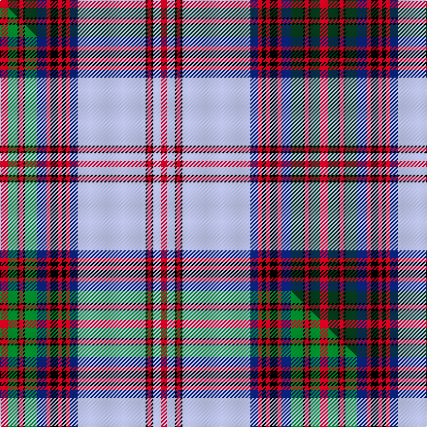

This is one **variant** — a specific cloth: this exact thread count and colourway, with its own
provenance below. It is one weaving of the [sett](/setts/r4dg5k1r2k1dg6db5r2k4r2k2r2db4lb35k1r2k1lb4r3/) (the scale-free proportion — the
same cloth at any scale or shade), whose colour order is pattern [RGKRKGBRKRKRBWKRKWR](/stripes/rgkrkgbrkrkrbwkrkwr/).

Part of the [Taggart](/tartans/t/ta/taggart/) tartan — the named design grouping this sett with its other cloths.

Sourced from tartans-authority.  It is a [19 stripe tartan](/stripes/stripes19/).

Original link [https://www.tartanregister.gov.uk/tartanDetails.aspx?ref=10003](https://www.tartanregister.gov.uk/tartanDetails.aspx?ref=10003)

Dataset <small>— provenance for this record, inherited from the source manifest</small>

<dl class="dataset-prov">
<dt>source</dt><dd><a href="/sources/tartans-authority/">Scottish Tartans Authority</a></dd>
<dt>data captured from</dt><dd><a href="https://github.com/thetartan/tartan-database/blob/master/data/tartans-authority/data.csv">https://github.com/thetartan/tartan-database/blob/master/data/tartans-authority/data.csv</a></dd>
<dt>data date</dt><dd>pre 2008 <small>(this record)</small></dd>
<dt>licence</dt><dd><a href="https://creativecommons.org/licenses/by-nc-nd/4.0/">CC BY-NC-ND 4.0</a></dd>
</dl>

Capture chain <small>— the hands this data passed through, oldest first; each capture carries its own licence</small>

<ol class="capture-chain">
<li><a href="https://www.tartansauthority.com/">Scottish Tartans Authority</a> <small>the heritage body's archive — its tartan-ferret record browser is retired (links repaired to the SRT, above)</small></li>
<li><a href="https://github.com/thetartan/tartan-database">thetartan/tartan-database</a> <small>2016-2017</small> · <a href="https://creativecommons.org/licenses/by-nc-nd/4.0/">CC BY-NC-ND 4.0</a> <small>Levko Kravets's frozen compilation — the capture we vendored, and where its CC licence text came from</small></li>
<li>this dictionary <small>captured 2026-06-10 · commit 5bf86c7566</small> <small>each re-capture is a git commit to data/sources</small></li>
</ol>

## Register references

External register numbers recorded for this tartan.

- Scottish Tartans Authority (ITI): 10003

## Thread count
R/8 DG10 K2 R4 K2 DG12 DB10 R4 K8 R4 K4 R4 DB8 LB70 K2 R4 K2 LB8 R/6

One full sett is **330 threads**.

## Palette
<table><thead><tr><th>Colour</th><th>Shade</th><th>OKLCh</th></tr></thead><tbody><tr><td>DB</td><td><code style="background-color:#082077;">#082077</code> <small style="color:#888">#082077</small></td><td><small style="color:#888">oklch(30.0% 0.149 265.1)</small></td></tr><tr><td>DG</td><td><code style="background-color:#053819;">#053819</code> <small style="color:#888">#053819</small></td><td><small style="color:#888">oklch(30.0% 0.075 151.3)</small></td></tr><tr><td>R</td><td><code style="background-color:#D60020;">#D60020</code> <small style="color:#888">#D60020</small></td><td><small style="color:#888">oklch(55.2% 0.224 25.5)</small></td></tr><tr><td>K</td><td><code style="background-color:#000000;">#000000</code> <small style="color:#888">#000000</small></td><td><small style="color:#888">oklch(0.0% 0.000 0.0)</small></td></tr><tr><td>LB</td><td><code style="background-color:#B5BBDE;">#B5BBDE</code> <small style="color:#888">#B5BBDE</small></td><td><small style="color:#888">oklch(79.9% 0.050 277.6)</small></td></tr></tbody></table>

# Sample pattern

## Compared to the master

This cloth is one sett of its design; the master sett (the exemplar the design is anchored on) is below for comparison.

Its **ΔTartan distance** from the master is **0.07** — the same measure the nearest-tartans table ranks by (0 is identical; a re-scale of the same cloth is near 0, a recolour or a different proportion further).

<figure class="master-compare" style="margin:0">

this sett
master sett ★

<figcaption style="color:#888;font-size:smaller">One weave of this sett against the <a href="/setts/r4g5k1r2k1g6db5r2k4r2k2r2db4lb35k1r2k1lb4r3/">master sett ★</a>, split on the diagonal: a shared proportion runs seamlessly across it with only the shades shifting; a different proportion breaks on it.</figcaption>
</figure>

## Nearest tartan variants

The nearest existing variants by ΔTartan distance, with this cloth at the top so the swatches line up against it.

ΔTartan

Threads

Variant

Sett

—

330

<a href="/variants/s19/r4dg5k1r2k1dg6db5r2k4r2k2r2db4lb35k1r2k1lb4r3~x2/">Taggart (Name)</a>

<a href="/ttd/edit/#slug=r4g5k1r2k1g6db5r2k4r2k2r2db4lb35k1r2k1lb4r3~x2&amp;base=r4dg5k1r2k1dg6db5r2k4r2k2r2db4lb35k1r2k1lb4r3~x2" title="compare in the TTD">0.07</a>

330

<a href="/variants/s19/r4g5k1r2k1g6db5r2k4r2k2r2db4lb35k1r2k1lb4r3~x2/">Taggart</a>

<a href="/ttd/edit/#slug=r4k6r2k7db5r2k4r2k2r2db4lb35k1r2k1lb4r3~x2&amp;base=r4dg5k1r2k1dg6db5r2k4r2k2r2db4lb35k1r2k1lb4r3~x2" title="compare in the TTD">2.25</a>

330

<a href="/variants/s17/r4k6r2k7db5r2k4r2k2r2db4lb35k1r2k1lb4r3~x2/">Taggart Name Tartan</a>

<a href="/ttd/edit/#slug=r8g16k1r4k1g16lb14r2k14y2k4y2k1w8lb52k1r4k1lb16r8~x2&amp;base=r4dg5k1r2k1dg6db5r2k4r2k2r2db4lb35k1r2k1lb4r3~x2" title="compare in the TTD">3.18</a>

668

<a href="/variants/s20/r8g16k1r4k1g16lb14r2k14y2k4y2k1w8lb52k1r4k1lb16r8~x2/">Anderson Old (Makinlay)</a>

<a href="/ttd/edit/#slug=w2db2w53db2w2k15g15k2w3k2g15k15db14k2r3k2db14k15w2db2w53db2w2~x2&amp;base=r4dg5k1r2k1dg6db5r2k4r2k2r2db4lb35k1r2k1lb4r3~x2" title="compare in the TTD">3.19</a>

948

<a href="/variants/s23/w2db2w53db2w2k15g15k2w3k2g15k15db14k2r3k2db14k15w2db2w53db2w2~x2/">MacKenzie Dress #3</a>

<a href="/ttd/edit/#slug=lb32k10lo1k2lb1k2r7y3k1y3lb1~x4&amp;base=r4dg5k1r2k1dg6db5r2k4r2k2r2db4lb35k1r2k1lb4r3~x2" title="compare in the TTD">3.36</a>

372

<a href="/variants/s11/lb32k10lo1k2lb1k2r7y3k1y3lb1~x4/">Glen Coe #3</a>

<a href="/ttd/edit/#slug=w24k12db3k2db2k2db12r1db1r3db1r1db12k2db2k2db3k12w24g2~x4&amp;base=r4dg5k1r2k1dg6db5r2k4r2k2r2db4lb35k1r2k1lb4r3~x2" title="compare in the TTD">3.42</a>

880

<a href="/variants/s20/w24k12db3k2db2k2db12r1db1r3db1r1db12k2db2k2db3k12w24g2~x4/">Sutherland, Dress Royal (Dance)</a>

<a href="/ttd/edit/#slug=db2r4o2w28db3w2db3k10r3db2r3g9db1k1db21r4db2o2~x2&amp;base=r4dg5k1r2k1dg6db5r2k4r2k2r2db4lb35k1r2k1lb4r3~x2" title="compare in the TTD">3.48</a>

400

<a href="/variants/s18/db2r4o2w28db3w2db3k10r3db2r3g9db1k1db21r4db2o2~x2/">Cooper, dress</a>

<a href="/ttd/edit/#slug=lb24t3lb3k6lo1k1lb1k1g8dr4k1dr2lb1dr2k1dr4g8k1lb1k1lo1k6lb3t3lb24dr2~x4&amp;base=r4dg5k1r2k1dg6db5r2k4r2k2r2db4lb35k1r2k1lb4r3~x2" title="compare in the TTD">3.52</a>

800

<a href="/variants/s26/lb24t3lb3k6lo1k1lb1k1g8dr4k1dr2lb1dr2k1dr4g8k1lb1k1lo1k6lb3t3lb24dr2~x4/">Stewart Victoria</a>

<a href="/ttd/edit/#slug=dy2db2r4db21k1db1g9r3db2r3k10db3w2db3w28dy2r4db2~x2&amp;base=r4dg5k1r2k1dg6db5r2k4r2k2r2db4lb35k1r2k1lb4r3~x2" title="compare in the TTD">3.53</a>

400

<a href="/variants/s18/dy2db2r4db21k1db1g9r3db2r3k10db3w2db3w28dy2r4db2~x2/">Cooper Dress (Dalgleish #2) (Dance)</a>

<a href="/ttd/edit/#slug=r1w16n6db2w1r8w1db28k3db3k3db3k1lb1~x2&amp;base=r4dg5k1r2k1dg6db5r2k4r2k2r2db4lb35k1r2k1lb4r3~x2" title="compare in the TTD">3.57</a>

304

<a href="/variants/s14/r1w16n6db2w1r8w1db28k3db3k3db3k1lb1~x2/">Russian Arctic Convoy</a>

## Neighbour map

Every grey dot is one of 13621 variants placed by the first two principal components of the ΔTartan feature space (42% of its variance). Red is this tartan; blue dots are its nearest — click one to open its page. The map is a flat projection of a many-dimensional space — [how to read it](/posts/neighbourhood-maps/).

<svg viewBox="0 0 640 380" role="img" style="max-width:100%;height:auto;border:1px solid #e0e0e0;border-radius:4px;display:block" xmlns="http://www.w3.org/2000/svg"><image href="/nn/cloud.v1.png" width="640" height="380"/><a href="/variants/s19/r4g5k1r2k1g6db5r2k4r2k2r2db4lb35k1r2k1lb4r3~x2/"><circle cx="204.8" cy="34.9" r="4" fill="#3465a4"><title>Taggart</title></circle></a><a href="/variants/s17/r4k6r2k7db5r2k4r2k2r2db4lb35k1r2k1lb4r3~x2/"><circle cx="192.6" cy="27.2" r="4" fill="#3465a4"><title>Taggart Name Tartan</title></circle></a><a href="/variants/s20/r8g16k1r4k1g16lb14r2k14y2k4y2k1w8lb52k1r4k1lb16r8~x2/"><circle cx="192.0" cy="23.5" r="4" fill="#3465a4"><title>Anderson Old (Makinlay)</title></circle></a><a href="/variants/s23/w2db2w53db2w2k15g15k2w3k2g15k15db14k2r3k2db14k15w2db2w53db2w2~x2/"><circle cx="185.0" cy="46.3" r="4" fill="#3465a4"><title>MacKenzie Dress #3</title></circle></a><a href="/variants/s11/lb32k10lo1k2lb1k2r7y3k1y3lb1~x4/"><circle cx="257.4" cy="58.4" r="4" fill="#3465a4"><title>Glen Coe #3</title></circle></a><a href="/variants/s20/w24k12db3k2db2k2db12r1db1r3db1r1db12k2db2k2db3k12w24g2~x4/"><circle cx="148.7" cy="71.7" r="4" fill="#3465a4"><title>Sutherland, Dress Royal (Dance)</title></circle></a><a href="/variants/s18/db2r4o2w28db3w2db3k10r3db2r3g9db1k1db21r4db2o2~x2/"><circle cx="105.4" cy="50.1" r="4" fill="#3465a4"><title>Cooper, dress</title></circle></a><a href="/variants/s26/lb24t3lb3k6lo1k1lb1k1g8dr4k1dr2lb1dr2k1dr4g8k1lb1k1lo1k6lb3t3lb24dr2~x4/"><circle cx="185.2" cy="37.4" r="4" fill="#3465a4"><title>Stewart Victoria</title></circle></a><a href="/variants/s18/dy2db2r4db21k1db1g9r3db2r3k10db3w2db3w28dy2r4db2~x2/"><circle cx="105.0" cy="50.1" r="4" fill="#3465a4"><title>Cooper Dress (Dalgleish #2) (Dance)</title></circle></a><a href="/variants/s14/r1w16n6db2w1r8w1db28k3db3k3db3k1lb1~x2/"><circle cx="186.3" cy="56.3" r="4" fill="#3465a4"><title>Russian Arctic Convoy</title></circle></a><circle cx="203.4" cy="33.0" r="5" fill="#c00000"/><text x="320" y="376" text-anchor="middle" font-size="11" fill="#999">ground</text><text x="11" y="190" text-anchor="middle" font-size="11" fill="#999" transform="rotate(-90 11 190)">complexity</text></svg>

ID: /variants/s19/r4dg5k1r2k1dg6db5r2k4r2k2r2db4lb35k1r2k1lb4r3~x2/
