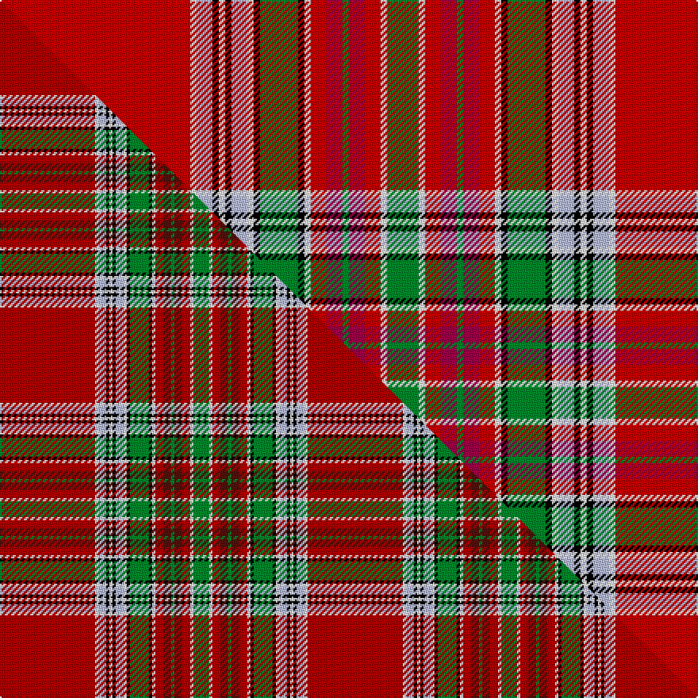

This is one **variant** — a specific cloth: this exact thread count and colourway, with its own
provenance below. It is one weaving of the [sett](/tartans/m/ma/macbain/) (the scale-free proportion — the
same cloth at any scale or shade), whose colour order is pattern [GWRRGRRWKGKWWKWKWWR](/stripes/gwrrgrrwkgkwwkwkwwr/).

Part of the [MacBain](/tartans/m/ma/macbain/) tartan — the named design grouping this sett with its other cloths.

Sourced from house-of-tartan.  It is a [19 stripe tartan](/stripes/stripes19/).

Original link [http://www.house-of-tartan.scotland.net/house/TartanViewjs.asp?colr=Def&tnam=951](http://www.house-of-tartan.scotland.net/house/TartanViewjs.asp?colr=Def&tnam=951)

## Provenance

Earliest known date: 1960 (1847) MacBains, MacBeans, and MacVeans are all forms of the same name possibly from the same origin as the early Scottish King, Donald Ban. The principle family is MacBean of Kinchyle from the northern end of Loch Ness. The MacBains are closely associated with Mackintosh and this is apparent in the design of the tartan. This version, recorded by Lord Lyon under the name MacBain, shows a minor variation on the earlier MacBean sett attributed to McIan (1847).

Dataset <small>— provenance for this record, inherited from the source manifest</small>

<dl class="dataset-prov">
<dt>source</dt><dd><a href="/sources/house-of-tartan/">House of Tartan</a></dd>
<dt>data captured from</dt><dd><a href="https://github.com/thetartan/tartan-database/blob/master/data/house-of-tartan/data.csv">https://github.com/thetartan/tartan-database/blob/master/data/house-of-tartan/data.csv</a></dd>
<dt>data date</dt><dd>1960 <small>(this record)</small></dd>
<dt>licence</dt><dd><a href="https://creativecommons.org/licenses/by-nc-nd/4.0/">CC BY-NC-ND 4.0</a></dd>
</dl>

Capture chain <small>— the hands this data passed through, oldest first; each capture carries its own licence</small>

<ol class="capture-chain">
<li><a href="http://www.house-of-tartan.scotland.net/">House of Tartan</a> <small>the weaver/retailer's database — the site is now offline; the URL is kept as the ultimate source's identity</small></li>
<li><a href="https://github.com/thetartan/tartan-database">thetartan/tartan-database</a> <small>2016-2017</small> · <a href="https://creativecommons.org/licenses/by-nc-nd/4.0/">CC BY-NC-ND 4.0</a> <small>Levko Kravets's frozen compilation — the capture we vendored, and where its CC licence text came from</small></li>
<li>this dictionary <small>captured 2026-06-10 · commit 5bf86c7566</small> <small>each re-capture is a git commit to data/sources</small></li>
</ol>

## Thread count
Ri/120 W4 LB10 K4 W4 K4 LB10 W4 K4 G24 K4 W4 Ri10 R10 G4 R10 Ri10 W4 G/20

One full sett is **388 threads**.

## Palette
<table><thead><tr><th>Colour</th><th>Shade</th><th>OKLCh</th></tr></thead><tbody><tr><td>LB</td><td><code style="background-color:#B5BBDE;">#B5BBDE</code> <small style="color:#888">#B5BBDE</small></td><td><small style="color:#888">oklch(79.9% 0.050 277.6)</small></td></tr><tr><td>G</td><td><code style="background-color:#008B2A;">#008B2A</code> <small style="color:#888">#008B2A</small></td><td><small style="color:#888">oklch(55.4% 0.170 145.9)</small></td></tr><tr><td>K</td><td><code style="background-color:#000000;">#000000</code> <small style="color:#888">#000000</small></td><td><small style="color:#888">oklch(0.0% 0.000 0.0)</small></td></tr><tr><td>W</td><td><code style="background-color:#F7F7F7;">#F7F7F7</code> <small style="color:#888">#F7F7F7</small></td><td><small style="color:#888">oklch(97.6% 0.000 89.9)</small></td></tr><tr><td>R</td><td><code style="background-color:#A00048;">#A00048</code> <small style="color:#888">#A00048</small></td><td><small style="color:#888">oklch(45.4% 0.182 5.3)</small></td></tr><tr><td>R</td><td><code style="background-color:#C80000;">#C80000</code> <small style="color:#888">#C80000</small></td><td><small style="color:#888">oklch(52.3% 0.215 29.2)</small></td></tr></tbody></table>

# Sample pattern

## Compared to the master

This cloth is one sett of its design; the master sett (the exemplar the design is anchored on) is below for comparison.

Its **ΔTartan distance** from the master is **0.08** — the same measure the nearest-tartans table ranks by (0 is identical; a re-scale of the same cloth is near 0, a recolour or a different proportion further).

<figure class="master-compare" style="margin:0">

this sett
master sett ★

<figcaption style="color:#888;font-size:smaller">One weave of this sett against the <a href="/setts/r60w2lb5k2w2k2lb5w2k2g12k2w2r5dr5g2dr5r5w2g10/">master sett ★</a>, split on the diagonal: a shared proportion runs seamlessly across it with only the shades shifting; a different proportion breaks on it.</figcaption>
</figure>

## Nearest tartan variants

The nearest existing variants by ΔTartan distance, with this cloth at the top so the swatches line up against it.

ΔTartan

Threads

Variant

Sett

—

388

<a href="/variants/s19/ri60w2lb5k2w2k2lb5w2k2g12k2w2ri5r5g2r5ri5w2g10~x2~ri2109032-r1807008/">MacBain Clan Tartan</a>

<a href="/ttd/edit/#slug=ri60w2lb5k2w2k2lb5w2k2g12k2w2ri5r5g2r5ri5w2g10~x2~ri2008029-r1707016&amp;base=ri60w2lb5k2w2k2lb5w2k2g12k2w2ri5r5g2r5ri5w2g10~x2~ri2109032-r1807008" title="compare in the TTD">0.03</a>

388

<a href="/variants/s19/ri60w2lb5k2w2k2lb5w2k2g12k2w2ri5r5g2r5ri5w2g10~x2~ri2008029-r1707016/">MacBain/MacBean</a>

<a href="/ttd/edit/#slug=r60w2lb5k2w2k2lb5w2k2g12k2w2r5dr5g2dr5r5w2g10~x2~r1908029&amp;base=ri60w2lb5k2w2k2lb5w2k2g12k2w2ri5r5g2r5ri5w2g10~x2~ri2109032-r1807008" title="compare in the TTD">0.09</a>

388

<a href="/variants/s19/r60w2lb5k2w2k2lb5w2k2g12k2w2r5dr5g2dr5r5w2g10~x2~r1908029/">MacBain</a>

<a href="/ttd/edit/#slug=r60w2lb5k2w2k2lb5w2k2g12k2w2r5dr5g2dr5r5w2g10~r1908029&amp;base=ri60w2lb5k2w2k2lb5w2k2g12k2w2ri5r5g2r5ri5w2g10~x2~ri2109032-r1807008" title="compare in the TTD">0.09</a>

194

<a href="/variants/s19/r60w2lb5k2w2k2lb5w2k2g12k2w2r5dr5g2dr5r5w2g10~r1908029/">MacBain</a>

<a href="/ttd/edit/#slug=ri24w1db2lb1w1lb1db2w1k1g6k1w1ri2r2g1r2ri2w1g3~x2~ri2008029-r1707016&amp;base=ri60w2lb5k2w2k2lb5w2k2g12k2w2ri5r5g2r5ri5w2g10~x2~ri2109032-r1807008" title="compare in the TTD">0.86</a>

166

<a href="/variants/s19/ri24w1db2lb1w1lb1db2w1k1g6k1w1ri2r2g1r2ri2w1g3~x2~ri2008029-r1707016/">MacBean</a>

<a href="/ttd/edit/#slug=ri24w1db2lb1w1lb1db2w1k1g6k1w1ri2r2g1r2ri2w1g3~x2~ri2209032-r1707016&amp;base=ri60w2lb5k2w2k2lb5w2k2g12k2w2ri5r5g2r5ri5w2g10~x2~ri2109032-r1807008" title="compare in the TTD">0.86</a>

166

<a href="/variants/s19/ri24w1db2lb1w1lb1db2w1k1g6k1w1ri2r2g1r2ri2w1g3~x2~ri2209032-r1707016/">MacBean</a>

<a href="/ttd/edit/#slug=r24w1db2lb1w1lb1db2w1k1g6k1w1r2dr2g1dr2r2w1g3~x2~r1908029&amp;base=ri60w2lb5k2w2k2lb5w2k2g12k2w2ri5r5g2r5ri5w2g10~x2~ri2109032-r1807008" title="compare in the TTD">0.87</a>

166

<a href="/variants/s19/r24w1db2lb1w1lb1db2w1k1g6k1w1r2dr2g1dr2r2w1g3~x2~r1908029/">MacBean</a>

<a href="/ttd/edit/#slug=r24w1db2lb1w1lb1db2w1k1g6k1w1r2dr2g1dr2r2w1g3~r1908029&amp;base=ri60w2lb5k2w2k2lb5w2k2g12k2w2ri5r5g2r5ri5w2g10~x2~ri2109032-r1807008" title="compare in the TTD">0.87</a>

83

<a href="/variants/s19/r24w1db2lb1w1lb1db2w1k1g6k1w1r2dr2g1dr2r2w1g3~r1908029/">MacBean</a>

<a href="/ttd/edit/#slug=r60y2w5k2y2k2w5y2k2g12k2w2r5dp5g2dp5r5w2k2g6&amp;base=ri60w2lb5k2w2k2lb5w2k2g12k2w2ri5r5g2r5ri5w2g10~x2~ri2109032-r1807008" title="compare in the TTD">1.00</a>

194

<a href="/variants/s20/r60y2w5k2y2k2w5y2k2g12k2w2r5dp5g2dp5r5w2k2g6/">MacBain</a>

<a href="/ttd/edit/#slug=r57w2k4db2w2db2k2w2k2g10k2w2r4o4g2o4r4w2g7~x2&amp;base=ri60w2lb5k2w2k2lb5w2k2g12k2w2ri5r5g2r5ri5w2g10~x2~ri2109032-r1807008" title="compare in the TTD">1.04</a>

336

<a href="/variants/s19/r57w2k4db2w2db2k2w2k2g10k2w2r4o4g2o4r4w2g7~x2/">MacBean (1847)</a>

<a href="/ttd/edit/#slug=r57w2k4db2w2db2k2w2k2g10k2w2r4dr4g2dr4r4w2g7~x2&amp;base=ri60w2lb5k2w2k2lb5w2k2g12k2w2ri5r5g2r5ri5w2g10~x2~ri2109032-r1807008" title="compare in the TTD">1.42</a>

336

<a href="/variants/s19/r57w2k4db2w2db2k2w2k2g10k2w2r4dr4g2dr4r4w2g7~x2/">MacBean Clan Tartan</a>

## Neighbour map

Every grey dot is one of 13656 variants placed by the first two principal components of the ΔTartan feature space (42% of its variance). Red is this tartan; blue dots are its nearest — click one to open its page. The map is a flat projection of a many-dimensional space — [how to read it](/posts/neighbourhood-maps/).

<svg viewBox="0 0 640 380" role="img" style="max-width:100%;height:auto;border:1px solid #e0e0e0;border-radius:4px;display:block" xmlns="http://www.w3.org/2000/svg"><image href="/nn/cloud.v1.png" width="640" height="380"/><a href="/variants/s19/ri60w2lb5k2w2k2lb5w2k2g12k2w2ri5r5g2r5ri5w2g10~x2~ri2008029-r1707016/"><circle cx="261.0" cy="19.6" r="4" fill="#3465a4"><title>MacBain/MacBean</title></circle></a><a href="/variants/s19/r60w2lb5k2w2k2lb5w2k2g12k2w2r5dr5g2dr5r5w2g10~x2~r1908029/"><circle cx="257.4" cy="19.7" r="4" fill="#3465a4"><title>MacBain</title></circle></a><a href="/variants/s19/r60w2lb5k2w2k2lb5w2k2g12k2w2r5dr5g2dr5r5w2g10~r1908029/"><circle cx="257.4" cy="19.7" r="4" fill="#3465a4"><title>MacBain</title></circle></a><a href="/variants/s19/ri24w1db2lb1w1lb1db2w1k1g6k1w1ri2r2g1r2ri2w1g3~x2~ri2008029-r1707016/"><circle cx="221.3" cy="18.4" r="4" fill="#3465a4"><title>MacBean</title></circle></a><a href="/variants/s19/ri24w1db2lb1w1lb1db2w1k1g6k1w1ri2r2g1r2ri2w1g3~x2~ri2209032-r1707016/"><circle cx="219.6" cy="16.7" r="4" fill="#3465a4"><title>MacBean</title></circle></a><a href="/variants/s19/r24w1db2lb1w1lb1db2w1k1g6k1w1r2dr2g1dr2r2w1g3~x2~r1908029/"><circle cx="218.7" cy="18.8" r="4" fill="#3465a4"><title>MacBean</title></circle></a><a href="/variants/s19/r24w1db2lb1w1lb1db2w1k1g6k1w1r2dr2g1dr2r2w1g3~r1908029/"><circle cx="218.7" cy="18.8" r="4" fill="#3465a4"><title>MacBean</title></circle></a><a href="/variants/s20/r60y2w5k2y2k2w5y2k2g12k2w2r5dp5g2dp5r5w2k2g6/"><circle cx="256.6" cy="14.0" r="4" fill="#3465a4"><title>MacBain</title></circle></a><a href="/variants/s19/r57w2k4db2w2db2k2w2k2g10k2w2r4o4g2o4r4w2g7~x2/"><circle cx="275.0" cy="14.0" r="4" fill="#3465a4"><title>MacBean (1847)</title></circle></a><a href="/variants/s19/r57w2k4db2w2db2k2w2k2g10k2w2r4dr4g2dr4r4w2g7~x2/"><circle cx="271.7" cy="14.0" r="4" fill="#3465a4"><title>MacBean Clan Tartan</title></circle></a><circle cx="261.3" cy="19.3" r="5" fill="#c00000"/><text x="320" y="376" text-anchor="middle" font-size="11" fill="#999">ground</text><text x="11" y="190" text-anchor="middle" font-size="11" fill="#999" transform="rotate(-90 11 190)">complexity</text></svg>

ID: /variants/s19/ri60w2lb5k2w2k2lb5w2k2g12k2w2ri5r5g2r5ri5w2g10~x2~ri2109032-r1807008/
