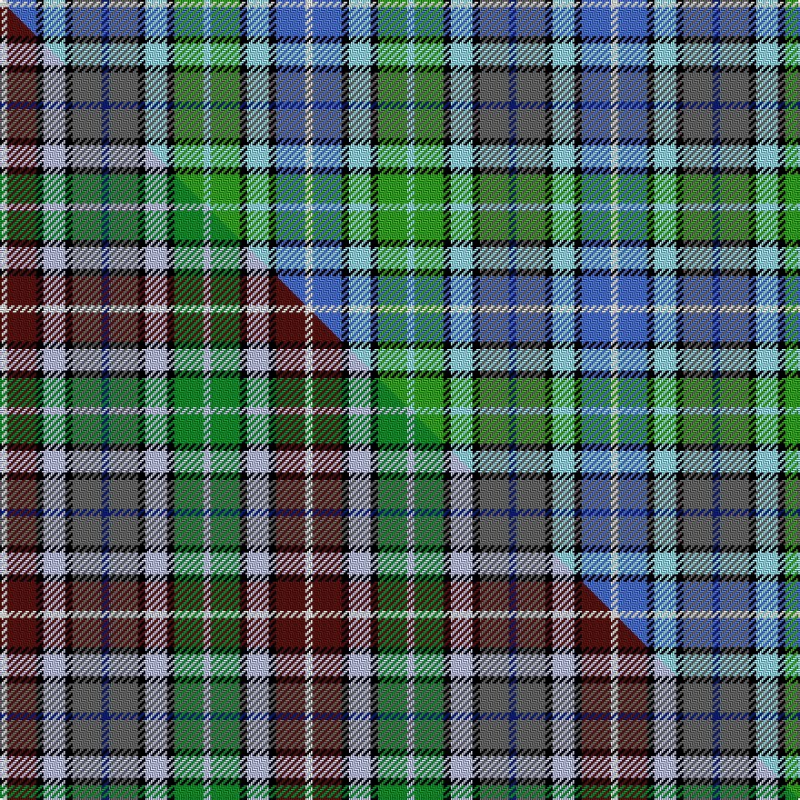

This is one **variant** — a specific cloth: this exact thread count and colourway, with its own
provenance below. It is one weaving of the [sett](/tartans/c/ca/caribou/) (the scale-free proportion — the
same cloth at any scale or shade), whose colour order is pattern [WBKWKBBBKWKGWGKWKBW](/stripes/wbkwkbbbkwkgwgkwkbw/).

Part of the [Caribou](/tartans/c/ca/caribou/) tartan — the named design grouping this sett with its other cloths.

Sourced from weddslist.  It is a [19 stripe tartan](/stripes/stripes19/).

Original link [http://www.weddslist.com/cgi-bin/tartans/pg.pl?source=sts](http://www.weddslist.com/cgi-bin/tartans/pg.pl?source=sts)

Dataset <small>— provenance for this record, inherited from the source manifest</small>

<dl class="dataset-prov">
<dt>source</dt><dd><a href="/sources/weddslist/">Weddslist</a></dd>
<dt>data captured from</dt><dd><a href="https://github.com/thetartan/tartan-database/blob/master/data/weddslist/data.csv">https://github.com/thetartan/tartan-database/blob/master/data/weddslist/data.csv</a></dd>
<dt>data date</dt><dd>2016-11-17 <small>(dataset default)</small></dd>
<dt>licence</dt><dd><a href="https://creativecommons.org/licenses/by-nc-nd/4.0/">CC BY-NC-ND 4.0</a></dd>
</dl>

Capture chain <small>— the hands this data passed through, oldest first; each capture carries its own licence</small>

<ol class="capture-chain">
<li><a href="https://www.weddslist.com/tartans/">Weddslist</a> <small>the living privately compiled reference</small></li>
<li><a href="https://github.com/thetartan/tartan-database">thetartan/tartan-database</a> <small>2016-2017</small> · <a href="https://creativecommons.org/licenses/by-nc-nd/4.0/">CC BY-NC-ND 4.0</a> <small>Levko Kravets's frozen compilation — the capture we vendored, and where its CC licence text came from</small></li>
<li>this dictionary <small>captured 2026-06-10 · commit 5bf86c7566</small> <small>each re-capture is a git commit to data/sources</small></li>
</ol>

## Thread count
W/4 B16 K4 LT12 K4 N16 DB4 N16 K4 LT12 K4 G16 LT4 G16 K4 LT12 K4 B16 W/4

One full sett is **336 threads**.

## Palette
<table><thead><tr><th>Colour</th><th>Shade</th><th>OKLCh</th></tr></thead><tbody><tr><td>DB</td><td><code style="background-color:#082077;">#082077</code> <small style="color:#888">#082077</small></td><td><small style="color:#888">oklch(30.0% 0.149 265.1)</small></td></tr><tr><td>B</td><td><code style="background-color:#466CC8;">#466CC8</code> <small style="color:#888">#466CC8</small></td><td><small style="color:#888">oklch(55.1% 0.149 265.0)</small></td></tr><tr><td>G</td><td><code style="background-color:#30A010;">#30A010</code> <small style="color:#888">#30A010</small></td><td><small style="color:#888">oklch(61.9% 0.195 140.5)</small></td></tr><tr><td>K</td><td><code style="background-color:#000000;">#000000</code> <small style="color:#888">#000000</small></td><td><small style="color:#888">oklch(0.0% 0.000 0.0)</small></td></tr><tr><td>LT</td><td><code style="background-color:#90D0F0;">#90D0F0</code> <small style="color:#888">#90D0F0</small></td><td><small style="color:#888">oklch(82.6% 0.079 230.6)</small></td></tr><tr><td>W</td><td><code style="background-color:#F7F7F7;">#F7F7F7</code> <small style="color:#888">#F7F7F7</small></td><td><small style="color:#888">oklch(97.6% 0.000 89.9)</small></td></tr><tr><td>N</td><td><code style="background-color:#636363;">#636363</code> <small style="color:#888">#636363</small></td><td><small style="color:#888">oklch(50.0% 0.000 89.9)</small></td></tr></tbody></table>

# Sample pattern

## Compared to the master

This cloth is one sett of its design; the master sett (the exemplar the design is anchored on) is below for comparison.

Its **ΔTartan distance** from the master is **2.31** — the same measure the nearest-tartans table ranks by (0 is identical; a re-scale of the same cloth is near 0, a recolour or a different proportion further).

<figure class="master-compare" style="margin:0">

this sett
master sett ★

<figcaption style="color:#888;font-size:smaller">One weave of this sett against the <a href="/setts/w1dr4k1lb3k1n4db1n4k1lb3k1g4lb1g4k1lb3k1dr4w1/">master sett ★</a>, split on the diagonal: a shared proportion runs seamlessly across it with only the shades shifting; a different proportion breaks on it.</figcaption>
</figure>

## Nearest tartan variants

The nearest existing variants by ΔTartan distance, with this cloth at the top so the swatches line up against it.

ΔTartan

Threads

Variant

Sett

—

336

<a href="/variants/s19/w1b4k1lt3k1n4db1n4k1lt3k1g4lt1g4k1lt3k1b4w1~x4~lt3303227-g2508144/">Caribou</a>

<a href="/ttd/edit/#slug=w1dr4k1lb3k1n4db1n4k1lb3k1g4lb1g4k1lb3k1dr4w1~x4&amp;base=w1b4k1lt3k1n4db1n4k1lt3k1g4lt1g4k1lt3k1b4w1~x4~lt3303227-g2508144" title="compare in the TTD">2.31</a>

336

<a href="/variants/s19/w1dr4k1lb3k1n4db1n4k1lb3k1g4lb1g4k1lb3k1dr4w1~x4/">Caribou (District)</a>

<a href="/ttd/edit/#slug=w2k1dg4g4dg4k1dg1k1db4lb5db4k1w1~x4&amp;base=w1b4k1lt3k1n4db1n4k1lt3k1g4lt1g4k1lt3k1b4w1~x4~lt3303227-g2508144" title="compare in the TTD">3.30</a>

252

<a href="/variants/s13/w2k1dg4g4dg4k1dg1k1db4lb5db4k1w1~x4/">Dyer</a>

<a href="/ttd/edit/#slug=w3dr3k3dr10t7db8g4db3g3db3g13lo3~x2&amp;base=w1b4k1lt3k1n4db1n4k1lt3k1g4lt1g4k1lt3k1b4w1~x4~lt3303227-g2508144" title="compare in the TTD">3.43</a>

240

<a href="/variants/s12/w3dr3k3dr10t7db8g4db3g3db3g13lo3~x2/">Chattahoochee River</a>

<a href="/ttd/edit/#slug=k7g9k2ly2k2y2k2g9k7db7r2db3r2db7k7w2k2w11k2w3k2w11k2w2~x4&amp;base=w1b4k1lt3k1n4db1n4k1lt3k1g4lt1g4k1lt3k1b4w1~x4~lt3303227-g2508144" title="compare in the TTD">3.69</a>

820

<a href="/variants/s24/k7g9k2ly2k2y2k2g9k7db7r2db3r2db7k7w2k2w11k2w3k2w11k2w2~x4/">Malcolm Dress</a>

<a href="/ttd/edit/#slug=t6k4t10w2db10g4db6g9r2g4dy2~x4&amp;base=w1b4k1lt3k1n4db1n4k1lt3k1g4lt1g4k1lt3k1b4w1~x4~lt3303227-g2508144" title="compare in the TTD">3.71</a>

440

<a href="/variants/s11/t6k4t10w2db10g4db6g9r2g4dy2~x4/">O'Sullivan (Name)</a>

<a href="/ttd/edit/#slug=k5g15dy8g15k5r4db8lb5w3lb5db8r4~x2&amp;base=w1b4k1lt3k1n4db1n4k1lt3k1g4lt1g4k1lt3k1b4w1~x4~lt3303227-g2508144" title="compare in the TTD">3.75</a>

322

<a href="/variants/s12/k5g15dy8g15k5r4db8lb5w3lb5db8r4~x2/">Anderson (Blackwood) (Personal)</a>

<a href="/ttd/edit/#slug=k2y2k2g9k7w2k3w12k2w4k2w12k3w2k7db7r2db3r2db7k7g9k2lb2~x2&amp;base=w1b4k1lt3k1n4db1n4k1lt3k1g4lt1g4k1lt3k1b4w1~x4~lt3303227-g2508144" title="compare in the TTD">3.76</a>

440

<a href="/variants/s24/k2y2k2g9k7w2k3w12k2w4k2w12k3w2k7db7r2db3r2db7k7g9k2lb2~x2/">Malcolm, dress</a>

<a href="/ttd/edit/#slug=k8w9y6w10dp5g6dp5w36db8k8db8k8db8k8db8g38r8&amp;base=w1b4k1lt3k1n4db1n4k1lt3k1g4lt1g4k1lt3k1b4w1~x4~lt3303227-g2508144" title="compare in the TTD">3.77</a>

358

<a href="/variants/s17/k8w9y6w10dp5g6dp5w36db8k8db8k8db8k8db8g38r8/">Kennedy</a>

<a href="/ttd/edit/#slug=k3lb13m11t3k10w2k10t3g6m3lg13t3~x2~g2007139-lg2909145&amp;base=w1b4k1lt3k1n4db1n4k1lt3k1g4lt1g4k1lt3k1b4w1~x4~lt3303227-g2508144" title="compare in the TTD">3.78</a>

308

<a href="/variants/s12/k3lb13m11t3k10w2k10t3g6m3lg13t3~x2~g2007139-lg2909145/">Cascade Summers</a>

<a href="/ttd/edit/#slug=dy2lb10k2w2k2dy2k2db3g3k2g2w2~x4&amp;base=w1b4k1lt3k1n4db1n4k1lt3k1g4lt1g4k1lt3k1b4w1~x4~lt3303227-g2508144" title="compare in the TTD">3.82</a>

256

<a href="/variants/s12/dy2lb10k2w2k2dy2k2db3g3k2g2w2~x4/">MacSheehy</a>

## Neighbour map

Every grey dot is one of 13657 variants placed by the first two principal components of the ΔTartan feature space (42% of its variance). Red is this tartan; blue dots are its nearest — click one to open its page. The map is a flat projection of a many-dimensional space — [how to read it](/posts/neighbourhood-maps/).

<svg viewBox="0 0 640 380" role="img" style="max-width:100%;height:auto;border:1px solid #e0e0e0;border-radius:4px;display:block" xmlns="http://www.w3.org/2000/svg"><image href="/nn/cloud.v1.png" width="640" height="380"/><a href="/variants/s19/w1dr4k1lb3k1n4db1n4k1lb3k1g4lb1g4k1lb3k1dr4w1~x4/"><circle cx="14.0" cy="170.6" r="4" fill="#3465a4"><title>Caribou (District)</title></circle></a><a href="/variants/s13/w2k1dg4g4dg4k1dg1k1db4lb5db4k1w1~x4/"><circle cx="14.0" cy="188.1" r="4" fill="#3465a4"><title>Dyer</title></circle></a><a href="/variants/s12/w3dr3k3dr10t7db8g4db3g3db3g13lo3~x2/"><circle cx="24.4" cy="190.3" r="4" fill="#3465a4"><title>Chattahoochee River</title></circle></a><a href="/variants/s24/k7g9k2ly2k2y2k2g9k7db7r2db3r2db7k7w2k2w11k2w3k2w11k2w2~x4/"><circle cx="14.0" cy="127.7" r="4" fill="#3465a4"><title>Malcolm Dress</title></circle></a><a href="/variants/s11/t6k4t10w2db10g4db6g9r2g4dy2~x4/"><circle cx="31.3" cy="203.4" r="4" fill="#3465a4"><title>O'Sullivan (Name)</title></circle></a><a href="/variants/s12/k5g15dy8g15k5r4db8lb5w3lb5db8r4~x2/"><circle cx="14.0" cy="183.3" r="4" fill="#3465a4"><title>Anderson (Blackwood) (Personal)</title></circle></a><a href="/variants/s24/k2y2k2g9k7w2k3w12k2w4k2w12k3w2k7db7r2db3r2db7k7g9k2lb2~x2/"><circle cx="14.0" cy="125.1" r="4" fill="#3465a4"><title>Malcolm, dress</title></circle></a><a href="/variants/s17/k8w9y6w10dp5g6dp5w36db8k8db8k8db8k8db8g38r8/"><circle cx="14.0" cy="116.4" r="4" fill="#3465a4"><title>Kennedy</title></circle></a><a href="/variants/s12/k3lb13m11t3k10w2k10t3g6m3lg13t3~x2~g2007139-lg2909145/"><circle cx="14.0" cy="161.9" r="4" fill="#3465a4"><title>Cascade Summers</title></circle></a><a href="/variants/s12/dy2lb10k2w2k2dy2k2db3g3k2g2w2~x4/"><circle cx="14.0" cy="168.5" r="4" fill="#3465a4"><title>MacSheehy</title></circle></a><circle cx="14.0" cy="175.2" r="5" fill="#c00000"/><text x="320" y="376" text-anchor="middle" font-size="11" fill="#999">ground</text><text x="11" y="190" text-anchor="middle" font-size="11" fill="#999" transform="rotate(-90 11 190)">complexity</text></svg>

ID: /variants/s19/w1b4k1lt3k1n4db1n4k1lt3k1g4lt1g4k1lt3k1b4w1~x4~lt3303227-g2508144/
