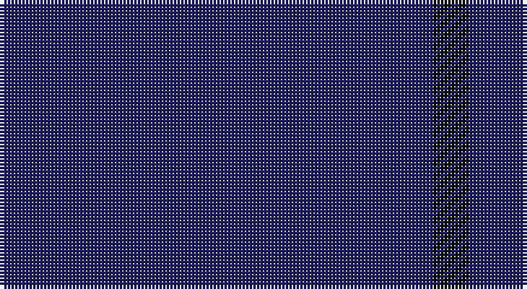

This page is one **sett** — a single exact thread-count. It belongs to the [tartan](/setts/db12k1/)
(the same proportion at any scale), whose colour order is pattern [BK](/stripes/bk/).

Part of the [Staines](/tartans/staines/) tartan — the named design grouping this sett with its other cloths.

Sourced from tartans-authority.  It is a [2 stripe tartan](/stripes/stripes2/).

Original link http://www.tartansauthority.com/tartan-ferret/display/10857/

## Register references

External register numbers recorded for this tartan.

- Scottish Register of Tartans: [10857](https://www.tartanregister.gov.uk/tartanDetails?ref=10857)
- Scottish Tartans Authority (ITI): 10857

## Thread count
DB/120 K/10

One full sett is **130 threads**.

## Palette

Palette: <strong>Tartan Register</strong>
<table><thead><tr><th>Colour</th><th>Threads</th><th>Shade</th><th>Base</th><th>OKLCh</th></tr></thead><tbody><tr><td>DB/</td><td style="text-align:right;font-variant-numeric:tabular-nums">120</td><td><code style="background-color:#202060;">#202060</code> <small style="color:#888">#202060</small></td><td>B <code style="background-color:#2A418A;">#2A418A</code></td><td><small style="color:#888">oklch(28.9% 0.111 276.9)</small></td></tr><tr><td>K/</td><td style="text-align:right;font-variant-numeric:tabular-nums">10</td><td><code style="background-color:#101010;">#101010</code> <small style="color:#888">#101010</small></td><td>K <code style="background-color:#000000;">#000000</code></td><td><small style="color:#888">oklch(17.3% 0.000 89.9)</small></td></tr></tbody></table>

# Sample pattern

## Compared to the master

This cloth is one sett of its design; the master sett (the exemplar the design is anchored on) is below for comparison.

<figure style="margin:0"><figcaption style="color:#888;font-size:smaller">this sett</figcaption></figure>
<figure style="margin:0"><figcaption style="color:#888;font-size:smaller"><a href="/setts/db1k12db1/">master sett →</a></figcaption></figure>

## Nearest tartans

The nearest existing variants by ΔTartan distance, with this tartan at the top so the swatches line up against it.

ΔTartan

Tartan

Sett

—

<a href="/ttd/edit/#slug=db12k1~x10">Staines</a> <a class="nn-out" href="/variants/s2/db12k1~x10/" title="open its dictionary page">↗</a>

3.49

<a href="/ttd/edit/#slug=do27n3do17~x4&amp;base=db12k1~x10">Outlander #4</a> <a class="nn-out" href="/variants/s3/do27n3do17~x4/" title="open its dictionary page">↗</a>

3.67

<a href="/ttd/edit/#slug=k20n1~x6&amp;base=db12k1~x10">Black Shadow (Fashion)</a> <a class="nn-out" href="/variants/s2/k20n1~x6/" title="open its dictionary page">↗</a>

4.09

<a href="/ttd/edit/#slug=db16dr4db3r1~x6&amp;base=db12k1~x10">Elliot Clan Tartan</a> <a class="nn-out" href="/variants/s4/db16dr4db3r1~x6/" title="open its dictionary page">↗</a>

4.37

<a href="/ttd/edit/#slug=k4dt1k3~x10&amp;base=db12k1~x10">Ben Dubh (Fashion)</a> <a class="nn-out" href="/variants/s3/k4dt1k3~x10/" title="open its dictionary page">↗</a>

4.39

<a href="/ttd/edit/#slug=db16m4db3r1~x2&amp;base=db12k1~x10">Elliot</a> <a class="nn-out" href="/variants/s4/db16m4db3r1~x2/" title="open its dictionary page">↗</a>

4.64

<a href="/ttd/edit/#slug=n4db1n6m1n14lr1~x8&amp;base=db12k1~x10">Torridon Tweed</a> <a class="nn-out" href="/variants/s6/n4db1n6m1n14lr1~x8/" title="open its dictionary page">↗</a>

4.72

<a href="/ttd/edit/#slug=dy9n1~x12&amp;base=db12k1~x10">Outlander #4</a> <a class="nn-out" href="/variants/s2/dy9n1~x12/" title="open its dictionary page">↗</a>

4.72

<a href="/ttd/edit/#slug=db45b2db4b15db7~x2&amp;base=db12k1~x10">Asahi (Corporate)</a> <a class="nn-out" href="/variants/s5/db45b2db4b15db7~x2/" title="open its dictionary page">↗</a>

4.73

<a href="/ttd/edit/#slug=n2y3n3y3n10y2n18y1~x4&amp;base=db12k1~x10">Hebridean Cairn Fashion Tartan</a> <a class="nn-out" href="/variants/s8/n2y3n3y3n10y2n18y1~x4/" title="open its dictionary page">↗</a>

4.76

<a href="/ttd/edit/#slug=dt4k2dt16k2dt16k1~x4&amp;base=db12k1~x10">Ben Dubh (The Black Mount)</a> <a class="nn-out" href="/variants/s6/dt4k2dt16k2dt16k1~x4/" title="open its dictionary page">↗</a>

## Neighbour map

Every grey dot is one of 14360 variants placed by the first two principal components of the ΔTartan feature space (44% of its variance). Red is this tartan; blue dots are its nearest — click one to open its page.

<svg viewBox="0 0 640 380" role="img" style="max-width:100%;height:auto;border:1px solid #e0e0e0;border-radius:4px;display:block" xmlns="http://www.w3.org/2000/svg"><image href="/nn/cloud.v1.png" width="640" height="380"/><a href="/variants/s3/do27n3do17~x4/"><circle cx="626.0" cy="366.0" r="4" fill="#3465a4"><title>Outlander #4</title></circle></a><a href="/variants/s2/k20n1~x6/"><circle cx="626.0" cy="366.0" r="4" fill="#3465a4"><title>Black Shadow (Fashion)</title></circle></a><a href="/variants/s4/db16dr4db3r1~x6/"><circle cx="626.0" cy="305.6" r="4" fill="#3465a4"><title>Elliot Clan Tartan</title></circle></a><a href="/variants/s3/k4dt1k3~x10/"><circle cx="626.0" cy="366.0" r="4" fill="#3465a4"><title>Ben Dubh (Fashion)</title></circle></a><a href="/variants/s4/db16m4db3r1~x2/"><circle cx="626.0" cy="291.5" r="4" fill="#3465a4"><title>Elliot</title></circle></a><a href="/variants/s6/n4db1n6m1n14lr1~x8/"><circle cx="626.0" cy="269.8" r="4" fill="#3465a4"><title>Torridon Tweed</title></circle></a><a href="/variants/s2/dy9n1~x12/"><circle cx="626.0" cy="366.0" r="4" fill="#3465a4"><title>Outlander #4</title></circle></a><a href="/variants/s5/db45b2db4b15db7~x2/"><circle cx="626.0" cy="283.1" r="4" fill="#3465a4"><title>Asahi (Corporate)</title></circle></a><a href="/variants/s8/n2y3n3y3n10y2n18y1~x4/"><circle cx="626.0" cy="322.2" r="4" fill="#3465a4"><title>Hebridean Cairn Fashion Tartan</title></circle></a><a href="/variants/s6/dt4k2dt16k2dt16k1~x4/"><circle cx="626.0" cy="366.0" r="4" fill="#3465a4"><title>Ben Dubh (The Black Mount)</title></circle></a><circle cx="626.0" cy="366.0" r="5" fill="#c00000"/></svg>

ID: /variants/s2/db12k1~x10/
